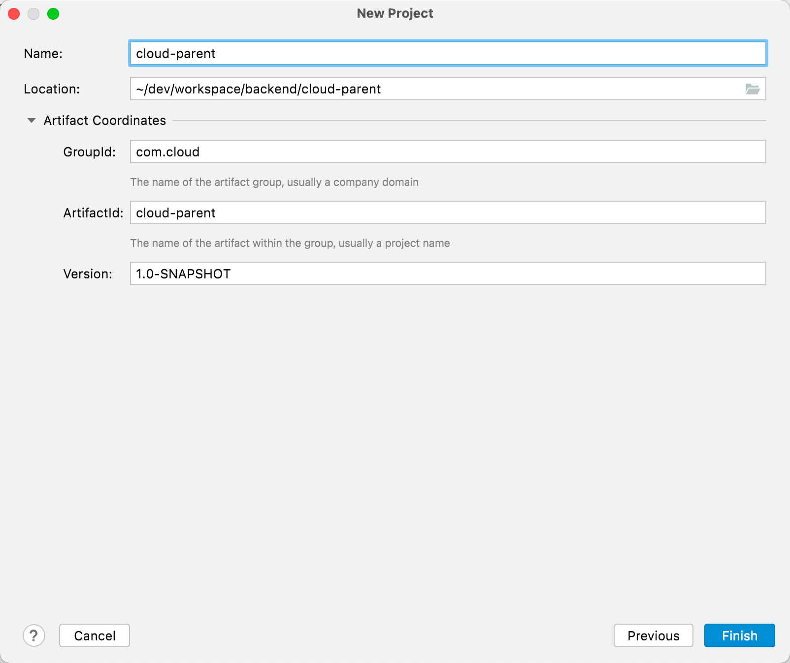
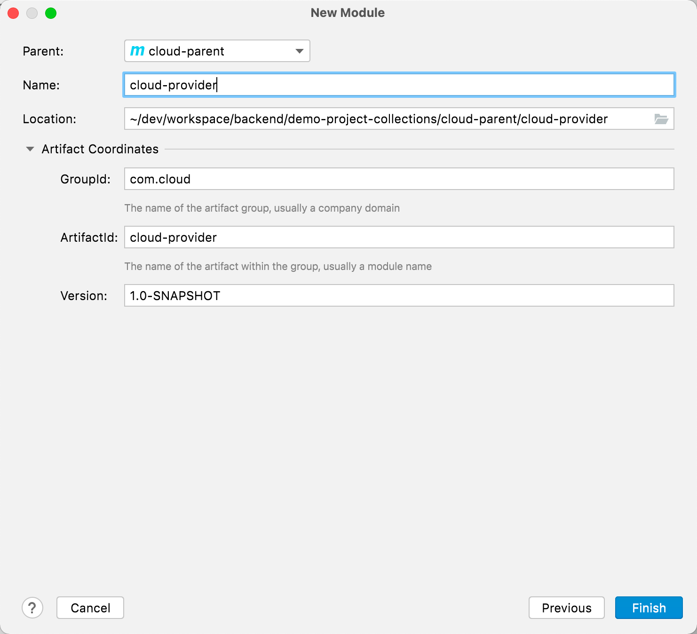
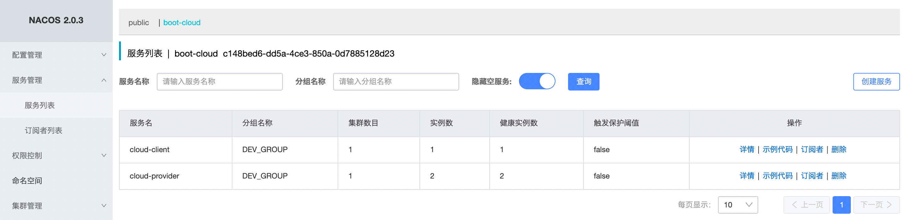
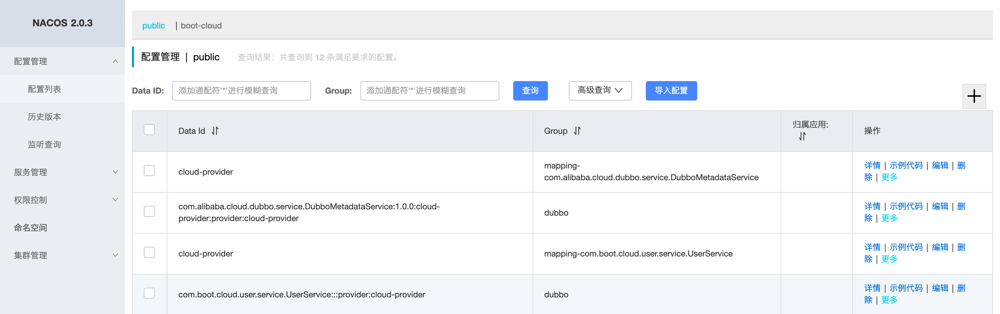
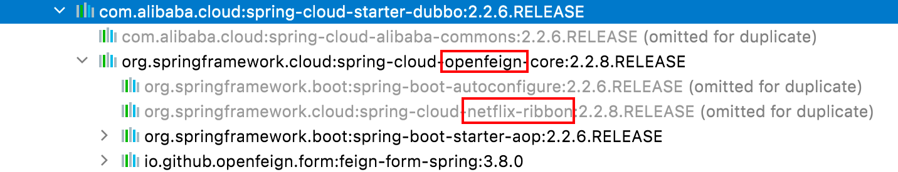

# Dubbo

## 1. 基本介绍

## 2. 使用

> springcloud+nacos+dubbo

### 2.1 nacos 准备

> 用作配置管理与服务注册/发现，若是考虑将 nacos 数据持久化可以将数据存储到 MySQL 中（详见 [SpringCloud 篇 nacos](https://gnl00.github.io/backend/SpringCloud.html#springcloud-alibaba-nacos-服务注册和配置中心) 部分内容）

[Nacos Spring Cloud 快速开始](https://nacos.io/zh-cn/docs/quick-start-spring-cloud.html)

### 2.2 项目准备

#### 2.2.1 工程创建

1、创建 Maven 父工程，命名`cloud-parent`



2、创建完成将其中的`src`文件夹删除，仅保留`pom.xml`文件，用作版本管理

3、Maven 锁定依赖版本

```xml
<properties>
  <maven.compiler.source>8</maven.compiler.source>
  <maven.compiler.target>8</maven.compiler.target>
  <spring.boot.version>2.2.6.RELEASE</spring.boot.version>
  <spring.cloud.version>Hoxton.SR11</spring.cloud.version>
  <spring.cloud.alibaba.version>2.2.6.RELEASE</spring.cloud.alibaba.version>
  <junit.version>4.13.2</junit.version>
  <lombok.version>1.18.22</lombok.version>
</properties>

<dependencyManagement>
  <dependencies>
    <dependency>
      <groupId>org.springframework.boot</groupId>
      <artifactId>spring-boot-dependencies</artifactId>
      <version>${spring.boot.version}</version>
      <type>pom</type>
      <scope>import</scope>
    </dependency>

    <dependency>
      <groupId>org.springframework.cloud</groupId>
      <artifactId>spring-cloud-dependencies</artifactId>
      <version>${spring.cloud.version}</version>
      <type>pom</type>
      <scope>import</scope>
    </dependency>

    <dependency>
      <groupId>com.alibaba.cloud</groupId>
      <artifactId>spring-cloud-alibaba-dependencies</artifactId>
      <version>${spring.cloud.alibaba.version}</version>
      <type>pom</type>
      <scope>import</scope>
    </dependency>

    <dependency>
      <groupId>junit</groupId>
      <artifactId>junit</artifactId>
      <version>${junit.version}</version>
    </dependency>

    <!-- Lombok 版本不对的话可能会抽疯 -->
    <dependency>
      <groupId>org.projectlombok</groupId>
      <artifactId>lombok</artifactId>
      <version>${lombok.version}</version>
      <optional>true</optional>
    </dependency>

  </dependencies>
</dependencyManagement>
```

4、创建**服务提供者**，命名`cloud-provider`



5、为**服务提供者**添加依赖

```xml
<dependencies>

  <!-- SpringBoot Starter -->
  <dependency>
    <groupId>org.springframework.boot</groupId>
    <artifactId>spring-boot-starter-actuator</artifactId>
  </dependency>
  <dependency>
    <groupId>org.springframework.boot</groupId>
    <artifactId>spring-boot-starter-web</artifactId>
  </dependency>

  <!-- For JSON return -->
  <dependency>
    <groupId>com.fasterxml.jackson.core</groupId>
    <artifactId>jackson-databind</artifactId>
  </dependency>
  <dependency>
    <groupId>com.fasterxml.jackson.core</groupId>
    <artifactId>jackson-core</artifactId>
  </dependency>
  <dependency>
    <groupId>com.fasterxml.jackson.core</groupId>
    <artifactId>jackson-annotations</artifactId>
  </dependency>

  <!-- Nacos -->
  <dependency>
    <groupId>com.alibaba.cloud</groupId>
    <artifactId>spring-cloud-starter-alibaba-nacos-discovery</artifactId>
  </dependency>
  <dependency>
    <groupId>com.alibaba.cloud</groupId>
    <artifactId>spring-cloud-starter-alibaba-nacos-config</artifactId>
  </dependency>

</dependencies>
```

6、创建**服务消费者/客户端**，命名`cloud-client`

7、为服**务消费者/客户端**添加依赖

```xml
<dependencies>

  <!-- SpringBoot Starter -->
  <dependency>
    <groupId>org.springframework.boot</groupId>
    <artifactId>spring-boot-starter-actuator</artifactId>
  </dependency>
  <dependency>
    <groupId>org.springframework.boot</groupId>
    <artifactId>spring-boot-starter-web</artifactId>
  </dependency>

  <!-- For JSON return -->
  <dependency>
    <groupId>com.fasterxml.jackson.core</groupId>
    <artifactId>jackson-databind</artifactId>
  </dependency>
  <dependency>
    <groupId>com.fasterxml.jackson.core</groupId>
    <artifactId>jackson-core</artifactId>
  </dependency>
  <dependency>
    <groupId>com.fasterxml.jackson.core</groupId>
    <artifactId>jackson-annotations</artifactId>
  </dependency>

  <!-- Nacos -->
  <dependency>
    <groupId>com.alibaba.cloud</groupId>
    <artifactId>spring-cloud-starter-alibaba-nacos-discovery</artifactId>
  </dependency>
  <dependency>
    <groupId>com.alibaba.cloud</groupId>
    <artifactId>spring-cloud-starter-alibaba-nacos-config</artifactId>
  </dependency>

</dependencies>
```

8、创建 api/common 模块，命名`cloud-api`，提供常用的封装类/工具类/公共类/枚举类/接口

9、分别在服务提供者和消费者模块中引入`cloud-api`模块的依赖，至此基本项目结构搭建完成

#### 2.2.2 完成配置中心

1、在`cloud-provider`模块中新建`bootstrap.yml`配置文件

```yaml
server:
  port: 8091

# 先创建 or 找到合适的命名空间，再在对应的命名空间中创建配置文件
spring:
  application:
    name: cloud-provider
  profiles:
    active: dev
  cloud:
    nacos:
      config:
        server-addr: localhost:8848 # nacos 作为注册中心的地址
        file-extension: yaml # 指定配置文件的为 yaml 格式
        group: DEV_GROUP # 指定分组
        namespace: c148bed6-dd5a-4ce3-850a-0d7885128d23 # 指定配置命名空间，注意指定的是命名空间的唯一Id，而不是命名空间的名称

# 在 nacos 上拉取的对应的配置文件名 ${spring.application.name}-${spring.profiles.active}-${spring.cloud.nacos.config.file-extension}
```

2、启动并登录 nacos，创建命名空间，在指定分组创建 provider 对应的配置文件`cloud-provider-dev.yaml`

```yml
config:
  info: config for cloud-provider
```

3、为服务提供者编写 Controller 测试类

```java
@RestController
@RequestMapping("/pro")
public class ProviderController {

    @Value("${server.port}")
    private String serverPort;

    @Value("${config.info}")
    private String configInfo;

    @GetMapping("/msg")
    public String getMsg() {
        String msg = "This is msg return from: " + serverPort;
        return msg;
    }

    @GetMapping("/config")
    public String getConfigInfo() {
        return configInfo + " " + serverPort;
    }

}
```

4、访问`localhost:8091/pro/config`，返回信息无异常则表示使用 nacos 作为配置中心运行正常

#### 2.2.3 完成注册中心

1、修改`bootstrap.yml`配置文件，添加 **discovery** 部分内容

```yml
# 先创建 or 找到合适的命名空间，再在对应的命名空间中创建配置文件
spring:
  application:
    name: cloud-provider
  profiles:
    active: dev
  cloud:
    nacos:
      config:
        server-addr: localhost:8848 # nacos 作为注册中心的地址
        file-extension: yaml # 指定配置文件的为 yaml 格式
        group: DEV_GROUP # 指定分组
        namespace: c148bed6-dd5a-4ce3-850a-0d7885128d23 # 指定配置命名空间，注意指定的是命名空间的唯一Id，而不是命名空间的名称
      discovery:
        server-addr: localhost:8848 # nacos 作为配置中心的地址
        namespace: c148bed6-dd5a-4ce3-850a-0d7885128d23 # 指定注册的命名空间
        group: DEV_GROUP # 指定分组

# 在 nacos 上拉取的对应的配置文件名 ${spring.application.name}-${spring.profiles.active}-${spring.cloud.nacos.config.file-extension}
```

2、主启动类添加注解`@EnableDiscoveryClient`，启动服务，若无误则可以在 nacos 上看到注册成功的服务



### 2.3 Dubbo 准备

#### 2.3.1 服务提供者

1、添加 Dubbo 对应依赖

```xml
<!-- Dubbo -->
<dependency>
  <groupId>com.alibaba.cloud</groupId>
  <artifactId>spring-cloud-starter-dubbo</artifactId>
</dependency>
<dependency>
  <groupId>io.netty</groupId>
  <artifactId>netty-all</artifactId>
  <version>4.1.70.Final</version>
</dependency>
<dependency>
  <groupId>org.apache.commons</groupId>
  <artifactId>commons-lang3</artifactId>
  <version>3.12.0</version>
</dependency>
```

2、修改 nacos 上的配置文件信息

```yaml
config:
  info: config for cloud-provider

dubbo:
  protocol:
    name: dubbo
    port: -1
  scan:
    base-packages: com.boot.cloud.service
  registry:
    address: nacos://localhost:8848

dubbo-ver:
  service:
    user: 1.0.0
```

3、在`cloud-api`模块中创建好接口，命名`UserService`

```java
package com.boot.cloud.user.service;

import com.boot.cloud.common.resp.PageResult;
import com.boot.cloud.user.domain.dto.UserDto;
import com.boot.cloud.user.domain.entities.User;
import com.boot.cloud.user.domain.query.UserQuery;

import java.util.List;

/**
 * UserService
 * @author lgn
 */

public interface UserService {

    /**
     * save user
     * @param query
     * @return java.lang.Integer
     */
    Integer save(UserQuery query);

    /**
     * update user
     * @param query
     * @return java.lang.Integer
     */
    Integer update(UserQuery query);

    /**
     * delete user
     * @param query
     * @return java.lang.Boolean
     */
    Boolean delete(UserQuery query);

    /**
     * query one user
     * @param query
     * @return com.boot.cloud.user.domain.dto.UserDto
     */
    UserDto queryOne(UserQuery query);

    /**
     * query users
     * @param query
     * @return java.util.List<com.boot.cloud.user.domain.dto.UserDto>
     */
    List<UserDto> queryList(UserQuery query);

    /**
     * query user by page
     * @param query
     * @return PageResult<User>
     */
    PageResult<User> queryByPage(UserQuery query);

}
```

4、provider 中引入`cloud-api`依赖

```xml
<!-- Custom API -->
<dependency>
  <groupId>com.boot</groupId>
  <artifactId>cloud-api</artifactId>
  <version>1.0-SNAPSHOT</version>
</dependency>
```

5、provider 中创建`UserServiceImpl`实现类

```java
package com.boot.cloud.service.user;

import com.boot.cloud.common.resp.PageResult;
import com.boot.cloud.user.domain.dto.UserDto;
import com.boot.cloud.user.domain.entities.User;
import com.boot.cloud.user.domain.query.UserQuery;
import com.boot.cloud.user.service.UserService;
import org.apache.dubbo.config.annotation.DubboService;
import org.springframework.beans.factory.annotation.Value;
import org.springframework.stereotype.Service;

import java.util.List;

/**
 * UserServiceImpl
 *
 * @author lgn
 */

// 指定当前服务版本
@DubboService(version = "1.0.0")
@Service
public class UserServiceImpl implements UserService {

    @Value("${server.port}")
    private String serverPort;

    @Override
    public Integer save(UserQuery query) {

        System.out.println("===> UserServiceImpl#save here iam " + serverPort);

        double random = Math.random();

        if (random < 0.5) {
            System.out.println("===> UserServiceImpl#save save user fail");
            return 0;
        } else {
            System.out.println("===> UserServiceImpl#save save user success");
            return 1;
        }
    }

    @Override
    public Integer update(UserQuery query) {
        return null;
    }

    @Override
    public Boolean delete(UserQuery query) {
        return null;
    }

    @Override
    public UserDto queryOne(UserQuery query) {
        return null;
    }

    @Override
    public List<UserDto> queryList(UserQuery query) {
        return null;
    }

    @Override
    public PageResult<User> queryByPage(UserQuery query) {
        return null;
    }
}
```

6、在 provider 主启动类中添加注解`@EnableDubbo`，并启动。在配置列表中可看到创建成功的`UserServiceImpl`相关配置



#### 2.3.2 服务消费者

1、添加 Dubbo 相关依赖

```xml
<!-- Dubbo -->
<dependency>
  <groupId>com.alibaba.cloud</groupId>
  <artifactId>spring-cloud-starter-dubbo</artifactId>
</dependency>
<dependency>
  <groupId>io.netty</groupId>
  <artifactId>netty-all</artifactId>
  <version>4.1.70.Final</version>
</dependency>
<dependency>
  <groupId>org.apache.commons</groupId>
  <artifactId>commons-lang3</artifactId>
  <version>3.12.0</version>
</dependency>
```

2、修改 `cloud-client-dev.yml`配置

```yaml
config:
  info: cloud-client dev config file from nacos

server-url:
  cloud-provider: http://cloud-provider # 注册在nacos上的服务提供者的url

dubbo-ver:
  service:
    user: 1.0.0

dubbo:
  protocol:
    name: dubbo
    port: -1
  registry:
    address: nacos://localhost:8848
  cloud:
    subscribed-services: cloud-provider
  scan:
    base-packages: com.boot.cloud.controller
```

3、新建`ClientController.java`

```java
package com.boot.cloud.controller;

import com.boot.cloud.common.enumm.StatusCode;
import com.boot.cloud.common.resp.Result;
import com.boot.cloud.user.domain.query.UserQuery;
import com.boot.cloud.user.service.UserService;
import org.apache.dubbo.config.annotation.DubboReference;
import org.springframework.beans.factory.annotation.Value;
import org.springframework.http.ResponseEntity;
import org.springframework.web.bind.annotation.GetMapping;
import org.springframework.web.bind.annotation.RequestBody;
import org.springframework.web.bind.annotation.RequestMapping;
import org.springframework.web.bind.annotation.RestController;
import org.springframework.web.client.RestTemplate;

import javax.annotation.Resource;
import java.util.UUID;

/**
 * ClientController
 * @author lgn
 */

@RestController
@RequestMapping("/client")
public class ClientController {

    @Value("${server.port}")
    private String serverPort;

      // 注意版本号需要和服务提供者的版本号一致，否则调用失败
    @DubboReference(version = "${dubbo-ver.service.user}", check = false)
    private UserService userService;

    @GetMapping("/save")
    public Result<UserQuery> save(@RequestBody UserQuery query) {

        System.out.println("===> ClientController#save " + serverPort);

        String uuid = UUID.randomUUID().toString();
        query.setUserAccount(uuid);

        query.setControllerPort(serverPort);

        Integer result = userService.save(query);

        return new Result(result.equals(1), StatusCode.SUCCESS_CODE, query);

    }

}
```

4、主启动类新增`@EnableDubbo`注解，启动服务，发起请求：`http://localhost:8081/client/save`

```java
package com.boot.cloud;

import org.apache.dubbo.config.spring.context.annotation.EnableDubbo;
import org.springframework.boot.SpringApplication;
import org.springframework.boot.autoconfigure.SpringBootApplication;
import org.springframework.cloud.client.discovery.EnableDiscoveryClient;
import org.springframework.cloud.client.loadbalancer.LoadBalanced;
import org.springframework.context.annotation.Bean;
import org.springframework.web.client.RestTemplate;

/**
 * ClientMainApp
 * @author lgn
 */

@EnableDubbo
@EnableDiscoveryClient
@SpringBootApplication
public class ClientMainApp {
    public static void main(String[] args) {
        SpringApplication.run(Client2MainApp.class, args);
    }
}
```

5、请求成功，则项目配置完毕；失败则按照错误信息排查啦

### 2.4 深入

#### 2.4.1 版本控制（灰度发布）

#### 2.4.2 负载均衡



从和 Dubbo 一起引入的依赖中可以看出，在引入 Dubbo 的同时引入了 `open-feign ` 和 `netflix-ribbon`，即可知 Dubbo 是带有负载均衡政策的，默认使用**轮训算法**
