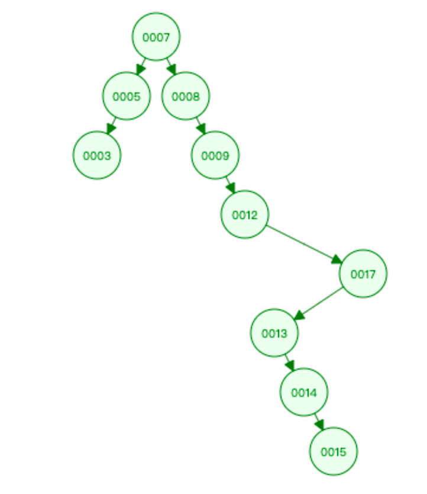
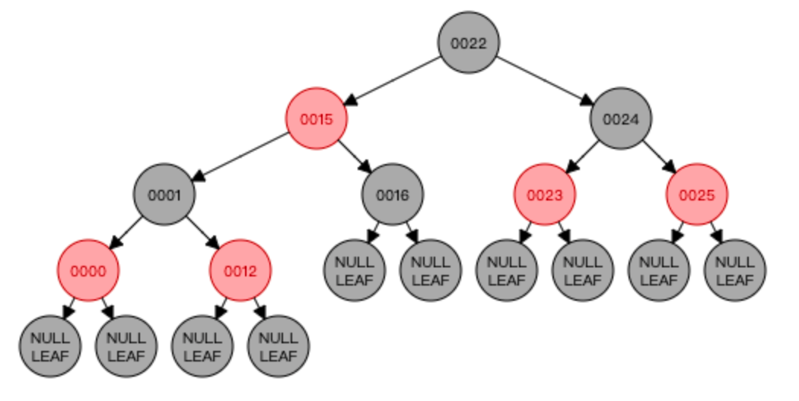
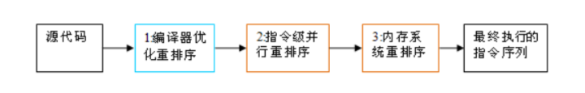
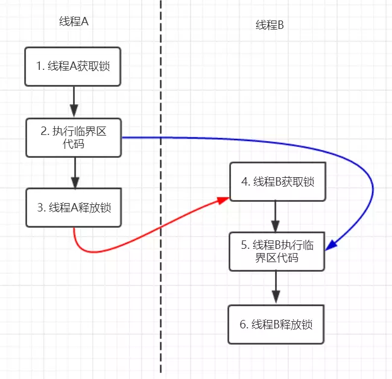
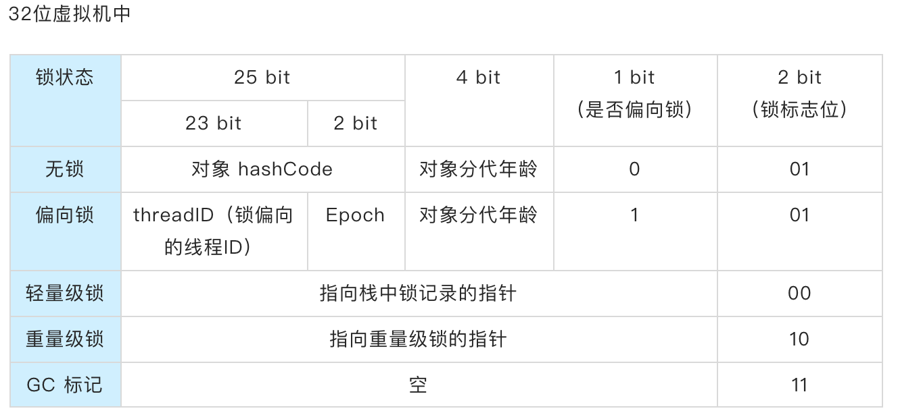
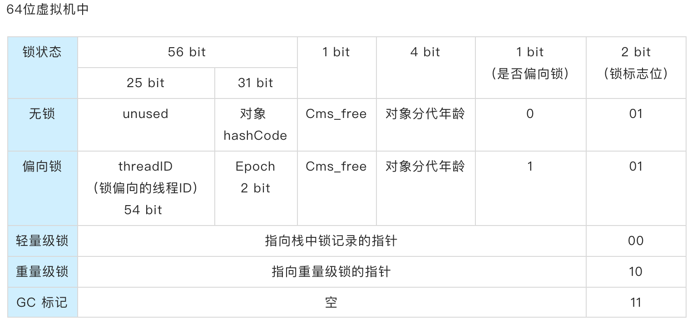
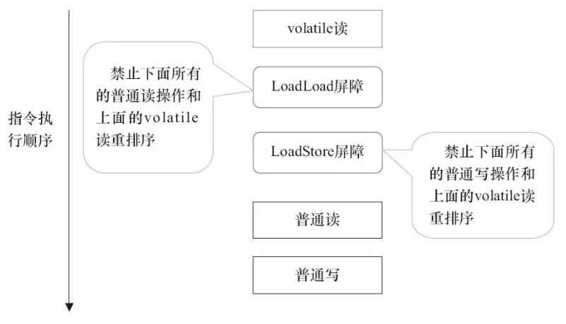

## 集合

集合和数组都是对多个数据进行存储操作的结构，都相当于**存储数据的容器**（内存方面的存储，非持久化存储）

**体系结构**


<br>

**<u>1 - 集合与数组</u>**

1、数组存储的数据长度是确定的，不便于扩展。集合长度可变

2、数组存储的数据类型是单一的，数组声明的类型，决定了进行元素初始化时的类型。

3、数组中提供的属性和方法少，不便于进行增删和插入操作，且效率不高，同时无法直接获取存储元素的个数

<br>

**<u>2 - Iterator 迭代器</u>**

> 使用 `Iterator` 接口遍历集合元素。Iterator 对象称为迭代器，主要用于遍历 `Collection` 集合中的元素

**迭代器模式**

1、提供一种方法，访问一个容器（Container）对象中的各个元素，而又不需暴露该对象的内部细节

2、迭代器模式就是为容器而生

**迭代器错误用法**

```java
// 1、iterator.next() 应该放在 while 体内
Iterator iterator = collection.iterator();
while( (iterator.next())!=null ){
    //...
}
// 2、死循环
// 集合对象每次调用iterator()方法都会得到一个全新的迭代器对象
// 默认的游标都在集合的第一个元素之前
// 此处每次判断都会返回一个新对象
while(collection.iterator().hasNext())
{
    System.out.println(collection.iterator().next());
}
```

<br>

#### List 接口

> 素有序，可重复的集合。==动态==数组

**<u>1 - 常见实现类</u>**

1）`Vector`

2）`ArrayList`

3）`LinkedList`

<br>

**关于 ArrayList & LinkedList & Vector**

相同点：

1）三个类都实现了`List`接口

2）存储的数据的特点都是有序，可重复

3）都支持存储 null 值

不同点：

1）`ArrayList`线程不安全，效率高，底层使用`Object []`存储数据

2）`LinkedList`线程不安全，对于频繁的插入、删除操作，比使用`ArrayList`效率高。底层使用<mark>双向链表</mark>存储，只能顺序访问。底层不是数组，不涉及到扩容。LinkedList 还可以用作栈、队列和双向队列。

3）`Vector`作为`List`接口的一个老的实现类，方法基本上都用`synchronized`修饰，线程安全，效率低，底层使用`Object []`存储数据。Java 自带的 `Stack` 类继承自 `Vector`

<br>

**2 - ArrayList**

**1、 ArrayList 实例化细节**

1）JDK 1.7 中默认初始化底层长度为 10 的`Object []`

2）JDK 1.8 中默认初始化底层数组为空，执行`add()`方法的时候才创建长度为 10 的`Object []`数组，若长度不够则进行扩容

3）JDK 1.7 中的创建类似于单例模式中的饿汉式，JDK 1.8 则类似于懒汉式，延迟数组的创建，节省内存

```java
/**
 * 默认初始化容量
 * Default initial capacity.
 */
private static final int DEFAULT_CAPACITY = 10;


/**
 * 默认初始化的空数组对象
 * Shared empty array instance used for default sized empty instances. We
 * distinguish this from EMPTY_ELEMENTDATA to know how much to inflate when
 * first element is added.
 */
private static final Object[] DEFAULTCAPACITY_EMPTY_ELEMENTDATA = {};


/**
 * 底层存储数据的Object数组
 * The array buffer into which the elements of the ArrayList are stored.
 * The capacity of the ArrayList is the length of this array buffer. Any
 * empty ArrayList with elementData == DEFAULTCAPACITY_EMPTY_ELEMENTDATA
 * will be expanded to DEFAULT_CAPACITY when the first element is added.
 */
transient Object[] elementData; // non-private to simplify nested class access

/**
 * ArrayList 的 size，默认为0
 * The size of the ArrayList (the number of elements it contains).
 */
private int size;

/**
 * 默认构造方法，底层创建一个空数组
 * Constructs an empty list with an initial capacity of ten.
 */
public ArrayList() {
    this.elementData = DEFAULTCAPACITY_EMPTY_ELEMENTDATA;
}

/**
 * 带自定义 capacity 的构造方法
 * Constructs an empty list with the specified initial capacity.
 *
 * @param  initialCapacity  the initial capacity of the list
 * @throws IllegalArgumentException if the specified initial capacity
 *         is negative
 */
public ArrayList(int initialCapacity) {
    if (initialCapacity > 0) {
        this.elementData = new Object[initialCapacity];
    } else if (initialCapacity == 0) {
        this.elementData = EMPTY_ELEMENTDATA;
    } else {
        throw new IllegalArgumentException("Illegal Capacity: "+
                                           initialCapacity);
    }
}

/**
 * Returns the number of elements in this list.
 */
public int size() {
    return size;
}

/**
 * list 被修改的次数
 * The number of times this list has been <i>structurally modified</i>.
 * Structural modifications are those that change the size of the
 * list, or otherwise perturb it in such a fashion that iterations in
 * progress may yield incorrect results.
 */
protected transient int modCount = 0;

/**
 * Returns true if this list contains no elements.
 */
public boolean isEmpty() {
    return size == 0;
}

/**
 * contains 方法声明于 List 接口，由 AbstractList 类实现
 * Returns true if this list contains the specified element.
 * More formally, returns true if and only if this list contains
 * at least one element <tt>e</tt> such that
 * <tt>(o==null ? e==null : o.equals(e))</tt>.
 *
 * @param o element whose presence in this list is to be tested
 * @return <tt>true</tt> if this list contains the specified element
 */
public boolean contains(Object o) {
    return indexOf(o) >= 0;
}

/**
 * Returns the index of the first occurrence of the specified element
 * in this list, or -1 if this list does not contain the element.
 * More formally, returns the lowest index <tt>i</tt> such that
 * <tt>(o==null ? get(i)==null : o.equals(get(i)))</tt>,
 * or -1 if there is no such index.
 */
public int indexOf(Object o) {
    if (o == null) {
        for (int i = 0; i < size; i++)
            if (elementData[i]==null)
                return i;
    } else {
        for (int i = 0; i < size; i++)
            if (o.equals(elementData[i]))
                return i;
    }
    return -1;
}

/**
 * 单个元素添加操作
 * Appends the specified element to the end of this list.
 *
 * @param e element to be appended to this list
 * @return true (as specified by {@link Collection#add})
 */
public boolean add(E e) {
      // 1、添加之前先调用 ensureCapacityInternal 方法确定内部数组容量
      // 当前size = 0， 将 size + 1 作为最小容量传入 ensureCapacityInternal 方法，计算出合适的容量
    ensureCapacityInternal(size + 1);  // Increments modCount!!
    elementData[size++] = e;
    return true;
}

private void ensureCapacityInternal(int minCapacity) {
      // 2、根据当前数组中元素的个数和传入的最小容量，计算出合适的容量
    ensureExplicitCapacity(calculateCapacity(elementData, minCapacity));
}

private static int calculateCapacity(Object[] elementData, int minCapacity) {
      // 3、取 DEFAULT_CAPACITY 和 minCapacity 中的最大值返回
      // 如果是第一次执行add方法，则返回的是 DEFAULT_CAPACITY = 10
    if (elementData == DEFAULTCAPACITY_EMPTY_ELEMENTDATA) {
        return Math.max(DEFAULT_CAPACITY, minCapacity);
    }
    return minCapacity;
}

private void ensureExplicitCapacity(int minCapacity) {
    modCount++;

      // 4、根据计算出来容量和当前数组中实际支持的容量做比较，若是大于数组的容量则进行扩容操作
    // overflow-conscious code
    if (minCapacity - elementData.length > 0)
        grow(minCapacity);
}

/**
 * 底层数组允许的最大长度
 * The maximum size of array to allocate.
 * Some VMs reserve some header words in an array.
 * Attempts to allocate larger arrays may result in
 * OutOfMemoryError: Requested array size exceeds VM limit
 */
private static final int MAX_ARRAY_SIZE = Integer.MAX_VALUE - 8;

/**
 * 进行扩容操作
 * Increases the capacity to ensure that it can hold at least the
 * number of elements specified by the minimum capacity argument.
 *
 * @param minCapacity the desired minimum capacity
 */
private void grow(int minCapacity) {
    // overflow-conscious code
    int oldCapacity = elementData.length;
      // capacity 扩大为原来的1.5倍
    int newCapacity = oldCapacity + (oldCapacity >> 1);
      // 如果扩容后的 newCapacity 还是不够 minCapacity 大
      // 那么使用 minCapacity 作为扩容后的容量
    if (newCapacity - minCapacity < 0)
        newCapacity = minCapacity;
      // 如果 newCapacity 超过底层数组允许的最大长度，设置为 Integer.MAX_VALUE
    if (newCapacity - MAX_ARRAY_SIZE > 0)
        newCapacity = hugeCapacity(minCapacity);
    // minCapacity is usually close to size, so this is a win:
    elementData = Arrays.copyOf(elementData, newCapacity);
}

private static int hugeCapacity(int minCapacity) {
    if (minCapacity < 0) // overflow
        throw new OutOfMemoryError();
    return (minCapacity > MAX_ARRAY_SIZE) ?
        Integer.MAX_VALUE :
        MAX_ARRAY_SIZE;
}
```

<br>

**2、ArrayList 的 add() 执行与扩容逻辑**

1）调用 add() 方法添加之前先调用 ensureCapacityInternal() 方法，确定一个能添加当前元素的最小容量 minCapacity。为什么是最小？那主要原因当然是为了节省空间，避免不必要的存储空间开销。

2）当前`size=0`， 将`size+1`作为最小容量 minCapacity 传入 ensureCapacityInternal() 方法，计算出合适的容量

3）如果是第一次执行 add() 方法，则返回`DEFAULT_CAPACITY = 10`，此时确定的最小容量即为 10；否则比较 minCapacity 和 DEFAULT_CAPACITY，并返回二者中的最大值。

4）根据计算出来最小容量 minCapacity 和当前数组中实际支持的容量做比较，若是 minCapacity 大于数组的容量则进行扩容操作

5）执行 grow() 方法，容量扩大为原来的 1.5 倍，`newCapacity = oldCapacity + (oldCapacity >> 1)`

6）如果扩容后的 newCapacity 还是不够 minCapacity 大，那么使用 minCapacity 作为扩容后的容量

7）如果最终确定的扩容量超过底层数组允许的最大长度，则将数组容量扩容至`Integer.MAX_VALUE`

<br>

**3、ArrayList 线程不安全**

```java
/**
 * ArrayListTest
 * @author gnl
 */

public class ArrayListTest {
    public static void main(String[] args) {

        /**
         * ArrayList线程不安全的表现
         * 报异常 java.util.ConcurrentModificationException
         * 原因 多线程并发争抢同一个资源，并且没有加锁
         * 解决办法
         * 1. Vector 不推荐
         * 2. new CopyOnWriteArrayList<>();
         *    写时复制
         *    CopyOnWrite 容器即写时复制容器
         *    往写时复制容器添加元素的时候，不直接往当前容器 Object[] 添加，而是对当前容器使用Arrays.copy()复制出一个新的容器 Object[] newElement，然后向新容器里添加元素
         *    添加完元素之后，再使用 setArray()方法将原容器的引用指向新容器
         *    这样做的好处是可以对 CopyOnWrite 容器进行并发的读，而不需要加锁
         *    因为原容器不会添加任何元素，所以 CopyOnWrite 容器也是一种读写分离思想，读原容器，写新容器
         * 3. List<String> list = Collections.synchronizedList(new ArrayList<>());
         */

        List<String> list = new CopyOnWriteArrayList<>();
        int n = 10;
        for (int i = 0; i < n; i++) {
            new Thread(() -> {
                list.add(UUID.randomUUID().toString().substring(0,5));
                System.out.println(list);
            }, i + " ").start();
        }
    }
}
```

<br>

**4、LinkedList 实现细节**

1）LinkedList 同时实现了 List 接口和 Deque 接口，也就是说它既可以看作一个顺序容器，又可以看作一个队列（Queue），同时又可以看作一个栈（Stack）。当需要使用栈或者队列时，可以考虑使用 LinkedList，一方面是因为 Java 官方已经声明不建议使用 Stack 类；另一方面是，Java 中没有 Queue 类，仅有 Queue 接口。

> 关于栈或队列，现在的首选 `ArrayDeque`，它有着比 LinkedList（当作栈或队列使用时）更好的性能。

2）LinkedList 的实现方式决定了所有跟下标相关的操作都是线性时间，而在首段或者末尾删除元素只需要常数时间。为追求效率 LinkedList 没有实现同步（synchronized），如果需要多个线程并发访问，可以使用`Collections.synchronizedList()`方法对其进行包装。

```java
transient int size = 0;

/**
 * Pointer to first node.
 * Invariant: (first == null && last == null) ||
 *            (first.prev == null && first.item != null)
 */
transient Node<E> first;

/**
 * Pointer to last node.
 * Invariant: (first == null && last == null) ||
 *            (last.next == null && last.item != null)
 */
transient Node<E> last;

/**
 * Constructs an empty list.
 */
public LinkedList() {
}

// Node 为静态内部类
private static class Node<E> {
    E item;
    Node<E> next;
    Node<E> prev;

    Node(Node<E> prev, E element, Node<E> next) {
        this.item = element;
        this.next = next;
        this.prev = prev;
    }
}
```

<br>

#### Queue 接口

> *Queue*接口继承自*Collection*接口，除了最基本的*Collection*的方法之外，它还支持额外的*insertion（插入）*, *extraction（提取）*和*inspection（检查）*操作。

这里有两组格式，共 6 个方法，一组是抛出异常的实现；另外一组是返回值的实现(没有则返回（null）。

|                     | Throws exception | **Returns special value** |
| ------------------- | ---------------- | ------------------------- |
| Insert              | add(e)           | offer(e)                  |
| Remove              | remove()         | poll()                    |
| Examine（元素检查） | element()        | peek()                    |

> 关于栈或队列，现在的首选是**_ArrayDeque_**，它有着比*LinkedList*（当作栈或队列使用时）有着更好的性能。

<br>

#### Set 接口

> 元素无序，不可重复的集合

继承自 Collection 接口，Set 接口和其实现类中没有`set()`和`get()`方法，因为 Set 无序，无 index，不能索引，所以不能用`get(index)`，同样的因为无 index，不能进行如`mySet.set(index, element)`等操作

1）`HashSet`，作为`Set`接口的主要实现类，线程不安全，可以存储`null`值，底层实现实际上是由`HashMap`实现

2）`LinkedHashSet`，作为`HashSet`的子类，也是线程不安全的，也可存储`null`值，内部使用双向链表维护元素的插入顺序。

- 作为`HashSet`的子类，在添加数据的同时，每个数据还维护两个引用，记录此数据的前一个数据和后一个数据
- 遍历其内部数据时，可以按照添加的顺序遍历，对于遍历频繁的操作，`LinkedHashSet`效率高于`HashSet`
- 底层同样由`HashMap`实现

3）`TreeSet`，底层由`TreeMap`实现，基于红黑树实现，线程不安全。`TreeSet`中**添加的元素必须是同一个类的实例对象**，并且可以按照添加对象的指定属性进行排序。==特点是有序，查询速度比`List`快==。支持有序性操作，例如根据一个范围查找元素的操作。但是查找效率不如 HashSet，HashSet 查找的时间复杂度为 O(1)，TreeSet 则为 O(logN)。

<br>

**Set 接口细节**

1）无序性，但不等于随机性，存储的数据在底层数组中并非按照数组索引顺序添加，而是使用`hashCode()`方法，计算出存储元素的键的哈希值，再根据哈希值决定数据存放的位置

2）不可重复性，保证添加的元素按照`equals()`方法判断时，不能返回`true`。即相同的元素只能添加一个，在调用`equals()`时，需要调用所在的类的`hashCode()`方法，计算出哈希值

3）`Set`接口中没有定义额外的方法，使用的都是`Collection`接口中声明的方法

4）向`Set`中添加数据的类一定要重写`equals()`和`hashCode()`方法

5）重写`equals()`和`hashCode()`方法尽可能保持一致，即相同的对象必须具有相同的散列码

重写的方法中，对象里用作`equals()`方法比较的成员变量都应该用来计算`hashCode()`的值

<br>

**HashSet 实例化细节**

```java
// 底层由 HashMap 实现
private transient HashMap<E,Object> map;

// 向 Set 中 add 值的时候是将值存放到HashMap的key位置，value位置则使用一个Object来填充
// Dummy value to associate with an Object in the backing Map
private static final Object PRESENT = new Object();


/**
 * 可以看到创建HashSet实际上是创建一个HashMap
 * Constructs a new, empty set; the backing <tt>HashMap</tt> instance has
 * default initial capacity (16) and load factor (0.75).
 */
public HashSet() {
    map = new HashMap<>();
}


/**
 * Returns an iterator over the elements in this set.  The elements
 * are returned in no particular order.
 *
 * @return an Iterator over the elements in this set
 * @see ConcurrentModificationException
 */
public Iterator<E> iterator() {
    return map.keySet().iterator();
}

/**
 * Returns the number of elements in this set (its cardinality).
 *
 * @return the number of elements in this set (its cardinality)
 */
public int size() {
    return map.size();
}

/**
 * Returns <tt>true</tt> if this set contains no elements.
 *
 * @return <tt>true</tt> if this set contains no elements
 */
public boolean isEmpty() {
    return map.isEmpty();
}

/**
 * Returns <tt>true</tt> if this set contains the specified element.
 * More formally, returns <tt>true</tt> if and only if this set
 * contains an element <tt>e</tt> such that
 * <tt>(o==null ? e==null : o.equals(e))</tt>.
 *
 * @param o element whose presence in this set is to be tested
 * @return true if this set contains the specified element
 */
public boolean contains(Object o) {
    return map.containsKey(o);
}


/**
 * Adds the specified element to this set if it is not already present.
 * More formally, adds the specified element <tt>e</tt> to this set if
 * this set contains no element <tt>e2</tt> such that
 * <tt>(e==null ? e2==null : e.equals(e2))</tt>.
 * If this set already contains the element, the call leaves the set
 * unchanged and returns <tt>false</tt>.
 *
 * @param e element to be added to this set
 * @return <tt>true</tt> if this set did not already contain the specified
 * element
 */
public boolean add(E e) {
    return map.put(e, PRESENT)==null;
}

/**
 * Removes the specified element from this set if it is present.
 * More formally, removes an element <tt>e</tt> such that
 * <tt>(o==null ? e==null : o.equals(e))</tt>,
 * if this set contains such an element.  Returns <tt>true</tt> if
 * this set contained the element (or equivalently, if this set
 * changed as a result of the call).  (This set will not contain the
 * element once the call returns.)
 *
 * @param o object to be removed from this set, if present
 * @return <tt>true</tt> if the set contained the specified element
 */
public boolean remove(Object o) {
    return map.remove(o)==PRESENT;
}

// 添加元素和扩容逻辑与 HashMap 一致
```

<br>

#### Map 接口

> 双列数据，保存具有映射关系 `key-value` 对的集合

1）`HashMap`，基于哈希表实现，底层使用 HashMap 的静态内部 Node 类，`Node<K, V> []`类型的数组进行存储。HashMap 线程不安全，在多线程下操作 HashMap 可能会出现`ConcurrentModificationException`（并发修改异常，情况同 ArrayList ）

- `key`，无序不可重复。使用`Set`存储所有的`key`，称为`keySet`
- `value`，无序可重复。使用`Collection`存储所有的`value`，称为`values`
- `entry`，无序不可重复。使用`Set`类型的`entrySet`保存所有的`key-value`对

2）`LinkedHashMap`，使用双向链表来维护元素的顺序，顺序为插入顺序或者最近最少使用(LRU)顺序

3）`Hashtable`，和 HashMap 类似，但它是线程安全的，这意味着同一时刻多个线程可以同时写入 HashTable 并且不会导致数据不一致。它是一个早期的实现类，现在推荐使用 ConcurrentHashMap 来支持线程安全，并且 ConcurrentHashMap 的效率会更高，因为 ConcurrentHashMap 引入了分段锁。

4）`Properties`，常用来处理配置文件，key 和 value 都是`String`类型的

5）`SortedMap`

5.1] `TreeMap`，基于红黑树实现，向`TreeMap`中添加元素，要求 key 必须是==同一个类的实例对象==，因为要按照 key 进行排序，需要相同的`equals()`和`hashCode`方法进行比较，如自然排序

<br>

**HashMap & Hashtable 区别**

1）父类不同。`HashMap`父类为`AbstractMap`类，`Hashtable`父类为`Dictionary`类。不过都实现了`Map`、`Cloneable`和`Serializable`接口

2）初始大小和每次扩容大小不同。HashMap 初始大小为 16，每次扩容为原来的 2 倍；Hashtable 初始大小为 11，每次扩容为原来的 2 倍再加 1

3）计算 hash 值的方法不同。HashMap 使用的是 key 所属类的 hashCode 方法；Hashtable 使用的是*Object*类的 hashCode 方法

4）对外提供的方法不同

`Hashtable`比`HashMap`多提供了`elements()`和`contains()`方法。`elements()`继承自父类`Dictionary`，用于返回`Hashtable`中的 value 枚举；`contains()`判断`Hashtable`是否包含传入的 value。它的作用与`containsValue()`一致。事实上，`containsValue()`方法只是调用了`contains()`

5）对`null`值的支持不同

- HashMap 中 key 和 value 都可以为 null，但是 null 值得 key 只能存在一个，null 值的 value 可以有多个，因为必须保证 key 值的唯一性
- Hashtable 中 key 和 value 都不能为 null

6）安全性不同

- Hashtable 是线程安全的，它的每个方法都是同步方法、
- HashMap 是线程不安全的，多线程情况下可以使用 ConcurrentHashMap 来保证线程的安全性，ConcurrentHashMap 中的方法采用了同步块的方式来保证线程安全，不需要对整个方法进行锁定，效率比 HashTable 高

<br>

**HashMap 实例化细节**

```java
/**
 * 底层Node[]数组，默认初始化大小。The default initial capacity - MUST be a power of two.
 */
static final int DEFAULT_INITIAL_CAPACITY = 1 << 4; // aka 16


/**
 * 支持存储元素的最大容量。The maximum capacity, used if a higher value is implicitly specified
 * by either of the constructors with arguments.
 * MUST be a power of two <= 1<<30.
 */
static final int MAXIMUM_CAPACITY = 1 << 30;


/**
 * 默认加载因子。The load factor used when none specified in constructor.
 */
static final float DEFAULT_LOAD_FACTOR = 0.75f;


/**
 * 当数组中的链表元素长度超过8，由链表转成红黑树。
 * The bin count threshold for using a tree rather than list for a
 * bin.  Bins are converted to trees when adding an element to a
 * bin with at least this many nodes. The value must be greater
 * than 2 and should be at least 8 to mesh with assumptions in
 * tree removal about conversion back to plain bins upon
 * shrinkage.
 */
static final int TREEIFY_THRESHOLD = 8;

/**
 * 当数组中的某个下标的元素树化之后，树结构中节点数小于6，由树转链表
 * The bin count threshold for untreeifying a (split) bin during a
 * resize operation. Should be less than TREEIFY_THRESHOLD, and at
 * most 6 to mesh with shrinkage detection under removal.
 */
static final int UNTREEIFY_THRESHOLD = 6;

/**
 * 当链表元素 >= 8 并且数组 > 64 的时候转化红黑树。
 * The smallest table capacity for which bins may be treeified.
 * (Otherwise the table is resized if too many nodes in a bin.)
 * Should be at least 4 * TREEIFY_THRESHOLD to avoid conflicts
 * between resizing and treeification thresholds.
 */
static final int MIN_TREEIFY_CAPACITY = 64;

/**
 * The number of key-value mappings contained in this map.
 */
transient int size;

/**
 * 记录集合中元素的修改次数。
 * The number of times this HashMap has been structurally modified
 * Structural modifications are those that change the number of mappings in
 * the HashMap or otherwise modify its internal structure (e.g.,
 * rehash).  This field is used to make iterators on Collection-views of
 * the HashMap fail-fast.  (See ConcurrentModificationException).
 */
transient int modCount;

/**
 * 能容纳的元素个数，当 size > threshold 的时候 就会扩容。threshold = 负载因子 * 数组长度
 * The next size value at which to resize (capacity * load factor).
 */
// (The javadoc description is true upon serialization.
// Additionally, if the table array has not been allocated, this
// field holds the initial array capacity, or zero signifying
// DEFAULT_INITIAL_CAPACITY.)
int threshold;

/**
 * The load factor for the hash table.
 */
final float loadFactor;

/**
 * The table, initialized on first use, and resized as
 * necessary. When allocated, length is always a power of two.
 * (We also tolerate length zero in some operations to allow
 * bootstrapping mechanics that are currently not needed.)
 */
transient Node<K,V>[] table;

/**
 * 静态内部 Node 类
 * Basic hash bin node, used for most entries.  (See below for
 * TreeNode subclass, and in LinkedHashMap for its Entry subclass.)
 */
static class Node<K,V> implements Map.Entry<K,V> {
    final int hash;
    final K key;
    V value;
    Node<K,V> next;

    Node(int hash, K key, V value, Node<K,V> next) {
        this.hash = hash;
        this.key = key;
        this.value = value;
        this.next = next;
    }
}

/**
 * Holds cached entrySet(). Note that AbstractMap fields are used
 * for keySet() and values().
 */
transient Set<Map.Entry<K,V>> entrySet;

/**
 * Constructs an empty <tt>HashMap</tt> with the default initial capacity
 * (16) and the default load factor (0.75).
 */
public HashMap() {
      // 将负载因子设置为默认 = 0.75
    this.loadFactor = DEFAULT_LOAD_FACTOR; // all other fields defaulted
}


/**
 * Associates the specified value with the specified key in this map.
 * If the map previously contained a mapping for the key, the old
 * value is replaced.
 *
 * @param key key with which the specified value is to be associated
 * @param value value to be associated with the specified key
 * @return the previous value associated with <tt>key</tt>, or
 *         <tt>null</tt> if there was no mapping for <tt>key</tt>.
 *         (A <tt>null</tt> return can also indicate that the map
 *         previously associated <tt>null</tt> with <tt>key</tt>.)
 */
public V put(K key, V value) {
    return putVal(hash(key), key, value, false, true);
}

/**
 * 计算存放的 key 的哈希值
 * Computes key.hashCode() and spreads (XORs) higher bits of hash
 * to lower.  Because the table uses power-of-two masking, sets of
 * hashes that vary only in bits above the current mask will
 * always collide. (Among known examples are sets of Float keys
 * holding consecutive whole numbers in small tables.)  So we
 * apply a transform that spreads the impact of higher bits
 * downward. There is a tradeoff between speed, utility, and
 * quality of bit-spreading. Because many common sets of hashes
 * are already reasonably distributed (so don't benefit from
 * spreading), and because we use trees to handle large sets of
 * collisions in bins, we just XOR some shifted bits in the
 * cheapest possible way to reduce systematic lossage, as well as
 * to incorporate impact of the highest bits that would otherwise
 * never be used in index calculations because of table bounds.
 */
static final int hash(Object key) {
    int h;
    return (key == null) ? 0 : (h = key.hashCode()) ^ (h >>> 16);
}

/**
 * Implements Map.put and related methods.
 *
 * @param hash hash for key
 * @param key the key
 * @param value the value to put
 * @param onlyIfAbsent if true, don't change existing value
 * @param evict if false, the table is in creation mode.
 * @return previous value, or null if none
 */
final V putVal(int hash, K key, V value, boolean onlyIfAbsent,
               boolean evict) {
    Node<K,V>[] tab; Node<K,V> p; int n, i;
      // 1、第一次创建必然会进入 resize()
    if ((tab = table) == null || (n = tab.length) == 0)
          // 2-11 小点在 resize() 方法中
        n = (tab = resize()).length;
      // 12、若 key 不存在，则为新增
    if ((p = tab[i = (n - 1) & hash]) == null)
        // 新创建一个 Node，添加到数组中
        tab[i] = newNode(hash, key, value, null);
    else {
          // 13、若存储元素的hash值相等 && key 已存在 & key != null & key 相等
        Node<K,V> e; K k;
        if (p.hash == hash &&
            ((k = p.key) == key || (key != null && key.equals(k))))
              // 14、使用新元素替换旧元素
            e = p;
          // 15、否则，查看该节点是否已树化，若已经树化，调用 putTreeVal()
        else if (p instanceof TreeNode)
            e = ((TreeNode<K,V>)p).putTreeVal(this, tab, hash, key, value);
        else {
              // 16、没有树化，将要添加的新元素添加到已存在的老元素的next（尾插法创建链表）
            for (int binCount = 0; ; ++binCount) {
                  // if p.next == null，说明p是链表中的最后一个节点
                if ((e = p.next) == null) {
                    p.next = newNode(hash, key, value, null);
                      // 17、检查链表长度是否达到 TREEIFY_THRESHOLD（树化阀值）
                    if (binCount >= TREEIFY_THRESHOLD - 1) // -1 for 1st
                          // 18、达到 TREEIFY_THRESHOLD 则树化
                        treeifyBin(tab, hash);
                    break;
                }
                  // 19、链表中的元素和添加的新元素 hash值相等 && key相等，直接break
                  // 若发现相同 key 则结束循环
                if (e.hash == hash &&
                    ((k = e.key) == key || (key != null && key.equals(k))))
                    break;
                p = e;
            }
        }
          // 20、有重复的 key， 则新值替换旧值
        if (e != null) { // existing mapping for key
            V oldValue = e.value;
            if (!onlyIfAbsent || oldValue == null)
                e.value = value;
            afterNodeAccess(e);
            return oldValue;
        }
    }
    ++modCount;
    if (++size > threshold)
        resize();
    afterNodeInsertion(evict);
    return null;
}

/**
 * Initializes or doubles table size.  If null, allocates in
 * accord with initial capacity target held in field threshold.
 * Otherwise, because we are using power-of-two expansion, the
 * elements from each bin must either stay at same index, or move
 * with a power of two offset in the new table.
 *
 * @return the table
 */
final Node<K,V>[] resize() {
      // 2、第一次创建时 oldTab = table is null
    Node<K,V>[] oldTab = table;
      // 3、第一次创建 oldCap = 0
    int oldCap = (oldTab == null) ? 0 : oldTab.length;
      // 4、threshold 初始值 = 0， oldThr = 0
    int oldThr = threshold;
    int newCap, newThr = 0;
    if (oldCap > 0) {
        if (oldCap >= MAXIMUM_CAPACITY) {
            threshold = Integer.MAX_VALUE;
            return oldTab;
        }
        else if ((newCap = oldCap << 1) < MAXIMUM_CAPACITY &&
                 oldCap >= DEFAULT_INITIAL_CAPACITY)
            newThr = oldThr << 1; // double threshold
    }
    else if (oldThr > 0) // initial capacity was placed in threshold
        newCap = oldThr;
      // 5、实例化HashMap，从上面直接跳到这一步
    else {               // zero initial threshold signifies using defaults
          // 6、newCap = DEFAULT_INITIAL_CAPACITY = 16
        newCap = DEFAULT_INITIAL_CAPACITY;
          // 7、newThr = 0.75 * 16
        newThr = (int)(DEFAULT_LOAD_FACTOR * DEFAULT_INITIAL_CAPACITY);
    }
    if (newThr == 0) {
        float ft = (float)newCap * loadFactor;
        newThr = (newCap < MAXIMUM_CAPACITY && ft < (float)MAXIMUM_CAPACITY ?
                  (int)ft : Integer.MAX_VALUE);
    }
      // 8、threshold = newThr = 12
    threshold = newThr;
    @SuppressWarnings({"rawtypes","unchecked"})
      // 9、使用 newCap = 16，创建一个容量为 newCap 的 Node[]
    Node<K,V>[] newTab = (Node<K,V>[])new Node[newCap];
      // 10、为成员变量 table 赋值
    table = newTab;
    if (oldTab != null) {
        for (int j = 0; j < oldCap; ++j) {
            Node<K,V> e;
            if ((e = oldTab[j]) != null) {
                oldTab[j] = null;
                if (e.next == null)
                    newTab[e.hash & (newCap - 1)] = e;
                else if (e instanceof TreeNode)
                    ((TreeNode<K,V>)e).split(this, newTab, j, oldCap);
                else { // preserve order
                    Node<K,V> loHead = null, loTail = null;
                    Node<K,V> hiHead = null, hiTail = null;
                    Node<K,V> next;
                    do {
                        next = e.next;
                        if ((e.hash & oldCap) == 0) {
                            if (loTail == null)
                                loHead = e;
                            else
                                loTail.next = e;
                            loTail = e;
                        }
                        else {
                            if (hiTail == null)
                                hiHead = e;
                            else
                                hiTail.next = e;
                            hiTail = e;
                        }
                    } while ((e = next) != null);
                    if (loTail != null) {
                        loTail.next = null;
                        newTab[j] = loHead;
                    }
                    if (hiTail != null) {
                        hiTail.next = null;
                        newTab[j + oldCap] = hiHead;
                    }
                }
            }
        }
    }
      // 11、 返回 newTab
    return newTab;
}

/**
 * Tree version of putVal.
 */
final TreeNode<K,V> putTreeVal(HashMap<K,V> map, Node<K,V>[] tab,
                               int h, K k, V v) {
    Class<?> kc = null;
    boolean searched = false;
    TreeNode<K,V> root = (parent != null) ? root() : this;
    for (TreeNode<K,V> p = root;;) {
        int dir, ph; K pk;
        if ((ph = p.hash) > h)
            dir = -1;
        else if (ph < h)
            dir = 1;
        else if ((pk = p.key) == k || (k != null && k.equals(pk)))
            return p;
        else if ((kc == null &&
                  (kc = comparableClassFor(k)) == null) ||
                 (dir = compareComparables(kc, k, pk)) == 0) {
            if (!searched) {
                TreeNode<K,V> q, ch;
                searched = true;
                if (((ch = p.left) != null &&
                     (q = ch.find(h, k, kc)) != null) ||
                    ((ch = p.right) != null &&
                     (q = ch.find(h, k, kc)) != null))
                    return q;
            }
            dir = tieBreakOrder(k, pk);
        }

        TreeNode<K,V> xp = p;
        if ((p = (dir <= 0) ? p.left : p.right) == null) {
            Node<K,V> xpn = xp.next;
            TreeNode<K,V> x = map.newTreeNode(h, k, v, xpn);
            if (dir <= 0)
                xp.left = x;
            else
                xp.right = x;
            xp.next = x;
            x.parent = x.prev = xp;
            if (xpn != null)
                ((TreeNode<K,V>)xpn).prev = x;
            moveRootToFront(tab, balanceInsertion(root, x));
            return null;
        }
    }
}


/**
 * Replaces all linked nodes in bin at index for given hash unless
 * table is too small, in which case resizes instead.
 */
final void treeifyBin(Node<K,V>[] tab, int hash) {
    int n, index; Node<K,V> e;
    if (tab == null || (n = tab.length) < MIN_TREEIFY_CAPACITY)
        resize();
    else if ((e = tab[index = (n - 1) & hash]) != null) {
        TreeNode<K,V> hd = null, tl = null;
        do {
            TreeNode<K,V> p = replacementTreeNode(e, null);
            if (tl == null)
                hd = p;
            else {
                p.prev = tl;
                tl.next = p;
            }
            tl = p;
        } while ((e = e.next) != null);
        if ((tab[index] = hd) != null)
            hd.treeify(tab);
    }
}


/**
 * Forms tree of the nodes linked from this node.
 */
final void treeify(Node<K,V>[] tab) {
    TreeNode<K,V> root = null;
    for (TreeNode<K,V> x = this, next; x != null; x = next) {
        next = (TreeNode<K,V>)x.next;
        x.left = x.right = null;
        if (root == null) {
            x.parent = null;
            x.red = false;
            root = x;
        }
        else {
            K k = x.key;
            int h = x.hash;
            Class<?> kc = null;
            for (TreeNode<K,V> p = root;;) {
                int dir, ph;
                K pk = p.key;
                if ((ph = p.hash) > h)
                    dir = -1;
                else if (ph < h)
                    dir = 1;
                else if ((kc == null &&
                          (kc = comparableClassFor(k)) == null) ||
                         (dir = compareComparables(kc, k, pk)) == 0)
                    dir = tieBreakOrder(k, pk);

                TreeNode<K,V> xp = p;
                if ((p = (dir <= 0) ? p.left : p.right) == null) {
                    x.parent = xp;
                    if (dir <= 0)
                        xp.left = x;
                    else
                        xp.right = x;
                    root = balanceInsertion(root, x);
                    break;
                }
            }
        }
    }
    moveRootToFront(tab, root);
}

/**
 * Returns a list of non-TreeNodes replacing those linked from
 * this node.
 */
final Node<K,V> untreeify(HashMap<K,V> map) {
    Node<K,V> hd = null, tl = null;
    for (Node<K,V> q = this; q != null; q = q.next) {
        Node<K,V> p = map.replacementNode(q, null);
        if (tl == null)
            hd = p;
        else
            tl.next = p;
        tl = p;
    }
    return hd;
}

/**
 * Returns the value to which the specified key is mapped,
 * or {@code null} if this map contains no mapping for the key.
 *
 * <p>More formally, if this map contains a mapping from a key
 * {@code k} to a value {@code v} such that {@code (key==null ? k==null :
 * key.equals(k))}, then this method returns {@code v}; otherwise
 * it returns {@code null}.  (There can be at most one such mapping.)
 *
 * <p>A return value of {@code null} does not <i>necessarily</i>
 * indicate that the map contains no mapping for the key; it's also
 * possible that the map explicitly maps the key to {@code null}.
 * The {@link #containsKey containsKey} operation may be used to
 * distinguish these two cases.
 *
 * @see #put(Object, Object)
 */
public V get(Object key) {
    Node<K,V> e;
    return (e = getNode(hash(key), key)) == null ? null : e.value;
}

/**
 * Returns <tt>true</tt> if this map contains a mapping for the
 * specified key.
 *
 * @param   key   The key whose presence in this map is to be tested
 * @return <tt>true</tt> if this map contains a mapping for the specified
 * key.
 */
public boolean containsKey(Object key) {
    return getNode(hash(key), key) != null;
}

/**
 * Removes the mapping for the specified key from this map if present.
 *
 * @param  key key whose mapping is to be removed from the map
 * @return the previous value associated with <tt>key</tt>, or
 *         <tt>null</tt> if there was no mapping for <tt>key</tt>.
 *         (A <tt>null</tt> return can also indicate that the map
 *         previously associated <tt>null</tt> with <tt>key</tt>.)
 */
public V remove(Object key) {
    Node<K,V> e;
    return (e = removeNode(hash(key), key, null, false, true)) == null ?
        null : e.value;
}

/**
 * Removes all of the mappings from this map.
 * The map will be empty after this call returns.
 */
public void clear() {
    Node<K,V>[] tab;
    modCount++;
    if ((tab = table) != null && size > 0) {
        size = 0;
        for (int i = 0; i < tab.length; ++i)
            tab[i] = null;
    }
}

/**
 * Returns <tt>true</tt> if this map maps one or more keys to the
 * specified value.
 *
 * @param value value whose presence in this map is to be tested
 * @return <tt>true</tt> if this map maps one or more keys to the
 *         specified value
 */
public boolean containsValue(Object value) {
    Node<K,V>[] tab; V v;
    if ((tab = table) != null && size > 0) {
        for (int i = 0; i < tab.length; ++i) {
            for (Node<K,V> e = tab[i]; e != null; e = e.next) {
                if ((v = e.value) == value ||
                    (value != null && value.equals(v)))
                    return true;
            }
        }
    }
    return false;
}
```

<br>

**JDK 1.7 和 JDK 1.8 HashMap 实例化的区别**

1）JDK 1.7 实例化底层创建默认长度为 16 的`Entry[]`数组

2）JDK 1.8 实例化的时候，底层创建的是一个空对象，首次调用`put()`方法时，底层创建默认长度为 16 的`Node[]`

3）JDK 1.7 底层结构只有**数组+链表**，JDK 1.8 的底层结构为**数组+链表+红黑树**

4）JDK 1.7 将元素插入链表时采用的是头插法，JDK 1.8 采用的是尾插法

<br>

> 为什么要将链表树化 ❓

链表扩容时容易造成的**链表过深**的问题

<br>

> 为何选择红黑树而不是二叉查找/排序/搜索树 ❓

二叉查找树在特殊情况下会变成一条线性结构，比如一直插入左边或右边，这就跟原来的链表结构一样了。

红黑树本质是一种**自平衡**二叉查找树，它的左右子树高度可能大于 1，严格意义上来讲，红黑树并不是完全平衡的二叉树。选择红黑树在插入新数据之后可能需要通过左旋，右旋，变色调整来保持平衡。为了保持平衡，使用红黑树是要付出资源代价的。但是资源损耗代价比遍历线性链表要少，之所以引入树化和非树化阀值，因为此时存储的元素数量根本不需要使用红黑树这一结构，引入反而会浪费资源

<br>

**红黑树**

下面是一个二叉查找树的实列，每次数据插入的时候，都是先判断是否比根节点大 （当前数据 > 根节点 ？ 从右边插入 ： 从左边插入 ） 。而且插入都是从最下面的叶子节点做比较再选择是否在叶子节点的左边还是右边。



这里便会产生一个缺点：树的高度问题。数据越多，高度越大。这样导致查询最下面的叶子节点耗时过长。于是便出现了红黑树 。



红黑树中维护了两种不同的颜色：黑色和红色

<br>

**红黑树特性**

① 每个节点要么是红色，要么是黑色。

② <mark>**根节点必须为黑色**</mark>

③ 每个叶节点（NULL 节点，空节点）是黑色的

④ 红色节点不可以连续 （红色节点的孩子不能为红色）

⑤ 对于每个节点，从该节点到 null （树尾端）的任何路径，都含有相同个数的黑色节点

**红黑树从根到叶子的最长路径不会超过最短路径的两倍**，红黑树只是近似的平衡二叉树，牺牲了些许平衡性换来的是增删操作的简单性

<br>

> 直观上看红黑树的插入和二叉查找树的插入相似，只是维护了两种不同颜色而且，为什么会说是一个平衡二叉树呢 ❓

红黑树引入了一些平衡操作：**变色、旋转**。旋转又分为：**左旋、右旋**

<br>

**旋转**

1）左旋，自己的右节点成为自己的父节点。右节点的最左节点成为了自己的右节点


2）右旋，自己的左节点成为自己的父节点。左节点的最右节点成为自己的左节点。

<br>

**变色**

黑的变成红的，红的变成黑的

<br>

**元素添加**

1）首先，将红黑树当作一颗二叉查找树，将节点插入

2）然后，将节点着色为红色；最后，通过旋转和重新着色等方法来修正该树，使之重新成为一颗红黑树。

> 为什么将插入的节点着色为红色呢 ❓

将插入的节点着色为红色，不会违背<mark>特性 ⑤</mark>。少违背一条特性，就意味着我们需要处理的情况越少。接下来，就要努力的让这棵树满足其它性质即可

3）旋转与变色

- <mark>特性 ①</mark>，不会违背。因为我们已经将它涂成红色了；
- <mark>特性 ②</mark>，不会违背。在第一步中，我们是将红黑树当作二叉查找树，然后执行的插入操作。而根据二叉查找数的特点，插入操作不会改变根节点。所以根节点仍然是黑色；
- <mark>特性 ③</mark>，不会违背。这里的叶子节点是指的空叶子节点，插入非空节点并不会对它们造成影响；
- <mark><span style="color:red">特性 ④，红色节点不可以连续，是有可能违背的</span></mark>

<br>

根据以下三种情况进行着色：

1」插入的节点是根节点。直接把此节点涂为黑色；

2」被插入的节点的父节点是黑色。什么也不需要做。节点被插入后，仍然是红黑树；

3」被插入的节点的父节点是红色。那么，该情况与红黑树的<mark>特性 ⑤</mark>相冲突。这种情况下，被插入节点是一定存在非空祖父节点的。进一步的讲，被插入节点也一定存在叔叔节点（即使叔叔节点为空，我们也视之为存在，空节点本身就是黑色节点）。理解这点之后，我们依据"叔叔节点的情况"，将这种情况进一步划分为 3 种情况。**三种情况的核心思想都是：将红色的节点移到根节点，然后将根节点设为黑色**

|        | 现象说明                                                             | 处理策略                                                                                                                  |
| ------ | -------------------------------------------------------------------- | ------------------------------------------------------------------------------------------------------------------------- |
| Case 1 | 当前节点的父节点是红色的，叔叔节点也是红色的                         | 1、将父节点设为黑色 <br />2、将叔叔节点设为黑色 <br />3、将祖父节点设为当前节点（红色节点）。之后继续对“当前节点”进行操作 |
| Case 2 | 当前节点的父节点是红色的，叔叔节点是黑色的，当前节点是父节点的左孩子 | 1、将父节点作为新的当前节点<br />2、以“新的当前节点”为支点进行左旋                                                        |
| Case 3 | 当前节点的父节点是红色的，叔叔节点是黑色的，当前节点是父节点的右孩子 | 1、将父节点设为黑色<br />2、将祖父节点设为红色<br />3、以祖父节点为支点进行右旋                                           |

> 红黑树更多细节稍后再进行补充…

<br>

#### Collections 类

> Collections 是一个操作 Set、List 和 Map 等集合的工具类

<br>

**<u>1 - `copy()`</u>**

```java
// copy方法的使用
List list = new ArrayList();
list.add(123);
list.add(465);
list.add(798);

// 错误方式
// 报异常 IndexOutOfBoundException
// 因为 dest 默认长度为0
// List dest = new ArrayList();
// Collections.copy(dest,list);

// 正确方式
List dest = Arrays.asList(new Object[list.size()]);
Collections.copy(dest,list);
```

<br>

**<u>2 - `synchronizedList() & synchronizedMap() & synchronizedSet()`</u>**

Collections 类中提供了多个线程安全的方法，这些方法可将指定集合包装成线程同步的集合，从而解决多线程并发访问集合时的线程安全问题

```java
List list = new ArrayList();
// 同样还有 synchronizedMap();
// 此时 newList 就是线程安全的
List newList = Collections.synchronizedList(list);
```

> Java 集合框架还剩下一些内容稍后进行补充…


### 反射

> Java 反射机制能在程序运行中，对于任意一个类，都能够**获取/操作**这个类的**所有属性和方法**

动态获取类信息主要有两种方式：

一种是**传统的** `RRIT（Run-Time Type Identification）`，**运行时类型识别**，是在运行时识别一个对象的类型和类的信息，它假定我们在编译时已经知道了所有的类型；

另一种是**反射机制**，它允许我们在运行时解析和使用类的信息。**反射就是把 Java 类中的各种成分（成员变量、方法、构造方法、包等信息）映射成一个个的 Java 对象**

<br>

**一、Class 类**

1、Class 类也是类的一种，与`class`关键字不一样

2、手动编写的类在经过编译后会产生一个 Class 对象，表示创建的类的类型信息，这个 Class 对象保存在同名的`.class`文件中（字节码文件）

3、每个通过关键字`class`标识的类，在内存中**有且只有一个**与之对应的 Class 对象，来描述其类型信息。无论创建多少个实例对象，其依据的都是用同一个 Class 对象

4、Class 类只有私有构造函数，因此对应 Class 对象只能由 JVM 创建和加载

5、Class 类对象的作用是**运行时提供/获取某个对象的类型信息**，这点对于反射技术很重要

<br>

**二、类加载流程**

1、编译器将`.java`文件编译成`.class`字节码文件之后，JVM 在执行过程中会利用**类加载器（`Class Loader`）**动态加载`.class`文件，JVM 在第一次读取到一个`.class`类型时，就会将其加载进内存。

2、JVM 在执行 Java 程序的时候，并不是一次性把所有用到的`.class`全部加载到内存，而是第一次需要用到时才加载。每加载一种`.class`，JVM 就为其创建一个`Class`类型的实例对象，并将二者关联起来。这个对象就包含了完整的类结构信息，包括包名、类名、父类、实现接口、所有方法和字段等。

<br>

**三、反射的使用**

在`java.lang.reflect`包中的内容：`Constructor/Field/Method`与反射相关的三个类

1）Constructor 类表示的是 Class 对象所表示的类的构造方法，利用它可以在运行时动态创建对象

2）Field 表示 Class 对象所表示的类的成员变量，通过它可以在运行时动态修改成员变量的属性值（包含 private 修饰的值）

3）Method 表示 Class 对象所表示的类的成员方法，通过它可以动态调用对象的方法（包含 private 修饰的方法）

<br>

**1、获取 Class 实例**

1）通过`类名.class`获取。**多用于方法中参数传递**

2）通过实例对象的`类名.getClass()`方法获取。**多用于对象**，获取对象字节码

3）通过`Class.forName("类名")`获取。参数为**全限定类名**，**多用于配合配置文件**。将全类名定义在配置文件中，读取配置文件，加载类，获取 Class

```java
/**
 * 获取Class对象的不同方式
 */
public class GetClassTest {
    public static void main(String[] args) throws ClassNotFoundException, IOException {

        // 加载配置文件

        // 方式1
        Properties properties = new Properties();
        ClassLoader classLoader = GetClassTest.class.getClassLoader();
        // reflectConfig.properties 放在与 src 同级别或者在 resources 文件夹内
        InputStream is = classLoader.getResourceAsStream("reflectConfig.properties");
        properties.load(is);
        String className = properties.getProperty("className");
        System.out.println(className);

        // 方式2
        // ResourceBundle bundle = ResourceBundle.getBundle("reflectConfig");
        // String className = bundle.getString("className");
        // System.out.println(className);
        // Enumeration<String> bundleKeys = bundle.getKeys();
        // while (bundleKeys.hasMoreElements()) {
        //     System.out.println(bundleKeys.nextElement());
        // }

        // 1. Class.forName 多用于配合配置文件。将全类名定义在配置文件中，读取配置文件，加载类，获取Class
        Class clazz = Class.forName(className);


        // 2. 类名.class 多用于方法中参数传递
        Class clazz2 = GetClassTest.class;

        // 3. 多用于对象 获取对象字节码
        GetClassTest getClassTest = new GetClassTest();
        Class<? extends GetClassTest> clazz3 = getClassTest.getClass();

        // true
        System.out.println(clazz == clazz2);
        // true
        System.out.println(clazz2 == clazz3);
        // true
        System.out.println(clazz == clazz3);
    }
}

// 通过 getClass 获取类信息
public class ReflectionTest {

    public static void main(String[] args) {
        printClassInfo(ArrayList.class);
        System.out.println("===================");
        printClassInfo(String[].class);
        System.out.println("===================");
        printClassInfo(int.class);

    }

    static void printClassInfo(Class clazz) {
        System.out.println(String.format("className: %s", clazz.getName()));
        System.out.println(String.format("simpleName: %s", clazz.getSimpleName()));
        System.out.println(String.format("package: %s", clazz.getPackage()));
        System.out.println(String.format("is interface: %b", clazz.isInterface()));
        System.out.println(String.format("parent: %s", clazz.getSuperclass()));
        System.out.println(String.format("is array: %b", clazz.isArray()));
        Arrays.stream(clazz.getMethods()).forEach(System.out::println);
    }
}
```

<br>

**2、调用构造函数**

```java
/**
 * 访问 Class对象的构造方法
 */

public class ReflectionTest {
    public static void main(String[] args) throws InvocationTargetException, NoSuchMethodException, InstantiationException, IllegalAccessException {
        Class clazz = User.class;
        showConstructorInfo(clazz);
    }

    static void showConstructorInfo(Class clazz) throws IllegalAccessException, InstantiationException, NoSuchMethodException, InvocationTargetException {
        // 获取无参构造方法，并创建实例对象
        Object newInstance = clazz.getConstructor().newInstance();

        // 获取有参构造方法
        Constructor constructor = clazz.getConstructor(String.class, String.class);
        constructor.setAccessible(true);
        Object instance = constructor.newInstance("zss", "123456");

        System.out.println(instance);
    }
}
```

<br>

**3、获取变量**

```java
/**
 * 访问 Class对象的成员变量信息
 */

public class ReflectionTest2 {
    public static void main(String[] args) throws NoSuchFieldException, InstantiationException, IllegalAccessException {
        Class userClazz = User.class;
        showFiledInfo(userClazz);
    }

    /**
     * showFiledInfo 获取成员变量信息
     */
    static void showFiledInfo(Class clazz) throws NoSuchFieldException, IllegalAccessException, InstantiationException {
        // 获取 public 修饰的成员变量信息
        Field[] fields = clazz.getFields();
        Arrays.stream(fields).forEach(System.out::println);
        System.out.println("****************************");

        // 忽略修饰符，获取到类的所有成员变量信息
        Field[] declaredFields = clazz.getDeclaredFields();
        Arrays.stream(declaredFields).forEach(System.out::println);

        // 1. 为成员变量赋值
        Field gender = clazz.getField("gender");
        User user = new User();
        gender.set(user, "male");

        // 为非public修饰的成员变量赋值
        Field username = clazz.getDeclaredField("username");
        // 操作非public修饰的变量前，需要忽略访问修饰符的安全检查
        // 此做法也被称为【暴力反射】
        username.setAccessible(true);
        username.set(user, "Sb");

        // 2. 获取字段值
        Object obj = username.get(user);
        System.out.println(obj);

        System.out.println(user);
    }
}
```

<br>

**4、调用方法**

```java
/**
 * 访问 Class对象的方法
 */

public class ReflectionTest4 {
    public static void main(String[] args) throws NoSuchMethodException, InvocationTargetException, IllegalAccessException, InstantiationException {
        Class clazz = User.class;
        invokeMethod(clazz, "publicMsg");
    }

    static void invokeMethod(Class clazz, String methodName) throws NoSuchMethodException, InvocationTargetException, IllegalAccessException, InstantiationException {
        Object o = clazz.newInstance();

         Method[] declaredMethods = clazz.getDeclaredMethods();
         Arrays.stream(declaredMethods).forEach(System.out::println);

        System.out.println("**************************************");

        // 有参方法，getMethod(方法名, 方法参数)
        Method publicMsg = clazz.getMethod(methodName, String.class);

        // 执行有参方法 invoke(实例对象，方法参数值)
        // res 方法返回值
        Object res = publicMsg.invoke(o, "aaa");
        System.out.println(String.format("result: %s", res));

        // 无参方法，getDeclaredMethod(方法名)
        Method privateMsg = clazz.getDeclaredMethod("privateMsg");
        // 私有方法需要忽略安全检查
        privateMsg.setAccessible(true);

        // 执行无参方法 invoke(实例对象)
        Object privateResult = privateMsg.invoke(o);
        System.out.println(privateResult);
    }
}
```

<br>

**四、反射类加载细节**

首先调用`java.lang.Class`类的静态方法，获取类信息

```java
// 先获取 ClassLoader ，然后调用本地方法
@CallerSensitive
public static Class<?> forName(String className) throws ClassNotFoundException {
  Class<?> caller = Reflection.getCallerClass();
  return forName0(className, true, ClassLoader.getClassLoader(caller), caller);
}

// 调用本地方法，交给 JVM 去加载
// 获取信息，加载类再回调 java.lang.ClassLoader
private static native Class<?> forName0(String name, boolean initialize,
                                        ClassLoader loader,
                                        Class<?> caller) throws ClassNotFoundException;
```

```java
// 接下来 JVM 回调 ClassLoader 进类加载
public Class<?> loadClass(String name) throws ClassNotFoundException {
  return loadClass(name, false);
}

// sun.misc.Launcher
public Class<?> loadClass(String var1, boolean var2) throws ClassNotFoundException {
  int var3 = var1.lastIndexOf(46);
  if(var3 != -1) {
    SecurityManager var4 = System.getSecurityManager();
    if(var4 != null) {
      var4.checkPackageAccess(var1.substring(0, var3));
    }
  }

  if(this.ucp.knownToNotExist(var1)) {
    Class var5 = this.findLoadedClass(var1);
    if(var5 != null) {
      if(var2) {
        this.resolveClass(var5);
      }

      return var5;
    } else {
      throw new ClassNotFoundException(var1);
    }
  } else {
    return super.loadClass(var1, var2);
  }
}
// java.lang.ClassLoader
protected Class<?> loadClass(String name, boolean resolve)
  throws ClassNotFoundException
{
  // 先获取锁
  synchronized (getClassLoadingLock(name)) {
    // First, check if the class has already been loaded
    // 如果已经加载了的话，就不用再加载了
    Class<?> c = findLoadedClass(name);
    if (c == null) {
      long t0 = System.nanoTime();
      try {
        // 双亲委托加载
        if (parent != null) {
          c = parent.loadClass(name, false);
        } else {
          c = findBootstrapClassOrNull(name);
        }
      } catch (ClassNotFoundException e) {
        // ClassNotFoundException thrown if class not found
        // from the non-null parent class loader
      }

      // 父类没有加载到时，再自己加载
      if (c == null) {
        // If still not found, then invoke findClass in order
        // to find the class.
        long t1 = System.nanoTime();
        c = findClass(name);

        // this is the defining class loader; record the stats
        sun.misc.PerfCounter.getParentDelegationTime().addTime(t1 - t0);
        sun.misc.PerfCounter.getFindClassTime().addElapsedTimeFrom(t1);
        sun.misc.PerfCounter.getFindClasses().increment();
      }
    }
    if (resolve) {
      resolveClass(c);
    }
    return c;
  }
}

protected Object getClassLoadingLock(String className) {
  Object lock = this;
  if (parallelLockMap != null) {
    // 使用 ConcurrentHashMap 来保存锁
    Object newLock = new Object();
    lock = parallelLockMap.putIfAbsent(className, newLock);
    if (lock == null) {
      lock = newLock;
    }
  }
  return lock;
}

protected final Class<?> findLoadedClass(String name) {
  if (!checkName(name))
    return null;
  return findLoadedClass0(name);
}
```

<br>

**五、`newInstance()`的实现**

1、权限检测，如果不通过直接抛出异常

2、查找无参构造器，并将其缓存起来

3、调用具体方法的无参构造方法，生成实例并返回

```java
@CallerSensitive
public T newInstance()
    throws InstantiationException, IllegalAccessException
{
    if (System.getSecurityManager() != null) {
        checkMemberAccess(Member.PUBLIC, Reflection.getCallerClass(), false);
    }

    // NOTE: the following code may not be strictly correct under
    // the current Java memory model.

    // Constructor lookup
    // newInstance() 其实相当于调用类的无参构造函数，所以，首先要找到其无参构造器
    if (cachedConstructor == null) {
        if (this == Class.class) {
            // 不允许调用 Class 的 newInstance() 方法
            throw new IllegalAccessException(
                "Can not call newInstance() on the Class for java.lang.Class"
            );
        }
        try {
            // 获取无参构造器
            Class<?>[] empty = {};
            final Constructor<T> c = getConstructor0(empty, Member.DECLARED);
            // Disable accessibility checks on the constructor
            // since we have to do the security check here anyway
            // (the stack depth is wrong for the Constructor's
            // security check to work)
            java.security.AccessController.doPrivileged(
                new java.security.PrivilegedAction<Void>() {
                    public Void run() {
                        c.setAccessible(true);
                        return null;
                    }
                });
            cachedConstructor = c;
        } catch (NoSuchMethodException e) {
            throw (InstantiationException)
                new InstantiationException(getName()).initCause(e);
        }
    }
    Constructor<T> tmpConstructor = cachedConstructor;
    // Security check (same as in java.lang.reflect.Constructor)
    int modifiers = tmpConstructor.getModifiers();
    if (!Reflection.quickCheckMemberAccess(this, modifiers)) {
        Class<?> caller = Reflection.getCallerClass();
        if (newInstanceCallerCache != caller) {
            Reflection.ensureMemberAccess(caller, this, null, modifiers);
            newInstanceCallerCache = caller;
        }
    }
    // Run constructor
    try {
        // 调用无参构造器
        return tmpConstructor.newInstance((Object[])null);
    } catch (InvocationTargetException e) {
        Unsafe.getUnsafe().throwException(e.getTargetException());
        // Not reached
        return null;
    }
}
```

<br>

**六、获取构造器的过程**

1、先获取所有的构造器， 然后通过参数类型进行比较

2、找到匹配后，通过`getReflectionFactory().copyConstructor()`，拷贝一个构造器并返回

3、否则抛出 NoSuchMethodException

```java
private Constructor<T> getConstructor0(Class<?>[] parameterTypes,
                                       int which) throws NoSuchMethodException
{
    // 获取所有构造器
    // privateGetDeclaredConstructors 通过 JVM 或者缓存获取当前类所有的构造方法
    Constructor<T>[] constructors = privateGetDeclaredConstructors((which == Member.PUBLIC));
    for (Constructor<T> constructor : constructors) {
        if (arrayContentsEq(parameterTypes,
                            constructor.getParameterTypes())) {
            return getReflectionFactory().copyConstructor(constructor);
        }
    }
    throw new NoSuchMethodException(getName() + ".<init>" + argumentTypesToString(parameterTypes));
}
```

`privateGetDeclaredConstructors()`获取所有的构造器主要步骤：

1、先尝试从缓存中获取

2、如果缓存没有，则从 JVM 中重新获取，并存入缓存，缓存使用软引用进行保存，保证内存可用

```java
// 通过 JVM 或者缓存获取当前类所有的构造方法

// Returns an array of "root" constructors. These Constructor
// objects must NOT be propagated to the outside world, but must
// instead be copied via ReflectionFactory.copyConstructor.
private Constructor<T>[] privateGetDeclaredConstructors(boolean publicOnly) {
    checkInitted();
    Constructor<T>[] res;
    // 调用 reflectionData(), 获取保存的信息，使用软引用保存，内存不够可以回收
    ReflectionData<T> rd = reflectionData();
    if (rd != null) {
        res = publicOnly ? rd.publicConstructors : rd.declaredConstructors;
        // 存在缓存，则直接返回
        if (res != null) return res;
    }
    // No cached value available; request value from VM
    if (isInterface()) {
        @SuppressWarnings("unchecked")
        Constructor<T>[] temporaryRes = (Constructor<T>[]) new Constructor<?>[0];
        res = temporaryRes;
    } else {
        // 使用 native 方法从 JVM 获取构造器
        res = getDeclaredConstructors0(publicOnly);
    }
    if (rd != null) {
        // 将从 JVM 中读取的内容，存入缓存
        if (publicOnly) {
            rd.publicConstructors = res;
        } else {
            rd.declaredConstructors = res;
        }
    }
    return res;
}

// Lazily create and cache ReflectionData
private ReflectionData<T> reflectionData() {
    SoftReference<ReflectionData<T>> reflectionData = this.reflectionData;
    int classRedefinedCount = this.classRedefinedCount;
    ReflectionData<T> rd;
    if (useCaches &&
        reflectionData != null &&
        (rd = reflectionData.get()) != null &&
        rd.redefinedCount == classRedefinedCount) {
        return rd;
    }
    // else no SoftReference or cleared SoftReference or stale ReflectionData
    // -> create and replace new instance
    return newReflectionData(reflectionData, classRedefinedCount);
}

// 新创建缓存，保存反射信息
private ReflectionData<T> newReflectionData(SoftReference<ReflectionData<T>> oldReflectionData, int classRedefinedCount) {
    if (!useCaches) return null;

    // 使用 CAS 保证更新的线程安全性，所以反射是保证线程安全的
    while (true) {
        ReflectionData<T> rd = new ReflectionData<>(classRedefinedCount);
        // try to CAS it...
        if (Atomic.casReflectionData(this, oldReflectionData, new SoftReference<>(rd))) {
            return rd;
        }
        // 先使用 CAS 更新，如果更新成功，则立即返回
        // 否则测查当前已被其他线程更新的情况，如果和自己想要更新的状态一致，则也算是成功了
        oldReflectionData = this.reflectionData;
        classRedefinedCount = this.classRedefinedCount;
        if (oldReflectionData != null &&
            (rd = oldReflectionData.get()) != null &&
            rd.redefinedCount == classRedefinedCount) {
            return rd;
        }
    }
}
```

```java
// 使用 relactionData() 进行缓存保存
// ReflectionData 的数据结构如下：

// reflection data that might get invalidated when JVM TI RedefineClasses() is called
private static class ReflectionData<T> {
    volatile Field[] declaredFields;
    volatile Field[] publicFields;
    volatile Method[] declaredMethods;
    volatile Method[] publicMethods;
    volatile Constructor<T>[] declaredConstructors;
    volatile Constructor<T>[] publicConstructors;
    // Intermediate results for getFields and getMethods
    volatile Field[] declaredPublicFields;
    volatile Method[] declaredPublicMethods;
    volatile Class<?>[] interfaces;

    // Value of classRedefinedCount when we created this ReflectionData instance
    final int redefinedCount;

    ReflectionData(int redefinedCount) {
        this.redefinedCount = redefinedCount;
    }
}
```

> 如何比较构造是否是要查找构造器？

其实就是比较参数类型是否完全相等，有一个不相等则返回`false`

```java
private static boolean arrayContentsEq(Object[] a1, Object[] a2) {
    if (a1 == null) {
        return a2 == null || a2.length == 0;
    }

    if (a2 == null) {
        return a1.length == 0;
    }

    if (a1.length != a2.length) {
        return false;
    }

    for (int i = 0; i < a1.length; i++) {
        if (a1[i] != a2[i]) {
            return false;
        }
    }

    return true;
}
// sun.reflect.ReflectionFactory
/** Makes a copy of the passed constructor. The returned
    constructor is a "child" of the passed one; see the comments
    in Constructor.java for details. */
public <T> Constructor<T> copyConstructor(Constructor<T> arg) {
    return langReflectAccess().copyConstructor(arg);
}

// java.lang.reflect.Constructor, copy 其实就是新 new 一个 Constructor
Constructor<T> copy() {
    // This routine enables sharing of ConstructorAccessor objects
    // among Constructor objects which refer to the same underlying
    // method in the VM. (All of this contortion is only necessary
    // because of the "accessibility" bit in AccessibleObject,
    // which implicitly requires that new java.lang.reflect
    // objects be fabricated for each reflective call on Class
    // objects.)
    if (this.root != null)
        throw new IllegalArgumentException("Can not copy a non-root Constructor");

    Constructor<T> res = new Constructor<>(clazz,
                                           parameterTypes,
                                           exceptionTypes, modifiers, slot,
                                           signature,
                                           annotations,
                                           parameterAnnotations);
    // root 指向当前 constructor
    res.root = this;
    // Might as well eagerly propagate this if already present
    res.constructorAccessor = constructorAccessor;
    return res;
}
```

接下来就只需调用其相应构造器的`newInstance()`，返回实例。返回构造器的实例后，可以根据外部进行进行类型转换，从而使用接口或方法进行调用实例功能了

```java
// return tmpConstructor.newInstance((Object[])null);
// java.lang.reflect.Constructor
@CallerSensitive
public T newInstance(Object ... initargs)
    throws InstantiationException, IllegalAccessException,
           IllegalArgumentException, InvocationTargetException
{
    if (!override) {
        if (!Reflection.quickCheckMemberAccess(clazz, modifiers)) {
            Class<?> caller = Reflection.getCallerClass();
            checkAccess(caller, clazz, null, modifiers);
        }
    }
    if ((clazz.getModifiers() & Modifier.ENUM) != 0)
        throw new IllegalArgumentException("Cannot reflectively create enum objects");
    ConstructorAccessor ca = constructorAccessor;   // read volatile
    if (ca == null) {
        ca = acquireConstructorAccessor();
    }
    @SuppressWarnings("unchecked")
    T inst = (T) ca.newInstance(initargs);
    return inst;
}
// sun.reflect.DelegatingConstructorAccessorImpl
public Object newInstance(Object[] args)
  throws InstantiationException,
         IllegalArgumentException,
         InvocationTargetException
{
    return delegate.newInstance(args);
}
// sun.reflect.NativeConstructorAccessorImpl
public Object newInstance(Object[] args)
    throws InstantiationException,
           IllegalArgumentException,
           InvocationTargetException
{
    // We can't inflate a constructor belonging to a vm-anonymous class
    // because that kind of class can't be referred to by name, hence can't
    // be found from the generated bytecode.
    if (++numInvocations > ReflectionFactory.inflationThreshold()
            && !ReflectUtil.isVMAnonymousClass(c.getDeclaringClass())) {
        ConstructorAccessorImpl acc = (ConstructorAccessorImpl)
            new MethodAccessorGenerator().
                generateConstructor(c.getDeclaringClass(),
                                    c.getParameterTypes(),
                                    c.getExceptionTypes(),
                                    c.getModifiers());
        parent.setDelegate(acc);
    }

    // 调用native方法，进行调用 constructor
    return newInstance0(c, args);
}
```

<br>

**七、获取反射方法**

1、权限检查

2、获取所有方法列表

3、根据方法名称和方法列表，选出符合要求的方法

4、如果没有找到相应方法，抛出异常，否则返回对应方法

```java
// java.lang.Class
@CallerSensitive
public Method getDeclaredMethod(String name, Class<?>... parameterTypes)
  throws NoSuchMethodException, SecurityException {
  checkMemberAccess(Member.DECLARED, Reflection.getCallerClass(), true);
  Method method = searchMethods(privateGetDeclaredMethods(false), name, parameterTypes);
  if (method == null) {
    throw new NoSuchMethodException(getName() + "." + name + argumentTypesToString(parameterTypes));
  }
  return method;
}
```

<br>

> 怎样获取类声明的所有方法？

和获取所有构造器的方法很相似，都是先从缓存中获取方法，如果没有，则从 JVM 中获取。不同的是，方法列表需要进行过滤 `Reflection.filterMethods()`

```java
// Returns an array of "root" methods. These Method objects must NOT
// be propagated to the outside world, but must instead be copied
// via ReflectionFactory.copyMethod.
private Method[] privateGetDeclaredMethods(boolean publicOnly) {
    checkInitted();
    Method[] res;
    ReflectionData<T> rd = reflectionData();
    if (rd != null) {
        res = publicOnly ? rd.declaredPublicMethods : rd.declaredMethods;
        if (res != null) return res;
    }
    // No cached value available; request value from VM
    res = Reflection.filterMethods(this, getDeclaredMethods0(publicOnly));
    if (rd != null) {
        if (publicOnly) {
            rd.declaredPublicMethods = res;
        } else {
            rd.declaredMethods = res;
        }
    }
    return res;
}
```

```java
// sun.misc.Reflection
public static Method[] filterMethods(Class<?> containingClass, Method[] methods) {
    if (methodFilterMap == null) {
        // Bootstrapping
        return methods;
    }
    return (Method[])filter(methods, methodFilterMap.get(containingClass));
}
// 可以过滤指定的方法，一般为空，如果要指定过滤，可以调用 registerMethodsToFilter(), 或者...
private static Member[] filter(Member[] members, String[] filteredNames) {
    if ((filteredNames == null) || (members.length == 0)) {
        return members;
    }
    int numNewMembers = 0;
    for (Member member : members) {
        boolean shouldSkip = false;
        for (String filteredName : filteredNames) {
            if (member.getName() == filteredName) {
                shouldSkip = true;
                break;
            }
        }
        if (!shouldSkip) {
            ++numNewMembers;
        }
    }
    Member[] newMembers =
        (Member[])Array.newInstance(members[0].getClass(), numNewMembers);
    int destIdx = 0;
    for (Member member : members) {
        boolean shouldSkip = false;
        for (String filteredName : filteredNames) {
            if (member.getName() == filteredName) {
                shouldSkip = true;
                break;
            }
        }
        if (!shouldSkip) {
            newMembers[destIdx++] = member;
        }
    }
    return newMembers;
}
```

> 根据方法名和参数类型过滤指定方法返回（先匹配到方法名，然后参数类型匹配）

1、匹配到一个方法，并没有退出循环，而是继续进行匹配

2、这里是匹配最精确的子类进行返回（最优匹配）

3、最后通过`copyMethod()`返回

```java
private static Method searchMethods(Method[] methods,
                                    String name,
                                    Class<?>[] parameterTypes)
{
    Method res = null;
    // 使用常量池，避免重复创建String
    String internedName = name.intern();
    for (int i = 0; i < methods.length; i++) {
        Method m = methods[i];
        if (m.getName() == internedName
            && arrayContentsEq(parameterTypes, m.getParameterTypes())
            && (res == null
                || res.getReturnType().isAssignableFrom(m.getReturnType())))
            res = m;
    }

    return (res == null ? res : getReflectionFactory().copyMethod(res));
}
```

<br>

**反射方法调用**

通过`MethodAccessor`进行调用，MethodAccessor 是个接口，在第一次调用`acquireMethodAccessor()`时进行创建

```java
@CallerSensitive
public Object invoke(Object obj, Object... args)
    throws IllegalAccessException, IllegalArgumentException,
InvocationTargetException
{
    if (!override) {
        if (!Reflection.quickCheckMemberAccess(clazz, modifiers)) {
            Class<?> caller = Reflection.getCallerClass();
            checkAccess(caller, clazz, obj, modifiers);
        }
    }
    MethodAccessor ma = methodAccessor;             // read volatile
    if (ma == null) {
        ma = acquireMethodAccessor();
    }
    return ma.invoke(obj, args);
}
```

```java
// probably make the implementation more scalable.
private MethodAccessor acquireMethodAccessor() {
    // First check to see if one has been created yet, and take it
    // if so
    MethodAccessor tmp = null;
    if (root != null) tmp = root.getMethodAccessor();
    if (tmp != null) {
        // 存在缓存时，存入 methodAccessor，否则调用 ReflectionFactory 创建新的 MethodAccessor
        methodAccessor = tmp;
    } else {
        // Otherwise fabricate one and propagate it up to the root
        tmp = reflectionFactory.newMethodAccessor(this);
        setMethodAccessor(tmp);
    }

    return tmp;
}
// sun.reflect.ReflectionFactory
public MethodAccessor newMethodAccessor(Method method) {
    checkInitted();

    if (noInflation && !ReflectUtil.isVMAnonymousClass(method.getDeclaringClass())) {
        return new MethodAccessorGenerator().
            generateMethod(method.getDeclaringClass(),
                           method.getName(),
                           method.getParameterTypes(),
                           method.getReturnType(),
                           method.getExceptionTypes(),
                           method.getModifiers());
    } else {
        NativeMethodAccessorImpl acc =
            new NativeMethodAccessorImpl(method);
        DelegatingMethodAccessorImpl res =
            new DelegatingMethodAccessorImpl(acc);
        acc.setParent(res);
        return res;
    }
}
```

<br>

**八、反射调用流程小结**

1、反射类及反射方法的获取，都是通过从列表中搜寻查找匹配的方法，所以查找性能会随类的大小方法多少而变化；

2、每个类都会有一个与之对应的 Class 实例，每个类都可以获取反射方法，并作用到其他实例身上；

3、反射机制考虑了线程安全，可以放心使用；

4、反射使用软引用 relectionData 缓存 Class 信息，避免每次重新从 JVM 获取带来的开销；

5、反射调用多次生成新代理 Accessor，而且是通过字节码生成的。考虑了卸载功能，所以会使用独立的类加载器；

6、当找到需要的方法，都会 copy 一份出来，而不是使用原来的实例，保证数据隔离；

7、调度反射方法，最终是由 JVM 执行`invoke0()`执行

<br>

**九、反射机制执行流程**


1、运行中获取 Class 对象

2、JVM 进行类字节码文件的**加载/链接**，然后返回 Class 对象

3、程序利用反射调用`Class.new Instance()`，JVM 进行类的初始化，并返回反射创建的对象

4、`Class.getMethod()`获取类的方法时，Class 对象先进行安全权限检查，检查通过查询缓存，缓存中存在对应方法信息，则从缓存中将方法信息返回；缓存中不存在，则从 JVM 中获取对应方法信息并放入缓存

5、调用`method.invoke()`，首先进行方法权限检查，检查通过调用 `invoke()`方法，

<br>

### 范型

> 泛型的本质是为了参数化类型（在不创建新的类型的情况下，通过泛型指定的不同类型来控制形参具体限制的类型）。也就是说在泛型使用过程中，操作的数据类型被指定为一个参数，这种参数类型可以用在类、接口和方法中，分别被称为泛型类、泛型接口、泛型方法。

<br>

**为什么使用范型**

1、操作集合类型数据时，若是使用`Objact`类型存储数据，读取出来的数据需要进行强转，频繁操作可能有`ClassCastException`（类型转换异常）

2、引入泛型的意义在于：**适用于多种数据类型执行相同的代码**（代码复用）

3、泛型中的类型在使用时指定，不需要强制类型转换（**类型安全**，编译器会**检查类型**）

<br>

**范型的使用**

<u>**1 - 范型类**</u>

```java
class Point<T>{         // 此处可以随便写标识符号，T是type的简称
    private T var ;     // var的类型由T指定，即：由外部指定
    public T getVar(){  // 返回值的类型由外部决定
        return var ;
    }
    public void setVar(T var){  // 设置的类型也由外部决定
        this.var = var ;
    }
}

// 多元范型类
class Notepad<K, V>{       // 此处指定了两个泛型类型
    private K key ;     // 此变量的类型由外部决定
    private V value ;   // 此变量的类型由外部决定
    public K getKey(){
        return this.key ;
    }
    public V getValue(){
        return this.value ;
    }
    public void setKey(K key){
        this.key = key ;
    }
    public void setValue(V value){
        this.value = value ;
    }
}
```

<br>

<u>**2 - 范型接口**</u>

```java
interface Info<T>{        // 在接口上定义泛型
    public T getVar() ; // 定义抽象方法，抽象方法的返回值就是泛型类型
}
class InfoImpl<T> implements Info<T>{   // 定义泛型接口的子类
    private T var ;             // 定义属性
    public InfoImpl(T var){     // 通过构造方法设置属性内容
        this.setVar(var) ;
    }
    public void setVar(T var){
        this.var = var ;
    }
    public T getVar(){
        return this.var ;
    }
}
```

<br>

<u>**3 - 范型方法**</u>

```java
public <T extends Number> double add(T a, T b) {
    System.out.println(a + "+" + b + "=" + (a.doubleValue() + b.doubleValue()));
    return a.doubleValue() + b.doubleValue();
}
```

> ⚠️**什么要使用泛型方法呢**？

因为泛型类要在实例化的时候就指明类型，如果想换一种类型，不得不重新 new 一次，可能不够灵活；而泛型方法可以在调用的时候指明类型，更加灵活。

<br>

<u>**4 - 范型数组**</u>

> 数组实际上并不支持泛型。无论我们通过`new ArrayList[10]` 的形式还是通过泛型通配符的形式初始化泛型数组实例都是存在警告的，也就是说仅仅语法合格，运行时潜在的风险需要我们自己来承担，因此那些方式初始化泛型数组都不是最优雅的方式。

在使用到泛型数组的场景下应该尽量使用列表集合替换，此外也可以通过使用 `java.lang.reflect.Array.newInstance(Class<T> componentType, int length)` 方法来创建一个具有指定类型和维度的数组

```java
public class ArrayWithTypeToken<T> {
    private T[] array;

    public ArrayWithTypeToken(Class<T> type, int size) {
        array = (T[]) Array.newInstance(type, size);
    }

    public void put(int index, T item) {
        array[index] = item;
    }

    public T get(int index) {
        return array[index];
    }

    public T[] create() {
        return array;
    }
}
//...

ArrayWithTypeToken<Integer> arrayToken = new ArrayWithTypeToken<Integer>(Integer.class, 100);
Integer[] array = arrayToken.create();
```

<br>

<u>**5 - 范型的上下限**</u>

```java
class Info<T extends Number>{    // 此处泛型只能是数字类型
    private T var ;        // 定义泛型变量
    public void setVar(T var){
        this.var = var ;
    }
    public T getVar(){
        return this.var ;
    }
    public String toString(){    // 直接打印
        return this.var.toString() ;
    }
}

// 只能接收String或Object类型的泛型，String类的父类只有Object类
public void fun(Info<? super String> temp){
    System.out.print(temp + ", ") ;
}
```

**范型上下限细节**

1、`<?>` 无限制通配符

2、`<? extends E>` extends 关键字声明了类型的上界，表示参数化的类型可能是所指定的类型，或者是此类型的子类

3、`<? super E>` super 关键字声明了类型的下界，表示参数化的类型可能是指定的类型，或者是此类型的父类

4、为了获得最大限度的灵活性，要在表示 生产者或者消费者 的输入参数上使用通配符，使用的规则就是：**生产者有上限、消费者有下限** 。 如果既是生产又是消费，那使用通配符就没什么意义了，因为你需要的是精确的参数类型。

5、使用`&`符号

```java
public class Client {
    //工资低于2500元的上斑族并且站立的乘客车票打8折
    public static <T extends Staff & Passenger> void discount(T t){
        if(t.getSalary()<2500 && t.isStanding()){
            System.out.println("恭喜你！您的车票打八折！");
        }
    }

    public static void main(String[] args) {
        discount(new Me());
    }
}
```

<br>

<u>**6 - 范型使用细节**</u>

1、定义泛型方法时，必须在返回值前边加一个`<T>`，来声明这是一个泛型方法，持有一个泛型`T`，然后才可以用泛型`T`作为方法的返回值。

2、既然是泛型方法，就代表着我们不知道具体的类型是什么，也不知道构造方法如何，因此没有办法去 new 一个对象，但可以利用`newInstance()`方法去创建对象，也就是利用反射创建对象。

3、泛型类型不能用于静态方法和静态变量

4、`<T>`不能是基本类型，只能用基本类型的包装类

5、无法使用`instance of`关键字判断泛型类的类型

6、范型中常用字符的含义

1）E - Element (在集合中使用，因为集合中存放的是元素)

2）T - Type（Java 类）

3）K - Key（键）

4）V - Value（值）

5）N - Number（数值类型）

6）？ - 表示不确定的 Java 类型（无限制通配符类型）

7）S、U、V - 2nd、3rd、4th Type

<br>

**<u>7 - 在异常中使用范型</u>**

1、**不能抛出也不能捕获泛型类的对象**。事实上，泛型类扩展 Throwable 都不合法

```java
// 异常都是在运行时捕获和抛出的，而在编译的时候，泛型信息全都会被擦除掉
try{
  // 。。。
} catch(Problem<Integer> e1) {
  // 。。。
} catch(Problem<Number> e2) {
  // 。。。
}

// 类型信息被擦除后，那么两个地方的 catch 都变为原始类型 Object，那么也就是说，这两个地方的 catch 变的一模一样
try{
  // 。。。
} catch(Problem<Object> e1) {
  // 。。。
} catch(Problem<Object> e2) {
  // 。。。
}
```

2、**不能在 catch 子句中使用泛型变量**

```java
public static <T extends Throwable> void doWork(Class<T> t) {
    try {
        // ...
    } catch(T e) { //编译错误
        // ...
    }
}

// 因为泛型信息在编译的时候已经变味原始类型，也就是说上面的 T 会变为原始类型 Throwable

// 根据异常捕获的原则，一定是子类在前面，父类在后面，那么上面就违背了这个原则
public static <T extends Throwable> void doWork(Class<T> t){
    try {
      // ...
    } catch(T e) { //编译错误
      // ...
    } catch(IndexOutOfBounds e) {
      // ...
    }
}

// 在异常声明中可以使用类型变量。下面方法是合法的
public static<T extends Throwable> void doWork(T t) throws T {
    try{
        // ...
    } catch(Throwable realCause) {
        t.initCause(realCause);
        throw t;
    }
}
```

<br>

**<u>8 - 获取范型的参数类型</u>**

> 通过反射（`java.lang.reflect.Type`）获取

`java.lang.reflect.Type`是 Java 中所有类型的公共高级接口，代表了 Java 中的所有类型。

Type 体系中类型的包括：数组类型（GenericArrayType）、参数化类型（ParameterizedType）、类型变量（TypeVariable）、通配符类型（WildcardType）、原始类型（Class）

```java
public class GenericType<T> {
    private T data;

    public T getData() {
        return data;
    }

    public void setData(T data) {
        this.data = data;
    }

    public static void main(String[] args) {
        GenericType<String> genericType = new GenericType<String>() {};
        Type superclass = genericType.getClass().getGenericSuperclass();
        // getActualTypeArguments 返回确切的泛型参数, 如Map<String, Integer>返回[String, Integer]
        Type type = ((ParameterizedType) superclass).getActualTypeArguments()[0];
        System.out.println(type);// class java.lang.String
    }
}

// ParameterizedType.java
public interface ParameterizedType extends Type {
    // 返回确切的泛型参数, 如 Map<String, Integer> 返回 [String, Integer]
    Type[] getActualTypeArguments();

    // 返回当前 Class 或 interface 声明的类型，如List<?> 返回 List
    Type getRawType();

    // 返回所属类型，顶级类型将返回null
    Type getOwnerType();
}
```

<br>

**深入理解范型**

<u>**1 - 关于伪范型**</u>

> 如何理解 Java 中的泛型是伪泛型 ❓

Java 泛型这个特性是从 JDK 1.5 才开始加入的，因此为了兼容之前的版本，Java 泛型的实现采取了==**伪泛型**==的策略，即 Java 在语法上支持泛型，但是在编译阶段会进行所谓的==**类型擦除**==（Type Erasure），将所有的泛型表示（尖括号中的内容）都替换为具体的类型（其对应的原生态类型），就像完全没有泛型一样。理解类型擦除对于用好泛型是很有帮助的，尤其是一些看起来“疑难杂症”的问题，弄明白了类型擦除也就迎刃而解了。

<br>

<u>**2 - 泛型中类型擦除**</u>

原则：

1、消除类型参数声明，即删除`<>`及其包围的部分。

2、根据类型参数的上下界推断并替换所有的类型参数为原生态类型，如果类型参数是无限制通配符或没有上下界限定则替换为 Object，如果存在上下界限定则根据子类替换原则取类型参数的最左边限定类型（即父类）。

3、为了保证类型安全，必要时插入强制类型转换代码。

4、自动产生==桥接方法==以保证擦除类型后的代码仍然具有泛型的==多态性==。

<br>

**证明类型擦除**

1、原始类型相等

```java
public class Test {

    public static void main(String[] args) {

        ArrayList<String> list1 = new ArrayList<String>();
        list1.add("abc");

        ArrayList<Integer> list2 = new ArrayList<Integer>();
        list2.add(123);

        System.out.println(list1.getClass() == list2.getClass()); // true
    }
}
```

在这个例子中，我们定义了两个 ArrayList 数组，不过一个是`ArrayList<String>`泛型类型的，只能存储字符串；一个是`ArrayList<Integer>`泛型类型的，只能存储整数，最后，我们通过 list1 对象和 list2 对象的`getClass()`方法获取他们的类的信息，最后发现结果为 true。说明泛型类型 String 和 Integer 都被擦除掉了，只剩下原始类型。

<br>

2、通过反射添加其它类型元素

```java
public class Test {

    public static void main(String[] args) throws Exception {

        ArrayList<Integer> list = new ArrayList<Integer>();

        list.add(1);  //这样调用 add 方法只能存储整形，因为泛型类型的实例为 Integer

        list.getClass().getMethod("add", Object.class).invoke(list, "asd");

        for (int i = 0; i < list.size(); i++) {
            System.out.println(list.get(i));
        }
    }
}
```

在程序中定义了一个 ArrayList 泛型类型实例化为 Integer 对象，如果直接调用`add()`方法，那么只能存储整数数据，不过当我们利用反射调用`add()`方法的时候，却可以存储字符串，这说明了 Integer 泛型实例在编译之后被擦除掉了，只保留了原始类型。

<br>

### SPI 机制

> SPI（Service Provider Interface），服务提供接口，可以用来启用框架扩展和替换组件

比如`java.sql.Driver`接口，不同厂商可以针对同一接口做出不同的实现， MySQL 和 Postgre SQL 都有不同的实现，SPI 机制可以为某个接口寻找服务实现。SPI 机制主要思想是在模块化设计中将装配的控制权移到程序之外，其核心思想就是**解耦**。

<br>

**<u>1 - SPI 机制的使用</u>**

```java
package com.demo.spi;
public interface Search {
    void doSearch(String keyWord);
}

public class FileSearch implements Search{
    @Override
    public void doSearch(String keyWord) {
        System.out.println(String.format("FileSearch: %s", keyWord));
    }
}

public class DatabaseSearch implements Search {
    @Override
    public void doSearch(String keyWord) {
        System.out.println(String.format("DatabaseSearch: %s", keyWord));
    }
}

// ServiceLoader.java 中定义了文件的 PREFIX
private static final String PREFIX = "META-INF/services/"

// 此目录下文件必须为 UTF-8 编码
// resources/META-INF/services/com.demo.spi.Search
com.demo.spi.FileSearch

// SPI 测试
public class SPITest {
  public static void main(String[] args) {
    ServiceLoader<Search> s = ServiceLoader.load(Search.class);
    Iterator<Search> iterator = s.iterator();
    while (iterator.hasNext()) {
      Search search = iterator.next();
      search.doSearch("gulu gulu ~");
    }
  }
}
```


<br>

**<u>2 - SPI 机制的应用</u>**

1、JDBC DriverManager

2、Common-Logging

3、IDE 插件开发

<br>

**<u>3 - SPI 和 API 的区别</u>**

1、SPI 接口概念上更依赖调用方，API 接口概念上更依赖于实现方

2、SPI 接口位于调用方所在包中，API 接口位于实现方所在的包

3、SPI 实现位于独立的包中，API 实现和接口位于同一个包

<br>

## 多线程与并发

<br>

### 多线程

#### 多线程基础

<u>**1 - 为什么需要多线程**</u>

CPU、内存、I/O 设备的读写速度差异极大，为合理利用 CPU 的高性能，平衡三者的速度差异，计算机体系结构、操作系统、编译程序都做出了贡献：

1、CPU 增加缓存，以均衡与内存的速度差异；

> 导致 `可见性`问题

2、操作系统增加进程、线程，分时复用 CPU，均衡 CPU 与 I/O 设备的速度差异；

> 导致 `原子性`问题

3、编译程序优化指令执行次序，使得缓存能够得到更加合理地利用。

> 导致 `有序性`问题

**如果多个线程对同一个共享数据进行访问，而且不采取同步操作，那么操作的结果是不一致的**。就有可能会导致上面几个问题（[并发三要素](#并发三要素)）。

<br>

<u>**2 - 由于多线程操作引出的线程安全问题**</u>

> 一个类在可以被多个线程安全调用时就是线程安全的

**线程安全不是一个非真即假的命题**，可以将共享数据按照安全程度的强弱顺序分成以下五类：不可变、绝对线程安全、相对线程安全、线程兼容和线程对立。

**1、不可变**（Immutable）

不可变的对象一定是线程安全的，不需要再采取任何的线程安全保障措施。只要一个不可变的对象被正确地构建出来，永远也不会看到它在多个线程之中处于不一致的状态。多线程环境下，应当尽量使对象成为不可变，来满足线程安全。

不可变的类型：

- final 关键字修饰的基本数据类型
- String
- 枚举类型
- Number 部分子类，如 Long 和 Double 等数值包装类型，BigInteger 和 BigDecimal 等大数据类型。但同为 Number 的原子类 AtomicInteger 和 AtomicLong 是可变的
- 对于集合类型，可以使用`Collections.unmodifiableXXX()`方法来获取一个不可变的集合

<br>

**2、绝对线程安全**，不管运行时环境如何，调用者都不需要任何额外的同步措施。

**3、相对线程安全**

相对线程安全需要保证对这个对象单独的操作是线程安全的，在调用的时候不需要做额外的保障措施。但是对于一些特定顺序的连续调用，就可能需要在调用端使用额外的同步手段来保证调用的正确性。

如果删除元素的线程删除了`List`的一个元素，而获取元素的线程试图访问一个已经被删除的元素，那么就会抛出 `ArrayIndexOutOfBoundsException`。如果要保证代码能正确执行下去，就需要对删除元素和获取元素的代码进行同步

**4、线程兼容**

线程兼容是指对象本身并不是线程安全的，但是可以通过在调用端正确地使用同步手段来保证对象在并发环境中可以安全地使用，我们平常说一个类不是线程安全的，绝大多数时候指的是这一种情况。Java API 中大部分的类都是属于线程兼容的，如与前面的 Vector 和 HashTable 相对应的集合类 ArrayList 和 HashMap 等。

**5、线程对立**

线程对立是指无论调用端是否采取了同步措施，都无法在多线程环境中并发使用的代码。由于 Java 语言天生就具备多线程特性，线程对立这种排斥多线程的代码是很少出现的，而且通常都是有害的，应当尽量避免。

<br>

**<u>3 - 线程安全的实现方法</u>**

**1、互斥同步**：synchronized 和 ReentrantLock

**2、非阻塞同步**：CAS 和 原子类

**3、无同步方案**：栈封闭、ThreadLocal、可重入代码

1）栈封闭。多个线程访问同一个方法的局部变量时，不会出现线程安全问题，因为局部变量存储在虚拟机栈中，属于线程私有的。

2）可重入代码。可重入代码也叫做纯代码（Pure Code），可以在代码执行的任何时刻中断它，转而去执行另外一段代码（包括递归调用它本身），而在控制权返回后，原来的程序不会出现任何错误。

可重入代码有一些共同的特征，例如不依赖存储在堆上的数据和公用的系统资源、用到的状态量都由参数中传入、不调用非可重入的方法等。

<br>

<u>**4 - 线程状态**</u>

```java
public enum State {
    // 新建状态。处于新建，尚未启动的线程状态。
    NEW,
    // 可运行状态。处于可运行状态的线程正在Java虚拟机中执行，但可能正在等待来自操作系统的其他资源，例如处理器。
    RUNNABLE,
    // 阻塞状态，等待监视器锁定。 处于阻塞状态的线程正在等待监视器锁定输入同步的块/方法或调用后重新输入同步的块/方法
    BLOCKED,
    // 等待状态。 由于调用以下方法之一，线程处于等待状态。处于等待状态的线程正在等待另一个线程执行特定操作。
    // Object.wait    Thread.join LockSupport.park
    WAITING,
    // 具有指定等待时间的等待状态。 由于以指定的正等待时间调用以下方法之一，因此线程处于定时等待状态。
    // Thread.sleep Object.wait Thread.join LockSupport.parkNanos LockSupport.parkUntil
    TIMED_WAITING,
    // 终止状态。 线程已完成执行。
    TERMINATED;
}
```

**线程状态转换**


<br>

**<u>5 - 线程分类</u>**

**1、用户线程**

**2、守护线程**

1）守护线程是指**为其他线程服务的线程**，Java 的垃圾回收线程就是一个典型的守护线程

2）在 JVM 中，**所有非守护线程都执行完毕后，无论有没有守护线程，虚拟机都会自动退出**

3）**守护线程不能持有任何需要关闭的资源**，例如文件操作等，因为虚拟机退出时，守护线程没有任何机会来关闭文件，这会导致数据丢失

<br>

**3、用户线程与守护线程的区别**

1）守护线程和用户线程几乎每个方面都是相同的，**唯一的区别就是判断 JVM 何时离开**

2）所有非守护线程都执行完毕后 ，虚拟机退出

<br>

**<u>6 - 线程协作方法</u>**

1、`join()`

在线程中调用另一个线程的 join() 方法，会将当前线程挂起，而不是忙等待，直到目标线程结束。有 a 和 b 两个线程，b 线程先启动，但是因为在 b 线程中调用了 a 线程的`join()`方法，b 线程会等待 a 线程结束才继续执行，因此最后能够保证 a 线程的输出先于 b 线程的输出。

<br>

2、`wait() & notify() & notifyAll()`

定义在`java.lang.Object`类中，**只能用在同步方法或者同步控制块中使用**，否则会在运行时抛出`IllegalMonitorStateExeception`。调用`wait()`使得线程等待某个条件满足，线程在等待时会被挂起，当其他线程的运行使得这个条件满足时，其它线程会调用`notify()`或者`notifyAll()`来唤醒挂起的线程。**如果有多个线程被 wait，就会唤醒优先级较高的线程。**

使用`wait()`挂起期间，线程会释放锁。这是因为，如果没有释放锁，那么其它线程就无法进入对象的同步方法或者同步控制块中，那么就无法执行`notify()`或者`notifyAll()`来唤醒挂起的线程，造成死锁。

<br>

3、`await() & signal() & signalAll()`

`java.util.concurrent`类库中提供了 Condition 类来实现线程之间的协调，可以在 Condition 上调用`await()`方法使线程等待，其它线程调用`signal()`或`signalAll()`方法唤醒等待的线程。相比于`wait()`这种等待方式，`await()`可以指定等待的条件，因此更加灵活

4、`interrupt()`，中断线程

5、`sleep()`

让正在运行的线程变成`Blocked`（阻塞）状态，时间结束或者线程本身调用`interrupt()`方法后，睡眠中断，线程状态变成`Runnable`

<br>

**wait() 和 sleep() 的区别**

1）`wait()` 是 Object 类的方法，而 `sleep()` 是 Thread 类的静态方法

2）<mark>`wait()`会释放锁，`sleep()`不会</mark>

3）`sleep()`可以在任何场景调用，`wait()`必须在同步代码块或同步方法中调用

4）sleep() 必须传入时间，wait() 可传可不传，不传表示一直阻塞下去

5）sleep() 到时间了会自动唤醒，然后继续执行；wait() 带时间的，假如没有被 notify，到时间了会自动唤醒，分两种情况：一是立即获取到了锁，线程自然会继续执行；二是没有立即获取锁，线程进入同步队列等待获取锁

<br>

#### 线程池

> Java 中的线程池是通过`Executor`框架实现的，该框架用到了`Executor`，`Executors`，`ExecutorService`，`TheadPoolExecutor`这几个类

**<u>1 - 线程池特点</u>**

1、线程复用，降低资源消耗，通过复用已创建的线程降低线程创建销毁引起的消耗

2、管理线程，线程是稀缺资源，如果无限创建，不仅会消耗系统资源，还会降低系统稳定性，使用线程池可以进行统一的分配

3、提高响应速度，当任务到达时线程就可执行，减少了线程创建的时间

<br>

**<u>2 - 线程池状态</u>**

1、**RUNNING**：运行状态，接受新任务，持续处理任务队列里的任务。

2、**SHUTDOWN**：调用`shutdown()`方法会进入此状态，不再接受新任务，但要处理任务队列里的任务。`shutdown()`方法会等待线程都执行完毕之后再关闭。

3、**STOP**：调用`shutdownNow()`方法，不再接受新任务，不再处理任务队列里的任务，中断正在进行中的任务。`shutdownNow()`方法，则相当于调用每个线程的`interrupt()`方法。

4、**TIDYING**：表示线程池正在停止运作，中止所有任务，销毁所有工作线程。

5、**TERMINATED**：表示线程池已停止运作，所有工作线程已被销毁，所有任务已被清空或执行完毕

<br>

**<u>3 - 线程池种类</u>**

1、`newFixedThreadPool`，创建一个固定长线程池，可控制线程最大并发数，超出的线程会在队列中等待。定长线程池的大小最好根据系统资源进行设置。如`Runtime.getRuntime().availableProcessors()`

2、`newCacheThreadPool`，创建一个可缓存线程池，如果线程池长度超过处理需要，可灵活回收空闲线程，若无可回收，则新建线程

3、`newScheduledThreadPool`，创建一个定长线程池，支持定时及周期性任务执行

4、`newSingleThreadPool`，创建一个单线程化的线程池，它只会用唯一的工作线程来执行任务，保证所有任务按照指定顺序（FIFO、LIFO、优先级）执行

<br>

**<u>4 - 线程池细节</u>**

1、四种类型的线程池都是`ThreadPoolExecutor`的实例，只是在构造函数中传入的参数不同

2、线程池执行`execute()`方法提交不需要返回值的任务。无法判断是否执行成功

3、线程池执行`submit()`方法，提交有返回值的任务。该方法返回一个`Future`的对象，通过 Future 对象可以判断任务是否执行成功。Future 的`get()`方法会阻塞当前线程直到任务完成。`submit()`内部使用`RunnableFuture`对任务进行封装

<br>

<u>**5 - 线程池的正确创建方法**</u>

> ⚠️ 线程池不建议使用`Executors`来创建，而是要通过`ThreadPoolExecutor`来创建，构造函数的参数自定义

使用`Executors`创建线程池存在以下问题：

1、`FixedThreadPool`和`SingleThreadPool`**允许的请求队列**长度为`Integer.MAX_VALUE`，可能会堆积大量的请求，从而导致 OOM

2、`CacheThreadPool`和`ScheduleThreadPool`**允许的创建线程**数量为`Integer.MAX_VALUE`，可能会创建大量的线程，从而导致 OOM

<br>

**使用 ThreadPoolExecutor 创建线程池**

```java
private static final Integer threadCoreSize = Runtime.getRuntime().availableProcessors() * 2;

public static void theRightWayToBuildAThreadPool() {
    ThreadPoolExecutor threadPoolExecutor = new ThreadPoolExecutor(
            threadCoreSize,
            30,
            5L,
            TimeUnit.SECONDS,
            new LinkedBlockingQueue<>(15),
            Executors.defaultThreadFactory(),
            new ThreadPoolExecutor.AbortPolicy());
}
```

<br>

**<u>6 - ThreadPoolExecutor 详解</u>**

```java
/**
 * Creates a new {@code ThreadPoolExecutor} with the given initial
 * parameters.
 *
 * @param corePoolSize 线程池中的常驻核心线程数
 * the number of threads to keep in the pool, even if they are idle（空闲）, unless {@code allowCoreThreadTimeOut} is set
 * @param maximumPoolSize 线程池中能够容纳同时执行的最大线程数，此值必须大于等于1，一般设置为：cpu核数+1
 * the maximum number of threads to allow in the pool
 * @param keepAliveTime 多余的空闲线程的存活时间，当前线程池中数量超过corePoolSize时，当空闲时间达到keepAliveTime时，多余线程就会被销毁，直到只剩下corePoolSize个线程为止
 * when the number of threads is greater than the core, this is the maximum time that excess（超过） idle threads
 * will wait for new tasks before terminating.
 * @param unit keepAliveTime的单位
 * the time unit for the {@code keepAliveTime} argument
 * @param workQueue 任务队列，被提交但尚未被执行的任务
 * the queue to use for holding tasks before they are executed.  This queue will hold only the {@code Runnable} tasks submitted by the {@code execute} method.
 * @param threadFactory 表示生成线程池中工作线程的线程工厂，用于创建线程，一般使用默认的即可
 * the factory to use when the executor creates a new thread
 * @param handler 拒绝策略，表示当队列满了，并且工作线程大于等于线程池的最大线程数maximumPoolSize时如何来拒绝请求执行的runnable的策略。等待队列已经满了，无法继续添加新任务了，同时线程池中的线程已达到maximumPoolSize值，无法继续为新任务服务，这个时候我们就需要拒绝策略机制合理的处理这个新任务
 * the handler to use when execution is blocked because the thread bounds and queue capacities are reached
 * @throws IllegalArgumentException if one of the following holds:<br>
 *         {@code corePoolSize < 0}<br>
 *         {@code keepAliveTime < 0}<br>
 *         {@code maximumPoolSize <= 0}<br>
 *         {@code maximumPoolSize < corePoolSize}
 * @throws NullPointerException if {@code workQueue}
 *         or {@code threadFactory} or {@code handler} is null
 */
public ThreadPoolExecutor(int corePoolSize,
                          int maximumPoolSize,
                          long keepAliveTime,
                          TimeUnit unit,
                          BlockingQueue<Runnable> workQueue,
                          ThreadFactory threadFactory,
                          RejectedExecutionHandler handler) {
    if (corePoolSize < 0 ||
        maximumPoolSize <= 0 ||
        maximumPoolSize < corePoolSize ||
        keepAliveTime < 0)
        throw new IllegalArgumentException();
    if (workQueue == null || threadFactory == null || handler == null)
        throw new NullPointerException();
    this.acc = System.getSecurityManager() == null ?
            null :
            AccessController.getContext();
    this.corePoolSize = corePoolSize;
    this.maximumPoolSize = maximumPoolSize;
    this.workQueue = workQueue;
    this.keepAliveTime = unit.toNanos(keepAliveTime);
    this.threadFactory = threadFactory;
    this.handler = handler;
}
```

<br>

**1、关于核心线程数的细节**

实际上内部在创建线程时，并没有给线程做标记，因此无法区分核心线程与非核心线程。其内部主要根据当前线程的数量来处理。也可以理解为，只要当前的 worker 线程数小于配置的 corePoolSize，那么这些线程都是核心线程。线程池根据当前线程池的数量来判断要不要退出线程，而不是根据是否是核心线程

<br>

**2、关于线程池能容纳的最大任务数**

`最大任务数 = maximumPoolSize + workQueue.size()`，超过能容纳的最大任务树就会触发拒绝策略，报异常 `java.util.concurrent.RejectedExecutionException`

<br>

**3、拒绝策略**

1）AbortPolicy，默认策略，直接抛出`RejectedExecutionException`异常，组织系统正常运行

2）CallerRunsPolicy，调用者运行策略，一种调节机制，该策略不会抛弃任务，也不会抛出异常，而是将某些任务回退到调用者，从而降低新任务流量

3）DiscardOldestPolicy，抛弃队列中等待最久的任务，然后把当前任务加入队列中尝试再次提交当前任务

4）DiscardPolicy，丢弃无法处理的任务，不予处理任何处理也不抛异常，如果允许任务丢失，这是最好的一种策略

<br>

**4、线程池工作流程**

> Create
>
> When a new task is submitted in method execute(Runnable), and fewer than corePoolSize threads are running, a new thread is created to handle the request, even if other worker threads are idle.
>
> If there are more than corePoolSize but less than maximumPoolSize threads running, a new thread will be created only if the queue is full.
>
> Queue
>
> If corePoolSize or more threads are running, the Executor always prefers queuing a request rather than adding a new thread.
>
> If corePoolSize or more threads are running, the Executor always prefers queuing a request rather than adding a new thread.
>
> If a request cannot be queued, a new thread is created unless this would exceed maximumPoolSize, in which case, the task will be rejected.

1）线程池被创建之后，开始等待任务请求

2）当调用`execute()`方法添加请求时，线程池做出判断

1」正在运行的线程数量小于`corePoolSize`，马上创建线程运行这个任务

2」正在运行的线程数量大于等于`corePoolSize`，将这个任务放入队列等待

3」队列已满，且正在运行的线程数量小于`maximumPoolSize`，创建非核心线程立刻执行队列中的任务。当核心线程和阻塞队列都满了，就会扩大线程数。当线程数扩大到`maximumPoolSize`且阻塞队列也满了，就会触发拒绝策略

<br>

3）当一个线程完成任务时，它就会从队列中取出下一个任务执行

4）当一个线程没有任务执行超过`keepAliveTime`时，线程就会判断：当前运行的线程数是否大于`corePoolSize`，是的话这个线程就会被停掉

5）线程池的所有任务完成后，它最终会收缩到`corePoolSize`的大小

<br>

#### ThreadLocal

线程**本地变量**，使用 `ThreadLocal` 创建的变量只能被当前线程访问，其他线程则无法访问和修改。那么访问这个变量的每个线程都会在自己本地内存中保存有这个变量的一个副本，在实际多线程操作的时候，操作的是自己本地内存中的变量，从而规避了线程安全问题

多线程访问同一个共享变量的时候容易出现并发问题，特别是多个线程对一个变量进行写入的时候，为了保证线程安全，一般使用者在访问共享变量的时候需要进行额外的同步措施才能保证线程安全性。

`ThreadLocal` 是除了加锁这种同步方式之外的一种保证线程安全，一种规避多线程访问出现线程不安全的方法，当我们在创建一个变量后，如果每个线程对其进行访问的时候访问的都是线程自己的变量这样就不会存在线程不安全问题。

如果调用线程一直不终止，那么这个本地变量将会一直存放在它的 _threadLocals_ 中，所以不使用本地变量的时候需要调用 _remove_ 方法将 _threadLocals_ 中删除不用的本地变量

**Test1**

```java
public class ThreadLocalTest {
    public static void main(String[] args) {

        // 默认无初始值
        ThreadLocal<String> tl = new ThreadLocal<>();

        // 设置默认值
        ThreadLocal<String> withInitialThreadLocal = ThreadLocal.withInitial(() -> {
            System.out.println("setting initial");
            return "initialValue";
        });

        new Thread(() -> {
            System.out.println(Thread.currentThread().getName());

            System.out.println(withInitialThreadLocal.get());

            tl.set("hello");
            System.out.println(tl.get());

        }, "A").start();

        new Thread(() -> {
            System.out.println(Thread.currentThread().getName());

            System.out.println(withInitialThreadLocal.get());

            tl.set("world");
            System.out.println(tl.get());
        }, "B").start();
    }
}
```

**Test2**

```java
public class ThreadLocalTest {
    // 定义ThreadLocal类型的变量
    private static ThreadLocal<String> localVar = new ThreadLocal<>();

    public static void main(String[] args) {
        new Thread(() -> {
            // 在名为AA的线程中，设置localVar的值
            localVar.set("localVar in thread AA");
            print();
            System.out.println("aa after print and remove ===> " + localVar.get());
        }, "AA").start();

        new Thread(() -> {
            // 在名为BB的线程中，设置localVar的值
            localVar.set("localVar in thread BB");
            print();
            System.out.println("bb after print and remove ===> " + localVar.get());
        }, "BB").start();
    }

    public static void print() {
        System.out.println(Thread.currentThread().getName() + " ===> " + localVar.get());
        // 使用完之后将localVar移除
        localVar.remove();
    }
}
```

**Thread 类**

```java
/* ThreadLocal values pertaining（相关） to this thread. This map is maintained（维护）
 * by the ThreadLocal class. */
ThreadLocal.ThreadLocalMap threadLocals = null;

/*
 * InheritableThreadLocal values pertaining to this thread. This map is
 * maintained by the InheritableThreadLocal class.
 */
ThreadLocal.ThreadLocalMap inheritableThreadLocals = null
```

**ThreadLocal 类**

```java
/**
 * Sets the current thread's copy of this thread-local variable
 * to the specified value.  Most subclasses will have no need to
 * override this method, relying solely on the {@link #initialValue}
 * method to set the values of thread-locals.
 *
 * @param value the value to be stored in the current thread's copy of
 * this thread-local.
 */
public void set(T value) {
    // 获取当前操作 ThreadLocal 的线程
    Thread t = Thread.currentThread();
    // 只有当线程第一次调用 ThreadLocal 的 set 或者 get 方法的时候才会创建 ThreadLocalMap
    ThreadLocalMap map = getMap(t);
    if (map != null)
        map.set(this, value);
    else
        createMap(t, value);
}

/**
 * Get the map associated with a ThreadLocal. Overridden in
 * InheritableThreadLocal.
 *
 * @param  t the current thread
 * @return the map
 */
ThreadLocalMap getMap(Thread t) {
    return t.threadLocals;
}

/**
 * Create the map associated with a ThreadLocal. Overridden in
 * InheritableThreadLocal.
 *
 * @param t the current thread
 * @param firstValue value for the initial entry of the map
 */
void createMap(Thread t, T firstValue) {
    t.threadLocals = new ThreadLocalMap(this, firstValue);
}
```

<br>

### 并发三要素

<u>**1 - 可见性**</u>

> CPU 缓存引起，一个线程对共享变量的修改，另外一个线程能够立刻看到

```java
// 线程1 执行的代码
int i = 0;
i = 10;

// 线程2 执行的代码
j = i;
```

假若执行线程 1 的是 CPU1，执行线程 2 的是 CPU2。由上面的分析可知，当线程 1 执行`i=10`时，会先把 i 的初始值加载到 CPU1 的高速缓存中，然后赋值为 10，那么在 CPU1 的高速缓存当中 i 的值变为 10 了，却没有立即写入到主存当中。

此时线程 2 执行`j=i`，它会先去主存读取 i 的值并加载到 CPU2 的缓存当中，此时内存当中 i 的值还是 0，那么 j 得到的值仍为 0，而不是 10。

线程 1 对变量 i 修改了之后，线程 2 没有立即看到线程 1 修改的值。这就是可见性问题，**即一个线程对共享变量的修改对其他线程没有及时可见**

**Java 中的可见性**

> Java 提供了`volatile`关键字来保证可见性

1、当一个共享变量被`volatile`修饰时，它会保证修改的值会立即被更新到主存，当有其他线程需要读取时，它会去内存中读取新值。

2、而普通的共享变量不能保证可见性，因为普通共享变量被修改之后，什么时候被写入主存是不确定的，当其他线程去读取时，此时内存中可能还是原来的旧值，因此无法保证可见性。

> ⚠️ 通过`synchronized`和`Lock`也能够保证可见性， `synchronized`和`Lock`能保证同一时刻只有一个线程获取锁然后执行同步代码，并且在释放锁之前会将对变量的修改刷新到主存当中。因此可以保证可见性。

<br>

<u>**2 - 原子性**</u>

> 分时复用引起，一个操作或者多个操作 要么全部执行并且执行的过程不会被任何因素打断，要么就都不执行。

经典的**转账问题**：比如从账户 A 向账户 B 转 1000 元，那么必然包括 2 个操作：从账户 A 减去 1000 元，往账户 B 加上 1000 元。

试想一下，如果这 2 个操作不具备原子性，会造成什么样的后果。假如从账户 A 减去 1000 元之后，操作突然中止。然后又从 B 取出了 500 元，取出 500 元之后，再执行 往账户 B 加上 1000 元 的操作。这样就会导致账户 A 虽然减去了 1000 元，但是账户 B 没有收到这个转过来的 1000 元。所以这 2 个操作必须要具备原子性才能保证不出现一些意外的问题。

**Java 中的原子性**

> 在 Java 中，对基本数据类型的变量的读取和赋值操作是原子性操作，即这些操作是不可被中断的，要么执行，要么不执行。

```java
x = 10;        // 语句1: 直接将数值10赋值给x，也就是说线程执行这个语句的会直接将数值10写入到工作内存中
y = x;         // 语句2: 包含2个操作，它先要去读取x的值，再将x的值写入工作内存，虽然读取x的值以及 将x的值写入工作内存 这2个操作都是原子性操作，但是合起来就不是原子性操作了。
x++;           // 语句3： x++包括3个操作：读取x的值，进行加1操作，写入新的值。
x = x + 1;     // 语句4： 同语句3
```

也就是说，只有简单的读取、赋值（而且必须是将数字赋值给某个变量，变量之间的相互赋值不是原子操作）才是原子操作。

> ⚠️ Java 内存模型只保证了基本读取和赋值是原子性操作。如果要实现更大范围操作的原子性，可以通过 synchronized 和 Lock 来实现。由于 synchronized 和 Lock 能够保证任一时刻只有一个线程执行该代码块，那么自然就不存在原子性问题了，从而保证了原子性。

<br>

<u>**3 - 有序性**</u>

> 指令重排序引起，即程序执行的顺序按照代码的先后顺序执行。

举个简单的例子，看下面这段代码：

```java
int i = 0;
boolean flag = false;
i = 1;                //语句1
flag = true;          //语句2
```

上面代码定义了一个*int*型变量，定义了一个*boolean*类型变量，然后分别对两个变量进行赋值操作。从代码顺序上看，语句 1 是在语句 2 前面的，那么 JVM 在真正执行这段代码的时候会保证语句 1 一定会在语句 2 前面执行吗？不一定，为什么呢？这里可能会发生**指令重排序（Instruction Reorder）**。

在执行程序时为了提高性能，编译器和处理器常常会对指令做重排序。重排序分三种类型：

1）编译器优化的重排序。编译器在不改变单线程程序语义的前提下，可以重新安排语句的执行顺序。

2）指令级并行的重排序。现代处理器采用了指令级并行技术（Instruction-Level Parallelism， ILP）来将多条指令重叠执行。如果不存在数据依赖性，处理器可以改变语句对应机器指令的执行顺序。

3）内存系统的重排序。由于处理器使用缓存和读 / 写缓冲区，这使得加载和存储操作看上去可能是在乱序执行。

从 Java 源代码到最终实际执行的指令序列，会分别经历下面三种重排序：



上述的 1 属于编译器重排序，2 和 3 属于处理器重排序。这些重排序都可能会导致多线程程序出现内存可见性问题。对于编译器，JMM 的编译器重排序规则会禁止特定类型的编译器重排序（不是所有的编译器重排序都要禁止）。对于处理器重排序，JMM 的处理器重排序规则会要求 Java 编译器在生成指令序列时，插入特定类型的内存屏障（memory barriers，intel 称之为 memory fence）指令，通过内存屏障指令来禁止特定类型的处理器重排序（不是所有的处理器重排序都要禁止）。

**Java 中的有序性**

> 在 Java 中，可以通过 `volatile` 关键字来保证一定的有序性

`volatile` 关键字会禁止指令重排序，来保证代码语句按照顺序执行

> ⚠️ 可以通过 `synchronized` 和 `Lock` 来保证有序性，`synchronized` 和 `Lock` 保证每个时刻是有一个线程执行同步代码，相当于是让线程顺序执行同步代码，自然就保证了有序性。JMM 是通过 _Happens-Before_ 规则来保证有序性的。

<br>

### Java 如何解决并发问题

> 可以从两个方面出发来理解这个问题

**核心知识点**

1、Happens-Before 原则

2、synchronized & volatile & final 关键字

<br>

#### Happens-Before 原则

1、**单一原则**：在一个线程内，在程序前面的操作先行发生于后面的操作

2、**管程锁定规则**：一个 _unlock_ 操作，先行发生于后面对同一个锁的 _lock_ 操作

3、**`volatile` 变量规则**：对一个 `volatile` 变量的写操作，先行发生于后面对这个变量的读操作

4、**线程启动规则**：`Thread` 对象的`start()`方法调用，先行发生于此线程的每一个动作

5、**线程加入规则**：`Thread` 对象的结束，先行发生于`join()`方法返回

6、**线程中断规则**：对线程`interrupt()`方法的调用，先行发生于被中断线程的代码检测到中断事件的发生，可以通过`interrupted()`方法检测到是否有中断发生

7、**对象终结规则**：一个对象的初始化完成（构造函数执行结束），先行发生于它的`finalize()`方法的开始

8、**传递性**：如果操作 A 先行发生于操作 B，操作 B 先行发生于操作 C，那么操作 A 先行发生于操作 C

<br>

#### synchronized 详解

<u>**1 - 使用 synchronized 的注意事项**</u>

**1、相关理解**

1）一把锁只能同时被一个线程获取，没有获得锁的线程只能等待；

2）每个实例都对应有自己的一把锁（this）（实例/对象锁），不同实例对象之间互不影响。

3）以`类名.class`作为同步监视器或者用 synchronized 修饰的是 static 方法的时候，所有对象公用同一把锁（类锁）

4）**非静态 synchronized**方法/代码块，锁资源为实例对象本身，即`this`；**静态 synchronized**方法/代码块，锁资源为当前类，即`XXX.class`

5）**synchronized 修饰的方法，无论方法正常执行完毕还是抛出异常，都会释放锁**

<br>

**2、注意事项**

6）锁对象不能为空，因为锁的信息都保存在对象头里

7）作用域不宜过大，影响程序执行的速度，控制范围过大，编写代码也容易出错

8）在能选择的情况下，既不要用 Lock 也不要用 synchronized 关键字。而是使用`java.util.concurrent`包中的各种各样的类，如果不用该包下的类，在满足业务的情况下，可以使用 synchronized 关键，因为代码量少，避免出错

<br>

<u>**2 - synchronized 的原理分析**</u>

```java
public class SynchronizedDemo {
    Object object = new Object();
    public void method1() {
        synchronized (object) {
        }
        method2();
    }
    private static void method2() {}
}

// #################################################
// javac Test.java
// javap -v Test

  public void method1();
    descriptor: ()V
    flags: ACC_PUBLIC
    Code:
      stack=2, locals=3, args_size=1
         0: aload_0
         1: getfield      #3                  // Field object:Ljava/lang/Object;
         4: dup
         5: astore_1
         // 1、monitorenter
         6: monitorenter
         7: aload_1
         // 2、monitorexit
         8: monitorexit
         9: goto          17
        12: astore_2
        13: aload_1
        // 3、monitorexit
        14: monitorexit
        15: aload_2
        16: athrow
        17: invokestatic  #4                  // Method method2:()V
        20: return
      Exception table:
         from    to  target type
             7     9    12   any
            12    15    12   any
      LineNumberTable:
        line 4: 0
        line 5: 7
        line 6: 17
        line 7: 20
```

可以看到反编译出来的代码中包含`monitorenter`和`monitorexit`指令。`monitorenter`和`monitorexit`指令，会让对象在操作锁期间，使其锁计数器加 1 或者减 1。每一个对象在同一时间只与一个 monitor（锁/同步监视器）相关联，而一个 monitor 在同一时间只能被一个线程获得。

<br>

**1、`mnitorenter`指令**

一个对象在尝试获得与这个对象相关联的 monitor 锁的所有权的时候，`mnitorenter`指令可能会发生如下 3 种情况之一：

1）monitor 计数器为 0，意味着目前还没有被获得，那这个线程就会立刻获得然后把锁计数器+1，一旦+1，别的线程再想获取，就需要等待

2）如果这个 monitor 已经拿到了这个锁的所有权，又重入了这把锁，那锁计数器就会累加，变成 2，并且随着重入的次数，会一直累加

3）这把锁已经被别的线程获取了，等待锁释放

<br>

**2、`monitorexit`指令**

`monitorexit`指令释放对 monitor 的所有权，释放过程很简单，就是将 monitor 的计数器减 1，如果减完以后，计数器不是 0，则代表刚才是重入进来的，当前线程还继续持有这把锁的所有权，如果计数器变成 0，则代表当前线程不再拥有该 monitor 的所有权，即释放锁。

<br>

**3、监视器执行逻辑**

下图表现了对象，对象监视器，同步队列以及执行线程状态之间的关系：


可以看出，任意线程对 Object 的访问，首先要获得 Object 的监视器，如果获取失败，该线程就进入同步状态，线程状态变为 BLOCKED，当 Object 的监视器占有者释放后，在同步队列中得线程就会有机会重新获取该监视器

<br>

<u>**3 - 可重入锁原理**</u>

> 加锁次数计数器结合对象头中的信息

上面的 demo 中在执行完同步代码块之后紧接着再会去执行一个静态同步方法，而这个方法锁的对象依然就这个类对象，那么这个正在执行的线程还需要获取该锁吗？

答案是不必的，从上图中就可以看出来，执行静态同步方法的时候就只有一条 monitorexit 指令，并没有 monitorenter 获取锁的指令。这就是锁的重入性，即在同一锁程中，线程不需要再次获取同一把锁。在获取锁的时候只需要对比当前对像 hashCode 和锁对象头中的 hashCode 信息和线程 ID

> ⚠️ synchronized 先天具有重入性。每个对象拥有一个计数器，当线程获取该对象锁后，计数器就会加一，释放锁后就会将计数器减一。

<br>

<u>**4 - synchronized 保证可见性的原理**</u>

> synchronized 的 happens-before 规则，即**监视器锁规则**：对同一个监视器的解锁，happens-before 于对该监视器的加锁

```java
public class MonitorDemo {
    private int a = 0;

    public synchronized void writer() {     // 1
        a++;                                // 2
    }                                       // 3

    public synchronized void reader() {    // 4
        int i = a;                         // 5
    }                                      // 6
}
```

该代码的 happens-before 关系如图所示：



在图中每一个箭头连接的两个节点就代表之间的 happens-before 关系，黑色的是通过程序顺序规则推导出来，红色的为监视器锁规则推导而出：线程 A 释放锁 happens-before 线程 B 加锁，蓝色的则是通过程序顺序规则和监视器锁规则推测出来 happens-befor 关系，通过传递性规则进一步推导的 happens-before 关系。

<br>

> 现在我们来重点关注 2 happens-before 5，通过这个关系我们可以得出什么 ❓

根据 happens-before 的定义中的一条：如果 A happens-before B，则 A 的执行结果对 B 可见，并且 A 的执行顺序先于 B。线程 A 先对共享变量 A 进行加一，由 2 happens-before 5 关系可知线程 A 的执行结果对线程 B 可见即线程 B 所读取到的 a 的值为 1。

<br>

<u>**5 - JVM 中锁的优化**</u>

在 JVM 中 monitorenter 和 monitorexit 字节码依赖于底层的操作系统的`Mutex Lock`来实现的，但是由于使用 Mutex Lock 需要将当前线程挂起并从用户态切换到内核态来执行，这种切换的代价是非常昂贵的。

在现实中的大部分情况下，同步方法是运行在单线程环境（无锁竞争环境），如果每次都调用 Mutex Lock 那么将严重的影响程序的性能。**在 JDK 1.6 中对锁的实现引入了大量的优化，如锁粗化（Lock Coarsening）、锁消除（Lock Elimination）、轻量级锁（Lightweight Locking）、偏向锁（Biased Locking）、适应性自旋（Adaptive Spinning）等技术来减少锁操作的开销**

- `锁粗化(Lock Coarsening)`：也就是减少不必要的紧连在一起的 unlock，lock 操作，将多个连续的锁扩展成一个范围更大的锁。

- `锁消除(Lock Elimination)`：通过运行时 JIT 编译器的逃逸分析来消除一些没有在当前同步块以外被其他线程共享的数据的锁保护，通过逃逸分析也可以在线程本地 Stack 上进行对象空间的分配（同时还可以减少 Heap 上的垃圾收集开销）。

- `轻量级锁(Lightweight Locking)`：这种锁实现的背后基于这样一种假设，即在真实的情况下我们程序中的大部分同步代码一般都处于无锁竞争状态（即单线程执行环境），在无锁竞争的情况下完全可以避免调用操作系统层面的重量级互斥锁，取而代之的是在 monitorenter 和 monitorexit 中只需要依靠一条 CAS 原子指令就可以完成锁的获取及释放。当存在锁竞争的情况下，执行 CAS 指令失败的线程将调用操作系统互斥锁进入到阻塞状态，当锁被释放的时候被唤醒（具体处理步骤下面详细讨论）。

- `偏向锁(Biased Locking)`：是为了在无锁竞争的情况下避免在锁获取过程中执行不必要的 CAS 原子指令，因为 CAS 原子指令虽然相对于重量级锁来说开销比较小但还是存在非常可观的本地延迟。

- `适应性自旋(Adaptive Spinning)`：当线程在获取轻量级锁的过程中执行 CAS 操作失败时，在进入与 monitor 相关联的操作系统重量级锁（mutex semaphore）前会进入忙等待（Spinning）然后再次尝试，当尝试一定的次数后如果仍然没有成功则调用与该 monitor 关联的 semaphore （即互斥锁）进入到阻塞状态。

<br>

<u>**6 - 锁类型**</u>

**1、自旋锁**

1）引入原因

在多线程竞争锁时，当一个线程获取锁时，它会阻塞所有正在竞争的线程，这样对性能带来了极大的影响。在挂起线程和恢复线程的操作都需要转入内核态中完成，这些操作对系统的并发性能带来了很大的压力。

同时 HotSpot 团队注意到在很多情况下，共享数据的锁定状态只会持续很短的一段时间，为了这段时间去挂起和回复阻塞线程并不值得。在如今多处理器环境下，完全可以让另一个没有获取到锁的线程在门外等待一会（自旋），但不放弃 CPU 的执行时间。等待持有锁的线程是否很快就会释放锁。为了让线程等待，我们只需要让线程执行一个忙循环（自旋），这便是自旋锁由来的原因。

2）自旋锁的本质

自旋锁本质上与阻塞并不相同，先不考虑其对多处理器的要求，如果锁占用的时间非常的短，那么自旋锁的性能会非常的好，如果锁占用的时间非常的长，会带来更多的性能开销（因为在线程自旋时，始终会占用 CPU 的时间片，如果锁占用的时间太长，那么自旋的线程会白白消耗掉 CPU 资源）。

因此自旋等待的时间必须要有一定的限度，如果自选超过了限定的次数仍然没有成功获取到锁，就应该使用传统的方式去挂起线程了，在 JDK 定义中，自旋锁默认的自旋次数为 10 次，用户可以使用参数`-XX:PreBlockSpin`来更改。

> ⚠️ 自旋本身来说虽然能够避免了线程切换的开销，但是仍然要占用处理器的时间，所以要是等待时间较短效果还是比较好，但是等待时间长，就会白白浪费资源，而起不到任何的作用。所以这个自旋的次数要进行限制，但是这个次数是多少呢，引出了自适应自旋锁。

<br>

**2、自适应自旋锁**

> 自适应自旋锁，意味着自旋的时间不再固定，而是**由上次在同一个锁上的自旋时间及锁的拥有者的状态来决定的**。

1）如果在同一个锁对象上，自旋等待刚刚成功获取过锁，并且持有锁的线程正在运行中，那么 JVM 会认为该锁自旋获取到锁的可能性很大，会自动增加等待时间。比如增加到 100 此循环。

2）相反，如果对于某个锁，自旋很少成功获取锁。那再以后要获取这个锁时将可能省略掉自旋过程，以避免浪费处理器资源。有了自适应自旋，JVM 对程序的锁的状态预测会越来越准备，JVM 也会越来越聪明。

<br>

**3、锁消除**

锁消除时指虚拟机即时编译器再运行时，对一些代码上要求同步，但是被检测到不可能存在共享数据竞争的锁进行消除。锁消除的主要判定依据来源于逃逸分析的数据支持。意思就是：JVM 会判断再一段程序中的同步明显不会逃逸出去从而被其他线程访问到，那 JVM 就把它们当作栈上数据对待，认为这些数据时线程独有的，不需要加同步。此时就会进行锁消除。

在实际开发中，我们很清楚的知道那些地方时线程独有的，不需要加同步锁，但是在 Java API 中有很多方法都是加了同步的，那么此时 JVM 会判断这段代码是否需要加锁。如果数据并不会逃逸，则会进行锁消除。

比如，在操作 String 类型数据时，由于 String 是一个不可变类，对字符串的连接操作总是通过生成的新的 String 对象来进行的。因此 Javac 编译器会对 String 连接做自动优化。在 JDK 1.5 之前会使用 StringBuffer 对象的连续`append()`操作，在 JDK 1.5 及以后的版本中，会转化为 StringBuidler 对象的连续`append()`操作。

StringBuilder 不是安全同步的，但是在上述代码中，JVM 判断该段代码并不会逃逸，则将该代码带默认为线程独有的资源，并不需要同步，所以执行了锁消除操作。（还有 Vector 中的各种操作也可实现锁消除。在没有逃逸出数据安全防卫内）

<br>

**4、锁粗化**

我们都知道在加同步锁时，尽可能的将同步块的作用范围限制到尽量小的范围（只在共享数据的实际作用域中才进行同步，这样是为了使得需要同步的操作数量尽可能变小。在存在锁同步竞争中，也可以使得等待锁的线程尽早的拿到锁）。

大部分上述情况是完美正确的，但是如果存在连串的一系列操作都对同一个对象反复加锁和解锁，甚至加锁操作时出现在循环体中的，那即使没有线程竞争，频繁地进行互斥同步操作也会导致不必要地性能操作。

```java
public static String test(String s1, String s2, String s3) {
    StringBuilder sb = new StringBuilder();
    sb.append(s1);
    sb.append(s2);
    sb.append(s3);
    return sb.toString();
}
```

在上述地连续`append()`操作中就属于这类情况。JVM 会检测到这样一连串地操作都是对同一个对象加锁，那么 JVM 会将加锁同步地范围扩展（粗化）到整个一系列操作的 外部，使整个一连串地`append()`操作只需要加锁一次就可以了。

<br>

**5、轻量级锁**

在 JDK 1.6 之后引入的轻量级锁，**需要注意的是轻量级锁并不是替代重量级锁的**，而是对在大多数情况下同步块并不会有竞争出现提出的一种优化。它可以减少重量级锁对线程的阻塞带来地线程开销，从而提高并发性能。

<br>

**6、偏向锁**

在大多实际环境下，锁不仅不存在多线程竞争，而且总是由同一个线程多次获取。在同一个线程反复获取所释放锁中并没有锁的竞争，那么这样看上去，多次的获取锁和释放锁带来了很多不必要的性能开销和上下文切换。为了解决这一问题，JDK 1.6 中对 synchronized 进行了优化，引入了偏向锁。

当一个线程访问同步块并获取锁时，会在对象头和栈帧中的锁记录里存储锁偏向的线程 ID，以后该线程在进入和推出同步块时不需要进行 CAS 操作来加锁和解锁。只需要简单地对比一下对象头的`Mark Word`里是否存储着指向当前线程的偏向锁。如果成功，表示线程已经获取到了锁。

**偏向锁的撤销**

偏向锁使用了一种等待竞争出现才会释放锁的机制。所以当其他线程尝试获取偏向锁时，持有偏向锁的线程才会释放锁。

但是偏向锁的撤销需要等到全局安全点（就是当前线程没有正在执行的字节码）。首先它会暂停拥有偏向锁的线程，然后检查持有偏向锁的线程是否活着。如果线程不处于活动状态，直接将对象头设置为无锁状态。如果线程活着，JVM 会遍历栈帧中的锁记录，栈帧中的锁记录和对象头要么偏向于其他线程，要么恢复到无锁状态或者标记对象不适合作为偏向锁。

<br>

**7、锁的优缺点对比**

| 锁       | 优点                                                                                  | 缺点                                                                       | 使用场景                             |
| -------- | ------------------------------------------------------------------------------------- | -------------------------------------------------------------------------- | ------------------------------------ |
| 偏向锁   | 加锁和解锁不需要 CAS 操作，没有额外的性能消耗，和执行非同步方法相比仅存在纳秒级的差距 | 如果线程间存在锁竞争，会带来额外的锁撤销的消耗                             | 适用于只有一个：线程访问同步块的场景 |
| 轻量级锁 | 竞争的线程不会阻塞，提高了响应速度                                                    | 如线程成始终得不到锁竞争的线程，使用自旋会消耗 CPU 性能                    | 追求响应时间，同步快执行速度非常快   |
| 重量级锁 | 线程竞争不使用自旋，不会消耗 CPU                                                      | 线程阻塞，响应时间缓慢，在多线程下，频繁的获取释放锁，会带来巨大的性能消耗 | 追求响应时间，同步快执行速度非常快   |

<br>

<u>**7 - Java 对象头内容**</u>

在对象头中(`Object Header`)存在两部分。第一部分用于存储对象自身的运行时数据，`HashCode`、`GC Age`、`锁标记位`、`是否为偏向锁`等。一般为 32 位或者 64 位（视操作系统位数定）。官方称之为`Mark Word`，它是实现轻量级锁和偏向锁的关键。 另外一部分存储的是指向方法区对象类型数据的指针(`Klass Point`)，如果对象是数组的话，还会有一个额外的部分用于存储数据的长度。





<br>

**JVM 中锁和 Mark Word 的使用（synchronied 锁升级过程）**

> JDK 1.6 的 synchronied 同步锁，一共有四种状态：`无锁`、`偏向锁`、`轻量级所`、`重量级锁`，它会随着竞争情况逐渐升级。synchronized 锁可以升级但是不可以降级，目的是为了提供获取锁和释放锁的效率。

锁升级方向：无锁 → 偏向锁 → 轻量级锁 → 重量级锁 （此过程是不可逆的）（32bit 虚拟机为例）

1）当没有被当成锁时，这就是一个普通的对象。Mark Word 记录对象的 HashCode，锁标志位是 01，是否偏向锁那一位是 0；

2）当对象被当做同步锁并有一个线程 A 抢到了锁时，锁标志位还是 01，是否偏向锁位置改成 1，前 23 bit 记录抢到锁的线程 ID，表示进入偏向锁状态；

3）当线程 A 再次试图来获得锁时，JVM 发现同步锁对象的标志位是 01，是否偏向锁是 1，也就是偏向状态，Mark Word 中记录的线程 ID 就是线程 A 自己的 ID，表示线程 A 已经获得了这个偏向锁，可以执行同步锁的代码；

4）当线程 B 试图获得这个锁时，JVM 发现同步锁处于偏向状态，但是 Mark Word 中的线程 ID 记录的不是 B，那么线程 B 会先用 CAS 操作试图获得锁，这里的获得锁操作是有可能成功的，因为线程 A 一般不会自动释放偏向锁。如果抢锁成功，就把 Mark Word 里的线程 ID 改为线程 B 的 ID，代表线程 B 获得了这个偏向锁，可以执行同步锁代码。如果抢锁失败，则继续执行步骤 5；

5）**偏向锁状态抢锁失败，代表当前锁有一定的竞争，偏向锁将升级为轻量级锁**。JVM 会在当前线程的线程栈中开辟一块单独的空间，里面**保存指向对象锁 Mark Word 的指针**，同时在对象锁 Mark Word 中保存指向这片空间的指针。上述两个保存操作都是 CAS 操作，如果保存成功，代表线程抢到了同步锁，就把 Mark Word 中的锁标志位改成 00，可以执行同步锁代码。如果保存失败，表示抢锁失败，竞争太激烈，继续执行步骤 6；

6）轻量级锁抢锁失败，JVM 会使用自旋锁，自旋锁不是一个锁状态，只是代表不断的重试，尝试抢锁。从 JDK 1.7 开始，自旋锁默认启用，自旋次数由 JVM 决定（自适应自旋锁）。如果抢锁成功则执行同步锁代码，如果失败则继续执行步骤 7；

7）**自旋锁重试之后如果抢锁依然失败，同步锁会升级至重量级锁**，锁标志位改为 10。在这个状态下，未抢到锁的线程都会被阻塞。

<br>

<u>**8 - synchronized & Lock**</u>

**1、相同点**

都能解决线程安全问题

**2、不同点**

1）实现方式。synchronized 是 JVM 实现的，而 ReentrantLock 是 JDK 实现的。

2）`synchronized`机制在执行完相应的同步代码以后，**自动释放同步监视器**，==自动释放资源==

3）`Lock`锁需要手动`lock()`，同步结束需要`unlock()`，==手动释放资源==，所以一般使用`synchronized`较多

4）多线程竞争一个锁时，其余未得到锁的线程只能不停的尝试获得锁，而不能中断。高并发的情况下会导致性能下降。`ReentrantLock`的`lockInterruptibly()`方法可以优先考虑响应中断。 一个线程等待时间过长，它可以中断自己，然后 ReentrantLock 响应这个中断，不再让这个线程继续等待。有了这个机制，使用 ReentrantLock 时就不会像 synchronized 那样产生死锁了。

5）公平与非公平。synchronized 是非公平锁，新来的线程有可能立即获得监视器，而在等待区中等候已久的线程可能再次等待，不过这种抢占的方式可以预防饥饿；Lock 默认是非公平锁，可以在实例化时传入对应的参数来获取公平锁或者非公平锁

6）一个 ReentrantLock 可以同时绑定多个 Condition 对象。

<br>

**3、使用建议**

1）Lock

2）同步代码块

3）同步方法

> 操作的代码量由少到多

除非需要使用 ReentrantLock 的高级功能，否则优先使用 synchronized。这是因为 synchronized 是 JVM 实现的一种锁机制，JVM 原生地支持它。而 ReentrantLock 不是所有的 JDK 版本都支持。并且使用 synchronized 不用担心没有释放锁而导致死锁问题，因为 JVM 会确保锁的释放。

<br>

#### volatile 详解

> 防止指令重排、实现可见性、保证单次读写的原子性

**<u>1 - 防止重排序</u>**

```java
public class Singleton {
    public static volatile Singleton singleton;
    /**
     * 构造函数私有，禁止外部实例化
     */
    private Singleton() {};
    public static Singleton getInstance() {
        if (singleton == null) {
            synchronized (singleton.class) {
                if (singleton == null) {
                    singleton = new Singleton();
                }
            }
        }
        return singleton;
    }
}
```

根据上面的代码分析一下为什么要在变量 Singleton 之前加上 volatile 关键字。要理解这个问题，先要了解对象的构造过程，实例化一个对象其实可以分为三个步骤：

1、分配内存空间

2、初始化对象

3、将内存空间的地址赋值给对应的引用

<br>

但是由于操作系统可以`对指令进行重排序`，所以上面的过程也可能会变成如下过程：

1、分配内存空间

2、将内存空间的地址赋值给对应的引用

3、初始化对象

如果是这个流程，多线程环境下就可能将一个未初始化的对象引用暴露出来，从而导致不可预料的结果。为了防止这个过程的重排序，我们需要使用 volatile 来修饰变量，防止指令重排序。

<br>

**<u>2 - 实现可见性</u>**

可见性问题主要指一个线程修改了共享变量值，而另一个线程却看不到。引起可见性问题的主要原因是每个线程拥有自己的一个高速缓存区，即线程工作内存。当一个共享变量被 volatile 修饰时，它会保证修改的值会立即被更新到主内存，当有其他线程需要读取时，它会去主内存中读取新值。

<br>

**<u>3 - 保证单次读/写原子性</u>**

> `i++`为什么不能保证原子性 ❓

`i++`其实是一个复合操作，包括三步骤：

1、读取 i 的值

2、对 i 加 1

3、将 i 的值写回内存

volatile 不能保证完全的原子性，只能保证单次的读/写操作具有原子性。所以 volatile 是无法保证这三个操作是具有原子性的，可以通过`AtomicInteger`或者 synchronized 来保证+1 操作的原子性

> 共享的`double` 和`long`变量为什么需要 volatile 修饰 ❓

因为 long 和 double 两种数据类型的操作可分为高 32 位和低 32 位两部分，因此普通的 long 或 double 类型读/写可能不是原子的。所以建议将共享的 long 和 double 变量设置为 volatile 类型，这样能保证任何情况下对 long 和 double 的单次读/写操作都具有原子性。

<br>

**<u>4 - 深入理解 volatile</u>**

**1、禁止重排实现原理**

> 基于内存屏障（Memory Barrier）实现

内存屏障，又称内存栅栏，是一个 CPU 指令。在程序运行时，为了提高执行性能，编译器和处理器会对指令进行重排序，JMM 为了保证在不同的编译器和 CPU 上有相同的结果，通过插入特定类型的内存屏障来禁止+特定类型的编译器重排序和处理器重排序，插入一条内存屏障会告诉编译器和 CPU：不管什么指令都不能和这条 Memory Barrier 指令重排序。

<br>

**内存屏障类型**

| 内存屏障        | 插入位置                                             | 说明                                                      |
| --------------- | ---------------------------------------------------- | --------------------------------------------------------- |
| StoreStore 屏障 | 在每个 volatile 写操作的前面插入一个 StoreStore 屏障 | 禁止前面的普通写和后面的 volatile 写重排序                |
| StoreLoad 屏障  | 在每个 volatile 写操作的后面插入一个 StoreLoad 屏障  | 防止前面的 volatile 写与后面可能有的 volatile 读/写重排序 |
| LoadLoad 屏障   | 在每个 volatile 读操作的后面插入一个 LoadLoad 屏障   | 禁止前面所有的普通读操作和后面的 volatile 读重排序        |
| LoadStore 屏障  | 在每个 volatile 读操作的后面插入一个 LoadStore 屏障  | 禁止前面所有的普通写操作和后面的 volatile 读重排序        |

、

<br>

**<u>5 - volatile 应用场景</u>**

1、对变量的写操作不依赖于当前值

2、该变量没有包含在具有其他变量的不变式中

2、只有在状态真正独立于程序内其他内容时才能使用 volatile

<br>

#### final 详解

[关键字: final 详解 | Java 全栈知识体系 (pdai.tech)](https://pdai.tech/md/java/thread/java-thread-x-key-final.html)

> 稍后进行补充…

<br>

### JUC 包体系

> JUC 指的是`java.util.concurrent`包及其子包下用于并发场景的类

<br>

#### CAS

**<u>1 - 什么是 CAS</u>**

CAS 的全称 Compare-And-Swap（对比交换），是一条 CPU 的原子指令。CAS 操作包含三个操作数——内存位置、预期原值及新值。执行 CAS 操作的时候，将内存位置的值与预期原值比较，如果相匹配，那么处理器会自动将该位置值更新为新值，否则，处理器不做任何操作。

它的实现方式是基于硬件平台的汇编指令，也就是说 CAS 是靠硬件实现的，JVM 只是封装了汇编调用，`Atomic`相关类使用了这些封装后的接口。

**CAS 操作是原子性的，所以多线程并发使用 CAS 更新数据时，可以不使用锁**。JDK 中大量使用了 CAS 来更新数据而防止加锁（synchronized 重量级锁，Lock 底层的 AQS 也是基于 CAS 进行获取锁的）来保持原子更新。

CAS 实现方式为乐观锁，synchronized 为悲观锁。因此使用 CAS 解决并发问题通常情况下性能更优。

```java
// 使用 synchronized
public class Test {
    private int i=0;
    public synchronized int add(){
        return i++;
    }
}
// 使用原子类
public class Test {
    private  AtomicInteger i = new AtomicInteger(0);
    public int add(){
        return i.addAndGet(1);
    }
}
```

<br>

**<u>2 - CAS 带来的问题</u>**

**1、ABA 问题**

CAS 需要在操作值的时候，检查值有没有发生变化，没有发生变化则更新，如果将 A 值改成了 B，再将 B 改回 A，虽然期望值一样是 A，但是已经是被修改过了的。

> 可以使用乐观锁来解决 ABA 问题

JDK 的 Atomic 包里提供了一个类`AtomicStampedReference`来解决 ABA 问题。`AtomicStampedReference`类的`compareAndSet()`方法的作用是首先检查当前引用是否等于预期引用，并且检查当前标志（版本）是否等于预期标志（版本），如果全部相等，则以原子方式将该引用和该标志的值设置为给定的更新值。

总的来说就是：

1）使用版本号控制

2）不重复使用节点（Pair）的引用，每次都新建一个新的 Pair 来作为 CAS 比较的对象，而不是复用旧的

```java
/**
 * CASTest
 * @author gnl
 */
public class CASTest {
    public static void main(String[] args) {
        /**
         * AtomicStampedReference 带时间戳的原子引用
         * @param initialRef 初始引用值
         * @param initialStamp 初始版本
         */
        AtomicStampedReference<Integer> integerRef = new AtomicStampedReference<>(1, 1);

        System.out.println("ref: " + integerRef.getReference());
        System.out.println("stamp: " + integerRef.getStamp());

        new Thread(() -> {

            System.out.println(Thread.currentThread().getName() + "\tupdate now");
            /**
             * compareAndSet(期望值, 新值, 期望版本, 新版本)
             */
            System.out.println(integerRef.compareAndSet(1, 2, integerRef.getStamp(), integerRef.getStamp() + 1));

            System.out.println("ref: " + integerRef.getReference());
            System.out.println("stamp: " + integerRef.getStamp());

        }, "A").start();

        new Thread(() -> {

            System.out.println(Thread.currentThread().getName() + "\tupdate now");

            System.out.println(integerRef.compareAndSet(1, 2, integerRef.getStamp(), integerRef.getStamp() + 1));
            System.out.println("ref: " + integerRef.getReference());
            System.out.println("stamp: " + integerRef.getStamp());

        }, "B").start();
    }
}
```

<br>

**2、自旋循环时间长开销大**

自旋 CAS 如果长时间不成功，会给 CPU 带来非常大的执行开销。

> 📝 对于 CAS 自旋的开销，如果 JVM 能支持处理器提供的 pause 指令，那么效率会有一定的提升。pause 指令有两个作用：第一，它可以延迟流水线执行命令（de-pipeline），使 CPU 不会消耗过多的执行资源，延迟的时间取决于具体实现的版本，一些处理器上延迟时间是零；第二，它可以避免在退出循环的时候因内存顺序冲突（Memory Order Violation）而引起 CPU 流水线被清空（CPU Pipeline Flush），从而提高 CPU 的执行效率

<br>

**3、只能保证一个共享变量的原子操作**

当对一个共享变量执行操作时，我们可以使用 CAS 的方式来保证原子操作，但是对多个共享变量操作时，CAS 就无法保证操作的原子性，这个时候就可以用锁来实现。

> 📝 还有一个取巧的办法，就是把多个共享变量合并成一个共享变量来操作。比如，有两个共享变量：`i = 2，j = a`，合并一下`ij = 2a`，然后用 CAS 来操作`ij`。

从 Java 1.5 开始，JDK 提供了`AtomicReference`类来保证引用对象之间的原子性，就可以把多个变量放在一个对象里来进行 CAS 操作。

<br>

#### Unsafe 类

> 原子类（AtomicXXX 类）是通过`Unsafe`类实现的

`Unsafe` 是位于`sun.misc`包下的一个类，主要提供一些用于执行低级别、不安全操作的方法，如直接访问系统内存资源、自主管理内存资源等。这些方法在提升 Java 运行效率、增强 Java 语言底层资源操作能力方面起到了很大的作用。

由于 `Unsafe` 类使用的 `native` 方法底层是使用 C/C++ 语言开发的，因此具有操作内存空间的能力，这也增加了程序发生相关指针问题的风险。在程序中过度、不正确使用 `Unsafe` 类会使得程序出错的概率变大，使得 Java 这种内存安全的语言变得不再安全，因此对 `Unsafe` 的使用一定要慎重。

尽管 `Unsafe` 类里面的方法都是 `public` 的，但对于 `Unsafe` 类的使用是受限制的。只有授信任的类（`BootstrapClassLoader` 加载的类）才能获得该类的实例，除此之外其他类无法直接使用，只能通过反射获得 `Unsafe` 类对象

<br>

**UnSafe 类总体功能**

Unsafe 提供的 API 大致可分为：内存操作、CAS、Class 相关、对象操作、线程调度、系统信息获取、内存屏障、数组操作等


> Unsafe 类更多细节稍后补充…

<br>

#### Atomic 原子类

> 以 AtomicInteger 为例

**<u>1 - 基本原子类</u>**

**1、常用 API**

```java
public final int get()：获取当前的值
public final int getAndSet(int newValue)：获取当前的值，并设置新的值
public final int getAndIncrement()：获取当前的值，并自增
public final int getAndDecrement()：获取当前的值，并自减
public final int getAndAdd(int delta)：获取当前的值，并加上预期的值
void lazySet(int newValue): 最终会设置成newValue,使用lazySet设置值后，可能导致其他线程在之后的一小段时间内还是可以读到旧的值。
```

```java
// 1、synchronized + volatile 实现
private volatile int count = 0;
// 若要线程安全执行执行 count++，需要加锁
public synchronized void increment() {
    count++;
}
public int getCount() {
    return count;
}


// 2、AtomicInteger 实现
private AtomicInteger count = new AtomicInteger();
public void increment() {
    count.incrementAndGet();
}
// 使用 AtomicInteger 后，不需要加锁，也可以实现线程安全
public int getCount() {
    return count.get();
}
```

<br>

**2、AtomicInteger 实现细节**

```java
public class AtomicInteger extends Number implements java.io.Serializable {
    private static final long serialVersionUID = 6214790243416807050L;

    // setup to use Unsafe.compareAndSwapInt for updates
    private static final Unsafe unsafe = Unsafe.getUnsafe();
    private static final long valueOffset;

    static {
        try {
            valueOffset = unsafe.objectFieldOffset
                    (java.util.concurrent.atomic.AtomicInteger.class.getDeclaredField("value"));
        } catch (Exception ex) { throw new Error(ex); }
    }

      // 存储当前值
      // volatile 保证线程的可见性，多线程并发时，一个线程修改数据，可以保证其它线程立马看到修改后的值
    private volatile int value;

    /**
     * Creates a new AtomicInteger with the given initial value.
     *
     * @param initialValue the initial value
     */
    public AtomicInteger(int initialValue) {
        value = initialValue;
    }

    /**
     * Creates a new AtomicInteger with initial value {@code 0}.
     */
    public AtomicInteger() {
    }

    /**
     * Gets the current value.
     * 返回当前值
     * @return the current value
     */
    public final int get() {
        return value;
    }

    /**
     * Sets to the given value.
     *
     * @param newValue the new value
     */
    public final void set(int newValue) {
        value = newValue;
    }

    /**
     * Eventually sets to the given value.
     *
     * @param newValue the new value
     */
    public final void lazySet(int newValue) {
        unsafe.putOrderedInt(this, valueOffset, newValue);
    }

    /**
     * Atomically sets to the given value and returns the old value.
     *
     * @param newValue the new value
     * @return the previous value
     */
    public final int getAndSet(int newValue) {
        return unsafe.getAndSetInt(this, valueOffset, newValue);
    }

    /**
     * Atomically sets the value to the given updated value
     * if the current value {@code ==} the expected value.
     *
     * @param expect the expected value
     * @param update the new value
     * @return {@code true} if successful. False return indicates that
     * the actual value was not equal to the expected value.
     */
    public final boolean compareAndSet(int expect, int update) {
        return unsafe.compareAndSwapInt(this, valueOffset, expect, update);
    }

}
```

> 在其他基本类型的原子类方法类似 AtomicInteger，不再展开

<br>

**3、原子数组**

- AtomicIntegerArray，原子更新整型数组里的元素
- AtomicLongArray，原子更新长整型数组里的元素
- AtomicReferenceArray，原子更新引用类型数组里的元素

常用方法：

- get(int index)，获取索引为 index 的元素值
- compareAndSet(int i,E expect,E update)，如果当前值等于预期值，则以原子方式将数组位置 i 的元素设置为 update 值

<br>

**4、原子引用**

- AtomicReference，原子更新引用类型
- AtomicStampedReference，原子更新引用类型, 内部使用`Pair`类来存储元素值及其版本号
- AtomicMarkableReferce，原子更新带有标记位的引用类型

<br>

#### Lock 框架和工具类

**类结构**


<br>

##### LockSupport

> 稍后补充…

<br>

##### AQS

<br>

**<u>1 - AQS 是什么</u>**

AbstractQueuedSynchronizer（抽象队列同步器），**是一个用来构建锁和同步器的框架**，使用 AQS 能简单且高效地构造出应用广泛的大量的同步器。

比如 ReentrantLock，Semaphore，其他如 ReentrantReadWriteLock，SynchronousQueue，FutureTask 皆是基于 AQS。

<br>

**<u>2 - AQS 核心思想</u>**

AQS 核心思想是：

1）如果被请求的共享资源空闲，则将当前请求资源的线程设置为有效的工作线程，并且将共享资源设置为锁定状态；

2）如果被请求的共享资源被占用，那么就需要一套**线程阻塞等待机制**以及**被唤醒时锁分配机制**，这个机制 AQS 是用 CLH 队列锁实现的，将暂时获取不到锁的线程加入到队列中。

<br>

**1、CLH 队列**

CLH（Craig，Landin，and Hagersten 三个人名缩写）队列是一个**虚拟的双向队列**（不存在队列实例，仅存在结点之间的关联关系）。**AQS 将每条请求共享资源的线程封装成一个 CLH 锁队列的一个结点（Node）来实现锁的分配。**


**2、内部 Node 类**

在`AQS`中如果线程获取资源失败，会包装成一个节点挂载到`CLH`队列上，`AQS`中定义了`Node`类用于包装线程。

`Node`主要包含 5 个核心字段：

1）`waitStatus`：当前节点状态，共有 5 种取值：

- `CANCELLED = 1` 节点引用线程由于等待超时或被*interrupt*时的状态
- `SIGNAL = -1` 后继节点线程需要被唤醒时的当前节点状态。当队列中加入后继节点被挂起(_block_)时，其前驱节点会被设置为`SIGNAL`状态，表示该节点需要被唤醒
- `CONDITION = -2` 当节点线程进入*condition*队列时的状态
- `PROPAGATE = -3` 仅在释放共享锁*releaseShared*时对头节点使用
- `0` 节点初始化时的状态

2）`prev` 前驱节点

3）`next` 后继节点

4）`thread` 引用线程，头节点不包含线程

5）`nextWaiter` 表示*condition*条件队列

<br>

**3、AQS 细节**

AQS 使用一个`volatile int state`变量来表示同步状态，一个*FIFO*的*CLH*队列来完成获取资源线程的排队工作。队列中的*Node*节点持有线程引用，每个节点均可通过`getState()`、`setState()`和`compareAndSetState()`对`state`进行修改和访问。

```java
// AbstractQueuedSynchronizer.java

/**
 * 共享变量，使用volatile修饰保证线程可见性
 * The synchronization state.
 */
private volatile int state;

/**
 * 返回同步状态的当前值 Returns the current value of synchronization state.
 * This operation has memory semantics of a {@code volatile} read.
 */
protected final int getState() {
    return state;
}

/**
 * 设置同步状态的值 Sets the value of synchronization state.
 * This operation has memory semantics of a {@code volatile} write.
 */
protected final void setState(int newState) {
    state = newState;
}


/**
 * 如果当前同步状态的值等于expect(期望值)，则原子地（CAS操作）将同步状态值设置为给定值update
 * Atomically sets synchronization state to the given updated
 * value if the current state value equals the expected value.
 * This operation has memory semantics of a {@code volatile} read
 * and write.
 */
protected final boolean compareAndSetState(int expect, int update) {
    // See below for intrinsics setup to support this
    return unsafe.compareAndSwapInt(this, stateOffset, expect, update);
}

// acquire核心为tryAcquire、addWaiter和acquireQueued三个函数，其中tryAcquire需具体类实现。
// acquire实现默认为非公平锁，线程调用 acquire 时首先会调用 tryAcquire，失败后才会挂载到队列
public final void acquire(int arg) {
  if (!tryAcquire(arg) &&
      // 如获取资源失败，将线程包装为Node添加到队列中阻塞等待
      // addWaiter将线程包装为独占节点，尾插式加入到队列中。如队列为空，则会添加一个空的头节点。
      // 值得注意的是addWaiter中的enq方法，通过CAS+自旋的方式处理尾节点添加冲突。
      acquireQueued(addWaiter(Node.EXCLUSIVE), arg))
    selfInterrupt();
}
```

<br>

**<u>2 - AQS 对资源的占有方式</u>**

1、Exclusive（独占），只有一个线程能执行。如*ReentrantLock*，又可分为公平锁和非公平锁

- 公平锁：按照线程在队列中的排队顺序，先到者先拿到锁
- 非公平锁：当线程要获取锁时，无视队列顺序直接去抢锁，谁抢到就是谁的

2、Share（共享），多个线程可同时执行，如*Semaphore/CountDownLatch*

> ⚠️ `ReentrantReadWriteLock`可以看成是组合式，因为 ReentrantReadWriteLock（读写锁）允许多个线程同时对某一资源进行读

不同的自定义同步器争用共享资源的方式也不同。自定义同步器在实现时只需要实现共享资源 state 的获取与释放方式即可，至于具体线程等待队列的维护（如获取资源失败入队/唤醒出队等），AQS 已在上层实现好。

<br>

**<u>3 - AQS 模版方法</u>**

```java
isHeldExclusively() // 该线程是否正在独占资源。只有用到 condition 才需要去实现它。
tryAcquire(int) // 独占方式。尝试获取资源，成功则返回 true，失败则返回 false。
tryRelease(int) // 独占方式。尝试释放资源，成功则返回 true，失败则返回 false。
tryAcquireShared(int) // 共享方式。尝试获取资源。负数表示失败；0 表示成功，但没有剩余可用资源；正数表示成功，且有剩余资源。
tryReleaseShared(int) // 共享方式。尝试释放资源，成功则返回 true，失败则返回 false。
```

- 默认情况下，每个方法都抛出`UnsupportedOperationException`

- 这些方法的实现必须是内部线程安全的，并且通常应该简短而不是阻塞

- AQS 类中的其他方法都是*final*，所以无法被其他类使用，只有这几个方法可以被其他类使用

  > All other methods are declared final because they cannot be independently varied.

**AQS 与可重入**

以 ReentrantLock 为例：

1. `state`初始化为 0，表示未锁定状态。
2. A 线程`lock()`时，会调用`tryAcquire()`独占该锁并将`state+1`。
3. 此后其他线程再`tryAcquire()`时就会失败，直到 A 线程`unlock()`到`state`为 0（即释放锁）为止，其它线程才有机会获取该锁。
4. 释放锁之前，A 线程自己是可以重复获取此锁的，`state`会累加，这就是可重入的概念。但要注意，**获取多少次就要释放多少次，这样才能保证 state 是能回到零态（无锁）的。**

> 更多细节稍后补充…

<br>

##### ReentrantLock

<br>

**<u>1 - 可重入锁？</u>**

1、ReentrantLock 可重入

以 ReentrantLock 为例，state 初始化为 0，表示未锁定状态。A 线程`lock()`时，会调用`tryAcquire()`独占该锁并将 state+1。此后，其他线程再`tryAcquire()`时就会失败，直到 A 线程`unlock()`到 state 为 0（即释放锁）为止，其它线程才有机会获取该锁。当然，释放锁之前，A 线程自己是可以重复获取此锁的（state 会累加），这就是可重入的概念。但要注意，**获取多少次就要释放多少次，这样才能保证 state 是能回到零态的。**

2、synchronized 可重入

> 详见 synchronized 详解

<br>

**<u>2 - ReentrantLock 的内部结构</u>**

ReentrantLock 总共有三个内部类：`Sync`、`NonfairSync`和`FairSync`。三个内部类的关系如下：


<br>

**1、Sync 类**

```java
import java.util.concurrent.locks.AbstractQueuedSynchronizer;

/**
 * Base of synchronization control for this lock. Subclassed
 * into fair and nonfair versions below. Uses AQS state to
 * represent the number of holds on the lock.
 */
// 继承自 AbstractQueuedSynchronizer
abstract static class Sync extends AbstractQueuedSynchronizer {
    private static final long serialVersionUID = -5179523762034025860L;

    /**
     * lock，留给子类：FairSync和NonfairSync实现
     */
    abstract void lock();

    /**
     * 非公平方式尝试获取锁
     */
    final boolean nonfairTryAcquire(int acquires) {
          // 获取当前线程
        final Thread current = Thread.currentThread();
          // 获取当前锁的状态
        int c = getState();

          // state 为0，说明当前锁处于空闲状态
        if (c == 0) {
              // 使用CAS 更新state 值
            if (compareAndSetState(0, acquires)) {
                  // 设置独占锁的持有者为当前线程
                setExclusiveOwnerThread(current);
                return true;
            }
        }
          // state 不为0，检查独占锁的持有者是否为当前线程
        else if (current == getExclusiveOwnerThread()) {
              // 锁的持有者为当前线程，nextState 也即nextc= 当前state + acquires
              // 增加重入次数
            int nextc = c + acquires;
            if (nextc < 0) // overflow
                throw new Error("Maximum lock count exceeded");
              // 设置state 值
            setState(nextc);
            return true;
        }
          // 锁的持有者非当前线程，返回false
        return false;
    }

      // 尝试释放锁
    protected final boolean tryRelease(int releases) {
          // 获取当前state， c = state - relase表示释放锁之后的状态
        int c = getState() - releases;
          // 锁的持有者非当前对象，抛出异常
        if (Thread.currentThread() != getExclusiveOwnerThread())
            throw new IllegalMonitorStateException();
          // 若锁释放之后的状态为0，说明释放成功
        boolean free = false;
        if (c == 0) {
            free = true;
              // 设置锁的持有者为null
            setExclusiveOwnerThread(null);
        }
          // 设置state为0
        setState(c);
        return free;
    }

      // 判断当前线程是否持有独占锁
    protected final boolean isHeldExclusively() {
        // While we must in general read state before owner,
        // we don't need to do so to check if current thread is owner
        return getExclusiveOwnerThread() == Thread.currentThread();
    }

      // 新建Condition对象
    final AbstractQueuedSynchronizer.ConditionObject newCondition() {
        return new ConditionObject();
    }

    // Methods relayed from outer class

      // 获取当前锁的持有者
    final Thread getOwner() {
        return getState() == 0 ? null : getExclusiveOwnerThread();
    }

      // 获取当前锁被重入的次数
    final int getHoldCount() {
        return isHeldExclusively() ? getState() : 0;
    }

      // 检查锁资源是否已被占用
    final boolean isLocked() {
        return getState() != 0;
    }

    /**
     * 自定义反序列化逻辑
     */
    private void readObject(java.io.ObjectInputStream s)
            throws java.io.IOException, ClassNotFoundException {
        s.defaultReadObject();
        setState(0); // reset to unlocked state
    }
}
```

<br>

**2、NonfairSync 类**

> NonfairSync 继承自 Sync 类，表示采用非公平策略获取锁，其实现了 Sync 类中抽象的 lock 方法

```java
// 非公平锁
static final class NonfairSync extends Sync {
    private static final long serialVersionUID = 7316153563782823691L;

    /**
     * 获取锁
     */
    final void lock() {
          // 一进入方法就立即设置state为1，将持有锁的线程设置成当前线程
          // 若获取失败则自旋等待
        if (compareAndSetState(0, 1))
            setExclusiveOwnerThread(Thread.currentThread());
        else
            acquire(1);
    }

    protected final boolean tryAcquire(int acquires) {
        return nonfairTryAcquire(acquires);
    }
}
```

<br>

**3、FairSync 类**

> 公平锁

```java
// 公平锁
static final class FairSync extends Sync {
    private static final long serialVersionUID = -3000897897090466540L;

    final void lock() {
          // 进入方法就在将当前获取锁的请求设置到等待队列中，等待获取锁
        acquire(1);
    }

    /**
     * 尝试取锁公平获
     */
    protected final boolean tryAcquire(int acquires) {
          // 获取当前线程
        final Thread current = Thread.currentThread();
          // 获取state
        int c = getState();
          // state为0，当前锁资源空闲，
        if (c == 0) {
              // hasQueuedPredecessors 检查是否有正在等待获取公平锁资源的队列
              // 若没有等待队列，则获取公平锁成功，CAS更新state 值
            if (!hasQueuedPredecessors() &&
                    compareAndSetState(0, acquires)) {
                  // state 更新成功，将独占锁持有者设置成当前线程
                setExclusiveOwnerThread(current);
                return true;
            }
        }
          // state 不为0，判断持有独占锁资源的线程是否是当前线程
        else if (current == getExclusiveOwnerThread()) {
              // 增加重入次数
            int nextc = c + acquires;
            if (nextc < 0)
                throw new Error("Maximum lock count exceeded");
              // 更新state的值
            setState(nextc);
            return true;
        }
          // state不为0，并且锁资源持有者非当前线程
        return false;
    }
}
```

<br>

**`FairSync#lock`方法执行流程：**

```java
// 1、调用 AbstractQueuedSynchronizer#acquire
public final void acquire(int arg) {
  // 2、调用 FairSync#tryAcquire 尝试获取锁
  // 3、若是 tryAcquire 不成功，调用AbstractQueuedSynchronizer#acquireQueued 获取等待队列
  // 4、将当前请求包装成 CLH Node 节点加入等待队列
  if (!tryAcquire(arg) &&
      acquireQueued(addWaiter(Node.EXCLUSIVE), arg))
    selfInterrupt();
}

private Node addWaiter(Node mode) {
  // 新建一个 Node 节点
  Node node = new Node(Thread.currentThread(), mode);
  // Try the fast path of enq; backup to full enq on failure
  Node pred = tail;
  if (pred != null) {
    node.prev = pred;
    // 将 node 插入等待队列尾部
    if (compareAndSetTail(pred, node)) {
      pred.next = node;
      return node;
    }
  }
  enq(node);
  return node;
}

final boolean acquireQueued(final Node node, int arg) {
  boolean failed = true;
  try {
    boolean interrupted = false;
    for (;;) {
      final Node p = node.predecessor();
      if (p == head && tryAcquire(arg)) {
        setHead(node);
        p.next = null; // help GC
        failed = false;
        return interrupted;
      }
      if (shouldParkAfterFailedAcquire(p, node) &&
          parkAndCheckInterrupt())
        interrupted = true;
    }
  } finally {
    if (failed)
      cancelAcquire(node);
  }
}
```

<br>

**<u>3 - ReentrantLock 实现细节</u>**

**1、类的操作**

ReentrantLock 类的 Sync 非常重要，对 ReentrantLock 类的操作大部分都直接转化为对 Sync 和 AbstractQueuedSynchronizer 类的操作。如将 ReentrantLock 的 lock 函数转化为对 Sync 的 lock 函数的调用，而具体会根据采用的策略（如公平策略或者非公平策略）的不同而调用到 Sync 的不同子类。

**2、类的构造函数**

无参构造函数默认创建的是 NonfairSync，可以使用带一个参数的`ReentrantLock(boolean fair)`型构造函数决定创建的是公平或者非公平锁。

<br>

##### ReentrantReadWriteLock

**<u>1 - ReentrantReadWriteLock 内部结构</u>**

相比于 ReentrantLock，ReentrantReadWriteLock 有五个内部类。除了 Sync、NonfairSync、FairSync 之外，还多了 `ReadLock`和`WriteLock`两个类。


> 稍后进行补充。。。

<br>

#### 并发集合

**类结构**


<br>

##### ConcurrentHashMap

> JDK 1.7 之前的 ConcurrentHashMap 使用分段锁机制实现，JDK 1.8 则使用数组+链表+红黑树数据结构和 CAS 原子操作实现 ConcurrentHashMap

<br>

**<u>1 - 为何 HashTable 慢？</u>**

Hashtable 之所以效率低下主要是因为其实现使用了 synchronized 关键字对 put() 等操作进行加锁，而 synchronized 关键字加锁是**对整个对象进行加锁**，也就是说在进行 put() 等修改 HashTable 的操作时，锁住了整个 HashTable，从而使得其表现的效率低下。

<br>

**<u>2 - JDK 1.7 及之前的实现？</u>**

在 JDK1.5 ~ 1.7 版本，Java 使用了分段锁机制实现 ConcurrentHashMap。

即 ConcurrentHashMap 在对象中保存了一个 Segment 数组，即将整个 Hash 表划分为多个分段；而每个 Segment 元素，即每个分段则类似于一个 Hashtable；这样，在执行 put() 操作时首先根据 hash 算法定位到元素属于哪个 Segment，然后对该 Segment 加锁即可。因此，ConcurrentHashMap 在多线程并发编程中可是实现多线程 put 操作。接下来分析 JDK1.7 版本中 ConcurrentHashMap 的实现原理。

**<u>3 - JDK 1.8 的实现</u>**

**1、数据结构**

在 JDK 1.7 之前，ConcurrentHashMap 是通过分段锁机制来实现的，所以其最大并发度受 Segment 的个数限制。在 JDK 1.8 中，ConcurrentHashMap 的实现原理摒弃了这种设计，而是选择了与 HashMap 类似的数组+链表+红黑树的方式实现，而加锁则采用 CAS 和 synchronized 实现。

**2、原理分析**

```java
public class ConcurrentHashMap<K,V> extends AbstractMap<K,V>
    implements ConcurrentMap<K,V>, Serializable {

    private static final long serialVersionUID = 7249069246763182397L;

    /* ---------------- Constants -------------- */

      // 最大容量为2^30
    private static final int MAXIMUM_CAPACITY = 1 << 30;

    /**
     * 默认容量为16.  Must be a power of 2
     */
    private static final int DEFAULT_CAPACITY = 16;

    /**
     * 默认负载因子
     */
    private static final float LOAD_FACTOR = 0.75f;

    /**
     * 链表 treeify 的阈值，一旦链表长度大于等于8，进行 treeify 操作
     */
    static final int TREEIFY_THRESHOLD = 8;

    /**
     * 在进行 resize 操作时，当树的节点小于等于6，进行untreeify 操作
     */
    static final int UNTREEIFY_THRESHOLD = 6;

    /**
     * 当数组中容量大于等于 MIN_TREEIFY_CAPACITY ，则进行 treeifyBin 操作
     */
    static final int MIN_TREEIFY_CAPACITY = 64;


    /* ---------------- Nodes -------------- */


    /**
     * Key-value entry.  This class is never exported out as a
     * user-mutable Map.Entry (i.e., one supporting setValue; see
     * MapEntry below), but can be used for read-only traversals used
     * in bulk tasks.  Subclasses of Node with a negative hash field
     * are special, and contain null keys and values (but are never
     * exported).  Otherwise, keys and vals are never null.
     */
    static class Node<K,V> implements Map.Entry<K,V> {
        final int hash;
        final K key;
        volatile V val;
        volatile Node<K,V> next;

        Node(int hash, K key, V val, Node<K,V> next) {
            this.hash = hash;
            this.key = key;
            this.val = val;
            this.next = next;
        }

        public final K getKey()       { return key; }
        public final V getValue()     { return val; }
        public final int hashCode()   { return key.hashCode() ^ val.hashCode(); }
        public final String toString(){ return key + "=" + val; }
        public final V setValue(V value) {
            throw new UnsupportedOperationException();
        }

        public final boolean equals(Object o) {
            Object k, v, u; Map.Entry<?,?> e;
            return ((o instanceof Map.Entry) &&
                    (k = (e = (Map.Entry<?,?>)o).getKey()) != null &&
                    (v = e.getValue()) != null &&
                    (k == key || k.equals(key)) &&
                    (v == (u = val) || v.equals(u)));
        }

        /**
         * Virtualized support for map.get(); overridden in subclasses.
         */
        Node<K,V> find(int h, Object k) {
            Node<K,V> e = this;
            if (k != null) {
                do {
                    K ek;
                    if (e.hash == h &&
                        ((ek = e.key) == k || (ek != null && k.equals(ek))))
                        return e;
                } while ((e = e.next) != null);
            }
            return null;
        }
    }

    /* ---------------- Fields -------------- */

    /**
     * 底层存储数据的Node数组，在第一次创建前采用懒加载策略，容量一直是2的n次幂
     * The array of bins. Lazily initialized upon first insertion.
     * Size is always a power of two. Accessed directly by iterators.
     */
    transient volatile Node<K,V>[] table;

    /**
     * 用来控制初始化和resize操作
     * 如果为负，则表正在初始化或调整大小：-1 表示初始化，否则 -（1 + 活动调整大小线程的数量）。
     * 当 table 为空时，保存创建时使用的初始表大小，或默认为 0。
     * 初始化后，保存下一个要调整表格大小的元素计数值。
     * Table initialization and resizing control.  When negative, the
     * table is being initialized or resized: -1 for initialization,
     * else -(1 + the number of active resizing threads).  Otherwise,
     * when table is null, holds the initial table size to use upon
     * creation, or 0 for default. After initialization, holds the
     * next element count value upon which to resize the table.
     */
    private transient volatile int sizeCtl;


    /* ---------------- Public operations -------------- */

    /**
     * Creates a new, empty map with the default initial table size (16).
     */
    public ConcurrentHashMap() {}

    public ConcurrentHashMap(int initialCapacity) {
      if (initialCapacity < 0)
        throw new IllegalArgumentException();
      // 如果 initialCapacity 大于等于 MAXIMUM_CAPACITY = 1 << 30 的 1/2，即1 << 29
      // 则将创建的容量设置为 MAXIMUM_CAPACITY = 1 << 30
      // tableSizeFor(initialCapacity + (initialCapacity * 1/2) + 1 )
      // 即 tableSizeFor( 1.5*initialCapacity + 1 )
      // 如果 initialCapacity = 10 ===> tableSizeFor(16)
      int cap = ((initialCapacity >= (MAXIMUM_CAPACITY >>> 1)) ?
                 MAXIMUM_CAPACITY :
                 tableSizeFor(initialCapacity + (initialCapacity >>> 1) + 1));
      this.sizeCtl = cap;
    }

    /**
     * 返回给定容量的2次幂
     */
    private static final int tableSizeFor(int c) {
        int n = c - 1;
        n |= n >>> 1;
        n |= n >>> 2;
        n |= n >>> 4;
        n |= n >>> 8;
        n |= n >>> 16;
        return (n < 0) ? 1 : (n >= MAXIMUM_CAPACITY) ? MAXIMUM_CAPACITY : n + 1;
    }


    public V put(K key, V value) {
      return putVal(key, value, false);
    }


    final V putVal(K key, V value, boolean onlyIfAbsent) {
      if (key == null || value == null) throw new NullPointerException();
      // 得到key的hash值
      int hash = spread(key.hashCode());
      int binCount = 0;
      // 1、第一次创建 table = null
      for (Node<K,V>[] tab = table;;) {
        // f = null
        // n = i = fh = 0
        Node<K,V> f; int n, i, fh;
        // 如果是空数组，执行初始化逻辑，并存值
        if (tab == null || (n = tab.length) == 0)
          // 2、第一次执行put 方法，初始化底层table，见下方initTable()
          tab = initTable();
        // 找该 hash 值对应的数组下标，得到第一个节点 f
        // 如果数组该位置为空
        else if ((f = tabAt(tab, i = (n - 1) & hash)) == null) {
          // 用一次 CAS 操作将这个新值放入其中，这个 put 操作差不多就结束了，可以拉到最后面了
          // 如果 CAS 操作失败，那就是有并发操作，进到下一个循环就好了
          if (casTabAt(tab, i, null,
                       new Node<K,V>(hash, key, value, null)))
            break;                   // no lock when adding to empty bin
        }
        // MOVED = -1，表示需要进行扩容操作
        else if ((fh = f.hash) == MOVED)
          // 扩容时帮助数据迁移
          tab = helpTransfer(tab, f);
        // 非空数组，并且 f 是该位置的头结点
        else {
          V oldVal = null;
          // 获取数组该位置的头结点的监视器锁
          synchronized (f) {
            if (tabAt(tab, i) == f) {
              // 头结点的 hash 值大于 0，说明是链表
              if (fh >= 0) {
                // binCount 用于累加，记录链表的长度
                binCount = 1;
                // 遍历链表
                for (Node<K,V> e = f;; ++binCount) {
                  K ek;
                  // 如果发现了"相等"的 key，判断是否要进行值覆盖，然后也就可以 break 了
                  if (e.hash == hash &&
                      ((ek = e.key) == key ||
                       (ek != null && key.equals(ek)))) {
                    oldVal = e.val;
                    if (!onlyIfAbsent)
                      e.val = value;
                    break;
                  }
                  // 到了链表的最末端，将这个新值放到链表的最后面
                  Node<K,V> pred = e;
                  if ((e = e.next) == null) {
                    pred.next = new Node<K,V>(hash, key,
                                              value, null);
                    break;
                  }
                }
              }
              // 如果是树结构
              else if (f instanceof TreeBin) {
                Node<K,V> p;
                binCount = 2;
                // 调用红黑树的插值方法插入新节点
                if ((p = ((TreeBin<K,V>)f).putTreeVal(hash, key,
                                                      value)) != null) {
                  oldVal = p.val;
                  if (!onlyIfAbsent)
                    p.val = value;
                }
              }
            }
          }
          if (binCount != 0) {
            // 判断是否要将链表转换为红黑树，临界值和 HashMap 一样，也是 8
            if (binCount >= TREEIFY_THRESHOLD)
              // 这个方法和 HashMap 中稍微有一点点不同，那就是它不是一定会进行红黑树转换
              // 如果当前数组的长度小于 64，那么会选择进行数组扩容，而不是转换为红黑树
              treeifyBin(tab, i);
            if (oldVal != null)
              return oldVal;
            break;
          }
        }
      }
      addCount(1L, binCount);
      return null;
    }

    /**
     * 使用 sizeCtl 初始化底层数据存储的table数组
     * Initializes table, using the size recorded in sizeCtl.
     */
    private final Node<K,V>[] initTable() {
      Node<K,V>[] tab; int sc;
      while ((tab = table) == null || tab.length == 0) {
        // sizeCtl 小于 0，一直自旋
        if ((sc = sizeCtl) < 0)
          Thread.yield(); // lost initialization race; just spin
        // U = Unsafe
        // valueOffset：valueOffset
        // expect：sc
        // update： -1
        // 使用CAS操作将 sc 更新为-1，表示正在进行初始化操作
        else if (U.compareAndSwapInt(this, SIZECTL, sc, -1)) {
          try {
            // tab为null，并且tab.length = 0
            if ((tab = table) == null || tab.length == 0) {
              // 如果使用的是有参构造器进行实例化，容量 n=sc，否则 n=DEFAULT_CAPACITY=16
              int n = (sc > 0) ? sc : DEFAULT_CAPACITY;
              @SuppressWarnings("unchecked")
              // 创建长度为n的Node数组
              Node<K,V>[] nt = (Node<K,V>[])new Node<?,?>[n];
              table = tab = nt;
              // sc = n - n * 1/2 = n * (1 - 1/2) = 1/2 * n
              sc = n - (n >>> 2);
            }
          } finally {
            sizeCtl = sc;
          }
          break;
        }
      }
      return tab;
    }

  /* ---------------- Conversion from/to TreeBins -------------- */

    /**
     * Replaces all linked nodes in bin at given index unless table is
     * too small, in which case resizes instead.
     */
    private final void treeifyBin(Node<K,V>[] tab, int index) {
      Node<K,V> b; int n, sc;
      if (tab != null) {
        // MIN_TREEIFY_CAPACITY 为 64
        // 如果数组长度小于 64 的时候，其实也就是 32 或者 16 或者更小的时候，会进行数组扩容
        if ((n = tab.length) < MIN_TREEIFY_CAPACITY)
          // 传入 n * 2
          tryPresize(n << 1);
        else if ((b = tabAt(tab, index)) != null && b.hash >= 0) {
          synchronized (b) {
            if (tabAt(tab, index) == b) {
              TreeNode<K,V> hd = null, tl = null;
              // 遍历链表，建立一颗红黑树
              for (Node<K,V> e = b; e != null; e = e.next) {
                TreeNode<K,V> p =
                  new TreeNode<K,V>(e.hash, e.key, e.val,
                                    null, null);
                if ((p.prev = tl) == null)
                  hd = p;
                else
                  tl.next = p;
                tl = p;
              }
              // 将红黑树设置到数组相应位置中
              setTabAt(tab, index, new TreeBin<K,V>(hd));
            }
          }
        }
      }
    }

    /**
     * Tries to presize table to accommodate the given number of elements.
     */
    private final void tryPresize(int size) {
          // tableSizeFor（ 1.5*size +1 ）
          // 若size >= 1/2 * MAXIMUM_CAPACITY，扩容至 MAXIMUM_CAPACITY
          // 否则 c = size 的 1.5 倍，再加 1，再往上取最近的 2 的 n 次方。
        int c = (size >= (MAXIMUM_CAPACITY >>> 1)) ? MAXIMUM_CAPACITY :
            tableSizeFor(size + (size >>> 1) + 1);
        int sc;
        while ((sc = sizeCtl) >= 0) {
            Node<K,V>[] tab = table; int n;
            if (tab == null || (n = tab.length) == 0) {
                n = (sc > c) ? sc : c;
                if (U.compareAndSwapInt(this, SIZECTL, sc, -1)) {
                    try {
                        if (table == tab) {
                            @SuppressWarnings("unchecked")
                            Node<K,V>[] nt = (Node<K,V>[])new Node<?,?>[n];
                            table = nt;
                            sc = n - (n >>> 2);
                        }
                    } finally {
                        sizeCtl = sc;
                    }
                }
            }
            else if (c <= sc || n >= MAXIMUM_CAPACITY)
                break;
            else if (tab == table) {
                int rs = resizeStamp(n);
                if (sc < 0) {
                    Node<K,V>[] nt;
                    if ((sc >>> RESIZE_STAMP_SHIFT) != rs || sc == rs + 1 ||
                        sc == rs + MAX_RESIZERS || (nt = nextTable) == null ||
                        transferIndex <= 0)
                        break;
                    if (U.compareAndSwapInt(this, SIZECTL, sc, sc + 1))
                        transfer(tab, nt);
                }
                else if (U.compareAndSwapInt(this, SIZECTL, sc,
                                             (rs << RESIZE_STAMP_SHIFT) + 2))
                    transfer(tab, null);
            }
        }
    }


}
```

> 更多细节稍后补充。。。

<br>

##### CopyOnWriteArrayList

> CopyOnWrite，写时复制容器。可以对 CopyOnWrite 容器进行并发的读，而不需要加锁。实现方法与 ArrayList 差不多

<br>

**<u>1 - 实现细节</u>**

1、底层容器为`Object[]`，向一个容器中添加元素时，不直接往当前容器添加，而是使用`Arrays.copyOf()`先对当前容器进行复制，复制出一个新的容器`Object[] newElements`，然后在新容器里添加元素，添加完元素之后，将原容器的引用指向新容器

2、因为当前容器不会添加任何元素,所以 CopyOnWrite 也是一种读写分离的思想，读（Object[] array）和写（Object[] newElements）是不同的容器

```java
public class CopyOnWriteArrayList<E>
    implements List<E>, RandomAccess, Cloneable, java.io.Serializable {

    /** The lock protecting all mutators */
    final transient ReentrantLock lock = new ReentrantLock();

    // 底层容器为 volatile 修饰的 Object 数组
    private transient volatile Object[] array;

    /**
     * Sets the array.
     */
    final void setArray(Object[] a) {
        array = a;
    }

      // 无参实例化创建一个长度为0的底层数组
    public CopyOnWriteArrayList() {
        setArray(new Object[0]);
    }

    /**
     * Appends the specified element to the end of this list.
     */
    public boolean add(E e) {
        final ReentrantLock lock = this.lock;
        lock.lock();
        try {
              // 获取当前 array 的值与 array 的长
            Object[] elements = getArray();
            int len = elements.length;
            // 使用 Arrays.copyOf 复制出一个新的容器 newElements，并使用旧值为新容器赋值
              // Arrays.copyOf 底层实现是一个 native 方法 System.arraycopy
            Object[] newElements = Arrays.copyOf(elements, len + 1);
            newElements[len] = e;
            // 添加完成之后，指向新容器
            setArray(newElements);
            return true;
        } finally {
            lock.unlock();
        }
    }

    /**
     * Gets the array.  Non-private so as to also be accessible
     * from CopyOnWriteArraySet class.
     */
    final Object[] getArray() {
        return array;
    }

    private E get(Object[] a, int index) {
        return (E) a[index];
    }

    // 得益于写时复制，读取的时候不需加锁
    public E get(int index) {
        return get(getArray(), index);
    }

}
```

<br>

**<u>2 - 缺陷和使用场景</u>**

**1、缺陷**

1）由于写操作的时候，需要拷贝数组，会消耗内存，如果原数组的内容比较多的情况下，可能导致 YGC 或 FGC；

2）不能用于实时读的场景，像拷贝数组、新增元素都需要时间，所以调用 set 操作后，读取到数据可能还是旧的，虽然 CopyOnWriteArrayList 能做到最终一致性，但是还是没法满足实时性要求。

**2、使用场景**

**CopyOnWriteArrayList 合适读多写少的场景**，不过还是需要谨慎使用，因为谁也没法保证 CopyOnWriteArrayList 到底要放置多少数据，万一数据较多，每次 add/set 都要重新复制数组，这个代价太高昂

<br>

**<u>3 - 与 Vector 对比</u>**

Vector 对单独的 add/remove 等方法都是在方法上加 synchronized。如果一个线程 A 调用 size 时，另一个线程 B 执行了 remove，此时 A 获取到的 size 的值就不是最新的，然后线程 A 调用 remove 就会越界（这时就需要再加一个 synchronized）。这样就导致有了双重锁，效率大大降低。

而 CopyOnWriteArrayList 的 add/remove 操作使用的是 lock，操作比较灵活，影响的范围也较小；此外 CopyOnWriteArrayList 读写所涉及的存储容器是不同的，可以达到读写分离的操作。

<br>

#### 线程池

**类结构**


> 稍后补充。。。

## 参考

[pdai.tech](https://pdai.tech/md/java/basic/java-basic-oop.html)
[一篇文章带你彻底搞懂 HashMap 的实现，再也不用担心被欺负。](https://blog.csdn.net/weixin_45465895/article/details/106854581)

[红黑树(一)之 原理和算法详细介绍 - 如果天空不死](https://www.cnblogs.com/skywang12345/p/3245399.html)

[互斥锁,自旋锁与自适应自旋锁 - skipping - 博客园 (cnblogs.com)](https://www.cnblogs.com/skipping/p/5454690.html)

[锁的优化（自旋锁、自适应自旋锁、锁消除、偏向锁、轻量级锁）*Maycope 的博客-CSDN 博客*自适应自旋锁](https://blog.csdn.net/weixin_44015043/article/details/104612824)

[Java 并发——Synchronized 关键字和锁升级，详细分析偏向锁和轻量级锁的升级\_tongdanping 的博客-CSDN 博客](https://blog.csdn.net/tongdanping/article/details/79647337)

[Java 的对象头和对象组成详解\_lkforce-CSDN 博客\_java 对象头](https://blog.csdn.net/lkforce/article/details/81128115)

[Java 并发之 AQS 详解 - 掘金 (juejin.cn)](https://juejin.cn/post/7006895386103119908)
