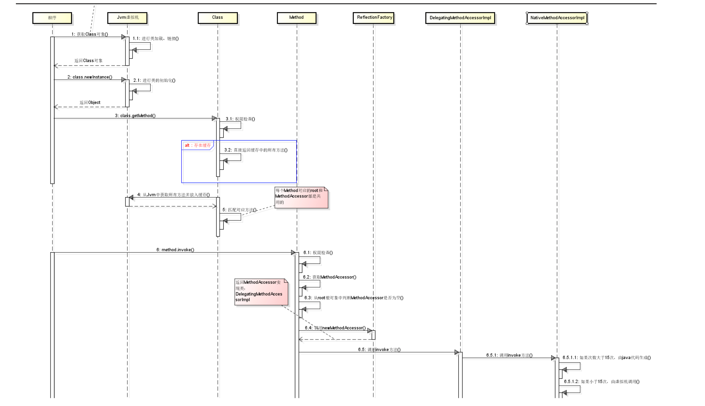
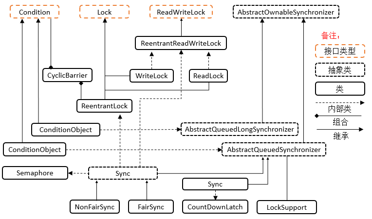
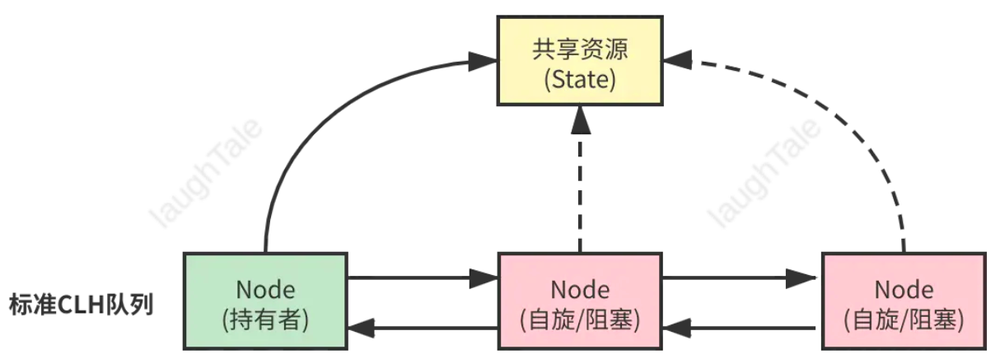
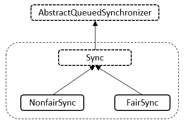

## 反射

> Java 反射机制能在程序运行中，对于任意一个类，都能够**获取/操作**这个类的**所有属性和方法**

动态获取类信息主要有两种方式：

一种是**传统的** `RRIT（Run-Time Type Identification）`，**运行时类型识别**，是在运行时识别一个对象的类型和类的信息，它假定我们在编译时已经知道了所有的类型；

另一种是**反射机制**，它允许我们在运行时解析和使用类的信息。**反射就是把 Java 类中的各种成分（成员变量、方法、构造方法、包等信息）映射成一个个的 Java 对象**

<br>

**一、Class 类**

1、Class 类也是类的一种，与`class`关键字不一样

2、手动编写的类在经过编译后会产生一个 Class 对象，表示创建的类的类型信息，这个 Class 对象保存在同名的`.class`文件中（字节码文件）

3、每个通过关键字`class`标识的类，在内存中**有且只有一个**与之对应的 Class 对象，来描述其类型信息。无论创建多少个实例对象，其依据的都是用同一个 Class 对象

4、Class 类只有私有构造函数，因此对应 Class 对象只能由 JVM 创建和加载

5、Class 类对象的作用是**运行时提供/获取某个对象的类型信息**，这点对于反射技术很重要

<br>

**二、类加载流程**

1、编译器将`.java`文件编译成`.class`字节码文件之后，JVM 在执行过程中会利用**类加载器（`Class Loader`）**动态加载`.class`文件，JVM 在第一次读取到一个`.class`类型时，就会将其加载进内存。

2、JVM 在执行 Java 程序的时候，并不是一次性把所有用到的`.class`全部加载到内存，而是第一次需要用到时才加载。每加载一种`.class`，JVM 就为其创建一个`Class`类型的实例对象，并将二者关联起来。这个对象就包含了完整的类结构信息，包括包名、类名、父类、实现接口、所有方法和字段等。

<br>

**三、反射的使用**

在`java.lang.reflect`包中的内容：`Constructor/Field/Method`与反射相关的三个类

1）Constructor 类表示的是 Class 对象所表示的类的构造方法，利用它可以在运行时动态创建对象

2）Field 表示 Class 对象所表示的类的成员变量，通过它可以在运行时动态修改成员变量的属性值（包含 private 修饰的值）

3）Method 表示 Class 对象所表示的类的成员方法，通过它可以动态调用对象的方法（包含 private 修饰的方法）

<br>

**1、获取 Class 实例**

1）通过`类名.class`获取。**多用于方法中参数传递**

2）通过实例对象的`类名.getClass()`方法获取。**多用于对象**，获取对象字节码

3）通过`Class.forName("类名")`获取。参数为**全限定类名**，**多用于配合配置文件**。将全类名定义在配置文件中，读取配置文件，加载类，获取 Class

```java
/**
 * 获取Class对象的不同方式
 */
public class GetClassTest {
    public static void main(String[] args) throws ClassNotFoundException, IOException {

        // 加载配置文件

        // 方式1
        Properties properties = new Properties();
        ClassLoader classLoader = GetClassTest.class.getClassLoader();
        // reflectConfig.properties 放在与 src 同级别或者在 resources 文件夹内
        InputStream is = classLoader.getResourceAsStream("reflectConfig.properties");
        properties.load(is);
        String className = properties.getProperty("className");
        System.out.println(className);

        // 方式2
        // ResourceBundle bundle = ResourceBundle.getBundle("reflectConfig");
        // String className = bundle.getString("className");
        // System.out.println(className);
        // Enumeration<String> bundleKeys = bundle.getKeys();
        // while (bundleKeys.hasMoreElements()) {
        //     System.out.println(bundleKeys.nextElement());
        // }

        // 1. Class.forName 多用于配合配置文件。将全类名定义在配置文件中，读取配置文件，加载类，获取Class
        Class clazz = Class.forName(className);


        // 2. 类名.class 多用于方法中参数传递
        Class clazz2 = GetClassTest.class;

        // 3. 多用于对象 获取对象字节码
        GetClassTest getClassTest = new GetClassTest();
        Class<? extends GetClassTest> clazz3 = getClassTest.getClass();

        // true
        System.out.println(clazz == clazz2);
        // true
        System.out.println(clazz2 == clazz3);
        // true
        System.out.println(clazz == clazz3);
    }
}

// 通过 getClass 获取类信息
public class ReflectionTest {

    public static void main(String[] args) {
        printClassInfo(ArrayList.class);
        System.out.println("===================");
        printClassInfo(String[].class);
        System.out.println("===================");
        printClassInfo(int.class);

    }

    static void printClassInfo(Class clazz) {
        System.out.println(String.format("className: %s", clazz.getName()));
        System.out.println(String.format("simpleName: %s", clazz.getSimpleName()));
        System.out.println(String.format("package: %s", clazz.getPackage()));
        System.out.println(String.format("is interface: %b", clazz.isInterface()));
        System.out.println(String.format("parent: %s", clazz.getSuperclass()));
        System.out.println(String.format("is array: %b", clazz.isArray()));
        Arrays.stream(clazz.getMethods()).forEach(System.out::println);
    }
}
```

<br>

**2、调用构造函数**

```java
/**
 * 访问 Class对象的构造方法
 */

public class ReflectionTest {
    public static void main(String[] args) throws InvocationTargetException, NoSuchMethodException, InstantiationException, IllegalAccessException {
        Class clazz = User.class;
        showConstructorInfo(clazz);
    }

    static void showConstructorInfo(Class clazz) throws IllegalAccessException, InstantiationException, NoSuchMethodException, InvocationTargetException {
        // 获取无参构造方法，并创建实例对象
        Object newInstance = clazz.getConstructor().newInstance();

        // 获取有参构造方法
        Constructor constructor = clazz.getConstructor(String.class, String.class);
        constructor.setAccessible(true);
        Object instance = constructor.newInstance("zss", "123456");

        System.out.println(instance);
    }
}
```

<br>

**3、获取变量**

```java
/**
 * 访问 Class对象的成员变量信息
 */

public class ReflectionTest2 {
    public static void main(String[] args) throws NoSuchFieldException, InstantiationException, IllegalAccessException {
        Class userClazz = User.class;
        showFiledInfo(userClazz);
    }

    /**
     * showFiledInfo 获取成员变量信息
     */
    static void showFiledInfo(Class clazz) throws NoSuchFieldException, IllegalAccessException, InstantiationException {
        // 获取 public 修饰的成员变量信息
        Field[] fields = clazz.getFields();
        Arrays.stream(fields).forEach(System.out::println);
        System.out.println("****************************");

        // 忽略修饰符，获取到类的所有成员变量信息
        Field[] declaredFields = clazz.getDeclaredFields();
        Arrays.stream(declaredFields).forEach(System.out::println);

        // 1. 为成员变量赋值
        Field gender = clazz.getField("gender");
        User user = new User();
        gender.set(user, "male");

        // 为非public修饰的成员变量赋值
        Field username = clazz.getDeclaredField("username");
        // 操作非public修饰的变量前，需要忽略访问修饰符的安全检查
        // 此做法也被称为【暴力反射】
        username.setAccessible(true);
        username.set(user, "Sb");

        // 2. 获取字段值
        Object obj = username.get(user);
        System.out.println(obj);

        System.out.println(user);
    }
}
```

<br>

**4、调用方法**

```java
/**
 * 访问 Class对象的方法
 */

public class ReflectionTest4 {
    public static void main(String[] args) throws NoSuchMethodException, InvocationTargetException, IllegalAccessException, InstantiationException {
        Class clazz = User.class;
        invokeMethod(clazz, "publicMsg");
    }

    static void invokeMethod(Class clazz, String methodName) throws NoSuchMethodException, InvocationTargetException, IllegalAccessException, InstantiationException {
        Object o = clazz.newInstance();

         Method[] declaredMethods = clazz.getDeclaredMethods();
         Arrays.stream(declaredMethods).forEach(System.out::println);

        System.out.println("**************************************");

        // 有参方法，getMethod(方法名, 方法参数)
        Method publicMsg = clazz.getMethod(methodName, String.class);

        // 执行有参方法 invoke(实例对象，方法参数值)
        // res 方法返回值
        Object res = publicMsg.invoke(o, "aaa");
        System.out.println(String.format("result: %s", res));

        // 无参方法，getDeclaredMethod(方法名)
        Method privateMsg = clazz.getDeclaredMethod("privateMsg");
        // 私有方法需要忽略安全检查
        privateMsg.setAccessible(true);

        // 执行无参方法 invoke(实例对象)
        Object privateResult = privateMsg.invoke(o);
        System.out.println(privateResult);
    }
}
```

<br>

**四、反射类加载细节**

首先调用`java.lang.Class`类的静态方法，获取类信息

```java
// 先获取 ClassLoader ，然后调用本地方法
@CallerSensitive
public static Class<?> forName(String className) throws ClassNotFoundException {
  Class<?> caller = Reflection.getCallerClass();
  return forName0(className, true, ClassLoader.getClassLoader(caller), caller);
}

// 调用本地方法，交给 JVM 去加载
// 获取信息，加载类再回调 java.lang.ClassLoader
private static native Class<?> forName0(String name, boolean initialize,
                                        ClassLoader loader,
                                        Class<?> caller) throws ClassNotFoundException;
```

```java
// 接下来 JVM 回调 ClassLoader 进类加载
public Class<?> loadClass(String name) throws ClassNotFoundException {
  return loadClass(name, false);
}

// sun.misc.Launcher
public Class<?> loadClass(String var1, boolean var2) throws ClassNotFoundException {
  int var3 = var1.lastIndexOf(46);
  if(var3 != -1) {
    SecurityManager var4 = System.getSecurityManager();
    if(var4 != null) {
      var4.checkPackageAccess(var1.substring(0, var3));
    }
  }

  if(this.ucp.knownToNotExist(var1)) {
    Class var5 = this.findLoadedClass(var1);
    if(var5 != null) {
      if(var2) {
        this.resolveClass(var5);
      }

      return var5;
    } else {
      throw new ClassNotFoundException(var1);
    }
  } else {
    return super.loadClass(var1, var2);
  }
}
// java.lang.ClassLoader
protected Class<?> loadClass(String name, boolean resolve)
  throws ClassNotFoundException
{
  // 先获取锁
  synchronized (getClassLoadingLock(name)) {
    // First, check if the class has already been loaded
    // 如果已经加载了的话，就不用再加载了
    Class<?> c = findLoadedClass(name);
    if (c == null) {
      long t0 = System.nanoTime();
      try {
        // 双亲委托加载
        if (parent != null) {
          c = parent.loadClass(name, false);
        } else {
          c = findBootstrapClassOrNull(name);
        }
      } catch (ClassNotFoundException e) {
        // ClassNotFoundException thrown if class not found
        // from the non-null parent class loader
      }

      // 父类没有加载到时，再自己加载
      if (c == null) {
        // If still not found, then invoke findClass in order
        // to find the class.
        long t1 = System.nanoTime();
        c = findClass(name);

        // this is the defining class loader; record the stats
        sun.misc.PerfCounter.getParentDelegationTime().addTime(t1 - t0);
        sun.misc.PerfCounter.getFindClassTime().addElapsedTimeFrom(t1);
        sun.misc.PerfCounter.getFindClasses().increment();
      }
    }
    if (resolve) {
      resolveClass(c);
    }
    return c;
  }
}

protected Object getClassLoadingLock(String className) {
  Object lock = this;
  if (parallelLockMap != null) {
    // 使用 ConcurrentHashMap 来保存锁
    Object newLock = new Object();
    lock = parallelLockMap.putIfAbsent(className, newLock);
    if (lock == null) {
      lock = newLock;
    }
  }
  return lock;
}

protected final Class<?> findLoadedClass(String name) {
  if (!checkName(name))
    return null;
  return findLoadedClass0(name);
}
```

<br>

**五、`newInstance()`的实现**

1、权限检测，如果不通过直接抛出异常

2、查找无参构造器，并将其缓存起来

3、调用具体方法的无参构造方法，生成实例并返回

```java
@CallerSensitive
public T newInstance()
    throws InstantiationException, IllegalAccessException
{
    if (System.getSecurityManager() != null) {
        checkMemberAccess(Member.PUBLIC, Reflection.getCallerClass(), false);
    }

    // NOTE: the following code may not be strictly correct under
    // the current Java memory model.

    // Constructor lookup
    // newInstance() 其实相当于调用类的无参构造函数，所以，首先要找到其无参构造器
    if (cachedConstructor == null) {
        if (this == Class.class) {
            // 不允许调用 Class 的 newInstance() 方法
            throw new IllegalAccessException(
                "Can not call newInstance() on the Class for java.lang.Class"
            );
        }
        try {
            // 获取无参构造器
            Class<?>[] empty = {};
            final Constructor<T> c = getConstructor0(empty, Member.DECLARED);
            // Disable accessibility checks on the constructor
            // since we have to do the security check here anyway
            // (the stack depth is wrong for the Constructor's
            // security check to work)
            java.security.AccessController.doPrivileged(
                new java.security.PrivilegedAction<Void>() {
                    public Void run() {
                        c.setAccessible(true);
                        return null;
                    }
                });
            cachedConstructor = c;
        } catch (NoSuchMethodException e) {
            throw (InstantiationException)
                new InstantiationException(getName()).initCause(e);
        }
    }
    Constructor<T> tmpConstructor = cachedConstructor;
    // Security check (same as in java.lang.reflect.Constructor)
    int modifiers = tmpConstructor.getModifiers();
    if (!Reflection.quickCheckMemberAccess(this, modifiers)) {
        Class<?> caller = Reflection.getCallerClass();
        if (newInstanceCallerCache != caller) {
            Reflection.ensureMemberAccess(caller, this, null, modifiers);
            newInstanceCallerCache = caller;
        }
    }
    // Run constructor
    try {
        // 调用无参构造器
        return tmpConstructor.newInstance((Object[])null);
    } catch (InvocationTargetException e) {
        Unsafe.getUnsafe().throwException(e.getTargetException());
        // Not reached
        return null;
    }
}
```

<br>

**六、获取构造器的过程**

1、先获取所有的构造器， 然后通过参数类型进行比较

2、找到匹配后，通过`getReflectionFactory().copyConstructor()`，拷贝一个构造器并返回

3、否则抛出 NoSuchMethodException

```java
private Constructor<T> getConstructor0(Class<?>[] parameterTypes,
                                       int which) throws NoSuchMethodException
{
    // 获取所有构造器
    // privateGetDeclaredConstructors 通过 JVM 或者缓存获取当前类所有的构造方法
    Constructor<T>[] constructors = privateGetDeclaredConstructors((which == Member.PUBLIC));
    for (Constructor<T> constructor : constructors) {
        if (arrayContentsEq(parameterTypes,
                            constructor.getParameterTypes())) {
            return getReflectionFactory().copyConstructor(constructor);
        }
    }
    throw new NoSuchMethodException(getName() + ".<init>" + argumentTypesToString(parameterTypes));
}
```

`privateGetDeclaredConstructors()`获取所有的构造器主要步骤：

1、先尝试从缓存中获取

2、如果缓存没有，则从 JVM 中重新获取，并存入缓存，缓存使用软引用进行保存，保证内存可用

```java
// 通过 JVM 或者缓存获取当前类所有的构造方法

// Returns an array of "root" constructors. These Constructor
// objects must NOT be propagated to the outside world, but must
// instead be copied via ReflectionFactory.copyConstructor.
private Constructor<T>[] privateGetDeclaredConstructors(boolean publicOnly) {
    checkInitted();
    Constructor<T>[] res;
    // 调用 reflectionData(), 获取保存的信息，使用软引用保存，内存不够可以回收
    ReflectionData<T> rd = reflectionData();
    if (rd != null) {
        res = publicOnly ? rd.publicConstructors : rd.declaredConstructors;
        // 存在缓存，则直接返回
        if (res != null) return res;
    }
    // No cached value available; request value from VM
    if (isInterface()) {
        @SuppressWarnings("unchecked")
        Constructor<T>[] temporaryRes = (Constructor<T>[]) new Constructor<?>[0];
        res = temporaryRes;
    } else {
        // 使用 native 方法从 JVM 获取构造器
        res = getDeclaredConstructors0(publicOnly);
    }
    if (rd != null) {
        // 将从 JVM 中读取的内容，存入缓存
        if (publicOnly) {
            rd.publicConstructors = res;
        } else {
            rd.declaredConstructors = res;
        }
    }
    return res;
}

// Lazily create and cache ReflectionData
private ReflectionData<T> reflectionData() {
    SoftReference<ReflectionData<T>> reflectionData = this.reflectionData;
    int classRedefinedCount = this.classRedefinedCount;
    ReflectionData<T> rd;
    if (useCaches &&
        reflectionData != null &&
        (rd = reflectionData.get()) != null &&
        rd.redefinedCount == classRedefinedCount) {
        return rd;
    }
    // else no SoftReference or cleared SoftReference or stale ReflectionData
    // -> create and replace new instance
    return newReflectionData(reflectionData, classRedefinedCount);
}

// 新创建缓存，保存反射信息
private ReflectionData<T> newReflectionData(SoftReference<ReflectionData<T>> oldReflectionData, int classRedefinedCount) {
    if (!useCaches) return null;

    // 使用 CAS 保证更新的线程安全性，所以反射是保证线程安全的
    while (true) {
        ReflectionData<T> rd = new ReflectionData<>(classRedefinedCount);
        // try to CAS it...
        if (Atomic.casReflectionData(this, oldReflectionData, new SoftReference<>(rd))) {
            return rd;
        }
        // 先使用 CAS 更新，如果更新成功，则立即返回
        // 否则测查当前已被其他线程更新的情况，如果和自己想要更新的状态一致，则也算是成功了
        oldReflectionData = this.reflectionData;
        classRedefinedCount = this.classRedefinedCount;
        if (oldReflectionData != null &&
            (rd = oldReflectionData.get()) != null &&
            rd.redefinedCount == classRedefinedCount) {
            return rd;
        }
    }
}
```

```java
// 使用 relactionData() 进行缓存保存
// ReflectionData 的数据结构如下：

// reflection data that might get invalidated when JVM TI RedefineClasses() is called
private static class ReflectionData<T> {
    volatile Field[] declaredFields;
    volatile Field[] publicFields;
    volatile Method[] declaredMethods;
    volatile Method[] publicMethods;
    volatile Constructor<T>[] declaredConstructors;
    volatile Constructor<T>[] publicConstructors;
    // Intermediate results for getFields and getMethods
    volatile Field[] declaredPublicFields;
    volatile Method[] declaredPublicMethods;
    volatile Class<?>[] interfaces;

    // Value of classRedefinedCount when we created this ReflectionData instance
    final int redefinedCount;

    ReflectionData(int redefinedCount) {
        this.redefinedCount = redefinedCount;
    }
}
```

> 如何比较构造是否是要查找构造器？

其实就是比较参数类型是否完全相等，有一个不相等则返回`false`

```java
private static boolean arrayContentsEq(Object[] a1, Object[] a2) {
    if (a1 == null) {
        return a2 == null || a2.length == 0;
    }

    if (a2 == null) {
        return a1.length == 0;
    }

    if (a1.length != a2.length) {
        return false;
    }

    for (int i = 0; i < a1.length; i++) {
        if (a1[i] != a2[i]) {
            return false;
        }
    }

    return true;
}
// sun.reflect.ReflectionFactory
/** Makes a copy of the passed constructor. The returned
    constructor is a "child" of the passed one; see the comments
    in Constructor.java for details. */
public <T> Constructor<T> copyConstructor(Constructor<T> arg) {
    return langReflectAccess().copyConstructor(arg);
}

// java.lang.reflect.Constructor, copy 其实就是新 new 一个 Constructor
Constructor<T> copy() {
    // This routine enables sharing of ConstructorAccessor objects
    // among Constructor objects which refer to the same underlying
    // method in the VM. (All of this contortion is only necessary
    // because of the "accessibility" bit in AccessibleObject,
    // which implicitly requires that new java.lang.reflect
    // objects be fabricated for each reflective call on Class
    // objects.)
    if (this.root != null)
        throw new IllegalArgumentException("Can not copy a non-root Constructor");

    Constructor<T> res = new Constructor<>(clazz,
                                           parameterTypes,
                                           exceptionTypes, modifiers, slot,
                                           signature,
                                           annotations,
                                           parameterAnnotations);
    // root 指向当前 constructor
    res.root = this;
    // Might as well eagerly propagate this if already present
    res.constructorAccessor = constructorAccessor;
    return res;
}
```

接下来就只需调用其相应构造器的`newInstance()`，返回实例。返回构造器的实例后，可以根据外部进行进行类型转换，从而使用接口或方法进行调用实例功能了

```java
// return tmpConstructor.newInstance((Object[])null);
// java.lang.reflect.Constructor
@CallerSensitive
public T newInstance(Object ... initargs)
    throws InstantiationException, IllegalAccessException,
           IllegalArgumentException, InvocationTargetException
{
    if (!override) {
        if (!Reflection.quickCheckMemberAccess(clazz, modifiers)) {
            Class<?> caller = Reflection.getCallerClass();
            checkAccess(caller, clazz, null, modifiers);
        }
    }
    if ((clazz.getModifiers() & Modifier.ENUM) != 0)
        throw new IllegalArgumentException("Cannot reflectively create enum objects");
    ConstructorAccessor ca = constructorAccessor;   // read volatile
    if (ca == null) {
        ca = acquireConstructorAccessor();
    }
    @SuppressWarnings("unchecked")
    T inst = (T) ca.newInstance(initargs);
    return inst;
}
// sun.reflect.DelegatingConstructorAccessorImpl
public Object newInstance(Object[] args)
  throws InstantiationException,
         IllegalArgumentException,
         InvocationTargetException
{
    return delegate.newInstance(args);
}
// sun.reflect.NativeConstructorAccessorImpl
public Object newInstance(Object[] args)
    throws InstantiationException,
           IllegalArgumentException,
           InvocationTargetException
{
    // We can't inflate a constructor belonging to a vm-anonymous class
    // because that kind of class can't be referred to by name, hence can't
    // be found from the generated bytecode.
    if (++numInvocations > ReflectionFactory.inflationThreshold()
            && !ReflectUtil.isVMAnonymousClass(c.getDeclaringClass())) {
        ConstructorAccessorImpl acc = (ConstructorAccessorImpl)
            new MethodAccessorGenerator().
                generateConstructor(c.getDeclaringClass(),
                                    c.getParameterTypes(),
                                    c.getExceptionTypes(),
                                    c.getModifiers());
        parent.setDelegate(acc);
    }

    // 调用native方法，进行调用 constructor
    return newInstance0(c, args);
}
```

<br>

**七、获取反射方法**

1、权限检查

2、获取所有方法列表

3、根据方法名称和方法列表，选出符合要求的方法

4、如果没有找到相应方法，抛出异常，否则返回对应方法

```java
// java.lang.Class
@CallerSensitive
public Method getDeclaredMethod(String name, Class<?>... parameterTypes)
  throws NoSuchMethodException, SecurityException {
  checkMemberAccess(Member.DECLARED, Reflection.getCallerClass(), true);
  Method method = searchMethods(privateGetDeclaredMethods(false), name, parameterTypes);
  if (method == null) {
    throw new NoSuchMethodException(getName() + "." + name + argumentTypesToString(parameterTypes));
  }
  return method;
}
```

<br>

> 怎样获取类声明的所有方法？

和获取所有构造器的方法很相似，都是先从缓存中获取方法，如果没有，则从 JVM 中获取。不同的是，方法列表需要进行过滤 `Reflection.filterMethods()`

```java
// Returns an array of "root" methods. These Method objects must NOT
// be propagated to the outside world, but must instead be copied
// via ReflectionFactory.copyMethod.
private Method[] privateGetDeclaredMethods(boolean publicOnly) {
    checkInitted();
    Method[] res;
    ReflectionData<T> rd = reflectionData();
    if (rd != null) {
        res = publicOnly ? rd.declaredPublicMethods : rd.declaredMethods;
        if (res != null) return res;
    }
    // No cached value available; request value from VM
    res = Reflection.filterMethods(this, getDeclaredMethods0(publicOnly));
    if (rd != null) {
        if (publicOnly) {
            rd.declaredPublicMethods = res;
        } else {
            rd.declaredMethods = res;
        }
    }
    return res;
}
```

```java
// sun.misc.Reflection
public static Method[] filterMethods(Class<?> containingClass, Method[] methods) {
    if (methodFilterMap == null) {
        // Bootstrapping
        return methods;
    }
    return (Method[])filter(methods, methodFilterMap.get(containingClass));
}
// 可以过滤指定的方法，一般为空，如果要指定过滤，可以调用 registerMethodsToFilter(), 或者...
private static Member[] filter(Member[] members, String[] filteredNames) {
    if ((filteredNames == null) || (members.length == 0)) {
        return members;
    }
    int numNewMembers = 0;
    for (Member member : members) {
        boolean shouldSkip = false;
        for (String filteredName : filteredNames) {
            if (member.getName() == filteredName) {
                shouldSkip = true;
                break;
            }
        }
        if (!shouldSkip) {
            ++numNewMembers;
        }
    }
    Member[] newMembers =
        (Member[])Array.newInstance(members[0].getClass(), numNewMembers);
    int destIdx = 0;
    for (Member member : members) {
        boolean shouldSkip = false;
        for (String filteredName : filteredNames) {
            if (member.getName() == filteredName) {
                shouldSkip = true;
                break;
            }
        }
        if (!shouldSkip) {
            newMembers[destIdx++] = member;
        }
    }
    return newMembers;
}
```

> 根据方法名和参数类型过滤指定方法返回（先匹配到方法名，然后参数类型匹配）

1、匹配到一个方法，并没有退出循环，而是继续进行匹配

2、这里是匹配最精确的子类进行返回（最优匹配）

3、最后通过`copyMethod()`返回

```java
private static Method searchMethods(Method[] methods,
                                    String name,
                                    Class<?>[] parameterTypes)
{
    Method res = null;
    // 使用常量池，避免重复创建String
    String internedName = name.intern();
    for (int i = 0; i < methods.length; i++) {
        Method m = methods[i];
        if (m.getName() == internedName
            && arrayContentsEq(parameterTypes, m.getParameterTypes())
            && (res == null
                || res.getReturnType().isAssignableFrom(m.getReturnType())))
            res = m;
    }

    return (res == null ? res : getReflectionFactory().copyMethod(res));
}
```

<br>

**反射方法调用**

通过`MethodAccessor`进行调用，MethodAccessor 是个接口，在第一次调用`acquireMethodAccessor()`时进行创建

```java
@CallerSensitive
public Object invoke(Object obj, Object... args)
    throws IllegalAccessException, IllegalArgumentException,
InvocationTargetException
{
    if (!override) {
        if (!Reflection.quickCheckMemberAccess(clazz, modifiers)) {
            Class<?> caller = Reflection.getCallerClass();
            checkAccess(caller, clazz, obj, modifiers);
        }
    }
    MethodAccessor ma = methodAccessor;             // read volatile
    if (ma == null) {
        ma = acquireMethodAccessor();
    }
    return ma.invoke(obj, args);
}
```

```java
// probably make the implementation more scalable.
private MethodAccessor acquireMethodAccessor() {
    // First check to see if one has been created yet, and take it
    // if so
    MethodAccessor tmp = null;
    if (root != null) tmp = root.getMethodAccessor();
    if (tmp != null) {
        // 存在缓存时，存入 methodAccessor，否则调用 ReflectionFactory 创建新的 MethodAccessor
        methodAccessor = tmp;
    } else {
        // Otherwise fabricate one and propagate it up to the root
        tmp = reflectionFactory.newMethodAccessor(this);
        setMethodAccessor(tmp);
    }

    return tmp;
}
// sun.reflect.ReflectionFactory
public MethodAccessor newMethodAccessor(Method method) {
    checkInitted();

    if (noInflation && !ReflectUtil.isVMAnonymousClass(method.getDeclaringClass())) {
        return new MethodAccessorGenerator().
            generateMethod(method.getDeclaringClass(),
                           method.getName(),
                           method.getParameterTypes(),
                           method.getReturnType(),
                           method.getExceptionTypes(),
                           method.getModifiers());
    } else {
        NativeMethodAccessorImpl acc =
            new NativeMethodAccessorImpl(method);
        DelegatingMethodAccessorImpl res =
            new DelegatingMethodAccessorImpl(acc);
        acc.setParent(res);
        return res;
    }
}
```

<br>

**八、反射调用流程小结**

1、反射类及反射方法的获取，都是通过从列表中搜寻查找匹配的方法，所以查找性能会随类的大小方法多少而变化；

2、每个类都会有一个与之对应的 Class 实例，每个类都可以获取反射方法，并作用到其他实例身上；

3、反射机制考虑了线程安全，可以放心使用；

4、反射使用软引用 relectionData 缓存 Class 信息，避免每次重新从 JVM 获取带来的开销；

5、反射调用多次生成新代理 Accessor，而且是通过字节码生成的。考虑了卸载功能，所以会使用独立的类加载器；

6、当找到需要的方法，都会 copy 一份出来，而不是使用原来的实例，保证数据隔离；

7、调度反射方法，最终是由 JVM 执行`invoke0()`执行

<br>

**九、反射机制执行流程**



1、运行中获取 Class 对象

2、JVM 进行类字节码文件的**加载/链接**，然后返回 Class 对象

3、程序利用反射调用`Class.new Instance()`，JVM 进行类的初始化，并返回反射创建的对象

4、`Class.getMethod()`获取类的方法时，Class 对象先进行安全权限检查，检查通过查询缓存，缓存中存在对应方法信息，则从缓存中将方法信息返回；缓存中不存在，则从 JVM 中获取对应方法信息并放入缓存

5、调用`method.invoke()`，首先进行方法权限检查，检查通过调用 `invoke()`方法，

<br>

## 范型

> 泛型的本质是为了参数化类型（在不创建新的类型的情况下，通过泛型指定的不同类型来控制形参具体限制的类型）。也就是说在泛型使用过程中，操作的数据类型被指定为一个参数，这种参数类型可以用在类、接口和方法中，分别被称为泛型类、泛型接口、泛型方法。

<br>

**为什么使用范型**

1、操作集合类型数据时，若是使用`Objact`类型存储数据，读取出来的数据需要进行强转，频繁操作可能有`ClassCastException`（类型转换异常）

2、引入泛型的意义在于：**适用于多种数据类型执行相同的代码**（代码复用）

3、泛型中的类型在使用时指定，不需要强制类型转换（**类型安全**，编译器会**检查类型**）

<br>

**范型的使用**

<u>**1 - 范型类**</u>

```java
class Point<T>{         // 此处可以随便写标识符号，T是type的简称
    private T var ;     // var的类型由T指定，即：由外部指定
    public T getVar(){  // 返回值的类型由外部决定
        return var ;
    }
    public void setVar(T var){  // 设置的类型也由外部决定
        this.var = var ;
    }
}

// 多元范型类
class Notepad<K, V>{       // 此处指定了两个泛型类型
    private K key ;     // 此变量的类型由外部决定
    private V value ;   // 此变量的类型由外部决定
    public K getKey(){
        return this.key ;
    }
    public V getValue(){
        return this.value ;
    }
    public void setKey(K key){
        this.key = key ;
    }
    public void setValue(V value){
        this.value = value ;
    }
}
```

<br>

<u>**2 - 范型接口**</u>

```java
interface Info<T>{        // 在接口上定义泛型
    public T getVar() ; // 定义抽象方法，抽象方法的返回值就是泛型类型
}
class InfoImpl<T> implements Info<T>{   // 定义泛型接口的子类
    private T var ;             // 定义属性
    public InfoImpl(T var){     // 通过构造方法设置属性内容
        this.setVar(var) ;
    }
    public void setVar(T var){
        this.var = var ;
    }
    public T getVar(){
        return this.var ;
    }
}
```

<br>

<u>**3 - 范型方法**</u>

```java
public <T extends Number> double add(T a, T b) {
    System.out.println(a + "+" + b + "=" + (a.doubleValue() + b.doubleValue()));
    return a.doubleValue() + b.doubleValue();
}
```

> ⚠️**什么要使用泛型方法呢**？

因为泛型类要在实例化的时候就指明类型，如果想换一种类型，不得不重新 new 一次，可能不够灵活；而泛型方法可以在调用的时候指明类型，更加灵活。

<br>

<u>**4 - 范型数组**</u>

> 数组实际上并不支持泛型。无论我们通过`new ArrayList[10]` 的形式还是通过泛型通配符的形式初始化泛型数组实例都是存在警告的，也就是说仅仅语法合格，运行时潜在的风险需要我们自己来承担，因此那些方式初始化泛型数组都不是最优雅的方式。

在使用到泛型数组的场景下应该尽量使用列表集合替换，此外也可以通过使用 `java.lang.reflect.Array.newInstance(Class<T> componentType, int length)` 方法来创建一个具有指定类型和维度的数组

```java
public class ArrayWithTypeToken<T> {
    private T[] array;

    public ArrayWithTypeToken(Class<T> type, int size) {
        array = (T[]) Array.newInstance(type, size);
    }

    public void put(int index, T item) {
        array[index] = item;
    }

    public T get(int index) {
        return array[index];
    }

    public T[] create() {
        return array;
    }
}
//...

ArrayWithTypeToken<Integer> arrayToken = new ArrayWithTypeToken<Integer>(Integer.class, 100);
Integer[] array = arrayToken.create();
```

<br>

<u>**5 - 范型的上下限**</u>

```java
class Info<T extends Number>{    // 此处泛型只能是数字类型
    private T var ;        // 定义泛型变量
    public void setVar(T var){
        this.var = var ;
    }
    public T getVar(){
        return this.var ;
    }
    public String toString(){    // 直接打印
        return this.var.toString() ;
    }
}

// 只能接收String或Object类型的泛型，String类的父类只有Object类
public void fun(Info<? super String> temp){
    System.out.print(temp + ", ") ;
}
```

**范型上下限细节**

1、`<?>` 无限制通配符

2、`<? extends E>` extends 关键字声明了类型的上界，表示参数化的类型可能是所指定的类型，或者是此类型的子类

3、`<? super E>` super 关键字声明了类型的下界，表示参数化的类型可能是指定的类型，或者是此类型的父类

4、为了获得最大限度的灵活性，要在表示 生产者或者消费者 的输入参数上使用通配符，使用的规则就是：**生产者有上限、消费者有下限** 。 如果既是生产又是消费，那使用通配符就没什么意义了，因为你需要的是精确的参数类型。

5、使用`&`符号

```java
public class Client {
    //工资低于2500元的上斑族并且站立的乘客车票打8折
    public static <T extends Staff & Passenger> void discount(T t){
        if(t.getSalary()<2500 && t.isStanding()){
            System.out.println("恭喜你！您的车票打八折！");
        }
    }

    public static void main(String[] args) {
        discount(new Me());
    }
}
```

<br>

<u>**6 - 范型使用细节**</u>

1、定义泛型方法时，必须在返回值前边加一个`<T>`，来声明这是一个泛型方法，持有一个泛型`T`，然后才可以用泛型`T`作为方法的返回值。

2、既然是泛型方法，就代表着我们不知道具体的类型是什么，也不知道构造方法如何，因此没有办法去 new 一个对象，但可以利用`newInstance()`方法去创建对象，也就是利用反射创建对象。

3、泛型类型不能用于静态方法和静态变量

4、`<T>`不能是基本类型，只能用基本类型的包装类

5、无法使用`instance of`关键字判断泛型类的类型

6、范型中常用字符的含义

1）E - Element (在集合中使用，因为集合中存放的是元素)

2）T - Type（Java 类）

3）K - Key（键）

4）V - Value（值）

5）N - Number（数值类型）

6）？ - 表示不确定的 Java 类型（无限制通配符类型）

7）S、U、V - 2nd、3rd、4th Type

<br>

**<u>7 - 在异常中使用范型</u>**

1、**不能抛出也不能捕获泛型类的对象**。事实上，泛型类扩展 Throwable 都不合法

```java
// 异常都是在运行时捕获和抛出的，而在编译的时候，泛型信息全都会被擦除掉
try{
  // 。。。
} catch(Problem<Integer> e1) {
  // 。。。
} catch(Problem<Number> e2) {
  // 。。。
}

// 类型信息被擦除后，那么两个地方的 catch 都变为原始类型 Object，那么也就是说，这两个地方的 catch 变的一模一样
try{
  // 。。。
} catch(Problem<Object> e1) {
  // 。。。
} catch(Problem<Object> e2) {
  // 。。。
}
```

2、**不能在 catch 子句中使用泛型变量**

```java
public static <T extends Throwable> void doWork(Class<T> t) {
    try {
        // ...
    } catch(T e) { //编译错误
        // ...
    }
}

// 因为泛型信息在编译的时候已经变味原始类型，也就是说上面的 T 会变为原始类型 Throwable

// 根据异常捕获的原则，一定是子类在前面，父类在后面，那么上面就违背了这个原则
public static <T extends Throwable> void doWork(Class<T> t){
    try {
      // ...
    } catch(T e) { //编译错误
      // ...
    } catch(IndexOutOfBounds e) {
      // ...
    }
}

// 在异常声明中可以使用类型变量。下面方法是合法的
public static<T extends Throwable> void doWork(T t) throws T {
    try{
        // ...
    } catch(Throwable realCause) {
        t.initCause(realCause);
        throw t;
    }
}
```

<br>

**<u>8 - 获取范型的参数类型</u>**

> 通过反射（`java.lang.reflect.Type`）获取

`java.lang.reflect.Type`是 Java 中所有类型的公共高级接口，代表了 Java 中的所有类型。

Type 体系中类型的包括：数组类型（GenericArrayType）、参数化类型（ParameterizedType）、类型变量（TypeVariable）、通配符类型（WildcardType）、原始类型（Class）

```java
public class GenericType<T> {
    private T data;

    public T getData() {
        return data;
    }

    public void setData(T data) {
        this.data = data;
    }

    public static void main(String[] args) {
        GenericType<String> genericType = new GenericType<String>() {};
        Type superclass = genericType.getClass().getGenericSuperclass();
        // getActualTypeArguments 返回确切的泛型参数, 如Map<String, Integer>返回[String, Integer]
        Type type = ((ParameterizedType) superclass).getActualTypeArguments()[0];
        System.out.println(type);// class java.lang.String
    }
}

// ParameterizedType.java
public interface ParameterizedType extends Type {
    // 返回确切的泛型参数, 如 Map<String, Integer> 返回 [String, Integer]
    Type[] getActualTypeArguments();

    // 返回当前 Class 或 interface 声明的类型，如List<?> 返回 List
    Type getRawType();

    // 返回所属类型，顶级类型将返回null
    Type getOwnerType();
}
```

<br>

**深入理解范型**

<u>**1 - 关于伪范型**</u>

> 如何理解 Java 中的泛型是伪泛型 ❓

Java 泛型这个特性是从 JDK 1.5 才开始加入的，因此为了兼容之前的版本，Java 泛型的实现采取了==**伪泛型**==的策略，即 Java 在语法上支持泛型，但是在编译阶段会进行所谓的==**类型擦除**==（Type Erasure），将所有的泛型表示（尖括号中的内容）都替换为具体的类型（其对应的原生态类型），就像完全没有泛型一样。理解类型擦除对于用好泛型是很有帮助的，尤其是一些看起来“疑难杂症”的问题，弄明白了类型擦除也就迎刃而解了。

<br>

<u>**2 - 泛型中类型擦除**</u>

原则：

1、消除类型参数声明，即删除`<>`及其包围的部分。

2、根据类型参数的上下界推断并替换所有的类型参数为原生态类型，如果类型参数是无限制通配符或没有上下界限定则替换为 Object，如果存在上下界限定则根据子类替换原则取类型参数的最左边限定类型（即父类）。

3、为了保证类型安全，必要时插入强制类型转换代码。

4、自动产生==桥接方法==以保证擦除类型后的代码仍然具有泛型的==多态性==。

<br>

**证明类型擦除**

1、原始类型相等

```java
public class Test {

    public static void main(String[] args) {

        ArrayList<String> list1 = new ArrayList<String>();
        list1.add("abc");

        ArrayList<Integer> list2 = new ArrayList<Integer>();
        list2.add(123);

        System.out.println(list1.getClass() == list2.getClass()); // true
    }
}
```

在这个例子中，我们定义了两个 ArrayList 数组，不过一个是`ArrayList<String>`泛型类型的，只能存储字符串；一个是`ArrayList<Integer>`泛型类型的，只能存储整数，最后，我们通过 list1 对象和 list2 对象的`getClass()`方法获取他们的类的信息，最后发现结果为 true。说明泛型类型 String 和 Integer 都被擦除掉了，只剩下原始类型。

<br>

2、通过反射添加其它类型元素

```java
public class Test {

    public static void main(String[] args) throws Exception {

        ArrayList<Integer> list = new ArrayList<Integer>();

        list.add(1);  //这样调用 add 方法只能存储整形，因为泛型类型的实例为 Integer

        list.getClass().getMethod("add", Object.class).invoke(list, "asd");

        for (int i = 0; i < list.size(); i++) {
            System.out.println(list.get(i));
        }
    }
}
```

在程序中定义了一个 ArrayList 泛型类型实例化为 Integer 对象，如果直接调用`add()`方法，那么只能存储整数数据，不过当我们利用反射调用`add()`方法的时候，却可以存储字符串，这说明了 Integer 泛型实例在编译之后被擦除掉了，只保留了原始类型。

<br>

## 多线程与并发

### 线程池

> Java 中的线程池是通过 `Executor` 框架实现的，该框架用到 `Executor/Executors/ExecutorService/TheadPoolExecutor` 这几个类

**<u>1 - 线程池特点</u>**

1、线程复用，降低资源消耗，通过复用已创建的线程降低线程创建销毁引起的消耗

2、管理线程，线程是稀缺资源，如果无限创建，不仅会消耗系统资源，还会降低系统稳定性，使用线程池可以进行统一的分配

3、提高响应速度，当任务到达时线程就可执行，减少了线程创建的时间

<br>

**<u>2 - 线程池状态</u>**

1、**RUNNING**：运行状态，接受新任务，持续处理任务队列里的任务。

2、**SHUTDOWN**：调用`shutdown()`方法会进入此状态，不再接受新任务，但要处理任务队列里的任务。`shutdown()`方法会等待线程都执行完毕之后再关闭。

3、**STOP**：调用`shutdownNow()`方法，不再接受新任务，不再处理任务队列里的任务，中断正在进行中的任务。`shutdownNow()`方法，则相当于调用每个线程的`interrupt()`方法。

4、**TIDYING**：表示线程池正在停止运作，中止所有任务，销毁所有工作线程。

5、**TERMINATED**：表示线程池已停止运作，所有工作线程已被销毁，所有任务已被清空或执行完毕

<br>

**<u>3 - 线程池种类</u>**

1、`newFixedThreadPool`，创建一个固定长线程池，可控制线程最大并发数，超出的线程会在队列中等待。定长线程池的大小最好根据系统资源进行设置。如`Runtime.getRuntime().availableProcessors()`

2、`newCacheThreadPool`，创建一个可缓存线程池，如果线程池长度超过处理需要，可灵活回收空闲线程，若无可回收，则新建线程

3、`newScheduledThreadPool`，创建一个定长线程池，支持定时及周期性任务执行

4、`newSingleThreadPool`，创建一个单线程化的线程池，它只会用唯一的工作线程来执行任务，保证所有任务按照指定顺序（FIFO、LIFO、优先级）执行

<br>

**<u>4 - 线程池细节</u>**

1、四种类型的线程池都是`ThreadPoolExecutor`的实例，只是在构造函数中传入的参数不同

2、线程池执行`execute()`方法提交不需要返回值的任务。无法判断是否执行成功

3、线程池执行`submit()`方法，提交有返回值的任务。该方法返回一个`Future`的对象，通过 Future 对象可以判断任务是否执行成功。Future 的`get()`方法会阻塞当前线程直到任务完成。`submit()`内部使用`RunnableFuture`对任务进行封装

<br>

<u>**5 - 线程池的正确创建方法**</u>

> ⚠️ 线程池不建议使用`Executors`来创建，而是要通过`ThreadPoolExecutor`来创建，构造函数的参数自定义

使用`Executors`创建线程池存在以下问题：

1、`FixedThreadPool`和`SingleThreadPool`**允许的请求队列**长度为`Integer.MAX_VALUE`，可能会堆积大量的请求，从而导致 OOM

2、`CacheThreadPool`和`ScheduleThreadPool`**允许的创建线程**数量为`Integer.MAX_VALUE`，可能会创建大量的线程，从而导致 OOM

<br>

**使用 ThreadPoolExecutor 创建线程池**

```java
private static final Integer threadCoreSize = Runtime.getRuntime().availableProcessors() * 2;

public static void theRightWayToBuildAThreadPool() {
    ThreadPoolExecutor threadPoolExecutor = new ThreadPoolExecutor(
            threadCoreSize,
            30,
            5L,
            TimeUnit.SECONDS,
            new LinkedBlockingQueue<>(15),
            Executors.defaultThreadFactory(),
            new ThreadPoolExecutor.AbortPolicy());
}
```

<br>

**<u>6 - ThreadPoolExecutor 详解</u>**

```java
/**
 * Creates a new {@code ThreadPoolExecutor} with the given initial
 * parameters.
 *
 * @param corePoolSize 线程池中的常驻核心线程数
 * the number of threads to keep in the pool, even if they are idle（空闲）, unless {@code allowCoreThreadTimeOut} is set
 * @param maximumPoolSize 线程池中能够容纳同时执行的最大线程数，此值必须大于等于1，一般设置为：cpu核数+1
 * the maximum number of threads to allow in the pool
 * @param keepAliveTime 多余的空闲线程的存活时间，当前线程池中数量超过corePoolSize时，当空闲时间达到keepAliveTime时，多余线程就会被销毁，直到只剩下corePoolSize个线程为止
 * when the number of threads is greater than the core, this is the maximum time that excess（超过） idle threads
 * will wait for new tasks before terminating.
 * @param unit keepAliveTime的单位
 * the time unit for the {@code keepAliveTime} argument
 * @param workQueue 任务队列，被提交但尚未被执行的任务
 * the queue to use for holding tasks before they are executed.  This queue will hold only the {@code Runnable} tasks submitted by the {@code execute} method.
 * @param threadFactory 表示生成线程池中工作线程的线程工厂，用于创建线程，一般使用默认的即可
 * the factory to use when the executor creates a new thread
 * @param handler 拒绝策略，表示当队列满了，并且工作线程大于等于线程池的最大线程数maximumPoolSize时如何来拒绝请求执行的runnable的策略。等待队列已经满了，无法继续添加新任务了，同时线程池中的线程已达到maximumPoolSize值，无法继续为新任务服务，这个时候我们就需要拒绝策略机制合理的处理这个新任务
 * the handler to use when execution is blocked because the thread bounds and queue capacities are reached
 */
public ThreadPoolExecutor(int corePoolSize,
                          int maximumPoolSize,
                          long keepAliveTime,
                          TimeUnit unit,
                          BlockingQueue<Runnable> workQueue,
                          ThreadFactory threadFactory,
                          RejectedExecutionHandler handler) {
    if (corePoolSize < 0 ||
        maximumPoolSize <= 0 ||
        maximumPoolSize < corePoolSize ||
        keepAliveTime < 0)
        throw new IllegalArgumentException();
    if (workQueue == null || threadFactory == null || handler == null)
        throw new NullPointerException();
    this.acc = System.getSecurityManager() == null ?
            null :
            AccessController.getContext();
    this.corePoolSize = corePoolSize;
    this.maximumPoolSize = maximumPoolSize;
    this.workQueue = workQueue;
    this.keepAliveTime = unit.toNanos(keepAliveTime);
    this.threadFactory = threadFactory;
    this.handler = handler;
}
```

<br>

**1、核心线程数**

实际上内部在创建线程时，并没有给线程做标记，因此无法区分核心线程与非核心线程。其内部主要根据当前线程的数量来处理。

也可以理解为，只要当前的 worker 线程数小于配置的 corePoolSize，那么这些线程都是核心线程。线程池根据当前线程数量判断要不要退出线程，而不是根据是否是核心线程

<br>

**2、线程池能容纳的最大任务数**

`最大任务数 = maximumPoolSize + workQueue.size()`，超过能容纳的最大任务树就会触发拒绝策略，报异常 `java.util.concurrent.RejectedExecutionException`

<br>

**3、拒绝策略**

1）AbortPolicy，默认策略，直接抛出`RejectedExecutionException`异常，组织系统正常运行

2）CallerRunsPolicy，调用者运行策略，一种调节机制，该策略不会抛弃任务，也不会抛出异常，而是将某些任务回退到调用者，从而降低新任务流量

3）DiscardOldestPolicy，抛弃队列中等待最久的任务，然后把当前任务加入队列中尝试再次提交当前任务

4）DiscardPolicy，丢弃无法处理的任务，不予处理任何处理也不抛异常，如果允许任务丢失，这是最好的一种策略

<br>

**4、线程池工作流程**

> Create
>
> When a new task is submitted in method execute(Runnable), and fewer than corePoolSize threads are running, a new thread is created to handle the request, even if other worker threads are idle.
>
> If there are more than corePoolSize but less than maximumPoolSize threads running, a new thread will be created only if the queue is full.
>
> Queue
>
> If corePoolSize or more threads are running, the Executor always prefers queuing a request rather than adding a new thread.
>
> If corePoolSize or more threads are running, the Executor always prefers queuing a request rather than adding a new thread.
>
> If a request cannot be queued, a new thread is created unless this would exceed maximumPoolSize, in which case, the task will be rejected.

1）线程池被创建之后，开始等待任务请求

2）当调用`execute()`方法添加请求时，线程池做出判断

1」正在运行的线程数量小于`corePoolSize`，马上创建线程运行这个任务

2」正在运行的线程数量大于等于`corePoolSize`，将这个任务放入队列等待

3」队列已满，且正在运行的线程数量小于`maximumPoolSize`，创建非核心线程立刻执行队列中的任务。当核心线程和阻塞队列都满了，就会扩大线程数。当线程数扩大到`maximumPoolSize`且阻塞队列也满了，就会触发拒绝策略

<br>

3）当一个线程完成任务时，它就会从队列中取出下一个任务执行

4）当一个线程没有任务执行超过`keepAliveTime`时，线程就会判断：当前运行的线程数是否大于`corePoolSize`，是的话这个线程就会被停掉

5）线程池的所有任务完成后，它最终会收缩到`corePoolSize`的大小


### synchronized & Lock

**1、相同点**

都能解决线程安全问题

**2、不同点**

1）实现方式。synchronized 是 JVM 实现的，而 `ReentrantLock` 是 JDK 实现的。

2）`synchronized`机制在执行完相应的同步代码以后，**自动释放同步监视器**，==自动释放资源==

3）`Lock`锁需要手动`lock()`，同步结束需要`unlock()`，==手动释放资源==，所以一般使用`synchronized`较多

4）多线程竞争一个锁时，其余未得到锁的线程只能不停的尝试获得锁，而不能中断。高并发的情况下会导致性能下降。`ReentrantLock`的`lockInterruptibly()`方法可以优先考虑响应中断。 一个线程等待时间过长，它可以中断自己，然后 ReentrantLock 响应这个中断，不再让这个线程继续等待。有了这个机制，使用 ReentrantLock 时就不会像 synchronized 那样产生死锁了。

5）公平与非公平。synchronized 是非公平锁，新来的线程有可能立即获得监视器，而在等待区中等候已久的线程可能再次等待，不过这种抢占的方式可以预防饥饿；Lock 默认是非公平锁，可以在实例化时传入对应的参数来获取公平锁或者非公平锁

6）一个 ReentrantLock 可以同时绑定多个 Condition 对象。

<br>

**3、使用建议**

1）Lock

2）同步代码块

3）同步方法

> 操作的代码量由少到多

除非需要使用 `ReentrantLock` 的高级功能，否则优先使用 `synchronized`。这是因为 `synchronized` 是 JVM 实现的一种锁机制，JVM 原生地支持它。而 `ReentrantLock` 不是所有的 JDK 版本都支持。并且使用 `synchronized` 不用担心没有释放锁而导致死锁问题，因为 JVM 会确保锁的释放。


<br>

### JUC 包体系

> JUC 指的是`java.util.concurrent`包及其子包下用于并发场景的类

<br>

#### CAS

**<u>1 - 什么是 CAS</u>**

CAS 的全称 Compare-And-Swap（对比交换），是一条 CPU 的原子指令。CAS 操作包含三个操作数——内存位置、预期原值及新值。执行 CAS 操作的时候，将内存位置的值与预期原值比较，如果相匹配，那么处理器会自动将该位置值更新为新值，否则，处理器不做任何操作。

它的实现方式是基于硬件平台的汇编指令，也就是说 CAS 是靠硬件实现的，JVM 只是封装了汇编调用，`Atomic`相关类使用了这些封装后的接口。

**CAS 操作是原子性的，所以多线程并发使用 CAS 更新数据时，可以不使用锁**。JDK 中大量使用了 CAS 来更新数据而防止加锁（synchronized 重量级锁，Lock 底层的 AQS 也是基于 CAS 进行获取锁的）来保持原子更新。

CAS 实现方式为乐观锁，synchronized 为悲观锁。因此使用 CAS 解决并发问题通常情况下性能更优。

```java
// 使用 synchronized
public class Test {
    private int i=0;
    public synchronized int add(){
        return i++;
    }
}
// 使用原子类
public class Test {
    private  AtomicInteger i = new AtomicInteger(0);
    public int add(){
        return i.addAndGet(1);
    }
}
```

<br>

**<u>2 - CAS 带来的问题</u>**

**1、ABA 问题**

CAS 需要在操作值的时候，检查值有没有发生变化，没有发生变化则更新，如果将 A 值改成了 B，再将 B 改回 A，虽然期望值一样是 A，但是已经是被修改过了的。

> 可以使用乐观锁来解决 ABA 问题

JDK 的 Atomic 包里提供了一个类`AtomicStampedReference`来解决 ABA 问题。`AtomicStampedReference`类的`compareAndSet()`方法的作用是首先检查当前引用是否等于预期引用，并且检查当前标志（版本）是否等于预期标志（版本），如果全部相等，则以原子方式将该引用和该标志的值设置为给定的更新值。

总的来说就是：

1）使用版本号控制

2）不重复使用节点（Pair）的引用，每次都新建一个新的 Pair 来作为 CAS 比较的对象，而不是复用旧的

```java
/**
 * CASTest
 * @author gnl
 */
public class CASTest {
    public static void main(String[] args) {
        /**
         * AtomicStampedReference 带时间戳的原子引用
         * @param initialRef 初始引用值
         * @param initialStamp 初始版本
         */
        AtomicStampedReference<Integer> integerRef = new AtomicStampedReference<>(1, 1);

        System.out.println("ref: " + integerRef.getReference());
        System.out.println("stamp: " + integerRef.getStamp());

        new Thread(() -> {

            System.out.println(Thread.currentThread().getName() + "\tupdate now");
            /**
             * compareAndSet(期望值, 新值, 期望版本, 新版本)
             */
            System.out.println(integerRef.compareAndSet(1, 2, integerRef.getStamp(), integerRef.getStamp() + 1));

            System.out.println("ref: " + integerRef.getReference());
            System.out.println("stamp: " + integerRef.getStamp());

        }, "A").start();

        new Thread(() -> {

            System.out.println(Thread.currentThread().getName() + "\tupdate now");

            System.out.println(integerRef.compareAndSet(1, 2, integerRef.getStamp(), integerRef.getStamp() + 1));
            System.out.println("ref: " + integerRef.getReference());
            System.out.println("stamp: " + integerRef.getStamp());

        }, "B").start();
    }
}
```

<br>

**2、自旋循环时间长开销大**

自旋 CAS 如果长时间不成功，会给 CPU 带来非常大的执行开销。

> 📝 对于 CAS 自旋的开销，如果 JVM 能支持处理器提供的 pause 指令，那么效率会有一定的提升。pause 指令有两个作用：第一，它可以延迟流水线执行命令（de-pipeline），使 CPU 不会消耗过多的执行资源，延迟的时间取决于具体实现的版本，一些处理器上延迟时间是零；第二，它可以避免在退出循环的时候因内存顺序冲突（Memory Order Violation）而引起 CPU 流水线被清空（CPU Pipeline Flush），从而提高 CPU 的执行效率

<br>

**3、只能保证一个共享变量的原子操作**

当对一个共享变量执行操作时，我们可以使用 CAS 的方式来保证原子操作，但是对多个共享变量操作时，CAS 就无法保证操作的原子性，这个时候就可以用锁来实现。

> 📝 还有一个取巧的办法，就是把多个共享变量合并成一个共享变量来操作。比如，有两个共享变量：`i = 2，j = a`，合并一下`ij = 2a`，然后用 CAS 来操作`ij`。

从 Java 1.5 开始，JDK 提供了`AtomicReference`类来保证引用对象之间的原子性，就可以把多个变量放在一个对象里来进行 CAS 操作。

<br>

#### Unsafe 类

> 原子类（AtomicXXX 类）是通过`Unsafe`类实现的

`Unsafe` 是位于`sun.misc`包下的一个类，主要提供一些用于执行低级别、不安全操作的方法，如直接访问系统内存资源、自主管理内存资源等。这些方法在提升 Java 运行效率、增强 Java 语言底层资源操作能力方面起到了很大的作用。

由于 `Unsafe` 类使用的 `native` 方法底层是使用 C/C++ 语言开发的，因此具有操作内存空间的能力，这也增加了程序发生相关指针问题的风险。在程序中过度、不正确使用 `Unsafe` 类会使得程序出错的概率变大，使得 Java 这种内存安全的语言变得不再安全，因此对 `Unsafe` 的使用一定要慎重。

尽管 `Unsafe` 类里面的方法都是 `public` 的，但对于 `Unsafe` 类的使用是受限制的。只有授信任的类（`BootstrapClassLoader` 加载的类）才能获得该类的实例，除此之外其他类无法直接使用，只能通过反射获得 `Unsafe` 类对象

<br>

**UnSafe 类总体功能**

Unsafe 提供的 API 大致可分为：内存操作、CAS、Class 相关、对象操作、线程调度、系统信息获取、内存屏障、数组操作等


> Unsafe 类更多细节稍后补充…

<br>

#### Atomic 原子类

> 以 AtomicInteger 为例

**<u>1 - 基本原子类</u>**

**1、常用 API**

```java
public final int get()：获取当前的值
public final int getAndSet(int newValue)：获取当前的值，并设置新的值
public final int getAndIncrement()：获取当前的值，并自增
public final int getAndDecrement()：获取当前的值，并自减
public final int getAndAdd(int delta)：获取当前的值，并加上预期的值
void lazySet(int newValue): 最终会设置成newValue,使用lazySet设置值后，可能导致其他线程在之后的一小段时间内还是可以读到旧的值。
```

```java
// 1、synchronized + volatile 实现
private volatile int count = 0;
// 若要线程安全执行执行 count++，需要加锁
public synchronized void increment() {
    count++;
}
public int getCount() {
    return count;
}


// 2、AtomicInteger 实现
private AtomicInteger count = new AtomicInteger();
public void increment() {
    count.incrementAndGet();
}
// 使用 AtomicInteger 后，不需要加锁，也可以实现线程安全
public int getCount() {
    return count.get();
}
```

<br>

**2、AtomicInteger 实现细节**

```java
public class AtomicInteger extends Number implements java.io.Serializable {
    private static final long serialVersionUID = 6214790243416807050L;

    // setup to use Unsafe.compareAndSwapInt for updates
    private static final Unsafe unsafe = Unsafe.getUnsafe();
    private static final long valueOffset;

    static {
        try {
            valueOffset = unsafe.objectFieldOffset
                    (java.util.concurrent.atomic.AtomicInteger.class.getDeclaredField("value"));
        } catch (Exception ex) { throw new Error(ex); }
    }

      // 存储当前值
      // volatile 保证线程的可见性，多线程并发时，一个线程修改数据，可以保证其它线程立马看到修改后的值
    private volatile int value;

    /**
     * Creates a new AtomicInteger with the given initial value.
     *
     * @param initialValue the initial value
     */
    public AtomicInteger(int initialValue) {
        value = initialValue;
    }

    /**
     * Creates a new AtomicInteger with initial value {@code 0}.
     */
    public AtomicInteger() {
    }

    /**
     * Gets the current value.
     * 返回当前值
     * @return the current value
     */
    public final int get() {
        return value;
    }

    /**
     * Sets to the given value.
     *
     * @param newValue the new value
     */
    public final void set(int newValue) {
        value = newValue;
    }

    /**
     * Eventually sets to the given value.
     *
     * @param newValue the new value
     */
    public final void lazySet(int newValue) {
        unsafe.putOrderedInt(this, valueOffset, newValue);
    }

    /**
     * Atomically sets to the given value and returns the old value.
     *
     * @param newValue the new value
     * @return the previous value
     */
    public final int getAndSet(int newValue) {
        return unsafe.getAndSetInt(this, valueOffset, newValue);
    }

    /**
     * Atomically sets the value to the given updated value
     * if the current value {@code ==} the expected value.
     *
     * @param expect the expected value
     * @param update the new value
     * @return {@code true} if successful. False return indicates that
     * the actual value was not equal to the expected value.
     */
    public final boolean compareAndSet(int expect, int update) {
        return unsafe.compareAndSwapInt(this, valueOffset, expect, update);
    }

}
```

> 在其他基本类型的原子类方法类似 AtomicInteger，不再展开

<br>

**3、原子数组**

- AtomicIntegerArray，原子更新整型数组里的元素
- AtomicLongArray，原子更新长整型数组里的元素
- AtomicReferenceArray，原子更新引用类型数组里的元素

常用方法：

- get(int index)，获取索引为 index 的元素值
- compareAndSet(int i,E expect,E update)，如果当前值等于预期值，则以原子方式将数组位置 i 的元素设置为 update 值

<br>

**4、原子引用**

- AtomicReference，原子更新引用类型
- AtomicStampedReference，原子更新引用类型, 内部使用`Pair`类来存储元素值及其版本号
- AtomicMarkableReferce，原子更新带有标记位的引用类型

<br>

#### Lock 框架和工具类

**类结构**



<br>

##### LockSupport

> 稍后补充…

<br>

##### AQS

<br>

**<u>1 - AQS 是什么</u>**

AbstractQueuedSynchronizer（抽象队列同步器），**是一个用来构建锁和同步器的框架**，使用 AQS 能简单且高效地构造出应用广泛的大量的同步器。

比如 ReentrantLock，Semaphore，其他如 ReentrantReadWriteLock，SynchronousQueue，FutureTask 皆是基于 AQS。

<br>

**<u>2 - AQS 核心思想</u>**

AQS 核心思想是：

1）如果被请求的共享资源空闲，则将当前请求资源的线程设置为有效的工作线程，并且将共享资源设置为锁定状态；

2）如果被请求的共享资源被占用，那么就需要一套**线程阻塞等待机制**以及**被唤醒时锁分配机制**，这个机制 AQS 是用 CLH 队列锁实现的，将暂时获取不到锁的线程加入到队列中。

<br>

**1、CLH 队列**

CLH（Craig，Landin，and Hagersten 三个人名缩写）队列是一个**虚拟的双向队列**（不存在队列实例，仅存在结点之间的关联关系）。**AQS 将每条请求共享资源的线程封装成一个 CLH 锁队列的一个结点（Node）来实现锁的分配。**



**2、内部 Node 类**

在`AQS`中如果线程获取资源失败，会包装成一个节点挂载到`CLH`队列上，`AQS`中定义了`Node`类用于包装线程。

`Node`主要包含 5 个核心字段：

1）`waitStatus`：当前节点状态，共有 5 种取值：

- `CANCELLED = 1` 节点引用线程由于等待超时或被*interrupt*时的状态
- `SIGNAL = -1` 后继节点线程需要被唤醒时的当前节点状态。当队列中加入后继节点被挂起(_block_)时，其前驱节点会被设置为`SIGNAL`状态，表示该节点需要被唤醒
- `CONDITION = -2` 当节点线程进入*condition*队列时的状态
- `PROPAGATE = -3` 仅在释放共享锁*releaseShared*时对头节点使用
- `0` 节点初始化时的状态

2）`prev` 前驱节点

3）`next` 后继节点

4）`thread` 引用线程，头节点不包含线程

5）`nextWaiter` 表示*condition*条件队列

<br>

**3、AQS 细节**

AQS 使用一个`volatile int state`变量来表示同步状态，一个*FIFO*的*CLH*队列来完成获取资源线程的排队工作。队列中的*Node*节点持有线程引用，每个节点均可通过`getState()`、`setState()`和`compareAndSetState()`对`state`进行修改和访问。

```java
// AbstractQueuedSynchronizer.java

/**
 * 共享变量，使用volatile修饰保证线程可见性
 * The synchronization state.
 */
private volatile int state;

/**
 * 返回同步状态的当前值 Returns the current value of synchronization state.
 * This operation has memory semantics of a {@code volatile} read.
 */
protected final int getState() {
    return state;
}

/**
 * 设置同步状态的值 Sets the value of synchronization state.
 * This operation has memory semantics of a {@code volatile} write.
 */
protected final void setState(int newState) {
    state = newState;
}


/**
 * 如果当前同步状态的值等于expect(期望值)，则原子地（CAS操作）将同步状态值设置为给定值update
 * Atomically sets synchronization state to the given updated
 * value if the current state value equals the expected value.
 * This operation has memory semantics of a {@code volatile} read
 * and write.
 */
protected final boolean compareAndSetState(int expect, int update) {
    // See below for intrinsics setup to support this
    return unsafe.compareAndSwapInt(this, stateOffset, expect, update);
}

// acquire核心为tryAcquire、addWaiter和acquireQueued三个函数，其中tryAcquire需具体类实现。
// acquire实现默认为非公平锁，线程调用 acquire 时首先会调用 tryAcquire，失败后才会挂载到队列
public final void acquire(int arg) {
  if (!tryAcquire(arg) &&
      // 如获取资源失败，将线程包装为Node添加到队列中阻塞等待
      // addWaiter将线程包装为独占节点，尾插式加入到队列中。如队列为空，则会添加一个空的头节点。
      // 值得注意的是addWaiter中的enq方法，通过CAS+自旋的方式处理尾节点添加冲突。
      acquireQueued(addWaiter(Node.EXCLUSIVE), arg))
    selfInterrupt();
}
```

<br>

**<u>2 - AQS 对资源的占有方式</u>**

1、Exclusive（独占），只有一个线程能执行。如*ReentrantLock*，又可分为公平锁和非公平锁

- 公平锁：按照线程在队列中的排队顺序，先到者先拿到锁
- 非公平锁：当线程要获取锁时，无视队列顺序直接去抢锁，谁抢到就是谁的

2、Share（共享），多个线程可同时执行，如*Semaphore/CountDownLatch*

> ⚠️ `ReentrantReadWriteLock`可以看成是组合式，因为 ReentrantReadWriteLock（读写锁）允许多个线程同时对某一资源进行读

不同的自定义同步器争用共享资源的方式也不同。自定义同步器在实现时只需要实现共享资源 state 的获取与释放方式即可，至于具体线程等待队列的维护（如获取资源失败入队/唤醒出队等），AQS 已在上层实现好。

<br>

**<u>3 - AQS 模版方法</u>**

```java
isHeldExclusively() // 该线程是否正在独占资源。只有用到 condition 才需要去实现它。
tryAcquire(int) // 独占方式。尝试获取资源，成功则返回 true，失败则返回 false。
tryRelease(int) // 独占方式。尝试释放资源，成功则返回 true，失败则返回 false。
tryAcquireShared(int) // 共享方式。尝试获取资源。负数表示失败；0 表示成功，但没有剩余可用资源；正数表示成功，且有剩余资源。
tryReleaseShared(int) // 共享方式。尝试释放资源，成功则返回 true，失败则返回 false。
```

- 默认情况下，每个方法都抛出`UnsupportedOperationException`

- 这些方法的实现必须是内部线程安全的，并且通常应该简短而不是阻塞

- AQS 类中的其他方法都是*final*，所以无法被其他类使用，只有这几个方法可以被其他类使用

  > All other methods are declared final because they cannot be independently varied.

**AQS 与可重入**

以 ReentrantLock 为例：

1. `state`初始化为 0，表示未锁定状态。
2. A 线程`lock()`时，会调用`tryAcquire()`独占该锁并将`state+1`。
3. 此后其他线程再`tryAcquire()`时就会失败，直到 A 线程`unlock()`到`state`为 0（即释放锁）为止，其它线程才有机会获取该锁。
4. 释放锁之前，A 线程自己是可以重复获取此锁的，`state`会累加，这就是可重入的概念。但要注意，**获取多少次就要释放多少次，这样才能保证 state 是能回到零态（无锁）的。**

> 更多细节稍后补充…

<br>

##### ReentrantLock

<br>

**<u>1 - 可重入锁？</u>**

1、ReentrantLock 可重入

以 ReentrantLock 为例，state 初始化为 0，表示未锁定状态。A 线程`lock()`时，会调用`tryAcquire()`独占该锁并将 state+1。此后，其他线程再`tryAcquire()`时就会失败，直到 A 线程`unlock()`到 state 为 0（即释放锁）为止，其它线程才有机会获取该锁。当然，释放锁之前，A 线程自己是可以重复获取此锁的（state 会累加），这就是可重入的概念。但要注意，**获取多少次就要释放多少次，这样才能保证 state 是能回到零态的。**

2、synchronized 可重入

> 详见 synchronized 详解

<br>

**<u>2 - ReentrantLock 的内部结构</u>**

ReentrantLock 总共有三个内部类：`Sync`、`NonfairSync`和`FairSync`。三个内部类的关系如下：



<br>

**1、Sync 类**

```java
import java.util.concurrent.locks.AbstractQueuedSynchronizer;

/**
 * Base of synchronization control for this lock. Subclassed
 * into fair and nonfair versions below. Uses AQS state to
 * represent the number of holds on the lock.
 */
// 继承自 AbstractQueuedSynchronizer
abstract static class Sync extends AbstractQueuedSynchronizer {
    private static final long serialVersionUID = -5179523762034025860L;

    /**
     * lock，留给子类：FairSync和NonfairSync实现
     */
    abstract void lock();

    /**
     * 非公平方式尝试获取锁
     */
    final boolean nonfairTryAcquire(int acquires) {
          // 获取当前线程
        final Thread current = Thread.currentThread();
          // 获取当前锁的状态
        int c = getState();

          // state 为0，说明当前锁处于空闲状态
        if (c == 0) {
              // 使用CAS 更新state 值
            if (compareAndSetState(0, acquires)) {
                  // 设置独占锁的持有者为当前线程
                setExclusiveOwnerThread(current);
                return true;
            }
        }
          // state 不为0，检查独占锁的持有者是否为当前线程
        else if (current == getExclusiveOwnerThread()) {
              // 锁的持有者为当前线程，nextState 也即nextc= 当前state + acquires
              // 增加重入次数
            int nextc = c + acquires;
            if (nextc < 0) // overflow
                throw new Error("Maximum lock count exceeded");
              // 设置state 值
            setState(nextc);
            return true;
        }
          // 锁的持有者非当前线程，返回false
        return false;
    }

      // 尝试释放锁
    protected final boolean tryRelease(int releases) {
          // 获取当前state， c = state - relase表示释放锁之后的状态
        int c = getState() - releases;
          // 锁的持有者非当前对象，抛出异常
        if (Thread.currentThread() != getExclusiveOwnerThread())
            throw new IllegalMonitorStateException();
          // 若锁释放之后的状态为0，说明释放成功
        boolean free = false;
        if (c == 0) {
            free = true;
              // 设置锁的持有者为null
            setExclusiveOwnerThread(null);
        }
          // 设置state为0
        setState(c);
        return free;
    }

      // 判断当前线程是否持有独占锁
    protected final boolean isHeldExclusively() {
        // While we must in general read state before owner,
        // we don't need to do so to check if current thread is owner
        return getExclusiveOwnerThread() == Thread.currentThread();
    }

      // 新建Condition对象
    final AbstractQueuedSynchronizer.ConditionObject newCondition() {
        return new ConditionObject();
    }

    // Methods relayed from outer class

      // 获取当前锁的持有者
    final Thread getOwner() {
        return getState() == 0 ? null : getExclusiveOwnerThread();
    }

      // 获取当前锁被重入的次数
    final int getHoldCount() {
        return isHeldExclusively() ? getState() : 0;
    }

      // 检查锁资源是否已被占用
    final boolean isLocked() {
        return getState() != 0;
    }

    /**
     * 自定义反序列化逻辑
     */
    private void readObject(java.io.ObjectInputStream s)
            throws java.io.IOException, ClassNotFoundException {
        s.defaultReadObject();
        setState(0); // reset to unlocked state
    }
}
```

<br>

**2、NonfairSync 类**

> NonfairSync 继承自 Sync 类，表示采用非公平策略获取锁，其实现了 Sync 类中抽象的 lock 方法

```java
// 非公平锁
static final class NonfairSync extends Sync {
    private static final long serialVersionUID = 7316153563782823691L;

    /**
     * 获取锁
     */
    final void lock() {
          // 一进入方法就立即设置state为1，将持有锁的线程设置成当前线程
          // 若获取失败则自旋等待
        if (compareAndSetState(0, 1))
            setExclusiveOwnerThread(Thread.currentThread());
        else
            acquire(1);
    }

    protected final boolean tryAcquire(int acquires) {
        return nonfairTryAcquire(acquires);
    }
}
```

<br>

**3、FairSync 类**

> 公平锁

```java
// 公平锁
static final class FairSync extends Sync {
    private static final long serialVersionUID = -3000897897090466540L;

    final void lock() {
          // 进入方法就在将当前获取锁的请求设置到等待队列中，等待获取锁
        acquire(1);
    }

    /**
     * 尝试取锁公平获
     */
    protected final boolean tryAcquire(int acquires) {
          // 获取当前线程
        final Thread current = Thread.currentThread();
          // 获取state
        int c = getState();
          // state为0，当前锁资源空闲，
        if (c == 0) {
              // hasQueuedPredecessors 检查是否有正在等待获取公平锁资源的队列
              // 若没有等待队列，则获取公平锁成功，CAS更新state 值
            if (!hasQueuedPredecessors() &&
                    compareAndSetState(0, acquires)) {
                  // state 更新成功，将独占锁持有者设置成当前线程
                setExclusiveOwnerThread(current);
                return true;
            }
        }
          // state 不为0，判断持有独占锁资源的线程是否是当前线程
        else if (current == getExclusiveOwnerThread()) {
              // 增加重入次数
            int nextc = c + acquires;
            if (nextc < 0)
                throw new Error("Maximum lock count exceeded");
              // 更新state的值
            setState(nextc);
            return true;
        }
          // state不为0，并且锁资源持有者非当前线程
        return false;
    }
}
```

<br>

**`FairSync#lock`方法执行流程：**

```java
// 1、调用 AbstractQueuedSynchronizer#acquire
public final void acquire(int arg) {
  // 2、调用 FairSync#tryAcquire 尝试获取锁
  // 3、若是 tryAcquire 不成功，调用AbstractQueuedSynchronizer#acquireQueued 获取等待队列
  // 4、将当前请求包装成 CLH Node 节点加入等待队列
  if (!tryAcquire(arg) &&
      acquireQueued(addWaiter(Node.EXCLUSIVE), arg))
    selfInterrupt();
}

private Node addWaiter(Node mode) {
  // 新建一个 Node 节点
  Node node = new Node(Thread.currentThread(), mode);
  // Try the fast path of enq; backup to full enq on failure
  Node pred = tail;
  if (pred != null) {
    node.prev = pred;
    // 将 node 插入等待队列尾部
    if (compareAndSetTail(pred, node)) {
      pred.next = node;
      return node;
    }
  }
  enq(node);
  return node;
}

final boolean acquireQueued(final Node node, int arg) {
  boolean failed = true;
  try {
    boolean interrupted = false;
    for (;;) {
      final Node p = node.predecessor();
      if (p == head && tryAcquire(arg)) {
        setHead(node);
        p.next = null; // help GC
        failed = false;
        return interrupted;
      }
      if (shouldParkAfterFailedAcquire(p, node) &&
          parkAndCheckInterrupt())
        interrupted = true;
    }
  } finally {
    if (failed)
      cancelAcquire(node);
  }
}
```

<br>

**<u>3 - ReentrantLock 实现细节</u>**

**1、类的操作**

ReentrantLock 类的 Sync 非常重要，对 ReentrantLock 类的操作大部分都直接转化为对 Sync 和 AbstractQueuedSynchronizer 类的操作。如将 ReentrantLock 的 lock 函数转化为对 Sync 的 lock 函数的调用，而具体会根据采用的策略（如公平策略或者非公平策略）的不同而调用到 Sync 的不同子类。

**2、类的构造函数**

无参构造函数默认创建的是 NonfairSync，可以使用带一个参数的`ReentrantLock(boolean fair)`型构造函数决定创建的是公平或者非公平锁。

<br>

##### ReentrantReadWriteLock

**<u>1 - ReentrantReadWriteLock 内部结构</u>**

相比于 ReentrantLock，ReentrantReadWriteLock 有五个内部类。除了 Sync、NonfairSync、FairSync 之外，还多了 `ReadLock`和`WriteLock`两个类。


> 稍后进行补充。。。

<br>

#### 并发集合

**类结构**


<br>

##### ConcurrentHashMap

> JDK 1.7 之前的 ConcurrentHashMap 使用分段锁机制实现，JDK 1.8 则使用数组+链表+红黑树数据结构和 CAS 原子操作实现 ConcurrentHashMap

<br>

**<u>1 - 为何 HashTable 慢？</u>**

Hashtable 之所以效率低下主要是因为其实现使用了 synchronized 关键字对 put() 等操作进行加锁，而 synchronized 关键字加锁是**对整个对象进行加锁**，也就是说在进行 put() 等修改 HashTable 的操作时，锁住了整个 HashTable，从而使得其表现的效率低下。

<br>

**<u>2 - JDK 1.7 及之前的实现？</u>**

在 JDK1.5 ~ 1.7 版本，Java 使用了分段锁机制实现 ConcurrentHashMap。

即 ConcurrentHashMap 在对象中保存了一个 Segment 数组，即将整个 Hash 表划分为多个分段；而每个 Segment 元素，即每个分段则类似于一个 Hashtable；这样，在执行 put() 操作时首先根据 hash 算法定位到元素属于哪个 Segment，然后对该 Segment 加锁即可。因此，ConcurrentHashMap 在多线程并发编程中可是实现多线程 put 操作。接下来分析 JDK1.7 版本中 ConcurrentHashMap 的实现原理。

**<u>3 - JDK 1.8 的实现</u>**

**1、数据结构**

在 JDK 1.7 之前，ConcurrentHashMap 是通过分段锁机制来实现的，所以其最大并发度受 Segment 的个数限制。在 JDK 1.8 中，ConcurrentHashMap 的实现原理摒弃了这种设计，而是选择了与 HashMap 类似的数组+链表+红黑树的方式实现，而加锁则采用 CAS 和 synchronized 实现。

**2、原理分析**

```java
public class ConcurrentHashMap<K,V> extends AbstractMap<K,V>
    implements ConcurrentMap<K,V>, Serializable {

    private static final long serialVersionUID = 7249069246763182397L;

    /* ---------------- Constants -------------- */

      // 最大容量为2^30
    private static final int MAXIMUM_CAPACITY = 1 << 30;

    /**
     * 默认容量为16.  Must be a power of 2
     */
    private static final int DEFAULT_CAPACITY = 16;

    /**
     * 默认负载因子
     */
    private static final float LOAD_FACTOR = 0.75f;

    /**
     * 链表 treeify 的阈值，一旦链表长度大于等于8，进行 treeify 操作
     */
    static final int TREEIFY_THRESHOLD = 8;

    /**
     * 在进行 resize 操作时，当树的节点小于等于6，进行untreeify 操作
     */
    static final int UNTREEIFY_THRESHOLD = 6;

    /**
     * 当数组中容量大于等于 MIN_TREEIFY_CAPACITY ，则进行 treeifyBin 操作
     */
    static final int MIN_TREEIFY_CAPACITY = 64;


    /* ---------------- Nodes -------------- */


    /**
     * Key-value entry.  This class is never exported out as a
     * user-mutable Map.Entry (i.e., one supporting setValue; see
     * MapEntry below), but can be used for read-only traversals used
     * in bulk tasks.  Subclasses of Node with a negative hash field
     * are special, and contain null keys and values (but are never
     * exported).  Otherwise, keys and vals are never null.
     */
    static class Node<K,V> implements Map.Entry<K,V> {
        final int hash;
        final K key;
        volatile V val;
        volatile Node<K,V> next;

        Node(int hash, K key, V val, Node<K,V> next) {
            this.hash = hash;
            this.key = key;
            this.val = val;
            this.next = next;
        }

        public final K getKey()       { return key; }
        public final V getValue()     { return val; }
        public final int hashCode()   { return key.hashCode() ^ val.hashCode(); }
        public final String toString(){ return key + "=" + val; }
        public final V setValue(V value) {
            throw new UnsupportedOperationException();
        }

        public final boolean equals(Object o) {
            Object k, v, u; Map.Entry<?,?> e;
            return ((o instanceof Map.Entry) &&
                    (k = (e = (Map.Entry<?,?>)o).getKey()) != null &&
                    (v = e.getValue()) != null &&
                    (k == key || k.equals(key)) &&
                    (v == (u = val) || v.equals(u)));
        }

        /**
         * Virtualized support for map.get(); overridden in subclasses.
         */
        Node<K,V> find(int h, Object k) {
            Node<K,V> e = this;
            if (k != null) {
                do {
                    K ek;
                    if (e.hash == h &&
                        ((ek = e.key) == k || (ek != null && k.equals(ek))))
                        return e;
                } while ((e = e.next) != null);
            }
            return null;
        }
    }

    /* ---------------- Fields -------------- */

    /**
     * 底层存储数据的Node数组，在第一次创建前采用懒加载策略，容量一直是2的n次幂
     * The array of bins. Lazily initialized upon first insertion.
     * Size is always a power of two. Accessed directly by iterators.
     */
    transient volatile Node<K,V>[] table;

    /**
     * 用来控制初始化和resize操作
     * 如果为负，则表正在初始化或调整大小：-1 表示初始化，否则 -（1 + 活动调整大小线程的数量）。
     * 当 table 为空时，保存创建时使用的初始表大小，或默认为 0。
     * 初始化后，保存下一个要调整表格大小的元素计数值。
     * Table initialization and resizing control.  When negative, the
     * table is being initialized or resized: -1 for initialization,
     * else -(1 + the number of active resizing threads).  Otherwise,
     * when table is null, holds the initial table size to use upon
     * creation, or 0 for default. After initialization, holds the
     * next element count value upon which to resize the table.
     */
    private transient volatile int sizeCtl;


    /* ---------------- Public operations -------------- */

    /**
     * Creates a new, empty map with the default initial table size (16).
     */
    public ConcurrentHashMap() {}

    public ConcurrentHashMap(int initialCapacity) {
      if (initialCapacity < 0)
        throw new IllegalArgumentException();
      // 如果 initialCapacity 大于等于 MAXIMUM_CAPACITY = 1 << 30 的 1/2，即1 << 29
      // 则将创建的容量设置为 MAXIMUM_CAPACITY = 1 << 30
      // tableSizeFor(initialCapacity + (initialCapacity * 1/2) + 1 )
      // 即 tableSizeFor( 1.5*initialCapacity + 1 )
      // 如果 initialCapacity = 10 ===> tableSizeFor(16)
      int cap = ((initialCapacity >= (MAXIMUM_CAPACITY >>> 1)) ?
                 MAXIMUM_CAPACITY :
                 tableSizeFor(initialCapacity + (initialCapacity >>> 1) + 1));
      this.sizeCtl = cap;
    }

    /**
     * 返回给定容量的2次幂
     */
    private static final int tableSizeFor(int c) {
        int n = c - 1;
        n |= n >>> 1;
        n |= n >>> 2;
        n |= n >>> 4;
        n |= n >>> 8;
        n |= n >>> 16;
        return (n < 0) ? 1 : (n >= MAXIMUM_CAPACITY) ? MAXIMUM_CAPACITY : n + 1;
    }


    public V put(K key, V value) {
      return putVal(key, value, false);
    }


    final V putVal(K key, V value, boolean onlyIfAbsent) {
      if (key == null || value == null) throw new NullPointerException();
      // 得到key的hash值
      int hash = spread(key.hashCode());
      int binCount = 0;
      // 1、第一次创建 table = null
      for (Node<K,V>[] tab = table;;) {
        // f = null
        // n = i = fh = 0
        Node<K,V> f; int n, i, fh;
        // 如果是空数组，执行初始化逻辑，并存值
        if (tab == null || (n = tab.length) == 0)
          // 2、第一次执行put 方法，初始化底层table，见下方initTable()
          tab = initTable();
        // 找该 hash 值对应的数组下标，得到第一个节点 f
        // 如果数组该位置为空
        else if ((f = tabAt(tab, i = (n - 1) & hash)) == null) {
          // 用一次 CAS 操作将这个新值放入其中，这个 put 操作差不多就结束了，可以拉到最后面了
          // 如果 CAS 操作失败，那就是有并发操作，进到下一个循环就好了
          if (casTabAt(tab, i, null,
                       new Node<K,V>(hash, key, value, null)))
            break;                   // no lock when adding to empty bin
        }
        // MOVED = -1，表示需要进行扩容操作
        else if ((fh = f.hash) == MOVED)
          // 扩容时帮助数据迁移
          tab = helpTransfer(tab, f);
        // 非空数组，并且 f 是该位置的头结点
        else {
          V oldVal = null;
          // 获取数组该位置的头结点的监视器锁
          synchronized (f) {
            if (tabAt(tab, i) == f) {
              // 头结点的 hash 值大于 0，说明是链表
              if (fh >= 0) {
                // binCount 用于累加，记录链表的长度
                binCount = 1;
                // 遍历链表
                for (Node<K,V> e = f;; ++binCount) {
                  K ek;
                  // 如果发现了"相等"的 key，判断是否要进行值覆盖，然后也就可以 break 了
                  if (e.hash == hash &&
                      ((ek = e.key) == key ||
                       (ek != null && key.equals(ek)))) {
                    oldVal = e.val;
                    if (!onlyIfAbsent)
                      e.val = value;
                    break;
                  }
                  // 到了链表的最末端，将这个新值放到链表的最后面
                  Node<K,V> pred = e;
                  if ((e = e.next) == null) {
                    pred.next = new Node<K,V>(hash, key,
                                              value, null);
                    break;
                  }
                }
              }
              // 如果是树结构
              else if (f instanceof TreeBin) {
                Node<K,V> p;
                binCount = 2;
                // 调用红黑树的插值方法插入新节点
                if ((p = ((TreeBin<K,V>)f).putTreeVal(hash, key,
                                                      value)) != null) {
                  oldVal = p.val;
                  if (!onlyIfAbsent)
                    p.val = value;
                }
              }
            }
          }
          if (binCount != 0) {
            // 判断是否要将链表转换为红黑树，临界值和 HashMap 一样，也是 8
            if (binCount >= TREEIFY_THRESHOLD)
              // 这个方法和 HashMap 中稍微有一点点不同，那就是它不是一定会进行红黑树转换
              // 如果当前数组的长度小于 64，那么会选择进行数组扩容，而不是转换为红黑树
              treeifyBin(tab, i);
            if (oldVal != null)
              return oldVal;
            break;
          }
        }
      }
      addCount(1L, binCount);
      return null;
    }

    /**
     * 使用 sizeCtl 初始化底层数据存储的table数组
     * Initializes table, using the size recorded in sizeCtl.
     */
    private final Node<K,V>[] initTable() {
      Node<K,V>[] tab; int sc;
      while ((tab = table) == null || tab.length == 0) {
        // sizeCtl 小于 0，一直自旋
        if ((sc = sizeCtl) < 0)
          Thread.yield(); // lost initialization race; just spin
        // U = Unsafe
        // valueOffset：valueOffset
        // expect：sc
        // update： -1
        // 使用CAS操作将 sc 更新为-1，表示正在进行初始化操作
        else if (U.compareAndSwapInt(this, SIZECTL, sc, -1)) {
          try {
            // tab为null，并且tab.length = 0
            if ((tab = table) == null || tab.length == 0) {
              // 如果使用的是有参构造器进行实例化，容量 n=sc，否则 n=DEFAULT_CAPACITY=16
              int n = (sc > 0) ? sc : DEFAULT_CAPACITY;
              @SuppressWarnings("unchecked")
              // 创建长度为n的Node数组
              Node<K,V>[] nt = (Node<K,V>[])new Node<?,?>[n];
              table = tab = nt;
              // sc = n - n * 1/2 = n * (1 - 1/2) = 1/2 * n
              sc = n - (n >>> 2);
            }
          } finally {
            sizeCtl = sc;
          }
          break;
        }
      }
      return tab;
    }

  /* ---------------- Conversion from/to TreeBins -------------- */

    /**
     * Replaces all linked nodes in bin at given index unless table is
     * too small, in which case resizes instead.
     */
    private final void treeifyBin(Node<K,V>[] tab, int index) {
      Node<K,V> b; int n, sc;
      if (tab != null) {
        // MIN_TREEIFY_CAPACITY 为 64
        // 如果数组长度小于 64 的时候，其实也就是 32 或者 16 或者更小的时候，会进行数组扩容
        if ((n = tab.length) < MIN_TREEIFY_CAPACITY)
          // 传入 n * 2
          tryPresize(n << 1);
        else if ((b = tabAt(tab, index)) != null && b.hash >= 0) {
          synchronized (b) {
            if (tabAt(tab, index) == b) {
              TreeNode<K,V> hd = null, tl = null;
              // 遍历链表，建立一颗红黑树
              for (Node<K,V> e = b; e != null; e = e.next) {
                TreeNode<K,V> p =
                  new TreeNode<K,V>(e.hash, e.key, e.val,
                                    null, null);
                if ((p.prev = tl) == null)
                  hd = p;
                else
                  tl.next = p;
                tl = p;
              }
              // 将红黑树设置到数组相应位置中
              setTabAt(tab, index, new TreeBin<K,V>(hd));
            }
          }
        }
      }
    }

    /**
     * Tries to presize table to accommodate the given number of elements.
     */
    private final void tryPresize(int size) {
          // tableSizeFor（ 1.5*size +1 ）
          // 若size >= 1/2 * MAXIMUM_CAPACITY，扩容至 MAXIMUM_CAPACITY
          // 否则 c = size 的 1.5 倍，再加 1，再往上取最近的 2 的 n 次方。
        int c = (size >= (MAXIMUM_CAPACITY >>> 1)) ? MAXIMUM_CAPACITY :
            tableSizeFor(size + (size >>> 1) + 1);
        int sc;
        while ((sc = sizeCtl) >= 0) {
            Node<K,V>[] tab = table; int n;
            if (tab == null || (n = tab.length) == 0) {
                n = (sc > c) ? sc : c;
                if (U.compareAndSwapInt(this, SIZECTL, sc, -1)) {
                    try {
                        if (table == tab) {
                            @SuppressWarnings("unchecked")
                            Node<K,V>[] nt = (Node<K,V>[])new Node<?,?>[n];
                            table = nt;
                            sc = n - (n >>> 2);
                        }
                    } finally {
                        sizeCtl = sc;
                    }
                }
            }
            else if (c <= sc || n >= MAXIMUM_CAPACITY)
                break;
            else if (tab == table) {
                int rs = resizeStamp(n);
                if (sc < 0) {
                    Node<K,V>[] nt;
                    if ((sc >>> RESIZE_STAMP_SHIFT) != rs || sc == rs + 1 ||
                        sc == rs + MAX_RESIZERS || (nt = nextTable) == null ||
                        transferIndex <= 0)
                        break;
                    if (U.compareAndSwapInt(this, SIZECTL, sc, sc + 1))
                        transfer(tab, nt);
                }
                else if (U.compareAndSwapInt(this, SIZECTL, sc,
                                             (rs << RESIZE_STAMP_SHIFT) + 2))
                    transfer(tab, null);
            }
        }
    }


}
```

> 更多细节稍后补充。。。

<br>

##### CopyOnWriteArrayList

> CopyOnWrite，写时复制容器。可以对 CopyOnWrite 容器进行并发的读，而不需要加锁。实现方法与 ArrayList 差不多

<br>

**<u>1 - 实现细节</u>**

1、底层容器为`Object[]`，向一个容器中添加元素时，不直接往当前容器添加，而是使用`Arrays.copyOf()`先对当前容器进行复制，复制出一个新的容器`Object[] newElements`，然后在新容器里添加元素，添加完元素之后，将原容器的引用指向新容器

2、因为当前容器不会添加任何元素,所以 CopyOnWrite 也是一种读写分离的思想，读（Object[] array）和写（Object[] newElements）是不同的容器

```java
public class CopyOnWriteArrayList<E>
    implements List<E>, RandomAccess, Cloneable, java.io.Serializable {

    /** The lock protecting all mutators */
    final transient ReentrantLock lock = new ReentrantLock();

    // 底层容器为 volatile 修饰的 Object 数组
    private transient volatile Object[] array;

    /**
     * Sets the array.
     */
    final void setArray(Object[] a) {
        array = a;
    }

      // 无参实例化创建一个长度为0的底层数组
    public CopyOnWriteArrayList() {
        setArray(new Object[0]);
    }

    /**
     * Appends the specified element to the end of this list.
     */
    public boolean add(E e) {
        final ReentrantLock lock = this.lock;
        lock.lock();
        try {
              // 获取当前 array 的值与 array 的长
            Object[] elements = getArray();
            int len = elements.length;
            // 使用 Arrays.copyOf 复制出一个新的容器 newElements，并使用旧值为新容器赋值
              // Arrays.copyOf 底层实现是一个 native 方法 System.arraycopy
            Object[] newElements = Arrays.copyOf(elements, len + 1);
            newElements[len] = e;
            // 添加完成之后，指向新容器
            setArray(newElements);
            return true;
        } finally {
            lock.unlock();
        }
    }

    /**
     * Gets the array.  Non-private so as to also be accessible
     * from CopyOnWriteArraySet class.
     */
    final Object[] getArray() {
        return array;
    }

    private E get(Object[] a, int index) {
        return (E) a[index];
    }

    // 得益于写时复制，读取的时候不需加锁
    public E get(int index) {
        return get(getArray(), index);
    }

}
```

<br>

**<u>2 - 缺陷和使用场景</u>**

**1、缺陷**

1）由于写操作的时候，需要拷贝数组，会消耗内存，如果原数组的内容比较多的情况下，可能导致 YGC 或 FGC；

2）不能用于实时读的场景，像拷贝数组、新增元素都需要时间，所以调用 set 操作后，读取到数据可能还是旧的，虽然 CopyOnWriteArrayList 能做到最终一致性，但是还是没法满足实时性要求。

**2、使用场景**

**CopyOnWriteArrayList 合适读多写少的场景**，不过还是需要谨慎使用，因为谁也没法保证 CopyOnWriteArrayList 到底要放置多少数据，万一数据较多，每次 add/set 都要重新复制数组，这个代价太高昂

<br>

**<u>3 - 与 Vector 对比</u>**

Vector 对单独的 add/remove 等方法都是在方法上加 synchronized。如果一个线程 A 调用 size 时，另一个线程 B 执行了 remove，此时 A 获取到的 size 的值就不是最新的，然后线程 A 调用 remove 就会越界（这时就需要再加一个 synchronized）。这样就导致有了双重锁，效率大大降低。

而 CopyOnWriteArrayList 的 add/remove 操作使用的是 lock，操作比较灵活，影响的范围也较小；此外 CopyOnWriteArrayList 读写所涉及的存储容器是不同的，可以达到读写分离的操作。

<br>

#### 线程池

**类结构**


> 稍后补充。。。

## 参考

[pdai.tech](https://pdai.tech/md/java/basic/java-basic-oop.html)

[互斥锁,自旋锁与自适应自旋锁 - skipping - 博客园 (cnblogs.com)](https://www.cnblogs.com/skipping/p/5454690.html)

[锁的优化（自旋锁、自适应自旋锁、锁消除、偏向锁、轻量级锁）*Maycope 的博客-CSDN 博客*自适应自旋锁](https://blog.csdn.net/weixin_44015043/article/details/104612824)

[Java 并发——Synchronized 关键字和锁升级，详细分析偏向锁和轻量级锁的升级\_tongdanping 的博客-CSDN 博客](https://blog.csdn.net/tongdanping/article/details/79647337)

[Java 的对象头和对象组成详解\_lkforce-CSDN 博客\_java 对象头](https://blog.csdn.net/lkforce/article/details/81128115)

[Java 并发之 AQS 详解 - 掘金 (juejin.cn)](https://juejin.cn/post/7006895386103119908)
