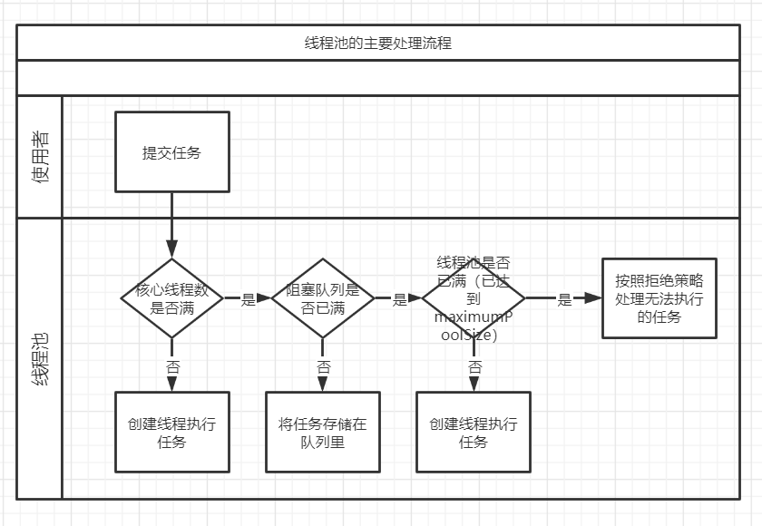

# JUC

> JUC 指的是`java.util.concurrent`包及其子包下用于并发场景的类


## 为何需要JUC

ArrayList/HashMap/HashSet 在多线程情况下可能会发生异常`java.util.ConcurrentModificationException`，即**并发修改异常**

**原因**

多线程并发争抢同一个资源，并且没有加锁

**解决办法**

> ArrayList为例

1. CopyOnWrite，写时复制容器

   ```java
   List<String> list = new CopyOnWriteArrayList<>();
   
   public class CopyOnWriteArrayList<E>
       implements List<E>, RandomAccess, Cloneable, java.io.Serializable {
       
       // 底层容器为volatile修饰的Object数组
       private transient volatile Object[] array;
   
       /**
        * Sets the array.
        */
       final void setArray(Object[] a) {
           array = a;
       }
       
       public CopyOnWriteArrayList() {
           setArray(new Object[0]);
       }
       
       /**
        * Appends the specified element to the end of this list.
        */
       public boolean add(E e) {
           final ReentrantLock lock = this.lock;
           lock.lock();
           try {
               Object[] elements = getArray();
               int len = elements.length;
               // 复制出一个新的容器newElements，并为新容器赋值
               Object[] newElements = Arrays.copyOf(elements, len + 1);
               newElements[len] = e;
               // 添加完成之后，指向新容器
               setArray(newElements);
               return true;
           } finally {
               lock.unlock();
           }
       }
   
       /**
        * Gets the array.  Non-private so as to also be accessible
        * from CopyOnWriteArraySet class.
        */
       final Object[] getArray() {
           return array;
       }
       
       private E get(Object[] a, int index) {
           return (E) a[index];
       }
       
       // 得益于写时赋值，读取的时候不需加锁
       public E get(int index) {
           return get(getArray(), index);
       }
       
   }
   ```
   
   - 底层容器为`Object[]`，向一个容器中添加元素时，不直接往当前容器添加，而是使用`Arrays.copyOf()`先对当前容器进行复制，复制出一个新的容器`Object[] newElements`，然后在新容器里添加元素，添加完元素之后，将原容器的引用指向新容器
   - 好处是可以对 CopyOnWrite 容器进行并发的读，而不需要加锁
   - 因为当前容器不会添加任何元素,所以 CopyOnWrite也是一种读写分离的思想，读（array）和写（Object[] newElements）是不同的容器
   
2. `Collections.synchronizedList`

   ```java
   List<String> concurrentList = Collections.synchronizedList(new ArrayList<>());
   ```


## 各种锁


**公平/非公平锁**

- 公平锁，公平，等待线程先来后到得到锁资源再执行

  ```java
  public ReentrantLock(boolean fair) {
          sync = fair ? new FairSync() : new NonfairSync();
  }
  ```

  

- 非公平锁，不公平，允许插队。正在等待的线程哪个抢到锁资源，就可先执行

  ```java
  // ReentrantLock默认为非公平锁
  public ReentrantLock() {
          sync = new NonfairSync();
  }
  ```

  

**可重用/入锁（递归锁）**

- 可重用锁也叫递归锁
- 所有的锁都是可重用锁

```java
/**
 * ReusableLockTest 可重用锁测试
 *
 * @author gnl
 */

public class ReusableLockTest {
    public static void main(String[] args) {
        Phone1 phone1 = new Phone1();
        Phone2 phone2 = new Phone2();

//        new Thread(() -> {
//            phone1.sms();
//        }, "A").start();
//
//        new Thread(() -> {
//            phone1.sms();
//        }, "B").start();

        new Thread(() -> {
            phone2.sms();
        },"A").start();

        new Thread(() -> {
            phone2.sms();
        },"B").start();

    }
}

class Phone1 {

    public synchronized void sms() {
        System.out.println(Thread.currentThread().getName() + "Phone1 ==> sms");
        call();
    }

    public synchronized void call() {
        System.out.println(Thread.currentThread().getName() + "Phone1 ==> call");
    }

}

class Phone2 {

    Lock lock = new ReentrantLock();

    public void sms() {

        lock.lock();
        try {
            System.out.println(Thread.currentThread().getName() + "Phone2 ==> sms");

            // call方法中也有锁，拿到了sms方法的锁的同时也拿到了call方法的锁
            call();
        } catch (Exception exception) {
            exception.printStackTrace();
        } finally {
            lock.unlock();
        }

    }

    public void call() {

        // lock和unlock必须配对出现，否则会造成死锁
        lock.lock();
        lock.lock();
        try {
            System.out.println(Thread.currentThread().getName() + "Phone2 ==> call");
        } catch (Exception e) {
            e.printStackTrace();
        } finally {
            lock.unlock();
            lock.unlock();
        }
    }

}
```


**自旋锁**

- SpinLock，会不断尝试获取锁资源，直到成功为止


**死锁**

- 所有线程都在等待锁资源


**乐观/悲观锁**

1. 乐观锁，认为什么操作都不会出问题，无论执行什么操作都不会加锁，如果因为冲突失败就重试，直到成功为止。而乐观锁用到的机制就是 CAS（Compare and Set）
2. 悲观锁，认为什么操作都会出问题，无论执行什么操作都会加锁


## ReentrantLock与Condition

> ReentrantLock，可重复，非公平的，递归锁（锁中嵌套锁），代替 synchronized（可重复，非公平的 递归锁）
>
> Condition中的方法代替 synchronized 的其他方法，如wait()，notifyAll()，notify()


### wait和notify

```java
/**
 * WaitNotifyTest 使用notify()和wait()让线程交替打印
 * @author gnl
 */

public class WaitNotifyTest {
    public static void main(String[] args) {

        MyCounter myCounter = new MyCounter();

        new Thread(() -> {
            for (int i = 0; i < 10; i++) {
                myCounter.increment();
            }
        }, "AAA").start();

        new Thread(() -> {
            for (int i = 0; i < 10; i++) {
                myCounter.decrement();
            }
        }, "BBB").start();

        new Thread(() -> {
            for (int i = 0; i < 10; i++) {
                myCounter.increment();
            }
        }, "CCC").start();

        new Thread(() -> {
            for (int i = 0; i < 10; i++) {
                myCounter.decrement();
            }
        }, "DDD").start();

    }
}

class MyCounter {

    /**
     * num从0开始，两个线程分别对num++和num--，交替打印
     */
    private int num = 0;

    public void increment() {
        synchronized (this) {
            while ( num != 0 ) {
                try {
                    wait();
                } catch (InterruptedException e) {
                    e.printStackTrace();
                }
            }
            num++;
            System.out.println(Thread.currentThread().getName() + " ==> " + num);
            notifyAll();
        }

    }

    public void decrement() {
        synchronized (this) {
            while ( num == 0 ) {
                try {
                    wait();
                } catch (InterruptedException e) {
                    e.printStackTrace();
                }
            }
            num--;
            System.out.println(Thread.currentThread().getName() + " ==> " + num);
            notifyAll();
        }
    }
}
```


### ReentrantLock和Condition

**细节**

- `lock()`和`unlock()`必须配对出现，否则会造成死锁
- Condition的方法调用必须在`lock()`和`unlock()`之间

```java
/**
 * ReentrantLockTest ReentrantLock和Condition测试
 * lock和unlock必须配对出现，否则会造成死锁
 * Condition方法的调用必须在lock和unlock之间
 *
 * @author gnl
 */
public class ReentrantLockTest {
    public static void main(String[] args) {
        MyReentrantLock myReentrantLock = new MyReentrantLock();

        new Thread(() -> {
            for (int i = 0; i < 10; i++) {
                myReentrantLock.increment();
            }
        }, "AAA").start();

        new Thread(() -> {
            for (int i = 0; i < 10; i++) {
                myReentrantLock.decrement();
            }
        }, "BBB").start();

        new Thread(() -> {
            for (int i = 0; i < 10; i++) {
                myReentrantLock.decrement();
            }
        }, "CCC").start();

        new Thread(() -> {
            for (int i = 0; i < 10; i++) {
                myReentrantLock.increment();
            }
        }, "DDD").start();
    }
}

class MyReentrantLock {

    private Lock lock = new ReentrantLock();
    private Condition condition = lock.newCondition();

    /**
     * num从0开始，多个线程分别对num++和num--，交替打印
     */
    private int num = 0;

    public void increment() {

        lock.lock();
        try {
            while ( num !=0 ) {
                condition.await();
            }
            num++;
            System.out.println(Thread.currentThread().getName() + " ==> " + num);
            condition.signalAll();
        } catch (InterruptedException e) {
            e.printStackTrace();
        } finally {
            lock.unlock();
        }
    }

    public void decrement() {

        lock.lock();
        try {

            while ( num ==0 ) {
                condition.await();
            }
            num--;
            System.out.println(Thread.currentThread().getName() + " ==> " + num);
            condition.signalAll();

        } catch (InterruptedException e) {
            e.printStackTrace();
        } finally {
            lock.unlock();
        }
    }
}
```


### synchronized与Lock

- `synchronized`是Java内置关键字，`Lock`是Java的`java.util.concurrent`包下的接口
- synchronized机制在执行完相应的同步代码以后，自动释放同步监视器。Lock需要手动释放，如果不释放就会造成死锁
- 使用Lock需要伴随`try-catch-finally`块
- synchronized是可重用的，不可中断的，非公平锁；Lock是可重用的，不可中断的（可以使用`trylock()`判断锁），非公平锁（可自己设置）
- synchronized适合锁少量的代码同步问题，Lock适合锁大量的同步代码


## Callable

> Callable为`java.util.concurrent`包下的一个接口

**实现步骤**

1. 创建子类实现Callable接口
2. 重写`call()`方法，将需要执行的操作放到`call()`方法内
3. 创建Callable实现类的实例对象，并作为参数传到`FutureTask`实例的构造函数中，创建出FutureTask实例对象
4. 将FutureTask实例对象作为Thread类构造函数的参数传入，创建Thread对象
5. 调用Thread对象的`start()`方法，执行线程
6. 利用FutureTask对象的`get()`方法获取返回值

**实现代码**

```java
/**
 * CallableTest
 * @author gnl
 */
public class CallableTest {
    public static void main(String[] args) throws ExecutionException, InterruptedException {
        MyCallable myCallable = new MyCallable();
        FutureTask<Integer> futureTask = new FutureTask<>(myCallable);
        Thread thread = new Thread(futureTask);
        thread.start();
        // 利用futureTask获取返回值
        Integer res = futureTask.get();
        System.out.println(res);
    }
}

class MyCallable implements Callable<Integer> {
    @Override
    public Integer call() throws Exception {
        int sum = 0;
        for (int i = 0; i < 100; i++) {
            // 输出偶数
            if ( (i&1) == 0) {
                System.out.println(i);
                // 计算偶数和
                sum += i;
            }
        }
        return sum;
    }
}
```

**与其他线程实现方式对比**

1. Callable接口带泛型，泛型即为`call()`方法返回值的类型
2. Callable重写的方法为`call()`，Runnable和Thread重写的方法为`run()`
3. `call()`方法有返回值
4. `call()`方法可抛出异常


## JUC辅助类


### CountDownLatch

> 线程计数减少

**方法**

- `countDown()`，调用`countDown()`方法会将计数-1，调用`countDown()`方法的线程不会阻塞。当计数器值变为0的时候，因 `await()`方法阻塞的线程会被唤醒，继续执行
- `await()`，当一个或多个线程调用`await()`，这些线程就会阻塞

```java
/**
 * CountDownLatchTest 计数减少测试
 * @author gnl
 */

public class CountDownLatchTest {
    public static void main(String[] args) throws InterruptedException {

        int threadCount = 6;
        CountDownLatch countDownLatch = new CountDownLatch(threadCount);

        for (int i = 0; i < threadCount; i++) {
            new Thread(() -> {
                System.out.println(Thread.currentThread().getName() + " 离开");

                // 每离开一个线程，计数减一
                // countDown() 方法会将计数器-1，调用 countDown 方法的线程不会阻塞
                countDownLatch.countDown();

            }, i + " ").start();
        }

        // 线程全部离开，countDownLatch倒数到0，锁门
        // 调用 await()，这些线程就会阻塞
        countDownLatch.await();
        System.out.println(Thread.currentThread().getName() + " 锁门");

    }
}
```


### CyclicBarrier

> 循环栅栏，线程计数加，效果与CountDownLatch相反

**方法**

- `await()`，线程阻塞

```java
/**
 * CyclicBarrierTest 线程计数加测试
 * @author gnl
 */

public class CyclicBarrierTest {
    public static void main(String[] args) throws BrokenBarrierException, InterruptedException {
        int count = 7;
        CyclicBarrier cyclicBarrier = new CyclicBarrier(count, () -> {
            System.out.println("=== 集齐七颗龙珠 ===");
        });
        for (int i = 0; i < count; i++) {
            new Thread(() -> {
                System.out.println(Thread.currentThread().getName() + " 收集到一颗龙珠");
                try {
                    // 收集到一颗龙珠之后，线程阻塞，接下来的事情交给其他线程来完成
                    // cyclicBarrier.await() 需要包含在try-catch块中
                    cyclicBarrier.await();
                } catch (InterruptedException e) {
                    e.printStackTrace();
                } catch (BrokenBarrierException e) {
                    e.printStackTrace();
                }
            }, i + " ").start();;
        }
    }
}
```


### Semaphore

> 信号量，用来控制同时访问特定资源的线程数量，它通过协调各个线程，以保证合理的使用公共资源。信号量主要用于两个目的，一个是用于多线程共享资源的互斥使用，另一个用于并发线程数的控制。可用来限流，某资源某时刻只能有指定量的请求可以访问

**方法**

- `acquire()`，获取信号量，当一个线程调用`acquire()`操作时，它要么成功获得信号量（将信号量设为`-1`），要么一直等待，直到有线程释放信号量或超时
- `tryAcquire()`，尝试获取资源，返回true或false
- `release()` ，释放信号量，会将信号量的值+1，然后唤醒等待的线程

```java
/**
 * SemaphoreTest 信号量测试
 * @author gnl
 */

public class SemaphoreTest {
    public static void main(String[] args) {
        // 开始有3个资源，若资源量为1，则Semaphore类似synchronized
        int resources = 3;
        // 6个线程抢占3个资源
        int count = 6;

        Semaphore semaphore = new Semaphore(resources);

        for (int i = 0; i < count; i++) {
            new Thread(() -> {
                try {
                    // 占用资源
                    semaphore.acquire();

                    System.out.println(Thread.currentThread().getName() + " 占有资源");

                    // 3s后释放资源
                    TimeUnit.SECONDS.sleep(3);

                    System.out.println(Thread.currentThread().getName() + " 释放资源");

                } catch (InterruptedException e) {
                    e.printStackTrace();
                } finally {
                    semaphore.release();
                }
            }, i + " ").start();
        }
    }
}
```


### ReadWriteLock

> 读写锁，多个线程同时读一个资源类没有问题，所以为了满足并发量，读取共享资源应该可以同时进行。但是，如果有一个线程想去写共享资源，其他线程就不可对该资源进行读或写


**读写情况**

1. 读-读，能共存
 * 读-写，不能共存
 * 写-写，不能共存


```java
/**
 * ReadWriteLockTest 读写锁测试
 * @author gnl
 */

public class ReadWriteLockTest {
    public static void main(String[] args) {
        MyCache myCache = new MyCache();

        for (int i = 0; i < 5; i++) {
            final int temp = i;
            new Thread(() -> {
                myCache.put(temp + "", temp);
            }, i + " ").start();
        }

        for (int i = 0; i < 5; i++) {
            final int temp = i;
            new Thread(() -> {
                myCache.get(temp + "");
            }, i + " ").start();
        }
    }
}

class MyCache {

    private volatile Map<String, Object> cache = new HashMap<>();
    private ReadWriteLock lock = new ReentrantReadWriteLock();

    public void put(String key, Object value) {
        // 进行写操作时，上锁
        lock.writeLock().lock();
        try {
            System.out.println(Thread.currentThread().getName() + " -- 写入数据");

            TimeUnit.MILLISECONDS.sleep(300);
            cache.put(key, value);

            System.out.println(Thread.currentThread().getName() + " -- 写入完成");
        } catch (Exception e) {
            e.printStackTrace();
        } finally {
            lock.writeLock().unlock();
        }
    }

    public Object get(String key) {
        lock.readLock().lock();
        try {
            System.out.println(Thread.currentThread().getName() + " -- 读取数据");

            TimeUnit.MILLISECONDS.sleep(300);
            Object obj = cache.get(key);

            System.out.println(Thread.currentThread().getName() + " -- 读取完成 ==> " + obj);

            return obj;
        } catch (Exception e) {
            e.printStackTrace();
        } finally {
            lock.readLock().unlock();
        }
        return null;
    }

}
```


## 阻塞队列

> `LinkedBlockingQueue`，当队列为空，从队列中获取数据的操作将会被阻塞，直到其他线程往空的队列插入新元素；当队列为满，向队列中添加数据的操作将会被阻塞，直到其它线程将队列中的数据取出。


## 线程池

> Java 中的线程池是通过`Executor`框架实现的，该框架用到了`Executor`，`Executors`，`ExecutorService`，`TheadPoolExecutor`这几个类

**线程池特点**

- 线程复用，降低资源消耗，通过复用已创建的线程降低线程创建销毁引起的消耗
- 管理线程，线程是稀缺资源，如果无限创建，不仅会消耗系统资源，还会降低系统稳定性，使用线程池可以进行统一的分配
- 提高响应速度，当任务到达时线程就可执行，减少了线程创建的时间


**线程池状态**

- **RUNNING**：运行状态，接受新任务，持续处理任务队列里的任务。
- **SHUTDOWN**：调用shutdown()方法会进入此状态，不再接受新任务，但要处理任务队列里的任务
- **STOP**：调用shutdownNow()方法，不再接受新任务，不再处理任务队列里的任务，中断正在进行中的任务
- **TIDYING**：表示线程池正在停止运作，中止所有任务，销毁所有工作线程。
- **TERMINATED**：表示线程池已停止运作，所有工作线程已被销毁，所有任务已被清空或执行完毕


**不同类型线程池**

- `newFixedThreadPool`，创建一个固定长线程池，可控制线程最大并发数，超出的线程会在队列中等待。定长线程池的大小最好根据系统资源进行设置。如`Runtime.getRuntime().availableProcessors()`

  ```java
  /**
   * 创建固定长度的线程池
   * @return void
   */
  public static void fixed() {
      ExecutorService fixedExecutorService = Executors.newFixedThreadPool(3);
      for (int i = 0; i < 10; i++) {
          final int temp = i;
          fixedExecutorService.execute(() -> {
              System.out.println(Thread.currentThread().getName() + " ==> " + temp);
              try {
                  TimeUnit.SECONDS.sleep(2);
              } catch (InterruptedException e) {
                  e.printStackTrace();
              }
          });
      }
      // 关闭线程池
      fixedExecutorService.shutdown();
  }
  ```

  

- `newCacheThreadPool`，创建一个可缓存线程池，如果线程池长度超过处理需要，可灵活回收空闲线程，若无可回收，则新建线程

  ```java
  /**
   * 创建可缓存的线程池
   * @return void
   */
  public static void cache() {
      ExecutorService cacheExecutorService = Executors.newCachedThreadPool();
      for (int i = 0; i < 10; i++) {
          final int temp = i;
          cacheExecutorService.execute(() -> {
              System.out.println(Thread.currentThread().getName() + " ==> " + temp);
              try {
                  TimeUnit.SECONDS.sleep(2);
              } catch (InterruptedException e) {
                  e.printStackTrace();
              }
          });
      }
      cacheExecutorService.shutdown();
  }
  ```

  

- `newScheduledThreadPool`，创建一个定长线程池，支持定时及周期性任务执行

  ```java
  /**
   * 创建定时线程池
   * @return void
   */
  public static void schedule() {
      ScheduledExecutorService scheduleExecutorService = Executors.newScheduledThreadPool(3);
      for (int i = 0; i < 5; i++) {
          scheduleExecutorService.schedule(() -> {
              System.out.println("delay 3 seconds");
          }, 3, TimeUnit.SECONDS);
      }
  
      for (int i = 0; i < 5; i++) {
          scheduleExecutorService.scheduleAtFixedRate(() -> {
              System.out.println("delay 1 second, execute every 3 seconds");
          }, 1 ,3, TimeUnit.SECONDS);
      }
  }
  ```

  

- `newSingleThreadPool`，创建一个单线程化的线程池，它只会用唯一的工作线程来执行任务，保证所有任务按照指定顺序（FIFO, LIFO, 优先级）执行

  ```java
  /**
   * 创建单一线程池
   * @return void
   */
  public static void single() {
      ExecutorService singleThreadExecutor = Executors.newSingleThreadExecutor();
      for (int i = 0; i < 5; i++) {
          final int temp = i;
          singleThreadExecutor.execute(() -> {
              System.out.println(Thread.currentThread().getName() + " " + temp);
              try {
                  TimeUnit.SECONDS.sleep(2);
              } catch (InterruptedException e) {
                  e.printStackTrace();
              }
          });
      }
      singleThreadExecutor.shutdown();
  }
  ```


**细节**

- 四种类型的线程池都是`ThreadPoolExecutor`的实例，只是在构造函数中传入的参数不同
- 执行任务的两种方法：
  1. `execute()`， 提交不需要返回值的任务，无法判断是否执行成功
  2. `submit()`，提交有返回值的任务，该方法返回一个future的对象，通过future对象可以判断任务是否执行成功。future的get方法会阻塞当前线程直到任务完成。submit内部使用RunnableFuture对任务进行封装


**参数解析**

```java

/**
 * Creates a new {@code ThreadPoolExecutor} with the given initial
 * parameters.
 *
 * @param corePoolSize 线程池中的常驻核心线程数 the number of threads to keep in the pool, even if they are idle（空闲）, unless {@code allowCoreThreadTimeOut} is set
 * @param maximumPoolSize 线程池中能够容纳同时执行的最大线程数，此值必须大于等于1，一般设置为：cpu核数+1 the maximum number of threads to allow in the pool
 * @param keepAliveTime 多余的空闲线程的存活时间，当前线程池中数量超过corePoolSize时，当空闲时间达到keepAliveTime时，多余线程就会被销毁，直到只剩下corePoolSize个线程为止 when the number of threads is greater than the core, this is the maximum time that excess（超过） idle threads
 * will wait for new tasks before terminating.
 * @param unit keepAliveTime的单位 the time unit for the {@code keepAliveTime} argument
 * @param workQueue 任务队列，被提交但尚未被执行的任务 the queue to use for holding tasks before they are executed.  This queue will hold only the {@code Runnable} tasks submitted by the {@code execute} method.
 * @param threadFactory 表示生成线程池中工作线程的线程工厂，用于创建线程，一般使用默认的即可 the factory to use when the executor creates a new thread
 * @param handler 拒绝策略，表示当队列满了，并且工作线程大于等于线程池的最大线程数maximumPoolSize时如何来拒绝请求执行的runnable的策略。等待队列已经满了，无法继续添加新任务了，同时线程池中的线程已达到maximumPoolSize值，无法继续为新任务服务，这个时候我们就需要拒绝策略机制合理的处理这个新任务 the handler to use when execution is blocked because the thread bounds and queue capacities are reached
 * @throws IllegalArgumentException if one of the following holds:<br>
 *         {@code corePoolSize < 0}<br>
 *         {@code keepAliveTime < 0}<br>
 *         {@code maximumPoolSize <= 0}<br>
 *         {@code maximumPoolSize < corePoolSize}
 * @throws NullPointerException if {@code workQueue}
 *         or {@code threadFactory} or {@code handler} is null
 */
public ThreadPoolExecutor(int corePoolSize,
						  int maximumPoolSize,
						  long keepAliveTime,
						  TimeUnit unit,
						  BlockingQueue<Runnable> workQueue,
						  ThreadFactory threadFactory,
						  RejectedExecutionHandler handler) {
	if (corePoolSize < 0 ||
		maximumPoolSize <= 0 ||
		maximumPoolSize < corePoolSize ||
		keepAliveTime < 0)
		throw new IllegalArgumentException();
	if (workQueue == null || threadFactory == null || handler == null)
		throw new NullPointerException();
	this.acc = System.getSecurityManager() == null ?
			null :
			AccessController.getContext();
	this.corePoolSize = corePoolSize;
	this.maximumPoolSize = maximumPoolSize;
	this.workQueue = workQueue;
	this.keepAliveTime = unit.toNanos(keepAliveTime);
	this.threadFactory = threadFactory;
	this.handler = handler;
}
```


**核心线程**

实际上内部在创建线程时，并没有给线程做标记，因此无法区分核心线程与非核心线程。

其内部主要根据当前线程的数量来处理。也可以理解为，只要当前的worker线程数小于配置的corePoolSize，那么这些线程都是核心线程。线程池根据当前线程池的数量来判断要不要退出线程，而不是根据是否核心线程


**拒绝策略**

- AbortPolicy，默认策略，直接抛出`RejectedExecutionException`异常，组织系统正常运行。
- CallerRunsPolicy，调用者运行策略，一种调节机制，该策略不会抛弃任务，也不会抛出异常，而是将某些任务回退到调用者，从而降低新任务流量
- DiscardOldestPolicy，抛弃队列中等待最久的任务，然后把当前任务加入队列中尝试再次提交当前任务
- DiscardPolicy，丢弃无法处理的任务，不予处理任何处理也不抛异常，如果允许任务丢失，这是最好的一种策略


**线程池容纳的最大任务数**

- 最大任务数 = `maximumPoolSize + workQueue.size()`，超过能容纳的最大任务树就会触发拒绝策略，报异常 `java.util.concurrent.RejectedExecutionException`


**线程池工作原理**

1. 线程池被创建之后，开始等待任务请求
2. 当调用`execute()`方法添加请求时，线程池做出判断，`submit()`方法，可以提供`Future <T>` 类型的返回值

   a. 正在运行的线程数量小于`corePoolSize`，马上创建线程运行这个任务

   b. 正在运行的线程数量大于等于`corePoolSize`，将这个任务放入队列等待

   c. 队列已满，且正在运行的线程数量小于`maximumPoolSize`，创建非核心线程立刻执行队列中的任务
3. 当一个线程完成任务时，它就会从队列中取出下一个任务执行
4. 当一个线程没有任务执行超过`keepAliveTime`时，线程就会判断

   当前运行的线程数大于`corePoolSize`，这个线程就会被停掉
5. 线程池的所有任务完成后，它最终会收缩到`corePoolSize`的大小

**总结**

当核心线程和阻塞队列都满了，就会扩大线程数。当线程数扩大到`maximumPoolSize`且阻塞队列也满了，就会触发拒绝策略


**执行流程**




### 线程池正确创建方法


**注意**

线程池不允许使用`Executors`来创建，而是要通过`ThreadPoolExecutor`来创建，构造函数的参数自定义

**说明**

使用`Executors`创建线程的缺点如下

1. `FixedThreadPool`和`SingleThreadPool`==允许的请求队列==长度为Integer.MAX_VALUE，可能会堆积大量的请求，从而导致OOM
2. `CacheThreadPool`和`ScheduleThreadPool`==允许的创建线程数量==为Integer.MAX_VALUE，可能会创建大量的线程，从而导致OOM


**正确创建方式**

```java
/**
 * 创建线程池的正确方式
 */
public static void theRightWayToBuildAThreadPool() {
	ThreadPoolExecutor threadPoolExecutor = new ThreadPoolExecutor(
			2,
			5,
			2L,
			TimeUnit.SECONDS,
			new LinkedBlockingQueue<>(3),
			Executors.defaultThreadFactory(),
			new ThreadPoolExecutor.AbortPolicy());
}
```


**停止线程池的方法**

1. shutdown，关闭资源后停止
2. shutdownnow，立即停止


### ForkJoinTask 分支合并

> `ForkJoinTask`，将一个大任务，进行拆分（Fork） 成若干个子任务（拆到不能再拆，这里就是指我们制定的拆分的临界值），再将一个个小任务的结果进行join汇总


**细节**

1. `ForkJoinTask`需要通过`ForkJoinPool`来执行
2. `ForkJoinTask`可以理解为线程但比线程轻量的实体, 在`ForkJoinPool`中运行的少量`ForkJoinWorkerThread`可以持有大量的`ForkJoinTask`和它的子任务
3. `ForkJoinTask`同时也是一个轻量的`Future`，使用时应避免较长阻塞和IO
4. `ForkJoinPool`由`ForkJoinTask`数组和`ForkJoinWorkerThread`数组组成，`ForkJoinTask`数组负责将存放程序提交给`ForkJoinPool`，而`ForkJoinWorkerThread`负责执行这些任务
5. 任务分割出的子任务会添加到当前工作线程所维护的**双端队列**中，进入队列的头部
6. 当一个工作线程的队列里暂时没有任务时，它会随机从其他工作线程的队列的尾部获取一个任务（工作窃取算法）来执行


**使用**

1. 创建`RecursiveTask<T>`或者`RecursiveAction`的实现类，前者为有返回值递归，后者无返回值
2. 重写`compute()`方法，将要执行的代码写在`compute()`中
3. 创建`ForkJoinPool`实例对象，调用`ForkJoinPool`的`submit()`方法，执行自定义的`ForkJoinTask`
4. 最后可利用`ForkJoinTask`的`get()`方法获取返回值


```java
/**
 * ForkJoinTaskTest 分支合并框架测试
 * @author gnl
 */

public class ForkJoinTaskTest {
    public static void main(String[] args) throws ExecutionException, InterruptedException {
        // 计算从0加到100
        MyTask myTask = new MyTask(0, 100);

        // ForkJoinTask需要通过ForkJoinPool来执行
        ForkJoinPool forkJoinPool = new ForkJoinPool();

        ForkJoinTask<Integer> forkJoinTask = forkJoinPool.submit(myTask);

        System.out.println(forkJoinTask.get());
		
        // 使用完关闭线程
        forkJoinPool.shutdown();

    }
}

/**
 * RecursiveTask<T> 有返回值的递归，返回值类型为T
 * RecursiveAction 无返回的递归
 * @author gnl
 */
class MyTask extends RecursiveTask<Integer> {

    /**
     * 拆分的界限
     */
    private static final int ADJUST_VALUE = 10;

    private int begin;
    private int end;
    private int res;

    public MyTask(int begin, int end) {
        this.begin = begin;
        this.end = end;
    }

    @Override
    protected Integer compute() {

        if ((end - begin) <= ADJUST_VALUE) {
            for (int i = begin; i < end; i++) {
                res += i;
            }
        } else {
            int mid = (begin + end) / 2;
            // 使用二分法拆分任务
            MyTask myTask1 = new MyTask(begin, mid);
            MyTask myTask2 = new MyTask(mid, end);

            // fork方法用于将新创建的子任务放入当前线程的work queue队列中
            myTask1.fork();
            myTask2.fork();
            
            // join方法用于让当前线程阻塞，直到对应的子任务完成运行并返回执行结果
            res = myTask1.join() + myTask2.join();
        }
        return res;
    }
}

```


### CompletableFuture 异步回调

> `CompletableFuture`


```java
/**
 * CompletableFutureTest 异步回调测试
 *
 * @author gnl
 */

public class CompletableFutureTest {
    public static void main(String[] args) throws ExecutionException, InterruptedException {
        CompletableFuture.runAsync(() -> {
            System.out.println(Thread.currentThread().getName() + "\t没有返回值的异步回调");
        }).get();

        CompletableFuture<Integer> supplyAsync = CompletableFuture.supplyAsync(() -> {
            System.out.println(Thread.currentThread().getName() + "\t有返回值的异步回调");
            // 报错，不再执行后续操作
            // int i = 10/0;
            return 100;
        });
        supplyAsync.get();

        CompletableFuture<Integer> integerCompletableFuture = supplyAsync.whenComplete((res, err) -> {
            // 正常返回100
            System.out.println("正常返回res: " + res);
            // 异常返回404
            System.out.println("异常返回err: " + err);
			
            // 手动出错，会得到返回值404
            int i = 10/0;

        }).exceptionally(e -> {
            System.out.println("出错啦: " + e.getMessage());
            return 404;
        });

        System.out.println("获取到返回值: " + integerCompletableFuture.get());
    }
}
```


# JMM


## 什么是JMM

> Java内存模型（Java Memory Model），实际上不存在，是理论性的概念或约定。定义了程序中各个变量（包括实例字段，静态字段和构成数组对象的元素）的访问方式


## 线程的工作

> 线程获开始工作前会把主存中的共享变量在自己的工作内存中复制一份，对自己工作内存中的变量进行操作，操作完成之后会立刻把共享变量立刻刷新回主存，让主存中的变量与自己操作之后的变量保持一致


**细节**

1. 线程操作的内存分为**工作内存**和**主内存**
2. 由于JVM运行程序的实体是线程，而**每个线程创建时JVM都会为其创建一个工作内存（栈空间）**，工作内存是每个**线程私有**的数据区域。而Java内存模型中规定**所有变量都存储在主内存**，**主内存是共享内存区域**，所有的线程都可以访问，但**线程对变量的操作（读写）**必须在工作内存中进行。先要将变量从主内存拷贝到线程自己的工作内存空间，然后对变量进行操作，操作完成后再将变量写回主内存，不能直接操作主内存中的变量，**各个线程中的工作内存中存储着主内存中的变量副本拷贝**，线程间的通信（传值）必须通过主内存来完成。


**JMM线程同步约定**

1. 线程解锁前，必须把共享变量**立刻**刷新回主存
2. 线程加锁前，必须读取主存中的最新值到工作内存中
3. 加锁和解锁用的是同一把锁


## volatile

> volatile是JVM提供的轻量级同步机制


**特点**

1. ==保证可见性==，一个线程对某个数据的修改对于其他线程是可见的，此时其他线程就会停止对该数据的操作
2. ==不保证原子性==，原子性，是指一个操作是不可中断的，即使是在多个线程一起执行的时候，一个操作一旦开始，就不会被其它线程干扰。不保证原子性，即对数据操作的结果不一定是预期结果。相对的，`synchronized`保证原子性
3. ==禁止指令重排==，指令重排是指在程序执行过程中, 为了性能考虑, 编译器和CPU可能会对指令重新排序。在某些情况下，这种重排优化会带来一些执行的逻辑问题，主要的原因是代码逻辑之间是存在一定的先后顺序，在并发执行情况下，会发生二义性，即按照不同的执行逻辑，会得到不同的结果信息。==禁止指令重排，保证指令到来的先后顺序执行，可保证结果的准确性==
   1. CPU指令重排
   2. 编译器优化重排


**代码测试**

```java
/**
 * VolatileTest volatile 关键字测试
 * @author gnl
 */

public class VolatileTest {

    public static volatile int num = 0;

    public static void main(String[] args) {
        // visibilityTest();
        atomicityTest();
    }

    /**
     * visibilityTest volatile 保证可见性
     * @return void
     * @author gnl
     */
    public static void visibilityTest() {
        new Thread(() -> {
            while (0 == num) {
                System.out.println("do something...");
            }

        }, "A").start();

        try {
            TimeUnit.SECONDS.sleep(2);
        } catch (InterruptedException e) {
            e.printStackTrace();
        }

        // 使用main线程修改num的值，因使用volatile修饰，主线程将num值改为1这一操作能被线程A可见，线程A就会停止
        num = 1;
        System.out.println(num);
    }

    /**
     * atomicityTest volatile不保证原子性
     * @return void
     */
    public static void atomicityTest() {

        /**
         * 20个线程，每个线程执行1000次add方法，正确的执行结果20*1000
         */
        for (int i = 0; i < 20; i++) {
            new Thread(() -> {
                for (int j = 0; j < 1000; j++) {
                    synchronizedAdd();
                }
            }).start();
        }

        // 当前线程执行完毕后，获取当前处于活跃状态的线程数，释放当前CPU的执行权，确保所有的线程都执行过一遍
        while (Thread.activeCount() > 2) {
            Thread.yield();
        }
        System.out.println(Thread.currentThread().getName() + "\t" + num);
    }

    public static void add() {
        num++;
    }

    /**
     * synchronized保证原子性
     * @author gnl
     */
    public synchronized static void synchronizedAdd() {
        num++;
    }

}
```


**使volatile保持原子性**

- 使用JUC包下的原子类

  原子类的方法大多使用到`unsafe`类中的方法，`unsafe`类中的方法大多是`native`修饰的方法（native方法底层由C/C++实现），在内存中修改值。**原子类比锁高效**。

  ```java
  // 使用原子类
  public static volatile AtomicInteger num = new AtomicInteger();
  
  public static void add(){
      // 调用原子类自身的自加1方法
      num.getAndIncrement();
  }
  ```


**`volatile`和`synchronized`区别**

1. `volatile`仅能修饰变量；`synchronized`则可以修饰变量、方法、代码块和类
2. `volatile`仅能实现变量z的修改可见性，不能保证原子性；而`synchronized`则可以保证变量的修改可见性和原子性
3. `volatile`不会造成线程的阻塞；,`synchronized`可能会造成线程的阻塞
4. `volatile`本质是在告诉JVM当前变量在寄存器（工作内存）中的值是不确定的，需要从主存中读取；`synchronized`则是锁定当前变量，只有当前线程可以访问该变量，其他线程被阻塞住


## 原子引用

> 原子引用（AtomicReference），底层使用的CAS（Compare And Swap）实现。CAS即比较当前工作内存中的值和主存中的值，如果是期望值，就执行操作，如果不是，就一直循环


**代码测试**

```java
/**
 * AtomicReferenceTest
 * @author gnl
 */

public class AtomicReferenceTest {
    public static void main(String[] args) {
        AtomicInteger integer = new AtomicInteger(2021);

        /**
         * compareAndSet(期望值, 更新值)
         * 如果满足期望值，就将其更新为指定的更新值
         */
        System.out.println(integer.compareAndSet(2021, 2020));
        System.out.println(integer.get());

        // 不满足期望值，不会更新
        System.out.println(integer.compareAndSet(2021, 2022));
        System.out.println(integer.get());
    }
}
```


**CAS缺点**

1. 循环会耗时

2. 一次操作只能保证一个共享变量的原子性

3. 会出现`ABA`问题，如将A值改成了B，再将B改回A，虽然期望值一样是A，但是已经是被修改过了的。可以使用乐观锁来解决`ABA`问题

   ```java
   /**
    * CASTest
    * @author gnl
    */
   
   public class CASTest {
       public static void main(String[] args) {
           /**
            * AtomicStampedReference 带时间戳的原子引用
            * @param initialRef 初始引用值
            * @param initialStamp 初始版本
            */
           AtomicStampedReference<Integer> integerRef = new AtomicStampedReference<>(1, 1);
   
           System.out.println("ref: " + integerRef.getReference());
           System.out.println("stamp: " + integerRef.getStamp());
   
           new Thread(() -> {
   
               System.out.println(Thread.currentThread().getName() + "\tupdate now");
               /**
                * compareAndSet(期望值, 新值, 期望版本, 新版本)
                */
               System.out.println(integerRef.compareAndSet(1, 2, integerRef.getStamp(), integerRef.getStamp() + 1));
   
               System.out.println("ref: " + integerRef.getReference());
               System.out.println("stamp: " + integerRef.getStamp());
   
           }, "A").start();
   
           new Thread(() -> {
   
               System.out.println(Thread.currentThread().getName() + "\tupdate now");
   
               System.out.println(integerRef.compareAndSet(1, 2, integerRef.getStamp(), integerRef.getStamp() + 1));
               System.out.println("ref: " + integerRef.getReference());
               System.out.println("stamp: " + integerRef.getStamp());
   
           }, "B").start();
       }
   }
   ```

   

