# JVM


<br>

## 前言

> **JDK/JRE/JVM**
>
> * JDK（Java Development Kit），Java 程序开发工具，是整个 Java 的核心。包含 JRE 和各种 Java 工具（javac/java/jdb 等）和 Java 基础类库（`rt.jar`）；
>
> - JRE（Java Runtime Environment），Java 运行时环境，包含 JVM 标准实现以及 Java 核心类库。JRE 是一个运行环境；
> - JVM（Java Virtual Machine），一个虚拟出来的计算机，通过在实际计算机上模拟各种计算机功能来实现

<br>

> **联系**
>
> - JVM 不能单独完成 `.class` 的运行。解析 `.class` 文件时 JVM 需要调用所需要的类库和工具进行解析。类库文件和工具在 JDK 目录下的 jre 目录里，在文件夹 bin 和 lib中。
>
>   可以认为 bin 里就是 JVM，lib 则是 JVM 工作时所需要的类库，JVM 和 lib 合起来就成为 JRE，即 `JRE = JVM + lib`；
>
> - 开发者利用 JDK 调用 Java API 开发 Java 程序，通过 `javac` 将 Java 文件编译成 `.class` 类型的字节码。然后在 JRE 上运行，JVM 负责解析这些字节码，并映射到 CPU 指令集或 OS，进行系统调用。

<br>

> **区别**
>
> - 在 JDK 的 bin 目录下有 `javac` 等工具，而 JRE 的 bin 目录里没有。`javac` 指令是将 Java 文件编译成 Java 字节码文件的工具，运行环境 JRE 是不需要的。
>
>   JDK 的 bin 目录下还有 `jar/javadoc ` 等开发工具，这也说明 JDK 是开发环境，JRE 是运行时环境。
>
> - 仅 JVM 自身还不能执行 `.class` 文件，还需要 JRE 目录下 lib 类库的支持，尤其是 `rt.jar`。

<br>

## JVM 结构

> JVM 内存结构和内存模型（JMM）是两个不同的概念

<br>

**JVM 内存结构体系**

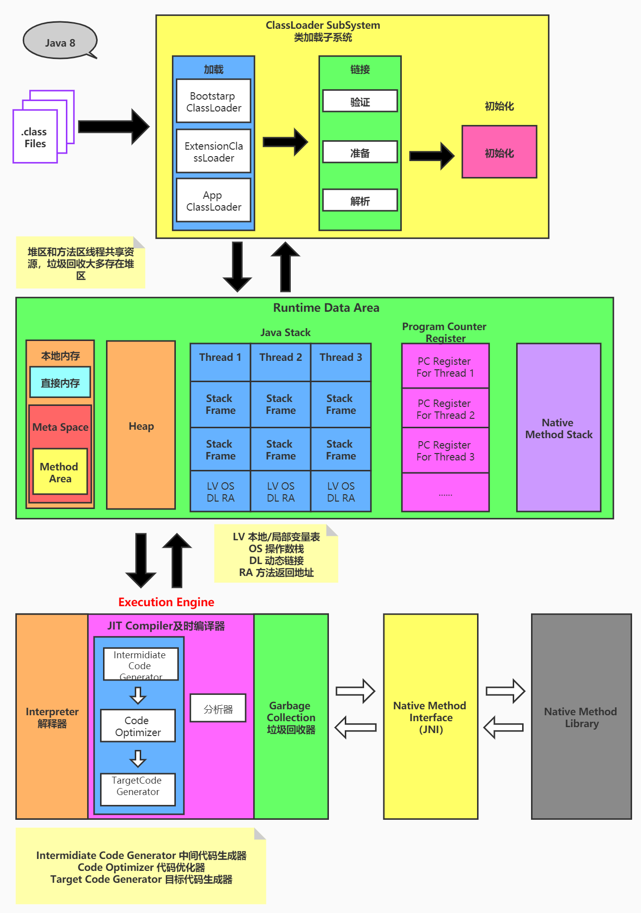

<br>

### 类加载子系统

<br>

#### 类加载过程

**加载**

从 `.class` 到 `Class`

a. 通过类的*全限定类名*获取定义此类的二进制字节流

b. 将这个字节流所代表的*静态存储结构*转化为方法区的*运行时数据结构*

c. 在内存中生成一个代表此类的 `java.lang.Class` 对象，并将其引用存放在方法区，作为此类数据的访问入口

<br>

**连接**

a. 验证（Verify）
- 目的在于确保字节码文件中包含的信息符合要求并且是安全的。*保证被加载类的正确性*
- 主要包括四种验证：文件格式验证，元数据验证，字节码验证，符号引用验证

b. 准备（Prepare）
- 为类静态变量分配内存，并初始化为默认值

- 在类加载子系统的链接准备阶段，`final static` 修饰的变量会被初始化为定义时的值，并分配到类的静态存储区域中。

  > 这时候并没有进行赋值操作，而是直接把编译时确定的常量值存储在变量对应的常量池中。在后续的类加载子系统的初始化阶段，静态变量才会被赋值为定义时的值，包括通过静态代码块赋值和通过静态方法赋值的情况。这也是为什么 `final static` 修饰的变量必须要在定义时初始化，并且只能被赋值一次，因为它们在类加载过程中就已经被确定了其值，而无法在后续改变。

c. 解析（Resolve）
- 将常量池中的*符号引用*转换为*直接引用*。符号引用就是用一组符号来描述所引用的目标，直接引用就是直接指向目标地址的指针、相对偏移量或一个间接定位到目标的语句

  > 解析动作主要针对类或接口、字段、类方法、接口方法、方法类型等。对应常量池中的 `CONSTANT_Class_info`、`CONSTANT_Fieldref_info`、`CONSTANT_Methodref_info` 等

<br>

**初始化**

> 初始化阶段就是执行类构造方法 `<clint>()` 的过程，此方法不需要定义，是 `javac` 编译器自动收集类中所有类变量的复制动作和静态代码块中的语句合并而来。如果类中没有定义静态变量或静态代码块，不会有此方法。
>
> `<clint>()` 不同于构造方法，构造方法是字节码文件中的 `<lint>()`。JVM 必须保证一个类的 `<clint>()` 在多线程下被同步加锁。

- 为类的静态变量赋予正确的初始值，并执行静态代码块。
- 如果该类具有超类，则初始化其超类。JVM 保证子类 `<clint>()` 执行之前，父类的 `<clint>()` 已经执行完毕
- 如果该类实现了任何接口，则按顺序初始化这些接口。

<br>

#### 类加载器

> 类加载器，负责加载字节码文件，字节码文件在文件开头有特定的文件标识（CAFE BABE）。类加载器将字节码文件的内容加载到内存中，并将加载的类信息放到方法区中。类加载器只负责字节码文件的加载，至于它是否可以运行则由执行引擎决定

<br>

**启动类加载器（Bootstrap ClassLoader）**

- 由 C/C++ 实现
- 用来加载 Java 核心类库（`rt.jar/resource.jar` 等），用于加载 JVM 自身需要的类
- 启动类加载器<mark>没有父加载器</mark>
- 作为扩展类和系统类加载器的父类加载器，<mark>负责加载扩展类和系统类加载器</mark>
- 出于安全考虑，只加载包名为 `java/javax/sun` 等开头的类

<br>

**扩展类加载器（Extension ClassLoader）**

- 父类加载器为启动类加载器
- 由 Java 实现，实现类为 `sun.misc.Launcher$ExtClassLoader`，是 `sun.misc.Launcher` 的匿名内部类
- 继承 `java.lang.ClassLoader`（除了启动类加载器之外所有的类加载器都继承自 `ClassLoader` 类）
- 从 `java.ext.dirs` 所指定的目录加载类库，或从 JDK 安装目录的 `jre.lib.ext` 子目录下加载类库。创建自定义的 `jar` 包放在此目录下，也会由扩展类加载器加载

<br>

**系统类/应用程序类加载器（System/App ClassLoader）**

- 父类加载器为扩展类加载器
- 由 Java 实现，实现类为 `sun.misc.Launcher$AppClassLoader` ，是 `sun.misc.Launcher` 的匿名内部类
- 继承自 `java.lang.ClassLoader`
- 负责加载环境变量 `classpath` 下或者系统属性 `java.class.path` 指定路径下的库
- 是程序中默认的类加载器，一般来说 Java 应用的类都是由它来完成加载
- 可以通过 `ClassLoader.getSystemClassLoader()` 获取

<br>

**自定义类加载器（User-Defined ClassLoader）**

- `java.lang.ClassLoader` 的子类，用户可以定制类的加载方式，如果不是很复杂的实现类加载器，可以直接继承自 `java.net.URLClassLoader`
- 需要自定义类加载器的原因

  a. 隔离加载类

  b. 修改类的加载方式

  c. 扩展加载源

  d. 防止源码泄露

<br>

**类加载器继承关系**

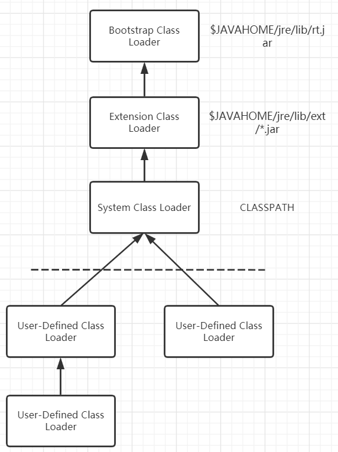


<br>

#### 双亲委派机制

JVM 对 `.class` 文件采用的是<mark>按需加载</mark>的方式，当需要使用到该类时才将其字节码文件加载到内存中，生成 Class 对象。

而在加载某个类的字节码文件时，Java 虚拟机采用的是双亲委派机制，即把请求层层交给上级处理，上级无法处理时，子类加载器才会尝试去加载，它是以一种<mark>任务委派模式</mark>


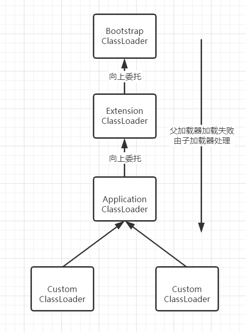

<br>

**原理**

1. 类加载器收到了类加载的请求，它不会自己先去加载，而是把这个请求向上委托给父类加载器进行加载
2. 如果父类加载器还存在父类，则进一步向上委托，最终达到最顶层的启动类加载器
3. 如果父类加载器能完成请求的类的加载任务，则由父类加载器进行加载，加载成功之后返回；若是父类加载器无法完成此加载任务（在它的加载路径下没有找到请求加载的 `.class` 文件），子类加载器才会尝试加载

<br>

**优点**

- 采用双亲委派机制的好处是，比如加载位于 `rt.jar` 包中的 `java.lang.Object` 类时，不管是请求哪个类加载器，都会层层向上委托到启动类加载器，使用启动类加载器进行加载。这样就保证使用不同的类加载器最终得到的都是同一个 Class 实例化出来的 `Object` 对象，<mark>避免类的重复加载</mark>
- <mark>防止子类加载器加载已经存在的核心类</mark>，防止 Java 源代码被污染，对 JVM 造成破坏
- 双亲委派机制<mark>保证 JVM 沙箱安全</mark>

<br>

#### 沙箱安全机制

自定义一个名为 String 类，定义并执行 `main` 方法，在 JVM 加载自定义的 String 类时会率先使用启动类加载器进行加载，而启动类加载器在加载过程中会先加载 JDK 自带的 String 类（`rt.jar` 包中的 `java.lang.String.class`）

运行自定义的 String 类时会报错 `在类 java.lang.String 中找不到 main 方法`，原因是启动类加载器加载的是 `java.lang.String` 类而不是自定义的 String 类

这样可以保证对 Java 核心代码的保护，防止恶意代码污染 Java 源代码，这就是<mark>沙箱安全机制</mark>

```java
package java.lang;

/**
 * 自定义 java.lang.String
 * @author gnl
 */

public class String {
    public static void main(String[] args) {
        /**
         * 报错
         * 错误: 在类 java.lang.String 中找不到 main 方法, 请将 main 方法定义为:
         *    public static void main(String[] args)
         */
        System.out.println("this is my java.lang.String");
    }
}
```

<br>

**类加载细节**

1、JVM 中判断两个 Class 对象是否为同一个类的条件：

1）类的<mark>全限定类名必须一致，包括包名</mark>

2）加载<mark>类的 ClassLoader 必须相同</mark>

换言之，在 JVM 中即使两个 Class 对象来自同一个 `.class` 文件，被同一个虚拟机加载，若是 ClassLoader 对象不同，这两个对象就不相等

<br>

2、JVM 必须知道一个类是由启动类还是用户自定义类加载器加载

如果一个类是由用户自定义类加载器加载，那么 JVM 就会将这个类加载器的一个引用作为类信息的一部分保存到方法区中。当解析一个类到另一个类的引用时，JVM 需要保证者两个类的类加载器是相同的

<br>

3、类的<mark>主动使用</mark>与<mark>被动使用</mark>

1）主动使用：

* 创建类实例

* 访问某个类/接口的静态变量，或是对某个类的静态变量赋值

* 调用类的静态方法

* 反射，如`Class.forName()`

* 初始化一个类的子类

* Java 虚拟机启动时被标明为启动类的类

* Java 7 开始提供的动态语言支持


2）被动使用：除了主动使用外的其他 Java 类的使用都可以看作是类的被动使用

<br>

### 程序计数器

-  程序计数器属于<mark>线程私有内存</mark>
- <mark>本质是一个指针</mark>，占用一块非常小的空间
-  它可以看作是<mark>当前线程所执行的字节码的行号指示器</mark>，字节码解释器通过改变计数器的值来选取下一条需要执行的指令的字节码
- 分支、循环、跳转、异常处理、线程恢复等功能都依赖程序计数器来完成
- 不会发生内存溢出（OOM）错误
- 如果执行的是一个 `native` 方法，则程序计数器为空

<br>

### 方法区

- 属于<mark>**线程共享**的内存区域</mark>

- 用于存储 JVM 加载的每个类的结构信息、运行时常量信息、静态变量、字符串字面量、数字常量、方法数据、构造函数、普通方法的字节码内容和即时编译器编译后的代码等数据

- 虽然 JVM 规范将方法区描述为堆的一个逻辑部分，但它还有一个别名叫<mark>非堆（Non-Heap）</mark>，目的就是要和堆分开

- <mark>方法区由 HotSpot 独有</mark>，J9 和 JRocket 没有。对于 HotSpot 虚拟机，可以将方法区理解为一个接口，永久带和元空间都是它的实现。

- <mark>方法区也存在垃圾回收</mark>，但是很少，垃圾回收大多发生在堆内存。方法区中的垃圾回收存在一下情况：
  1. 常量池中的一些常量和符号引用若是没有被引用，则会被清理
  2. 无用的类，所有实例被回收的类、ClassLoader 被回收的类、实例对象没有被引用的类

<br>

**方法区中的常量池**

1、类文件中常量池（The Constant Pool）

字节码文件，该文件记录当前这个类的所有相关信息，其中之一就是常量池。常量池存放编译器生成的各种字面量（Literal）和符号引用（Symbolic References）

**字面量**：

1）文本字符串；

2）八种基本类型的值；

3）被声明为 `final` 的常量等;

**符号引用**：

1）类和接口的全限定名（Fully Qualified Name）

2）字段的名称和描述符（Descriptor）

3）方法的名称和描述符

<br>

2、运行时常量池（The Run-Time Constant Pool）

运行时常量池是在类加载过程中，将 `.class` 文件中的常量池信息加载到内存中，并在 JVM 运行时使用的一个存储常量的表。在加载类的过程中，类的常量池会被完全加载到内存中，并在内存中动态地生成一个运行时常量池。运行时常量池中存储了一些字面量和符号引用，用于支持类文件中的各种指令。

> **运行时常量池的位置**
>
> 1）JDK 1.6 及之前版本，它位于**方法区的永久代中**；
>
> 2）JDK 1.7 逐步开始抛弃方法区，将**字符串常量池移至堆区**。这里 JDK 文档并没有说运行时常量池是否也跟着移到堆区，也就是说**运行时常量依然在方法区**，永久代仍存在于 JDK 1.7 中
>
> 3）JDK 1.8，JVM 移除了永久区，取而代之的是元空间（Metaspace），也就是将本地内存用来存储（容量取决于是 32 位或是 64 位操作系统的可用虚拟内存大小）。**字符串常量池还在堆**，运行时常量池还在方法区，只不过**方法区的实现从永久代变成了元空间。**

<br>

3、字符串常量池

1）字符串常量池，为了避免多次创建字符串对象，将字符串在 JVM 中开辟一块空间，储存**不重复**的字符串。

2）在直接使用双引号声明字符串的时候，会先去常量池找有没有相同的字符串，如果有则将常量池的引用返回给变量。如果没有，会在字符串常量池中创建一个对象，然后返回这个对象的引用。

3）使用 `new` 关键字创建，比如 `String a = new String("hello");` 这里可能创建两个对象。一个是用双引号括起来的 `hello` 字符串，另一个是 `new` 关键字在堆中创建的新对象。最终返回的是 `new` 创建的对象的地址。

<br>

> 在 JDK 1.7 之前，字符串常量池被放在**方法区** 中，此时实现是永久代（可以认为方法区是一个接口/规范，永久代和元空间都是它的实现）。因为永久代使用的是 JVM 的直接内存，空间有限，在大量使用字符串的场景下会导致 OOM 错误。
>
> JDK 1.7 及以后，**字符常量池移至了堆区**，字符串的创建也在堆区。为了节省开支 `intern` 不再是把该字符串直接加入字符常量池，而是将其地址引用放到字符常量池。
>
> 到了 JDK 1.8，JVM 使用元空间（MetaSpace）作为方法区的实现，来代替永久代。并将元空间从 JVM 内转移到本地内存上（容量取决于是 32 位或是 64 位操作系统的可用虚拟内存大小）。JDK 1.8 的字符串常量池还是放在在堆区，运行时常量池在方法区。

<br>

### 本地方法栈

- 属于<mark>线程私有的内存区域</mark>
- 本地方法栈与 Java 栈的作用类似，区别是执行 Java 方法使用的是 Java 栈，而执行 `native` 方法时使用的是本地方法栈

<br>

### Java 栈

- 属于<mark>线程私有的内存区域</mark>
- 栈主管 Java 程序的运行。<mark>线程创建时创建</mark>，生命周期与线程相同，线程结束意味着栈内存释放。
- <mark>栈不存在垃圾回收的问题，线程结束即释放内存</mark>
- Java 8 中基本类型的变量、对象的引用变量和实例方法都是在函数的栈内存中分配的
- 每个方法被执行时，都会创建一个<mark>栈帧</mark>，将栈帧压入栈中，当<mark>方法正常返回或是抛出未捕获的异常</mark>时，栈帧随之出栈


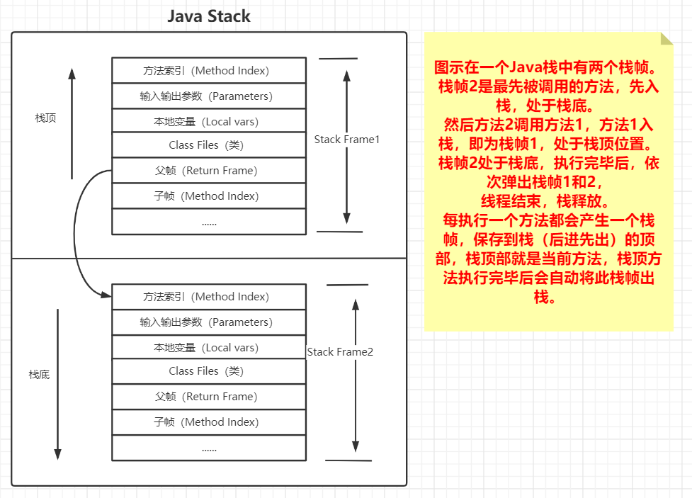

<br>

**栈中的内容**

- 栈帧用于<mark>存储局部变量表、操作数栈、动态链接、方法相关信息和方法返回值等信息</mark>。每个方法从调用直到执行完毕的过程，就对应着一个栈帧在虚拟机中入栈到出栈的过程。栈的大小和具体的 JVM 实现相关，通常在 256k~756k 之间，约等于 1MB 左右


- 栈中的数据都是以栈帧的格式存在，栈帧是一个内存区块，是一个数据集，是一个有关方法和运行期数据的数据集

- 栈帧实际上就是一个个不同的 Java 方法
- 栈帧中主要保存 3 类数据
  1. 本地变量（Local Variables），输入参数和输出参数以及方法内的变量
  2. 栈操作（Operand Stack），记录出栈入栈的操作
  3. 栈帧数据（Frame Data），包括类文件、方法等

<br>

### 堆

**堆的细节**

1、属于<mark>**线程共享**的内存区域</mark>

2、<mark>在 JVM 启动时创建</mark>，一个 JVM 实例只存在一个堆内存（堆内存的大小可调节），此内存区域的唯一目的就是存放对象实例，<mark>几乎所有</mark>的对象实例都在堆中分配内存

3、类加载器读取了类文件后，将类信息、方法、常量和变量放到堆内存中，保存所有引用类型的信息，以方便执行器执行

4、根据对象生命周期的不同，JVM 会把对象进行分代管理，由垃圾回收器进行分代垃圾回收

5、当堆中没有可用空间时，会抛出 OOM 异常

<br>

#### 堆/栈/方法区交互

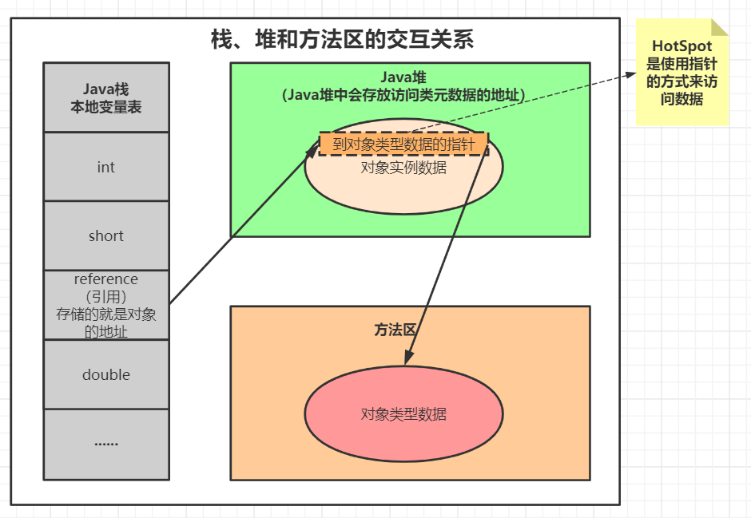

<br>

#### 堆内存对象分配逻辑

堆内存**物理上**只存在两个部分：新生区和养老区

堆内存**逻辑上**分为三部分：新生代、老年代、永久代（Java 7）/元空间（Java 8）

**Java 7 和 Java 8 区别**

**Java 7**

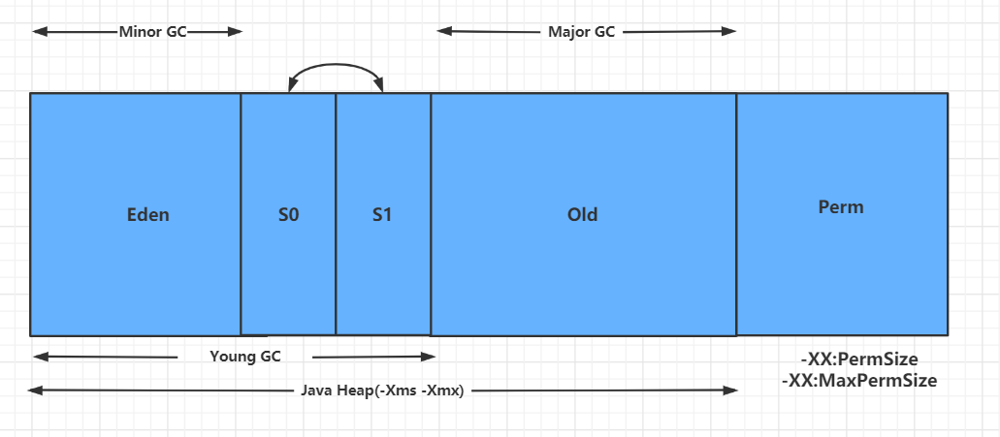

1、Young/New Generation Space，新生代

2、Tenure/Old Generation Space，老年代

3、Permanent/Perm Space，永久区

- 永久区是一个常驻内存的区域，用于存放 JDK 自身所携带的类和接口元数据
- 存储的是运行环境必须的类信息，被装载进入此区域的数据是不会被垃圾回收的，关闭 JVM 才会释放此区域所占用的内存

<br>

**Java 8**

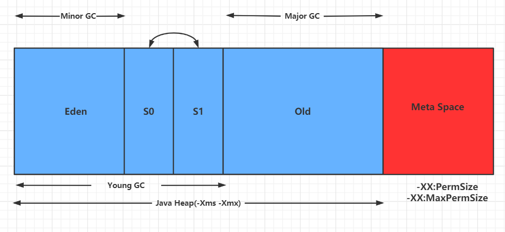

<br>

**新生代**

> 新生区是类创建/应用/销毁的区域，一个类在新生区创建和应用，无引用之后被垃圾收集器回收

<br>

**新生代分为两部分**

1）伊甸区（Eden Space）

- 几乎所有的类都是在伊甸区被创建出来（大对象直接在老年代创建）
- 对象被创建的时候首先放到伊甸区，新生代分配不了的大对象会直接进入老年代
- 在第一次 GC 开始前，对象只会存在于 Eden 区和幸存者 From 区，幸存者 To 区是空的
- 当伊甸区空间用完时，程序又需要创建对象，JVM 的垃圾回收器就会对伊甸区进行垃圾回收（Minor GC）。**只要产生  GC，伊甸区几乎会被全部清空，剩余的对象转移到幸存者 To 区**


2）幸存者区（Survivor Space），幸存者区分为：0 区（Survivor 0 Space）和 1 区（Survivor 1 Space）

- 幸存者 0 区和 1 区又叫 From 区和 To 区，From 和 To 不是固定的，每次 GC 后 From 和 To 会交换，GC 后为空的就是 To 区
- 当幸存者区中 From 和 To 来回复制交换次数达到 15 次（次数由 JVM 参数`MaxTenuringThreshold`决定，默认为15）之后，还存活的对象就存入养老区

- 新生代 GC（Young GC），对新生区包括伊甸和幸存者区进行垃圾回收

- **新生代的内存区域小于老年代，占堆内存的 1/3，对象存活率低，因此 GC 适合使用复制算法**


<br>

**老年代**

老年代内存空间满了之后开启 GC（Full GC，又称 Major GC，<mark>FGC 会清理整个堆空间</mark>，包括新生代和老年代），**FGC 多次后若养老区空间依然是满的则会报 OOM 异常 `java.lang.OutOfMemoryError:Java heap space`**

1）产生 OOM 异常原因

* Java 虚拟机的堆内存设置不够，可通过参数 `-Xms` 和 `-Xmx` 来调整

* 代码中创建了大量对象，并且长时间不能被垃圾回收器收集（仍被引用）


2）**养老区内存区域相对较大，占堆空间的 2/3，对象存活率高，因此 GC 算法常用标记清除或标记清除和标记整理的混合实现**


<br>

**元空间（Meta Space）**

- 元空间主要存放类的元数据

  1）Java 8 的元空间并不在虚拟机堆内存中，而是在本机的物理内存

  2）默认情况下，元空间的大小受本地内存限制，类的元数据放入本地物理内存中，此时可以加载多少类的元数据不再由 `MaxPermSize` 控制，而是由本地内存的实际可用空间来控制

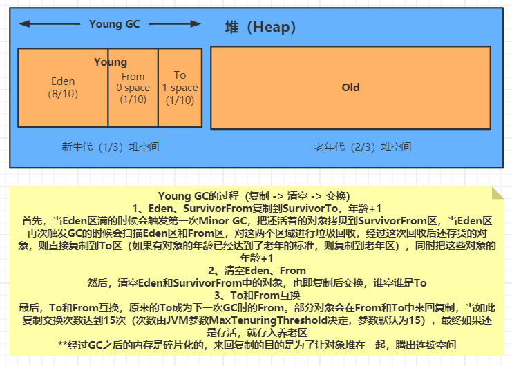

**堆参数调整**

- `-Xmx`，设置初始分配大小，默认为物理内存的 1/64
- `-Xms`，最大分配内存，默认为物理内存的 1/4
- `-XX:MaxTenuringThreshold`，设置对象在新生代中交换的次数
- `-XX:+PrintGCDetails`，输出详细的 GC 处理日志

<br>

#### 并发场景堆内存分配

> 在并发场景中，如何保证内存分配过程的线程安全性？如果两个线程先后把对象引用指向了同一个内存区域，怎么办？
>
> 1、<mark>对分配内存空间的动作做**同步处理**，采用 **CAS 机制**，配合失败重试的方式保证更新操作的线程安全性</mark>
>
> 缺点是每次分配时都需要进行同步控制，效率较低
>
> <br>
>
> 2、每个线程在 Java 堆中预先分配一小块<mark>“私有”内存</mark>，在给对象分配内存时，直接在这块内存中分配。当这部分区域用完之后，再重新分配
>
> - HotSpot 虚拟机中采用的方式，被称为 **TLAB 分配**（Thread Local Allocation Buffer），这部分 Buffer 是从堆中划分出来的，是**本地线程独享**的。虚拟机是否使用 TLAB 是可以选择的，可以通过 `-XX:+/-UseTLAB` 参数来设置。
>
>   需要注意，<mark>虽然说 TLAB 是线程独享的，但只是在“分配”这个动作上是线程独占的。至于在读取、垃圾回收等动作上都是线程共享的，而且在使用上也没有什么区别</mark>
>
> - <mark>TLAB 仅作用于新生代的 Eden Space</mark>
>
> <br>
>
> 使用 TLAB 之后，在 TLAB 上给对象分配内存时线程独享，并发场景下的冲突得到解决。但是 TLAB 内存自身从堆中划分出来的过程也可能存在内存安全问题，所以在对于 TLAB 的分配过程，还是需要进行同步控制的，但是这种开销相比于每次为单个对象划分内存时候对进行同步控制的要低得多。
>
> <br>
>
> TLAB 是线程特有的，它的内存区域不大，会出现不够用的情况，此时无法直接在 TLAB 上分配了，有两种解决办法：
>
> 1. 直接在堆中分配，缺点就是存在一种极端情况，TLAB 只剩下 1 KB，就会导致后续的分配可能大多数对象都需要直接在堆中分配
>
> 2. 废弃当前 TLAB，重新申请 TLAB 空间再次进行内存分配，会出现频繁的废弃 TLAB、频繁申请 TLAB 的情况
>
>
> <br>
>
> 为了解决这两个方案存在的问题，虚拟机定义了一个 `refill_waste` 的值，这个值可以看成**最大浪费空间**。
>
> 当请求分配的内存大于 `refill_waste` 的时候，会选择在堆内存中分配。若小于 `refill_waste` 值，则会废弃当前 TLAB，重新创建 TLAB 进行对象内存分配


<br>

## 垃圾回收

<br>

### 强/软/弱/虚引用

1、**强引用**，强引用即为平常使用得最多的引用，强引用的对象即便在程序内存不足（OOM）的时候也不会被回收

2、**软引用**，软引用的对象在**程序内存不足时回收**

3、**弱引用**，弱引用的对象，只要 JVM 的**垃圾回收器发现就会回收**

4、**虚引用**，虚引用的回收机制和弱引用一致，只要 JVM 的**垃圾回收器发现就会回收**。但在被回收之前，会被放入回收队列 `ReferenceQueue`。其他几种引用是被 JVM 的垃圾回收机制**回收之后**，才传入 `RefernceQueue` 中。虚引用大多被用于引用销毁前的处理工作，因此虚引用创建的时候必须带有 `RefernceQueue` 参数。

<br>

### 垃圾收集触发机制

#### YGC

* Eden 区内存满的时候触发 YGC


#### FGC

* 老年代空间不足
* 调用 `System.gc()` （只是对 JVM 发起 FGC 请求，至于何时触发，由 JVM 自行判断）

<br>

### GC 日志信息

> **如何查看**
>
> idea 的 vmoption 中添加参数
>
> ```shell
> -XX:+PrintGCTimeStamps -XX:+PrintGCDetails -Xloggc:./gc.log # Linux or macOS
> -XX:+PrintGCTimeStamps -XX:+PrintGCDetails -Xloggc:.\gc.log # Windows
> ```
>
> ```java
> public class GCTest {
>   public static void main(String[] args) {
>       new Thread(() -> {
>           byte[] arr1 = new byte[4 * 1024 * 1024];
>           arr1 = new byte[8 * 1024 * 1024];
>           arr1 = new byte[10 * 1024 * 1024];
> 
>           byte[] arr2 = new byte[4 * 1024 * 1024];
>           arr2 = null;
> 
>           byte[] arr3 = new byte[4 * 1024 * 1024];
>           byte[] arr4 = new byte[4 * 1024 * 1024];
>           byte[] arr5 = new byte[4 * 1024 * 1024];
>           byte[] arr6 = new byte[4 * 1024 * 1024];
> 
>           // 手动进行 FGC
>           System.gc();
> 
>       }).start();
> 
>       new Thread(() -> {
>           while (1 == 1) {
>               GCTest o = new GCTest();
>           }
>       }).start();
> 
>   }
> }
> ```

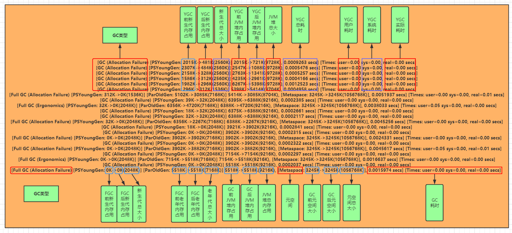

<br>

### 垃圾回收算法

> <mark>分代垃圾收集算法</mark>（没有最好的算法，只有根据堆中不同代使用的不同算法）

**总体概述**

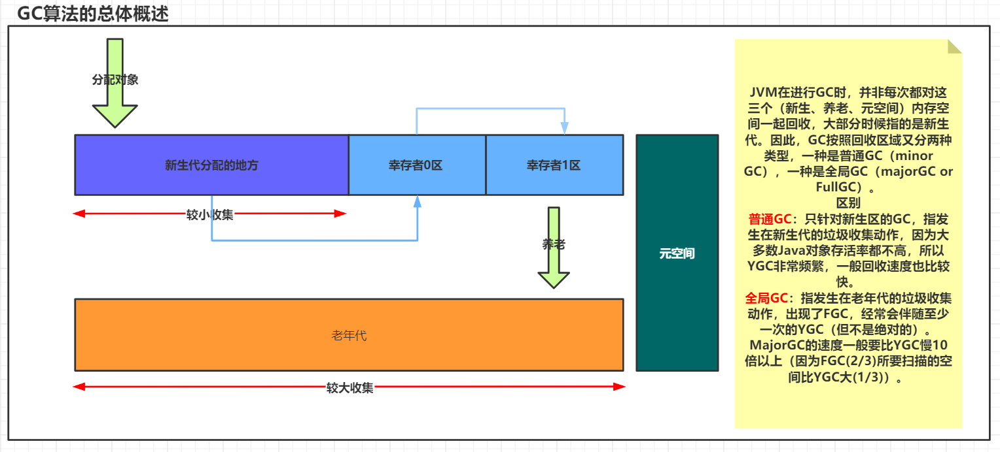

<br>


#### 对象回收判断

**引用计数法**

- 在 Java 中，引用和对象是有关联的。如果要操作对象则必须使用对象的引用进行操作。因此可以通过对象的引用次数来判断一个对象是否可以被回收

  操作如下：给对象中添加一个引用计数器，每当有一个地方引用它，计数器值加 1；每当有一个引用失效时，计数器值减 1。任意时刻计数器值为 0 的对象就是可回收对象

* 缺点是每次对象赋值时都要维护引用计数器，而且计数器本身也有一定的消耗，且较难处理循环引用

* <mark>JVM一般不采用此方法，其中最主要的原因是它很难解决对象之间相互循环引用的问题</mark>

  假设对象 A 和 B 相互引用，此外没有其他引用指向 A 和 B。这种情况下，若 A 和 B 已不再被使用，但由于它们的引用计数器都不为 0，在使用引用计数法时，就会将这两个对象判断为不可被回收。

<br>

**可达性分析**

- GC Roots，指垃圾收集器对象。垃圾回收过程中会回收不是 GC Roots，且没有被 GC Roots 引用的对象
- 通常有以下对象会被认为是 Root 对象
  1. 虚拟机栈中引用的对象（栈帧中的本地变量表）
  2. 方法区中静态属性引用的对象
  3. 方法区中常量引用的对象
  4. 本地方法栈中 `native` 方法引用的对象
- 通过一系列 `GC Roots` 对象作为起点进行遍历，<mark>如果在 GC Roots 和某个对象之间没有可达路径，则表示该对象是不可达的</mark>
- 不可达的对象不一定会成为可回收对象
  1. 可能是进入 `DEAD` 状态的线程，而进入 `DEAD` 状态的线程是可以恢复的，GC 不会回收
  2. 不可达对象为 Root 对象，JVM 认为 Root 对象是不可回收的，并且 Root 引用的对象也是不可回收的

<br>

#### 垃圾回收

**复制算法**（Copying），适用于新生代

- 新生代发生 YGC 时，使用的就是复制算法。因为新生代中的对象一般存活率不高，来回复制开销小

- 复制算法需要使用到两块内存区域，每次只用其中一块，当一块用完，就将存活的对象复制到另一块

- 新生代对象一般存货率较低，所以通常使用两块 10% 的内存作为空闲和活动空间，即 From 和 To。而另外 80% 的内存则用来给新建对象分配内存，即 Eden 区。

  一旦发生 GC，将 From 区中存活的对象与 Eden 区中存活的对象复制到 To 区，接下来将 Eden 和 From 这 90% 的内存全部释放

- 优点是不会产生内存碎片；缺点是消耗内存，可用内存减少，当有大量对象存活时，会产生较大复制开销


   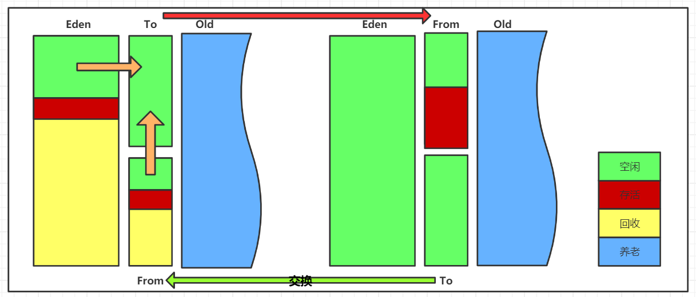

<br>

**标记清除算法**（Mark-Sweep），适用于老年代

- 老年代的 GC 算法一般是由标记清除或标记清除和标记整理混合实现

- 标记清除算法分为标记和清除两个阶段，先标记（Marking）出要回收的对象，然后再统一回收/清除（Sweep）这些对象

- 程序在运行期间，若可以使用的内存被耗尽，GC 线程就会被触发，并将程序暂停。随后将要回收的对象标记，最终统一回收被标记的对象，完成标记清除工作后让应用程序恢复运行

- 优点：不需消耗额外空间

- 缺点：

  1. 标记和清除分两次扫描，耗时严重，效率较低
  2. 会产生内存碎片，为了解决这个这个缺点，JVM 需要维持一个内存的空闲列表，产生额外开销。而且在分配数组对象时，寻找连续的内存空间会不太好找

- 回收前


- 回收后

  

<br>

**标记压缩**（Mark-Compact）/标记整理，适用于老年代

- **标记压缩 == 标记清除 + 标记整理**，经过多次标记清除 GC 后，才会进行 Compact 压缩整理

- 在标记整理的压缩阶段，不是标记回收对象，而是<mark>标记存活对象，把所有的存活对象都向一端移动，然后直接清除存活边界外的内存</mark>。标记存活的对象就得到了整理，按照内存地址依次排序，未被标记的内存就会被清理。在之后给新对象分配内存时，JVM 只需要持有空闲内存起始地址即可，比标记清除维护的空闲列表开销显然少了许多

- 优点：没有内存碎片，可以利用 bump

- 缺点：需要付出移动对象的成本，相比于前几个算法耗时长


   

<br>

#### GC 算法比较

> - 效率
>
>   复制 => 标记清除 => 标记整理
>
> - 内存整齐度
>
>   复制 = 标记整理 => 标记清除
>
> - 内存利用率
>
>   标记整理 = 标记清除 => 复制

<br>

**算法适用场景**

- 新生代内存区域相对老年代小，占堆空间的 1/3，对象存活率低，因此 YGC 适合使用复制算法
- 老年代内存区域相对较大，占堆空间的 2/3，对象存活率高，因此 FGC 算法通常用标记清除或标记压缩

<br>

### **垃圾回收过程**

> 对象被判定是否可回收，需要经历两个阶段
>
> 1、可达性分析
>
> 2、查看需要回收的对象是否重写了 `finalize()` 方法或者该对象的 `finalize()` 方法是否已被调用过
>
> - `finalize()` 方法的作用是给该对象一次救活的机会
> - GC 要回收一个对象时，不会直接将其回收，而是调用一次该对象的 `finalize()` 方法，在下次垃圾回收的时候，才会回收这个对象
> - 可以在 `finalize()` 方法中定义对象在释放前必须执行的操作

<br>

### 编码过程的优化

* 不显式调用 `System.gc()` 减少 GC 的频率；
* 尽量减少临时对象的使用。在方法结束后，临时对象便成为了垃圾，所以减少临时变量的使用就相当于减少了垃圾的产生；
* 对象不用时显式置为 `null`。一般而言，为 `null` 的对象都会被作为垃圾处理，增加可使用的内存空间；
* 尽量使用 `StringBuilder` 来代替 `String` 的字符串累加。因为 `String` 的底层是 `final` 类型的数组，所以 `String` 的增加其实是建了一个新的 `String`，从而产生了过多的垃圾；
* 许的情况下尽量使用基本类型（如 `int`）来替代 `Integer` 对象。因为基本类型变量比相应的对象占用的内存资源会少得多；
* 合理使用静态对象变量。因为静态变量属于全局变量，不会被 GC 回收；

<br>

### 垃圾收集器

> 1. Serial 收集器：Serial 收集器是一种单线程的垃圾收集器，它只使用一个线程进行垃圾收集，并且在垃圾收集期间会暂停应用程序的所有线程。它适用于小型或中小型的应用程序，或者是作为客户端模式下的默认垃圾收集器。
> 2. Parallel 收集器：Parallel 收集器是 Serial 收集器的多线程版本，它可以使用多个线程进行垃圾收集，从而提高垃圾收集的效率。Parallel 收集器适用于多核处理器和大型应用程序。
> 3. CMS 收集器：CMS 收集器是一种并发垃圾收集器，它可以和应用程序同时运行。它的垃圾收集过程包括四个阶段：Initial Mark、Concurrent Mark、Concurrent Preclean 和 Final Remark。相对于 Parallel 收集器，CMS 收集器的优势在于其**可以和应用程序同时运行**，减少了垃圾收集过程中的停顿时间。
> 4. G1 收集器：G1 收集器是一种面向服务端应用的垃圾收集器，它可以在高内存压力的情况下，实现**低停顿时间的垃圾收集**。它将堆内存划分为多个独立的区域，并且每个区域的大小不同，可以根据垃圾的分布情况，优先收集垃圾最多的区域。
> 5. ZGC 收集器：ZGC 收集器是 JDK 11 中引入的一种全新的垃圾收集器，它是一种低延迟的垃圾收集器，可以在不超过 10ms 的时间内完成垃圾收集。与其他垃圾收集器不同的是，ZGC 收集器可以对整个堆内存进行垃圾收集，而不是只针对部分区域。
> 6. Shenandoah 收集器：JDK 12 中引入的一种垃圾收集器，它是一种低延迟的垃圾收集器，可以在不超过 10ms 的时间内完成垃圾收集。与 ZGC 收集器类似，Shenandoah 收集器也可以对整个堆内存进行垃圾收集。可以与应用程序同时运行。

<br>

#### Serial

* SerialNew 新生代使用
* SerialOld 老年代使用

<br>

#### Parallel

* Parallel Scavenge 新生代，目标是达到一个可控制的吞吐量，主要适用于有大量可用 CPU 和较少内存的场景
* ParNew 新生代使用，主要适用于以前使用 CMS 垃圾收集器的应用程序，可以和 CMS 协同工作。
* ParallelOld 老年代使用，Parallel Scavenge 收集器的老年代版本

<br>

#### CMS

> CMS（Concurrent Mark Sweep）收集器，CMS 收集器是**获取最短回收停顿时间为目标**的收集器

<br>

##### CMS 垃圾回收过程

1、初始标记（CMS initial mark)）

2、并发标记（CMS concurrent mark）

3、重新标记（CMS remark）

4、并发清除（CMS concurrent sweep）

> 其中初始标记和重新标记会停止所有的用户线程。并发标记阶段就是进行 GC Roots Tracing 的过程。
>
> 重新标记是为了修正并发标记期间，因用户程序继续运行而导致标记产生变动的那一部分对象的标记记录，这个阶段的停顿时间一般比初始标记阶段长。
>
> 整个 GC 过程当中消耗时间最长的是并发标记和并发清除过程，但是这两个阶段的垃圾回收线程可以与用户线程一起并发执行。总体上说 CMS 收集器的内存回收过程是与用户线程一起并发执行的。

<br>

> ##### CMS 缺点
>
> - CMS 对 CPU 资源敏感，在并发阶段虽然不会停止用户线程，但是会占用一部分线程来进行垃圾回收，总吞吐量会降低。
>
> - CMS 无法回收浮动垃圾。CMS 在并发清理阶段还可以运行用户线程，需要预留一部分空间提供并发收集时候的用户线程使用。这时候还会产生新的垃圾，而这部分垃圾 CMS 无法在本次回收掉，这部分就是浮动垃圾。
>
> - CMS 不像其他的收集器，等到年老代几乎全部满了再进行回收。默认设置下 CMS 收集器在年老代使用了 68% 的空间后就会被激活，可以通过 `-XX:CMSInitiatingOccupancyFraction` 参数来设置。
>
>   如果 CMS 在运行时候预留的内存无法满足程序需要，就会出现一次 “Concurrent Mode Failure” 失败,这时候虚拟机临时启用 Serial Old 收集器重新来进行老年代的垃圾收集。
>
> - CMS 是基于标记清除算法，在清理的过程中会有大量的空间碎片。空间碎片过多后给打对象分配空间会有很多麻烦。
>
>   CMS 提供了一个参数 `-XX:+UseCMSCompactAtFullCollection` 用来在 FGC 完成后附加一个碎片整理过程，碎片整理无法并发会导致停顿时间变长。
>
>   还提供了一个参数 `-XX:CMSFullGCsBeforeCompaction` 参数设置在执行多少次不压缩的 FGC 后，进行一次带压缩的 FGC。

<br>

##### CMS 发生 FGC 原因分析

> 1）堆中分配很大的对象
>
> 所谓大对象，是指需要大量连续内存空间的 Java 对象，例如很长的数组，会直接进入老年代。而老年代虽然有很大的剩余空间，但是无法找到足够大的连续空间来分配给当前对象，此种情况就会触发 JVM 进行 Full GC。
>
> `-XX:+UseCMSCompactAtFullCollection` 参数，用于在 FGC 后进行一次碎片整理。内存整理的过程无法并发，空间碎片问题得到解决，但停顿的时间变长。
>
> 为此 JVM 设还提供了另外一个参数 `XX:CMSFullGCsBeforeCompaction`，用于设置在执行多少次不压缩的 FGC后，进行一次带压缩的 FGC。
>
> <br>
>
> 2）调用 `System.gc() ` 方法
>
> 3）老年代空间不足
>
> 如果执行 FGC 后空间仍然不足，则抛出错误：`java.lang.OutOfMemoryError: Java heap space`。因此应尽量做到让对象在 Minor GC 阶段被回收
>
> <br>
>
> 4）方法区空间不足
>
> 方法去中存放类的元信息/运行时常量/静态变量等数据。当系统中要加载的类、反射的类和调用的方法较多时，方法区可能会被占满，在未配置采用 CMS GC 的情况下会执行 Full GC。如果经过 FGC 仍然无法回收，JVM 会抛出 OOM。
>
> 为避免方法区占满造成 FGC 现象，可采用的方法为增大 Perm Gen or Metaspace 空间或转为使用 CMS GC
>


<br>

#### G1

<br>

> ##### G1 垃圾回收过程
>
> 1. 初始标记；
> 2. 并发标记；
> 3. 最终标记；
> 4. 筛选回收。

<br>

##### G1 优缺点

1）与应用程序并行：G1 能充分利用 CPU、多核环境下的硬件优势，使用多个CPU（ CPU 或者 CPU 核心）来缩短 Stop-The-World 停顿时间。

2）分代收集：虽然 G1 可以不需要其他收集器配合就能独立管理整个 GC 堆，但是还是保留了分代的概念。它能够采用不同的方式去处理新创建的对象和已经存活了一段时间，经过多次 GC 的旧对象以获取更好的收集效果。

3）空间整合：与 CMS 的标记清理算法不同，G1 整体上看是基于标记整理算法实现的；从局部上来看是基于复制算法实现的。

> G1 垃圾收集器在整体上使用的是基于标记整理算法的垃圾回收策略，它将堆内存划分为多个大小相等的区域，其中包括一个新生代和多个老年代。在收集垃圾时，首先会从整个堆中选取价值最高的区域开始回收，这个过程被称为“混合垃圾收集”（Mixed GC），也就是标记整理算法的应用。
>
> 在局部上来看，G1 收集器使用的是基于复制算法的策略，它将每个分区分为多个大小相等的小块，每个小块都会被标记为可用或不可用。在 Young GC 中，G1 收集器使用了复制算法，将 Eden 区域中的存活对象拷贝到其中一个存活区域中。在 Old GC 中，由于每个分区都可能包含一部分存活对象和垃圾对象，所以它会使用标记整理算法。这种混合使用复制算法和标记整理算法的方式既能保证效率，又能保证回收效果。
>
> 因此，可以说 G1 垃圾收集器是基于标记整理算法实现的，但在具体的实现过程中，它同时也采用了复制算法。

4）可预测的停顿：这是 G1 相对于 CMS 的另一个大优势，降低停顿时间是 G1 和 CMS 共同的关注点，但 G1 除了追求低停顿外，还能建立可预测的停顿时间模型

<br>


> 关于 JVM 的内容暂且告一段落...


<br>

## 参考

[Java字符串常量池，运行时常量池，jdk1.7后intern方法的变化](https://blog.csdn.net/zzzgd_666/article/details/87999870)


[JVM之G1和CMS](https://blog.csdn.net/zsj777/article/details/80353464)


[CMS发生FullGc分析](https://blog.csdn.net/peter7_zhang/article/details/107011297)


[JVM之垃圾回收机制（GC）](https://juejin.cn/post/7123853933801373733)