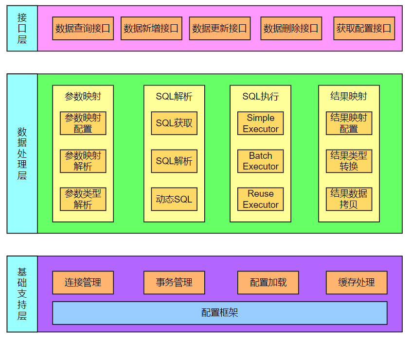

# MyBatis

## 前言

> [官方文档](https://mybatis.org/mybatis-3/)

> 在操作 MySQL 的时候，需要先启动服务，再使用客户端连接，开启一个会话（Session），才能在会话中进行增删改查操作。单纯的 JDBC 只能支持单个数据库连接，数据库操作需要频繁的打开和关闭会话连接。于是出现了数据源（DataSource），比如说 Druid DataSource，维护一个连接池，管理和维护多个会话连接。不管是 JDBC 还是数据源，都不能饶过会话，所有对数据库的操作都是在会话中进行的。会话是数据库操作中很重要的一环。
>
> （数据源还有其他功能，此处仅仅关注会话操作而已）

> MyBatis 是一个持久层框架，支持定制化 SQL 以及高级映射。MyBatis 可以使用的 XML 或注解来创建和配置，以及映射 Java 类型/接口/POJO 为数据库中的记录。
>
> 在引入了 MyBatis 后，可以将数据源交给 MyBatis 管理。数据源的连接池维护和管理多个会话，MyBatis 管理数据源，这样一来，MyBatis 也就间接的管理了会话。
>
> 会话很重要，在 MyBatis 中同样如此，所有 MyBatis 的操作都是在会话中进行的。因此就可以围绕 MyBatis 创建会话前要做什么，如何创建会话，创建会话后如何使用会话进行操作这几个方面出发来了解 MyBatis。
>
> * 创建会话前，解析配置文件，处理接口和 xml 映射等
> * 如何创建会话，工厂模式（SqlSessionFactory）
> * 创建会话后，进行会话操作（SqlSession）

> **特点**
>
> MyBatis 是一个**半自动的 ORM **框架（Object Relational Mapping，对象关系映射），通过使用描述对象和数据库之间映射的元数据，将对象自动持久化到关系数据库中，本质上就是将数据从一种形式转换到另外一种形式。
>
> 一般来说，对数据库的操作包括：编写 SQL -> 预编译 -> 设置参数 -> 执行 SQL -> 封装结果。MyBatis 将编写 SQL 的步骤交给开发者，是半自动的；JPA 帮助开发者生成了 SQL，是全自动的。
>
> 在 MyBatis 中开发者直接编写原生 SQL，可以严格控制 SQL 执行性能，灵活度高。内部封装 JDBC，开发时只需要关注 SQL 语句本身。
>
> MyBatis 可以使用 **XML** 或**注解**来配置和进行关系映射，将 POJO 映射成数据库中的记录，避免了几乎所有的 JDBC 连接和维护代码，不再需要手动设置参数，同时也处理好了结果集数据类型的映射。
>
> 通过 XML 或注解的方式将要执行的各种 statement 配置起来，并通过 Java 对象和 statement 中 SQL 的动态参数进行映射生成最终执行的 SQL 语句，最后由 MyBatis 框架执行 SQL 并将结果映射为 Java 对象并返回。

> **优点**
>
> 1、基于 SQL 语句编程，相当灵活，不会对应用程序或者数据库的现有设计造成任何影响，SQL 写在 XML 里，**SQL 与程序代码的耦合**，便于统一管理；提供 XML 标签，支持编写**动态 SQL **语句，而且 SQL 还支持重用
>
> 2、消除了 JDBC 大量冗余的代码，不需要手动开关数据库连接
>
> 3、很好的与各种数据库兼容（内部封装 JDBC，只要 JDBC 支持的数据库 MyBatis 都支持）
>
> 4、提供**映射标签**，支持对象与数据库的 ORM 字段关系映射；提供**对象关系映射标签**，支持对象关系组件维护
>
> 5、能够与 Spring/SpringBoot 很好的集成
>
> <br>
>
> **缺点**
>
> 1、SQL 语句的编写工作量较大，尤其当字段多、关联表多时，SQL 语句较为复杂。
>
> 2、SQL 语句依赖于数据库，导致数据库移植性差，不能随意更换数据库

> **与 Hibernate 的异同**
>
> 1、Hibernate 是**全自动的 ORM **框架，编写 SQL -> 预编译 -> 设置参数 -> 执行SQL -> 封装结果，都由 Hibernate 完成
>
> 2、MyBatis 支持编写原生 SQL，可以严格控制 SQL 执行，灵活度高。灵活的后果是 MyBatis 无法做到数据库无关性，如果需要实现支持多种数据库的软件，则需要自定义多套 SQL 映射。适合对关系数据模型要求不高的软件开发，因为这类软件需求变化频繁，一但需求变化要求迅速输出成果。
>
> 3、Hibernate 对象/关系映射能力强，数据库无关性好，对于关系模型要求高的软件，开发可以节省很多代码，提高效率

<br>

## 整体架构

MyBatis 最顶层的是接口层，即 Mapper 接口定义，包含了对数据库的 CRUD 操作方法。数据处理层主要是配置 Mapper 到 XML 之间的参数映射，SQL 解析，SQL 执行，结果映射的过程；基础支持层包括连接管理，事务管理，配置加载和缓存管理等。




<br>

### 接口层

> SqlSessionFactory 和 SqlSession 是 MyBatis 接口的核心接口。尤其是 SqlSession，是 MyBatis 中最重要的接口，主要是用来执行 SQL 命令，获取映射，管理事务

> **SqlSessionFactory**
>
> 主要负责
>
> - MyBatis 框架初始化操作
> - 提供 SqlSession 对象
>
> <br>
>
> SqlSessionFactory 有两个实现类，SqlSessionManager 和 DefaultSqlSessionFactory
>
> - DefaultSqlSessionFactory
>
>   SqlSessionFactory 的默认实现类，创建会话的工厂类，这个类的实例是全局共享的，只会在首次调用时生成一个实例（单例模式），就一直存在直到服务器关闭
>
> - SqlSessionManager
>
>   已被废弃，SqlSessionManager 需要维护一个自己的 ThreadLocal，而使用 MyBatis 更多的是要与 Spring 进行集成，并不会单独使用，所以维护自己的 ThreadLocal 并没有什么意义，所以 SqlSessionManager 已经不再使用

> **SqlSession**
>
> SqlSession 接口中定义了一系列模版方法，能够执行简单的 CRUD 操作，也可以通过 getMapper 获取 Mapper，执行自定义 SQL 语句。因为 SqlSession 在执行 SQL 语句之前是需要先开启一个会话，涉及到事务操作，所以还会有 commit/rollback/close 等方法

<br>

### 数据处理层

> **配置解析**
>
> 在 MyBatis 初始化过程中，会加载并解析 `mybatis-config.xml` 配置文件以及 Mapper 接口中的注解信息。解析后的配置信息会形成相应的对象并保存到 Configration 对象中，然后根据该对象创建 SqlSessionFactory 对象。初始化完成后，可以通过 SqlSessionFactory 创建 SqlSession 对象并开始数据库操作。

> **SQL执行**
>
> SQL 语句的执行涉及多个组件，包括 Executor/StatementHandler/ParameterHandler/ResultSetHandler
>
> - SqlSession，执行 SQL 命令，获取映射，管理事务
> - Executor，执行器，是 MyBatis 调度的核心，负责 SQL 语句的生成以及查询缓存的维护
> - StatementHandler，封装了 JDBC Statement 操作，负责对 JDBC Statement 的操作，如设置参数、将Statement 结果集转换成 List 集合
> - ParameterHandler，负责将用户传递的参数转换成 JDBC Statement 所需要的参数
> - ResultSetHandler，负责将 JDBC 返回的 ResultSet 结果集对象转换成 List 类型的集合
> - TypeHandler，用于 Java 类型和 JDBC 类型之间的转换
> - MappedStatement，保存 SQL 语句、参数类型、结果类型、缓存等配置信息，每个 SQL 映射语句在 MyBatis 中都会被解析为一个 MappedStatement 对象。在运行时，MyBatis 会根据调用的方法，获取对应 MappedStatement 对象中的信息，生成相应的 SQL 语句，并执行该语句，然后将结果映射为 Java 对象。
> - SqlSource，表示从 XML 文件或注释读取的映射语句的内容，它将从用户接收的输入参数传递给数据库，创建 对应的 SQL
> - Configuration，所有 MyBatis 配置信息都维持在 Configuration 对象之中


<br>

### 基础支持层

> - **反射模块**
>
>   MyBatis 中的反射模块，对 Java 反射进行封装，并且对反射操作进行了一系列的优化，比如，缓存了类的元数据（MetaClass）和对象的元数据（MetaObject），提高了反射操作的性能
>
> - **类型转换模块**
>
>   MyBatis 的别名机制，能够简化配置文件，该机制是类型转换模块的主要功能之一。类型转换模块的另一个功能是实现 JDBC 类型与 Java 类型的转换。在 SQL 语句绑定参数时，会将数据由 Java 类型转换成 JDBC 类型；在映射结果集时，会将数据由 JDBC 类型转换成 Java 类型
>
> - **日志模块**
>
>   在 Java 中，有很多优秀的日志框架，如 Log4j、Log4j2、slf4j 等。MyBatis 除了提供了详细的日志输出信息，还能够集成多种日志框架，其日志模块的主要功能就是集成第三方日志框架
>
> - **资源加载模块**
>
>   该模块主要封装了类加载器，确定了类加载器的使用顺序，并提供了加载类文件和其它资源文件的功能
>
> - **解析器模块**
>
>   该模块有两个主要功能：一个是封装了 XPath，为 MyBatis 初始化时解析 `mybatis-config.xml` 配置文件以及映射配置文件提供支持；另一个为处理动态 SQL 语句中的占位符提供支持
>
> - **数据源模块**
>
>   MyBatis 自身提供了相应的数据源实现，也提供了与第三方数据源集成的接口。数据源是开发中的常用组件之一，很多开源的数据源都提供了丰富的功能，如连接池、检测连接状态等，选择性能优秀的数据源组件，对于提供ORM 框架以及整个应用的性能都是非常重要的
>
> - **事务管理模块**
>
>   一般地，MyBatis 与 Spring 框架集成，由 Spring 框架管理事务。但 MyBatis 自身对数据库事务进行了抽象，提供了相应的事务接口和简单实现
>
> - **缓存模块**
>
>   MyBatis 中有**一级缓存**和**二级缓存**，这两级缓存都依赖于缓存模块中的实现。但是需要注意，这两级缓存与MyBatis 以及整个应用是运行在同一个 JVM 中的，共享同一块内存。如果这两级缓存中的数据量较大，则可能影响系统中其它功能，所以需要缓存大量数据时，优先考虑使用 Redis、Memcache 等缓存产品
>
> - **Binding 模块**
>
>   在调用 SqlSession 相应方法执行数据库操作时，需要制定映射文件中定义的 SQL 节点，如果 SQL 中出现了拼写错误，那就只能在运行时才能发现。
>
>   为了能尽早发现这种错误，MyBatis 通过 Binding 模块将用户自定义的Mapper 接口与映射文件关联起来，系统可以通过调用自定义 Mapper 接口中的方法执行相应的 SQL 语句完成数据库操作，从而避免上述问题。在开发中，只创建 Mapper 接口，并没有编写实现类，因为 MyBatis 自动为 Mapper 接口创建了动态代理对象
>
> 


<br>

## 配置文件

> 配置文件内的标签需要保持一定的顺序
>
> * properties 属性
>
> * settings 设置
>
> * typeAliases 类型别名
>
> * typeHandlers 类型处理器
>
> * objectFactory 对象工厂
>
>   每次 MyBatis 创建 result 对象的新实例时，它都会使用一个对象工厂实例来完成实例化工作
>
> * plugins 插件
>
>   MyBatis 允许在映射语句执行过程中的某一时刻进行拦截调用
>
> * environments 环境配置
>
> * databaseIdProvider 数据库厂商标识
>
> * mappers 映射器
>
> 顺序不能颠倒，比如 settings 不能放在 environments 后面

```xml
<?xml version="1.0" encoding="UTF-8" ?>
<!DOCTYPE configuration
        PUBLIC "-//mybatis.org//DTD Config 3.0//EN"
        "https://mybatis.org/dtd/mybatis-3-config.dtd">
<configuration>
    <properties>
        <property name="username" value="root"/>
        <property name="password" value=""/>
        <property name="url" value="jdbc:mysql://localhost:3306/db_test?useSSL=false"/>
        <property name="driver" value="com.mysql.cj.jdbc.Driver"/>
    </properties>
    <typeAliases>
        <package name="com.demo.mapper"/>
    </typeAliases>
    <environments default="development">
        <environment id="development">
            <transactionManager type="JDBC"/>
            <dataSource type="POOLED">
                <property name="driver" value="${driver}"/>
                <property name="url" value="${url}"/>
                <property name="username" value="${username}"/>
                <property name="password" value="${password}"/>
            </dataSource>
        </environment>
    </environments>
    <mappers>
        <mapper resource="mapper/UserMapper.xml"/>
    </mappers>
</configuration>
```

<br>

### 插件

> MyBatis 允许在映射语句执行过程中的某一时刻进行拦截调用，默认情况下，MyBatis 允许使用插件来拦截的方法调用包括
>
> - Executor 接口中的方法，如 update/query/flushStatements/commit/rollback/getTransaction/close/isClosed
> - ParameterHandler 接口中的方法，如 getParameterObject/setParameters
> - ResultSetHandler 接口中的方法，如 handleResultSets/handleOutputParameters
> - StatementHandler 接口中的方法，如 prepare/parameterize/batch/update/query

**自定义插件**

```java
// 拦截 Executor 的 update(MappedStatement, Object) 方法
@Intercepts({@Signature(
  type= Executor.class,
  method = "update",
  args = {MappedStatement.class,Object.class})})
public class ExamplePlugin implements Interceptor {
  private Properties properties = new Properties();

  @Override
  public Object intercept(Invocation invocation) throws Throwable {
    // pre processing
    Object returnObject = invocation.proceed();
    // post processing
    return returnObject;
  }

  @Override
  public void setProperties(Properties properties) {
    this.properties = properties;
  }
}
```

**注册插件**

```xml
<!-- 将插件注册到 MyBatis -->>
<plugins>
  <plugin interceptor="org.mybatis.example.ExamplePlugin">
    <property name="someProperty" value="100"/>
  </plugin>
</plugins>
```

<br>

## 使用

```java
String resource = "mybatis-config.xml";
// MyBatis 有一个 Resources 的工具类，包含获取资源的方法
// 使得从类路径或其它位置加载资源文件更加容易
InputStream inputStream = Resources.getResourceAsStream(resource);
SqlSessionFactory sqlSessionFactory = new SqlSessionFactoryBuilder().build(inputStream);
// 创建 SqlSession，接下来对数据库的任何操作都需要借助 SqlSession 进行
SqlSession sqlSession = sqlSessionFactory.openSession();
// 获取到的实际上是一个动态代理 MapperProxy 对象
UserMapper userMapper = sqlSession.getMapper(UserMapper.class);
int count = userMapper.count();
System.out.println(count);
```


<br>

## 功能

### 属性&字段映射

> * 定义字段别名
> * resultMap

在 SQL 语句中定义字段别名，让字段名的别名和实体类的属性名一致

```xml
<select id ="selectorder" parametertype="int" resultetype = "com.demo.domain.order>
	select order_id id, order_no orderno ,order_price price form orders where 		order_id = #{id};
</select>
```

通过 resultMap 来映射字段名和实体类属性名

```xml
<resultMap type="com.demo.domain.order" id="orderresultmap">
      <!–- id 属性映射主键字段 -–>  
  <id property="id" column="order_id">
      <!–- result 映射非主键字段，property 为实体类属性，column 为数据表字段 -–>
  <result property = "orderno" column = "order_no" />    
  <result property="price" column="order_price" />
</reslutMap>
<select id="getOrder" parameterType="int" resultMap="orderresultmap">
  select * from orders where order_id=#{id}
</select>
```

<br>

### XML 映射文件

> * Mapper 接口的全限名，就是 xml 映射文件中的 namespace 标签的值
> * 接口的方法名，就是映射文件中 select/insert/update/delete 标签的 id 值
> * 接口方法的参数，就是传递给 SQL 的参数
>
> [XML 映射文件](https://mybatis.org/mybatis-3/zh/sqlmap-xml.html)]


<br>

### 结果映射

> * resultMap 标签，逐一定义数据库列名和对象属性名之间的映射关系
> * SQL 的 as 关键字设置列别名，将列的别名设置为对象属性名

有了列名与属性名的映射关系后，MyBatis 通过反射创建对象，使用反射给对象的属性逐一赋值并返回。找不到映射关系的属性，无法完成赋值。

<br>

### 参数传递

**\#{} 表示占位符**

- 可以实现 preparedStatement 向占位符中设置值，自动进行 Java 类型和 JDBC 类型转换，可以有效防止 SQL 注入

- 可以接收简单类型值或 POJO 属性值。 如果 parameterType 传输单个简单类型值，`#{}` 中可以是 value 或其它名称。MyBatis 在处理 `#{}` 时，会将 SQL 中的 `#{}` 替换为 `?` 号，调用 PreparedStatement 的 set 方法来赋值

**${} 表示拼接 SQL 串**

通过 `${}` 可以将 parameterType 传入的内容拼接在 SQL 中且不进行 JDBC 类型转换。 ${} 可以接收简单类型值或 POJO 属性值，如果 parameterType 传输单个简单类型值，`${}` 中只能是 value。MyBatis 在处理 `${}` 时，就是把 `${}` 替换成变量的值

<br>

<br>

### 多参数传递

> * 数字占位
> * @param 注解
> * 多参数封装成 map
>
> 常用前两种

**数字占位**

```java
// 对应的 xml 中 #{0} 代表接收第一个参数，#{1} 代表第二参数，以此类推
public UserselectUser(String name,String area);
```

```xml
<select id="selectUser"resultMap="BaseResultMap">     
	select *  fromuser_user_t   whereuser_name = #{0} anduser_area = #{1}
</select>
```

<br>

**@param 注解**

```java
public interface usermapper {
    user selectuser(@param(“username”) string username,
                    @param(“hashedpassword”) string hashedpassword);
}
```

然后,就可以在xml像下面这样使用(推荐封装为一个map,作为单个参数传递给mapper):

```xml
<select id="selectuser" resulttype="user">
    select id, username, hashedpassword
    from some_table
    where username = #{username}
    and hashedpassword = #{hashedpassword}
</select>
```

**多参数封装成 Map**

```java
int start, end;
Map<String, Object> params = new HashMap<>();
params.put("start", start);
params.put("end", end);
sqlSession.selectList("StudentID.pagination", map)
```


<br>

### 模糊查询

在 Java 代码中添加 SQL 通配符

```java
string wildcardname = "%smi%";
List<name> names = mapper.selectlike(wildcardname);
```

```xml
<select id="selectlike">
	select * from foo where bar like #{value}
</select>
```

在 SQL 语句中拼接通配符（会引起 SQL 注入）

```java
string wildcardname = "smi";
List<name> names = mapper.selectlike(wildcardname);
```

```xml
<select id="selectlike">
	select * from foo where bar like "%"#{value}"%"
</select>
```

<br>

### 获取自动生成(主)键值

insert 方法总是返回一个 int 值 ，这个值代表的是插入的行数。

如果采用自增长策略，自动生成的键值在 insert 方法执行完后可以被设置到传入的参数对象中。

在 Java 代码中获取

```xml
<insert id ="insertname" usegeneratedkeys="true" keyproperty="id" >
    insert into names (name) values (#{name})
</insert>
```

```java
name name = new name();
name.setname(“fred”);

int rows = mapper.insertname(name);
// 完成后 id 已经被设置到对象中
system.out.println(“rows inserted = ” + rows);
system.out.println(“generated key value = ” + name.getid());
```

在 xml 中返回

```xml
<!--
	keyProperty="id": 将返回的主键放入传入参数的 id 中保存.
	order: 当前函数相对于 insert 语句的执行顺序，
				在 insert 前执行是 BEFORE，在 insert 后执行是 AFTER
-->
<insert id="insertBook" parameterType="Book">
    <selectKey keyProperty="bookId" order="AFTER" resultType="java.lang.Integer">
        select
        LAST_INSERT_ID()
    </selectKey>
    insert into
    book (bookname,price,booktypeid,bookspecies,bookscore,publisher,author,bookdata)
    values (#{bookName},#{price},#{bookTypeId},#{bookSpecies},
    #{bookScore},#{publisher},#{author},#{bookData})
</insert>
```

<br>

### 分页

MyBatis 使用 RowBounds 对象进行分页，是针对 ResultSet 结果集执行的内存分页，而非物理分页。可以在 SQL 内直接添加带有物理分页的参数来完成物理分页功能，也可以使用分页插件来完成物理分页。

分页插件的基本原理是使用 MyBatis 提供的插件接口，实现自定义插件，在插件的拦截方法内拦截待执行的 SQL，然后重写 SQL，根据 Dialect 方言，添加对应的物理分页语句和物理分页参数。


<br>

## 核心接口/类

### 初始化阶段

> MyBatis 启动时
>
> * 解析 xml 配置
> * 创建 Configuration 类
> * 设置 MyBatis 环境信息
> * 解析 xml 标签，比如解析 mapper 标签
> * 将 Java 接口和对应的 XML Mapper 绑定
> * 创建 Java 接口代理，将映射信息保存到 MapperRegistry

<br>

#### SqlSessionFactoryBuilder

> 负责创建 SqlSessionFactory，内部定义了多种方法，用于从不同途径创建 SqlSessionFactory，比如 XML 文件/输入流/Configuration 配置类等

```java
public class SqlSessionFactoryBuilder {
  // 从输入流创建 SqlSessionFactory
  public SqlSessionFactory build(InputStream inputStream) {
    return build(inputStream, null, null);
  }
  public SqlSessionFactory build(InputStream inputStream, String environment, Properties properties) {
    try {
      // 解析 XML 输入流
      // 这一步会创建 Configuration
      // 创建 Configuration 的时候会跟着 MapperRegistry 用于注册 mapper 文件
      XMLConfigBuilder parser = new XMLConfigBuilder(inputStream, environment, properties);
      // parser.parse() 方法会先检查是否已经解析过，如果已经解析过就会抛出异常
      // 然后开始解析 Configuration
      // 会扫描可用的 mapper 然后注册到 MapperRegistry
      // MapperRegistry 实际上是使用 HashMap 来保存 mapper 映射关系
      // 最后返回 Configuration
      // 实际上此类中的所有方法最后调用的都是 build(Configuration config)
      return build(parser.parse());
    } catch (Exception e) {
      throw ExceptionFactory.wrapException("Error building SqlSession.", e);
    } finally {
      ErrorContext.instance().reset();
      try {
      	if (inputStream != null) {
      	  inputStream.close();
      	}
      } catch (IOException e) {
        // Intentionally ignore. Prefer previous error.
      }
    }
  }
  
  // 配置文件创建 SqlSessionFactory
  // 如果不是使用 mybatis.xml 配置文件来创建 SqlSessionFactory
  // 而是通过配置类来创建，一般都是使用此方法
  // Configuration 类定义了 MyBatis 的各种属性
  // 如 MyBatis 的环境信息，是否开启缓存，是否开启懒加载等
  // 配置 Mapper 的注册器 MapperRegistry
  public SqlSessionFactory build(Configuration config) {
    return new DefaultSqlSessionFactory(config);
  }
  // ...
}
```

```java
// Configuration.java 
// 初始化时创建 MapperRegistry
protected final MapperRegistry mapperRegistry = new MapperRegistry(this);
```

#### SqlSessionFactory*

> 从连接或数据源创建 SqlSession
>
> * 每个基于 MyBatis 的应用都是以一个 SqlSessionFactory 的实例为核心的
> * SqlSessionFactory 的实例可以通过 SqlSessionFactoryBuilder 获得
> * SqlSessionFactoryBuilder 可以从 XML 配置文件或一个预先配置的 Configuration 实例来构建 SqlSessionFactory 实例

> 从 XML 文件中构建 SqlSessionFactory 的实例，可以使用类路径下的资源文件进行配置，也可以使用任意的输入流（InputStream）实例，比如用文件路径字符串或 `file://URL` 构造的输入流。
>
> ```java
> String resource = "mybatis-config.xml";
> // MyBatis 有一个 Resources 的工具类，包含获取资源的方法
> // 使得从类路径或其它位置加载资源文件更加容易
> InputStream inputStream = Resources.getResourceAsStream(resource);
> SqlSessionFactory sqlSessionFactory = new SqlSessionFactoryBuilder().build(inputStream);
> ```

```java
public interface SqlSessionFactory {
  SqlSession openSession();
  Configuration getConfiguration();
}
```

<br>

#### DefaultSqlSessionFactory

> SqlSessionFactory 子类，用于开启 session

```java
public class DefaultSqlSessionFactory implements SqlSessionFactory {
  
  // 从 DataSource 开启 session
  // 一般来说，如果配置了 DataSource 就会使用此方法打开 session
  private SqlSession openSessionFromDataSource(ExecutorType execType, TransactionIsolationLevel level, boolean autoCommit) {
    // 用来包装数据库连接，管理连接的生命周期
    // 包括：连接的创建、准备、commit/rollback 和连接的关闭
    Transaction tx = null;
    try {
      // 获取环境信息
      final Environment environment = configuration.getEnvironment();
      // 创建事务工厂
      final TransactionFactory transactionFactory = getTransactionFactoryFromEnvironment(environment);
      tx = transactionFactory.newTransaction(environment.getDataSource(), level, autoCommit);
      // 创建 SQL 执行器
      final Executor executor = configuration.newExecutor(tx, execType);
      // 创建 session
      return new DefaultSqlSession(configuration, executor, autoCommit);
    } catch (Exception e) {
      closeTransaction(tx); // may have fetched a connection so lets call close()
      throw ExceptionFactory.wrapException("Error opening session.  Cause: " + e, e);
    } finally {
      ErrorContext.instance().reset();
    }
  }

  // 从 Connection 开启 session
  private SqlSession openSessionFromConnection(ExecutorType execType, Connection connection) {
    try {
      boolean autoCommit; // default false
      try {
        autoCommit = connection.getAutoCommit(); // 是否自动提交
      } catch (SQLException e) {
        // Failover to true, as most poor drivers
        // or databases won't support transactions
        autoCommit = true;
      }
      final Environment environment = configuration.getEnvironment();
      final TransactionFactory transactionFactory = getTransactionFactoryFromEnvironment(environment);
      final Transaction tx = transactionFactory.newTransaction(connection);
      final Executor executor = configuration.newExecutor(tx, execType);
      return new DefaultSqlSession(configuration, executor, autoCommit); // 创建 sesion
    } catch (Exception e) {
      throw ExceptionFactory.wrapException("Error opening session.  Cause: " + e, e);
    } finally {
      ErrorContext.instance().reset();
    }
  }
}
```


<br>

#### 接口&映射绑定

##### XMLConfigBuilder

> 解析 XML 配置，在使用 SqlSessionFactoryBuilder#build 方法创建 SqlSessionFactory 时，会同时初始化 XMLConfigBuilder，用来解析 `mybatis-config.xml` 配置

**初始化**

```java
// SqlSessionFactoryBuilder#build(InputStream, String, Properties)
XMLConfigBuilder parser = new XMLConfigBuilder(inputStream, environment, properties);
```

**XMLConfigBuilder#mapperElement**

> 解析 `mybatis-config.xml` 配置文件中的 mapper 标签，获取 mapper 标签的属性，根据不同情况进行绑定

```xml
<!-- 实际上就是解析 <mapper> 标签 -->
<mappers>
    <mapper resource="mapper/UserMapper.xml"/><!-- 样例 -->
</mappers>
```

```java
private void mapperElement(XNode parent) throws Exception {
  if (parent != null) {
    for (XNode child : parent.getChildren()) {
      // 检查 mapper 标签中是否包含 package 属性
      if ("package".equals(child.getName())) {
        String mapperPackage = child.getStringAttribute("name");
        configuration.addMappers(mapperPackage);
      } else {
        // 检查 mapper 标签中是否包含 resource 属性
        // 从上面的样例只能解析到 resource 属性
        String resource = child.getStringAttribute("resource");
        // 检查 mapper 标签中是否包含 url 属性
        String url = child.getStringAttribute("url");
        // 检查 mapper 标签中是否包含 class 属性
        String mapperClass = child.getStringAttribute("class");
        if (resource != null && url == null && mapperClass == null) {
          ErrorContext.instance().resource(resource);
          try(InputStream inputStream = Resources.getResourceAsStream(resource)) {
            XMLMapperBuilder mapperParser = new XMLMapperBuilder(inputStream, configuration, resource, configuration.getSqlFragments());
            // XMLMapperBuilder#parse
            // 解析 xml 配置并将 mapper 接口和 mapper xml 绑定
            mapperParser.parse();
          }
        } else if (resource == null && url != null && mapperClass == null) {
          ErrorContext.instance().resource(url);
          try(InputStream inputStream = Resources.getUrlAsStream(url)){
            XMLMapperBuilder mapperParser = new XMLMapperBuilder(inputStream, configuration, url, configuration.getSqlFragments());
            // XMLMapperBuilder#parse
            // 解析 xml 配置并将 mapper 接口和 mapper xml 绑定
            mapperParser.parse();
          }
        } else if (resource == null && url == null && mapperClass != null) {
          Class<?> mapperInterface = Resources.classForName(mapperClass);
          // 属性为 class 直接添加 mapper 映射，不需要解析 xml
          // MapperRegistry#addMapper
          configuration.addMapper(mapperInterface);
        } else {
          throw new BuilderException("A mapper element may only specify a url, resource or class, but not more than one.");
        }
      }
    }
  }
}
```

<br>

##### XMLMapperBuilder

> 根据 XML 映射中的 

**XMLMapperBuilder#parse**

```java
public void parse() {
  if (!configuration.isResourceLoaded(resource)) {
    // 处理 mapper 标签，其中就包括将 Mapper 接口的方法和 xml 文件的 SQL 对应
    // 映射信息保存在 MappedStatement 类中
    configurationElement(parser.evalNode("/mapper"));
    configuration.addLoadedResource(resource);
    // Mapper 接口和 xml 文件绑定
    // 会调用 MapperRegistry#addMapper
    bindMapperForNamespace();
  }

  parsePendingResultMaps();
  parsePendingCacheRefs();
  parsePendingStatements();
}

private void configurationElement(XNode context) {
  try {
    // 获取 xml 映射的 namespace
    String namespace = context.getStringAttribute("namespace");
    if (namespace == null || namespace.isEmpty()) {
      throw new BuilderException("Mapper's namespace cannot be empty");
    }
    builderAssistant.setCurrentNamespace(namespace); // 设置 namespace
    // 解析缓存相关标签
    cacheRefElement(context.evalNode("cache-ref"));
    cacheElement(context.evalNode("cache"));
    // 解析 parameterMap 标签
    parameterMapElement(context.evalNodes("/mapper/parameterMap"));
    // 解析 resultMap 标签
    resultMapElements(context.evalNodes("/mapper/resultMap"));
    // 解析 sql 标签
    sqlElement(context.evalNodes("/mapper/sql"));
    解析 select|insert|update|delete 标签
    buildStatementFromContext(context.evalNodes("select|insert|update|delete"));
  } catch (Exception e) {
    throw new BuilderException("Error parsing Mapper XML. The XML location is '" + resource + "'. Cause: " + e, e);
  }
}
```


<br>

##### MapperRegistry

> 保存 XML 和 Mapper 接口映射，保存在 knownMappers 属性中。实际上 knownMappers 是一个 HashMap，key 是 `interface 全限定类名`，value 是 Mapper 接口的动态代理类，MapperProxyFactory 的实例

```java
public class MapperRegistry {
  private final Configuration config;
  // 保存 Mapper 与 Mapper 代理
  private final Map<Class<?>, MapperProxyFactory<?>> knownMappers = new HashMap<>();
}
```


```java
public <T> void addMapper(Class<T> type) {
  if (type.isInterface()) {
    if (hasMapper(type)) {
      throw new BindingException("Type " + type + " is already known to the MapperRegistry.");
    }
    boolean loadCompleted = false;
    try {
      knownMappers.put(type, new MapperProxyFactory<>(type));
      // It's important that the type is added before the parser is run
      // otherwise the binding may automatically be attempted by the
      // mapper parser. If the type is already known, it won't try.
      MapperAnnotationBuilder parser = new MapperAnnotationBuilder(config, type);
      parser.parse();
      loadCompleted = true;
    } finally {
      if (!loadCompleted) {
        knownMappers.remove(type);
      }
    }
  }
}
```

<br>

##### MappedStatement

> 保存 xml 映射文件信息，以及 Mapper 接口中的方法和 xml 映射文件对应 SQL 对应信息。在 xml 映射文件中，每一个 select/insert/update/delete 标签都会被解析为一个 MapperStatement 对象。
>
> Mapper 接口没有实现类，当调用接口方法时，接口全限名和对应方法名拼接作为 key 值，可定位唯一个 MapperStatement。例如，执行 `com.demo.mapper.userMapper#count`，可以定位到 id 为 `com.demo.mapper.UserMapper.count` 的 MapperStatement

```java
public final class MappedStatement {
  // 代理对象实例对应的 mapper 映射
  // 比如当前实例是 UserMapper
  // resource="mapper/UserMapper.xml"
  private String resource;
  // MyBatis 配置类
  private Configuration configuration;
  // 当前执行的方法
  // 比如当前执行 UserMapper#count
  // id= com.demo.mapper.UserMapper.count
  private String id;
  // STATEMENT | PREPARED | CALLABLE
  private StatementType statementType;
  private ResultSetType resultSetType;
  // 执行方法对应的 SQL 语句
  private SqlSource sqlSource;
  private Cache cache;
  private ParameterMap parameterMap;
  private List<ResultMap> resultMaps;
  private boolean flushCacheRequired;
  private boolean useCache;
  private boolean resultOrdered;
  // SQL 类型 select|update|insert|delete
  private SqlCommandType sqlCommandType;
  // 主键生成器
  private KeyGenerator keyGenerator;
  private String[] keyProperties;
  private String[] keyColumns;
  private boolean hasNestedResultMaps;
  private String databaseId;
  private Log statementLog;
  private LanguageDriver lang;
  private String[] resultSets;
}
```

<br>


### 执行阶段

```java
// 创建 SqlSession，接下来对数据库的任何操作都需要借助 SqlSession 进行
SqlSession sqlSession = sqlSessionFactory.openSession();
```

<br>

#### SqlSession*

> MyBatis 的主要接口，定义了 SQL 执行/Mapper 映射获取/事务管理等方法

```java
public interface SqlSession extends Closeable
```

**内部方法**

```java
<T> T selectOne(String statement);
<E> List<E> selectList(String statement);
<K, V> Map<K, V> selectMap(String statement, String mapKey);
int insert(String statement);
int update(String statement);
int delete(String statement);
void commit();
void rollback();
<T> T getMapper(Class<T> type);
Connection getConnection();
```


<br>

#### DefaultSqlSession

> SqlSession 的默认实现类，实现 **SQL 执行/Mapper 映射获取/事务管理**等方法

```java
public class DefaultSqlSession implements SqlSession
```

```java
// selectList 为例
private <E> List<E> selectList(String statement, Object parameter, RowBounds rowBounds, ResultHandler handler) {
  try {
    MappedStatement ms = configuration.getMappedStatement(statement);
    // executor 执行查询方法，会调用 CachingExecutor#query
    return executor.query(ms, wrapCollection(parameter), rowBounds, handler);
  } catch (Exception e) {
    throw ExceptionFactory.wrapException("Error querying database.  Cause: " + e, e);
  } finally {
    ErrorContext.instance().reset();
  }
}

@Override
public <T> T getMapper(Class<T> type) { // 获取 Mapper 映射代理
  return configuration.getMapper(type, this);
}
```


<br>

#### MapperProxy

> Mapper 接口的动态代理类。MyBatis 在初始化阶段会为每一个 Mapper 接口创建一个代理类，然后保存在 MapperRegistry 的 knownMappers 属性中

```java
public class MapperProxy<T> implements InvocationHandler, Serializable
```

```java
// 获取到的实际上是一个动态代理 MapperProxy 对象
UserMapper userMapper = sqlSession.getMapper(UserMapper.class);
int count = userMapper.count();
System.out.println(count);
```

<br>

#### MapperMethod

> 负责执行代理类 MapperProxy 的方法

```java
public class MapperMethod
```

```java
public Object execute(SqlSession sqlSession, Object[] args) {
  Object result;
  switch (command.getType()) {
    case INSERT: {
      Object param = method.convertArgsToSqlCommandParam(args);
      result = rowCountResult(sqlSession.insert(command.getName(), param));
      break;
    }
    case UPDATE: {
      Object param = method.convertArgsToSqlCommandParam(args);
      result = rowCountResult(sqlSession.update(command.getName(), param));
      break;
    }
    case DELETE: {
      Object param = method.convertArgsToSqlCommandParam(args);
      result = rowCountResult(sqlSession.delete(command.getName(), param));
      break;
    }
    case SELECT:
      if (method.returnsVoid() && method.hasResultHandler()) {
        executeWithResultHandler(sqlSession, args);
        result = null;
      } else if (method.returnsMany()) {
        result = executeForMany(sqlSession, args);
      } else if (method.returnsMap()) {
        result = executeForMap(sqlSession, args);
      } else if (method.returnsCursor()) {
        result = executeForCursor(sqlSession, args);
      } else {
        Object param = method.convertArgsToSqlCommandParam(args);
        result = sqlSession.selectOne(command.getName(), param);
        if (method.returnsOptional()
            && (result == null || !method.getReturnType().equals(result.getClass()))) {
          result = Optional.ofNullable(result);
        }
      }
      break;
    case FLUSH:
      result = sqlSession.flushStatements();
      break;
    default:
      throw new BindingException("Unknown execution method for: " + command.getName());
  }
  if (result == null && method.getReturnType().isPrimitive() && !method.returnsVoid()) {
    throw new BindingException("Mapper method '" + command.getName()
        + "' attempted to return null from a method with a primitive return type (" + method.getReturnType() + ").");
  }
  return result;
}
```


<br>

#### Mapper 方法执行

> **目标方法调用流程**
>
> 代理对象#目标方法
>
> -> MapperProxy#invoke
>
> -> MapperMethod#execute
>
> -> DefaultSqlSession#select|insert|update|delete
>
> -> CachingExecutor#query|update
>
> -> BaseExecutor#query|update


<br>

**Mapper 接口的方法不可重载**

Mapper 接口的方法不能重载。因为在定位唯一 MapperStatement 时，使用的是 `全限名+方法名` 的策略。如果存在多个同名方法则无法定位到唯一的 MapperStatement。


<br>

## Spring 集成

> [mybatis-spring](https://mybatis.org/spring/zh/)

### SqlSessionFactoryBean

> 用于创建 SqlSessionFactory 的 FactoryBean

```java
public class SqlSessionFactoryBean
    implements FactoryBean<SqlSessionFactory>, InitializingBean, ApplicationListener<ApplicationEvent>
```

**创建 SqlSessionFactoryBean** 

> MybatisAutoConfiguration#sqlSessionFactory 会创建一个全局共享的 SqlSessionFactoryBean 交由 Spring 管理

```java
@Bean
@ConditionalOnMissingBean
public SqlSessionFactory sqlSessionFactory(DataSource dataSource) throws Exception {
  SqlSessionFactoryBean factory = new SqlSessionFactoryBean();
}
```

**创建 SqlSessionFactoryBuilder**

```java
// 实例化 SqlSessionFactoryBean 的时候就会跟着创建 SqlSessionFactoryBuilder
private SqlSessionFactoryBuilder sqlSessionFactoryBuilder = new SqlSessionFactoryBuilder();
```

<br>

<br>

### SqlSessionTemplate

> SqlSession 的实现类，由 Spring 管理，效果类似 DefaultSqlSession

```java
public class SqlSessionTemplate implements SqlSession, DisposableBean
```


<br>

### SqlSessionUtils


<br>

## SpringBoot 集成

> [mybatis-spring-boot](https://mybatis.org/spring-boot-starter/mybatis-spring-boot-autoconfigure/)

> 所有核心接口/类的创建都是从 MybatisAutoConfiguration 的初始化及其内部对应方法调用开始的。Mabais 的核心配置类为 MybatisProperties，配置文件的位置和 mapper 映射文件的位置等都是在这个类内部配置的


<br>

## 参考

[MyBatis SQL 如何执行](https://mp.weixin.qq.com/s/N4LPTmlKRrUPvZ0axzO0GA)

[MyBatis 的 mapper接口如何工作？](https://mp.weixin.qq.com/s/5A6RHkAjJlcEjBdMW6kqVQ)