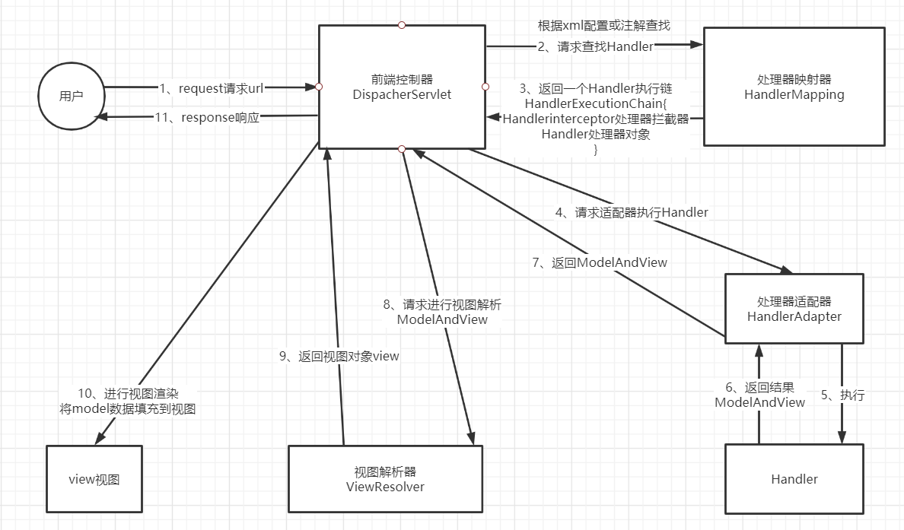
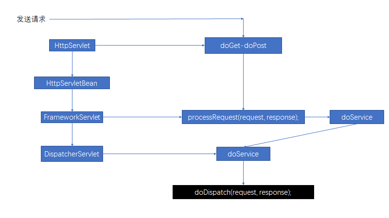
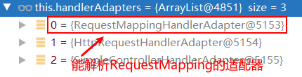

#  SpringMVC


## 请求流程图




## 代码执行流程图



## 请求细节

### doDispatch

```java
/*
处理向处理程序的实际分派。 处理程序将通过依次应用servlet的HandlerMappings获得。 通过查询servlet已安装HandlerAdapters 来找到第一个支持处理程序类的HandlerAdapter。 所有HTTP方法均由该方法处理。由HandlerAdapters或处理程序自己决定可接受的方法。
*/

protected void doDispatch(HttpServletRequest request, HttpServletResponse response) throws Exception {
   HttpServletRequest processedRequest = request;
   HandlerExecutionChain mappedHandler = null;
   boolean multipartRequestParsed = false;

   WebAsyncManager asyncManager = WebAsyncUtils.getAsyncManager(request);

   try {
      ModelAndView mv = null;
      Exception dispatchException = null;

      try {
         // 检查是否为文件上传请求
         processedRequest = checkMultipart(request);
         multipartRequestParsed = (processedRequest != request);

         // 确定处理当前请求的handler（Controller）
         // 即：根据当前请求url找到能处理的类
         // Determine handler for the current request.
         mappedHandler = getHandler(processedRequest);
         // 如果找不到能处理当前请求的类(Controller/Handler)则404或者抛异常
         if (mappedHandler == null) {
            
            noHandlerFound(processedRequest, response);
            return;
         }

         // 确定能执行当前请求的处理器适配器（RequestMappingHandlerAdapter）
         // Determine handler adapter for the current request.
         HandlerAdapter ha = getHandlerAdapter(mappedHandler.getHandler());

         // Process last-modified header, if supported by the handler.
         String method = request.getMethod();
         boolean isGet = "GET".equals(method);
         if (isGet || "HEAD".equals(method)) {
            long lastModified = ha.getLastModified(request, mappedHandler.getHandler());
            if (new ServletWebRequest(request, response).checkNotModified(lastModified) && isGet) {
               return;
            }
         }

         if (!mappedHandler.applyPreHandle(processedRequest, response)) {
            return;
         }

         // 处理器适配器来执行目标方法。处理器（Handler）/控制器（Controller）的方法被调用
         // 将目标方法执行完后的返回值作为视图名，设置保存到ModelAndView中
         // 无论目标方法内部如何工作，处理器适配器都会将执行完成之后的信息封装为ModelAndView
         // Actually invoke the handler.
         mv = ha.handle(processedRequest, response, mappedHandler.getHandler());

         // 判断当前方法是否是异步方法，如果是直接返回
         if (asyncManager.isConcurrentHandlingStarted()) {
            return;
         }

         // 如果没有视图名，则设置一个默认的视图名。即请求的路径名
         applyDefaultViewName(processedRequest, mv);
         mappedHandler.applyPostHandle(processedRequest, response, mv);
      }
      catch (Exception ex) {
         dispatchException = ex;
      }
      catch (Throwable err) {
         // As of 4.3, we're processing Errors thrown from handler methods as well,
         // making them available for @ExceptionHandler methods and other scenarios.
         dispatchException = new NestedServletException("Handler dispatch failed", err);
      }
      // 转发来到目标页面
      // 根据方法最终执行完成之后的ModelAndView转发到相应的页面，并且将ModelAndView中的数据封装到请求域中
      processDispatchResult(processedRequest, response, mappedHandler, mv, dispatchException);
   }
   catch (Exception ex) {
      triggerAfterCompletion(processedRequest, response, mappedHandler, ex);
   }
   catch (Throwable err) {
      triggerAfterCompletion(processedRequest, response, mappedHandler,
            new NestedServletException("Handler processing failed", err));
   }
   finally {
      if (asyncManager.isConcurrentHandlingStarted()) {
         // Instead of postHandle and afterCompletion
         if (mappedHandler != null) {
            mappedHandler.applyAfterConcurrentHandlingStarted(processedRequest, response);
         }
      }
      else {
         // Clean up any resources used by a multipart request.
         if (multipartRequestParsed) {
            cleanupMultipart(processedRequest);
         }
      }
   }
}
```


**总结**

1. 发送请求，DispatcherServlet收到请求
2. 调用doDispatch()处理请求
   1. `getHandler(processedRequest);`，返回一条执行链（HandlerExecutionChain）。根据当前请求地址找到能处理此请求的handler（对应的Controller类）。
   
      **根据当前请求，在HandlerMapping中找到这个请求的映射信息，获取目标处理器类**
   
   2. `getHandlerAdapter(mappedHandler.getHandler());`，返回（RequestMappingHandlerAdapter）。
   
      **根据获取到的目标处理器类，找到当前能执行当前处理器类的的处理器适配器HandlerAdapter**
   
   3. `mv = ha.handle(processedRequest, response, mappedHandler.getHandler());`调用处理器适配器的handler()方法利用反射执行目标方法
   
   4. 目标方法执行完成之后会返回一个ModelAndView对象
   
   5. 根据ModelAndView的信息转发到相应的页面，并将ModelAndView的信息封装到请求域中

### getHandler

怎么根据当前请求找到相应的类来处理？

getHandler()返回相应目标处理器的执行链

```java
protected HandlerExecutionChain getHandler(HttpServletRequest request) throws Exception {
    // HandlerMapping处理器映射器，保存了每个处理器（Handler）能处理哪些映射信息
    if (this.handlerMappings != null) {
      for (HandlerMapping mapping : this.handlerMappings) {
         HandlerExecutionChain handler = mapping.getHandler(request);
         if (handler != null) {
            return handler;
         }
      }
   }
   return null;
}
```

### getHandlerAdapter

如何找到目标处理器类的适配器？

需要用适配器来执行目标方法



```java
protected HandlerAdapter getHandlerAdapter(Object handler) throws ServletException {
   if (this.handlerAdapters != null) {
      for (HandlerAdapter adapter : this.handlerAdapters) {
         if (adapter.supports(handler)) {
            return adapter;
         }
      }
   }
   throw new ServletException("No adapter for handler [" + handler +
         "]: The DispatcherServlet configuration needs to include a HandlerAdapter that supports this handler");
}
```


### 九大组件初始化

> **何为九大组件？**
>
> SpringMVC 工作的时候的关键位置都是由这些组件完成的。
>
> 共同点：九大组件全部都是接口；接口就是规范，可自定义实现类，提供了强大的扩展性。


```java
/** MultipartResolver used by this servlet.
	文件上传解析器。与文件上传有关
*/
@Nullable
private MultipartResolver multipartResolver;

/** LocaleResolver used by this servlet.
	区域信息解析器。与国际化有关
*/
@Nullable
private LocaleResolver localeResolver;

/** ThemeResolver used by this servlet.
	主题解析器。实现主题效果更换
*/
@Nullable
private ThemeResolver themeResolver;

/** List of HandlerMappings used by this servlet.
	处理器映射器。
*/
@Nullable
private List<HandlerMapping> handlerMappings;

/** List of HandlerAdapters used by this servlet.
	处理器适配器。
*/
@Nullable
private List<HandlerAdapter> handlerAdapters;

/** List of HandlerExceptionResolvers used by this servlet.
	处理器异常解析器。与SpringMVC的异常解析功能有关
*/
@Nullable
private List<HandlerExceptionResolver> handlerExceptionResolvers;

/** RequestToViewNameTranslator used by this servlet.
	请求到视图名转换器。若没有跳转到的试图，则默认将请求地址转换为视图名
*/
@Nullable
private RequestToViewNameTranslator viewNameTranslator;

/** FlashMapManager used by this servlet.
	FlashMap管理器。SpringMVC中允许携带数据重定向功能。
	数据取出即销毁。
*/
@Nullable
private FlashMapManager flashMapManager;

/** List of ViewResolvers used by this servlet.
	视图解析器。
*/
@Nullable
private List<ViewResolver> viewResolvers;
```


**初始化细节**

有些组件在容器中是使用类型查找的，有些组件是根据ID查找的。

如果在容器中没有找到需要的组件，则使用默认配置的组件。

```java
/**
 * org.springframework.web.servlet.DispatcherServlet#initStrategies
 * 初始化此servlet使用的策略对象。可以在子类中重写，以初始化其他策略对象。
 * Initialize the strategy objects that this servlet uses.
 * <p>May be overridden in subclasses in order to initialize further strategy objects.
 */
protected void initStrategies(ApplicationContext context) {
   initMultipartResolver(context);
   initLocaleResolver(context);
   initThemeResolver(context);
   initHandlerMappings(context);
   initHandlerAdapters(context);
   initHandlerExceptionResolvers(context);
   initRequestToViewNameTranslator(context);
   initViewResolvers(context);
   initFlashMapManager(context);
}
```


```java
// 初始化HandlerMappings
private void initHandlerMappings(ApplicationContext context) {
   this.handlerMappings = null;

   // this.detectAllHandlerMappings默认为true
   if (this.detectAllHandlerMappings) {
      // 在ApplicationContext中查找所有HandlerMappings，包括父类上下文
      // Find all HandlerMappings in the ApplicationContext, including ancestor contexts.
      Map<String, HandlerMapping> matchingBeans =
            BeanFactoryUtils.beansOfTypeIncludingAncestors(context, HandlerMapping.class, true, false);
      if (!matchingBeans.isEmpty()) {
         this.handlerMappings = new ArrayList<>(matchingBeans.values());
         // We keep HandlerMappings in sorted order.
         AnnotationAwareOrderComparator.sort(this.handlerMappings);
      }
   }
   else {
      try {
         HandlerMapping hm = context.getBean(HANDLER_MAPPING_BEAN_NAME, HandlerMapping.class);
         this.handlerMappings = Collections.singletonList(hm);
      }
      catch (NoSuchBeanDefinitionException ex) {
         // Ignore, we'll add a default HandlerMapping later.
      }
   }

   // Ensure we have at least one HandlerMapping, by registering
   // a default HandlerMapping if no other mappings are found.
   if (this.handlerMappings == null) {
      this.handlerMappings = getDefaultStrategies(context, HandlerMapping.class);
      if (logger.isTraceEnabled()) {
         logger.trace("No HandlerMappings declared for servlet '" + getServletName() +
               "': using default strategies from DispatcherServlet.properties");
      }
   }
}
```


### 目标方法执行

```java
// org.springframework.web.servlet.mvc.method.annotation.RequestMappingHandlerAdapter#invokeHandlerMethod
@Nullable
protected ModelAndView invokeHandlerMethod(HttpServletRequest request,
      HttpServletResponse response, HandlerMethod handlerMethod) throws Exception {

   // 将原生的request, response包装成webRequest
   ServletWebRequest webRequest = new ServletWebRequest(request, response);
   try {
      // 获取参数绑定工厂
      WebDataBinderFactory binderFactory = getDataBinderFactory(handlerMethod);
      ModelFactory modelFactory = getModelFactory(handlerMethod, binderFactory);

      ServletInvocableHandlerMethod invocableMethod = createInvocableHandlerMethod(handlerMethod);
      if (this.argumentResolvers != null) {
         // 设置处理方法的参数解析器
         invocableMethod.setHandlerMethodArgumentResolvers(this.argumentResolvers);
      }
      if (this.returnValueHandlers != null) {
         // 设置处理方法的返回值处理器
         invocableMethod.setHandlerMethodReturnValueHandlers(this.returnValueHandlers);
      }
      // 设置参数绑定工厂
      invocableMethod.setDataBinderFactory(binderFactory);
      // 设置参数名的发现者
      invocableMethod.setParameterNameDiscoverer(this.parameterNameDiscoverer);

      ModelAndViewContainer mavContainer = new ModelAndViewContainer();
      mavContainer.addAllAttributes(RequestContextUtils.getInputFlashMap(request));
      modelFactory.initModel(webRequest, mavContainer, invocableMethod);
      mavContainer.setIgnoreDefaultModelOnRedirect(this.ignoreDefaultModelOnRedirect);

      AsyncWebRequest asyncWebRequest = WebAsyncUtils.createAsyncWebRequest(request, response);
      asyncWebRequest.setTimeout(this.asyncRequestTimeout);

      WebAsyncManager asyncManager = WebAsyncUtils.getAsyncManager(request);
      asyncManager.setTaskExecutor(this.taskExecutor);
      asyncManager.setAsyncWebRequest(asyncWebRequest);
      asyncManager.registerCallableInterceptors(this.callableInterceptors);
      asyncManager.registerDeferredResultInterceptors(this.deferredResultInterceptors);

      if (asyncManager.hasConcurrentResult()) {
         Object result = asyncManager.getConcurrentResult();
         mavContainer = (ModelAndViewContainer) asyncManager.getConcurrentResultContext()[0];
         asyncManager.clearConcurrentResult();
         LogFormatUtils.traceDebug(logger, traceOn -> {
            String formatted = LogFormatUtils.formatValue(result, !traceOn);
            return "Resume with async result [" + formatted + "]";
         });
         invocableMethod = invocableMethod.wrapConcurrentResult(result);
      }

      // 执行目标方法
      invocableMethod.invokeAndHandle(webRequest, mavContainer);
      if (asyncManager.isConcurrentHandlingStarted()) {
         return null;
      }

      return getModelAndView(mavContainer, modelFactory, webRequest);
   }
   finally {
      webRequest.requestCompleted();
   }
}
```


```java
public void invokeAndHandle(ServletWebRequest webRequest, ModelAndViewContainer mavContainer,
      Object... providedArgs) throws Exception {

   // 执行目标方法
   Object returnValue = invokeForRequest(webRequest, mavContainer, providedArgs);
   setResponseStatus(webRequest);

   if (returnValue == null) {
      if (isRequestNotModified(webRequest) || getResponseStatus() != null || mavContainer.isRequestHandled()) {
         disableContentCachingIfNecessary(webRequest);
         mavContainer.setRequestHandled(true);
         return;
      }
   }
   else if (StringUtils.hasText(getResponseStatusReason())) {
      mavContainer.setRequestHandled(true);
      return;
   }

   mavContainer.setRequestHandled(false);
   Assert.state(this.returnValueHandlers != null, "No return value handlers");
   try {
      this.returnValueHandlers.handleReturnValue(
            returnValue, getReturnValueType(returnValue), mavContainer, webRequest);
   }
   catch (Exception ex) {
      if (logger.isTraceEnabled()) {
         logger.trace(formatErrorForReturnValue(returnValue), ex);
      }
      throw ex;
   }
}
```