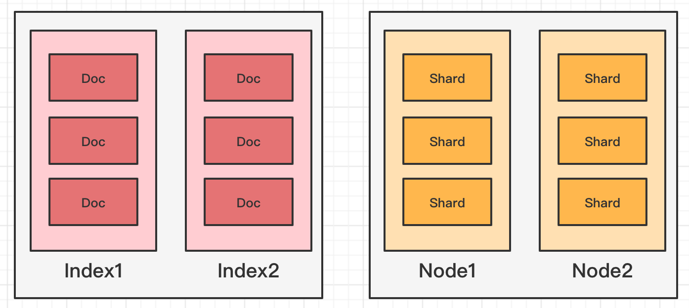

# ElasticSearch

## 前言

一般传统数据库，进行全文检索需要扫描整个表，如果数据量太大，即使对 SQL 的语法优化，效果也不明显。如果建立索引，维护起来也很麻烦，对于 insert 和 update 操作都会重新构建索引。

基于以上原因可以分析得出，在一些生产环境中，使用常规的搜索方式，性能是非常差的

- 搜索的数据对象是大量的非结构化的文本数据
- 文件记录量达到数十万或数百万个甚至更多
- 支持大量基于交互式文本的查询
- 需求非常灵活的全文搜索查询
- 对高度相关的搜索结果的有特殊需求，没有可用的关系数据库可以满足
- 对不同记录类型、非文本数据操作或安全事务处理的需求相对较少的情况。

为了解决结构化数据搜索和非结构化数据搜索性能问题，就需要专业，强大的全文搜索引擎

> 全文搜索引擎工作原理是通过扫描文章中的每一个词，对每一个词建立一个索引。指明该词在文章中出现的次数和位置，当用户查询时，检索程序就根据事先建立的索引进行查找，并将查找的结果反馈给用户的检索方式。类似于通过字典中的检索字表查字的过程。


<br>

## 概念

**数据存储结构**

| 关系型数据库 | ElasticSearch                         |
| ------------ | ------------------------------------- |
| Table        | Index                                 |
| Row          | Document                              |
| Columns      | Field                                 |
|              | Term 搜索的基本单位，如文本中的一个词 |
| Schema       | Mapping                               |
| SQL          | DSL                                   |


<br>

### 索引

> ElasticSearch 把数据存放到一个或者多个索引（indices）中，简单来说索引就是相似结构的文档集合。对比关系型数据库，创建索引就等同于创建数据库。
>
> ElasticSearch 会用到分片（shards）和备份（replicas）机制将一个索引（index）存储多份。

> **索引与文档**
>
> 一个索引中包含相同或者类似的文档，比如 goods 索引，包含各种不同的商品，可以是生活用品也可以是其他商品

> **索引结构**
>
> 索引的结构包括索引别名、索引的映射信息、索引的设置三部分
>
> * aliases，索引别名
> * mappings，用来描述文档包含的字段和字段类型
> * settings，索引的配置信息，比如索引的分片信息/索引副本信息/索引创建时间等

```json
{
  "goods": {
    "aliases": {},
    "mappings": {},
    "settings": {}
  }
}

{
  "goods": {
    "aliases": {},
    "mappings": {
      "properties": {
        "price": {
          "score": {
          	"type": "float"
        	}
        },
        "name": {
          "type": "text",
          "fields": {
            "keyword": {
              "type": "keyword",
              "ignore_above": 256
            }
          }
        }
      }
    },
    "settings": {
      "index": {
        "routing": {
          "allocation": {
            "include": {
              "_tier_preference": "data_content"
            }
          }
        },
        "number_of_shards": "1",
        "provided_name": "person",
        "creation_date": "1680100123619",
        "number_of_replicas": "1",
        "uuid": "7K7_IFlrQPOHohi81GytOw",
        "version": {
          "created": "7170999"
        }
      }
    }
  }
}
```


> **不同场景下索引的含义**
>
> 在 ES 中，索引是一类文档的集合，是名词；同时保存一个文档到 ES 的过程也叫索引（indexing）。抛开 ES 提到索引，可能是 **B 树索引或者是倒排索引**。倒排索引是 ES 中一个重要的数据结构


<br>

### 文档

> ES 是面向文档的，文档是主要的存在实体，是可搜索数据的最小单位

- 在 ES 中，文档会被序列化成 JSON 格式保存。JSON 对象由字段组成，其中每个字段都有对应的字段类型（字符串/数组/布尔/日期/二进制/范围类型）
- 在 ES 中，每个文档都有一个唯一的 ID，可以**自己指定 ID**，也可以通过 **ES 自动生成**
- JSON 每个字段都有对应的数据类型，ES 会自动进行数据类型推断，在 ES 中数据还支持**数组和嵌套**。

**ES 数据内容**

```json
{
    "_index" : "movies", # _index 代表文档所属的索引名
    "_type" : "_doc", # _type 表示文档所属的类型名
    "_id" : "2035", # _id 为文档唯一 id
    "_score" : 1.0, # _score 为相关性打分，是这个文档在这次查询中的算分
    "_source" : { # _source 为文档的原始 JSON 数据，搜索文档时默认返回的就是 _source 字段
        "title" : "Blackbeard's Ghost",
        "genre" : [
        "Children",
        "Comedy"
        ],
        "@version" : "1", # @version 为文档的版本信息，解决版本冲突的问题
    }
}
```


<br>

### 节点

> 每个 ES 实例都是一个节点，节点**本质上是一个 Java 进程**。一台机器上可以运行多个节点，但是生产环境一般建议一台机器上只运行一个节点，利于进行容灾备份

> **节点名称**
>
> 每个节点都有名字，节点名称很重要（方便运维管理操作），可以通过配置文件进行配置，或启动的时候添加环境变量 `-E node.name=node1` 指定名称。每一个节点在启动之后，会分配一个 UID，保存在 data 目录下

> **节点与集群**
>
> 节点默认会加入名为 elasticsearch 的集群，如果直接启动很多节点，它们会自动组成一个 elasticsearch 集群，当然一个节点也可以组成一个 elasticsearch 集群，称为单一节点集群



<br>

#### 节点分类

> **候选主节点和主节点**
>
> - 每一个节点启动后，默认就是一个候选主节点（Master-eligible Node），可以在配置文件中修改 `node.master: false` 禁止。候选主节点可以参加选主流程，成为主节点（Master Node）。当第一个节点启动时候，它会将自己选举成 Master 节点
> - 每个节点上都保存了集群的状态，但只有 Master 节点才能修改集群的状态信息。如果是任意节点都能修改信息，就会导致数据的不一致性

> **数据节点与协调节点**
>
> - 数据节点（Data Node），可以保存数据的节点。负责保存分片上存储的所有数据，当集群无法保存现有数据时，可以通过增加数据节点来解决存储上的问题
> - 协调节点（Coordinating Node），负责接收客户端请求，将请求分发到合适的节点。最终把结果汇集到一起返回给客户端，每个节点默认都起到了协调节点的职责

> **其他节点类型**
>
> - 冷热节点（Hot/Warm Node），降低集群部署的成本
>
>   热节点（Hot Node），配置高的节点，有更好的磁盘吞吐量和 CPU；
>
>   冷节点（Warm Node），存储旧数据，节点的机器配置会比较低。
>
> - 机器学习节点（Machine Learning Node），负责执行机器学习任务
>
> - 部落节点（Tribe Node），连接不同的 ES 集群
>
> - 预处理节点（Ingest Node）
>
>   预处理操作允许在索引文档之前（写入数据之前），通过事先定义好的一系列的 processors（处理器）和 pipeline（管道），对数据进行转换、加工

<br>

#### 节点类型配置

> 开发环境中，一个节点可以承担多种角色；生产环境中，应该设置单一的角色的节点（dedicated node）

| 节点类型          | 配置参数    | 默认值                             |
| ----------------- | ----------- | ---------------------------------- |
| master-eligible   | node.master | true                               |
| data              | node.data   | true                               |
| ingest            | node.ingest | true                               |
| coordinating only | 无          | 每个节点默认都是 coordinating 节点 |
| machine learning  | node.ml     | true                               |


<br>

### 集群

> ES 集群其实是一个分布式系统，要满足高可用性。需要保证当集群中有节点服务停止响应的时候，整个服务还能正常工作，即**服务可用性**；整个集群中有部分节点丢失的情况下，不会有数据丢失，即**数据可用性**。

> **集群的作用**
>
> 当用户的请求量越来越高，数据的增长越来越多的时候，系统需要把数据分散到其他节点上，实现水平扩展。当集群中有节点出现问题的时候，整个集群的服务也不会受到影响
>
> **集群命名**
>
> 不同的集群是通过不同的名字来区分的，默认的名字为 elasticsearch，可以在配置文件中进行修改，或者在命令行中使用 `-E cluster.name=customName` 设定，一个集群可以有一个或多个节点

> **集群健康状态**
>
> * Green 主分片与副本都正常分配
>
> * Yellow 主分片全部正常分配，有副本分片未能正常分配
>
> * Red 有主分片未能分配。例如，当服务器的磁盘容量超过 85% 时，去创建了一个新的索引

> 集群状态信息（Cluster State），维护一个集群中必要的信息，其中的信息只能由 master 节点进行修改。
>
> 主要包括
>
> * 所有的节点信息
>
> * 所有的索引和其相关的 mapping 与 setting 信息
>
> * 分片的路由信息


<br>

### 分片

> 由于单台机器无法存储大量数据，ES 可以将一个索引中的数据切分为多个分片（Shard），分布在多台服务器上存储。
>
> 有了分片就可以横向扩展，存储更多数据，让搜索和分析等操作分布到多台服务器上去执行，提升吞吐量和性能。分片（Shard）体现的是物理空间的概念，索引中的数据是分散在分片上的。

> 一个 ES 索引可以切分成多个分片，一个分片是一个 **Lucene 索引**。它本身就是一个完整的搜索引擎，可以独立执行建立索引和搜索任务。**Lucene 索引又由很多分段组成，每个分段都是一个倒排索引。**ES 每次 refresh 都会生成一个新的分段，其中包含若干文档的数据。在每个分段内部，文档的不同字段被单独建立索引。**每个字段的值由若干词（Term）组成，Term 是原文本内容经过分词器处理和语言处理后的最终结果**（例如，去除标点符号和转换为词根）


<br>

> 分片分为两类，一类为**主分片（Primary Shard）**，另一类为**副本分片（Replica Shard）**

- 主分片主要用以**解决水平扩展**的问题，通过主分片，就可以将数据分布到集群上的所有节点上，一个主分片就是一个运行的 Lucene 实例，当我们在创建 ES 索引的时候，可以指定分片数，但是**主分片数在索引创建时指定，后续不允许修改，除非使用 Reindex 进行修改**
- 副本分片用以**解决数据高可用**的问题，也就是说集群中有节点出现硬件故障的时候，通过副本的方式，也可以保证数据不会产生真正的丢失，因为副本分片是主分片的拷贝，在索引中副本分片数可以动态调整，通过增加副本数，可以在一定程度上提高服务查询的性能（读取的吞吐）

<br>

**为索引设置主分片和副本分片**

```json
PUT /blogs
{
    "settings" :{
        "number_of_shards" : 3, # 表示主分片数为 3
        "number_of_repicas" : 1 # 表示副本只有 1 份
    }
}
```

<br>

#### 分片的设定

> 分片的设定在生产环境中是十分重要的，很多时候需要提前做好容量规划，因为主分片在索引创建的时候需要预先设定的，并且在事后无法修改

在前面的例子中，一个索引被分成了 3 个主分片，这个集群即便增加再多节点，索引也只能分散在 3 个节点上

<br>

分片设置过大的时候，也会带来副作用，一方面来说会**影响搜索结果的打分**，影响统计结果的准确性，另外，单个节点上过多的分片，也会**导致资源浪费，同时也会影响性能**。从 7.0 版本开始，ES 的默认主分片数设置从 5 改为了 1，从这个方面也可以解决 over-sharding 的问题

<br>

### REST API

- GET
- PUT
- POST
- DELETE
- HEAD


<br>

## 操作

**Docker**

```shell
# es

# 1、拉取镜像
docker pull elasticsearch:7.6.2
# 2、创建挂载的目录
mkdir -p /mydata/elasticsearch/config
mkdir -p /mydata/elasticsearch/data
# 3、创建配置文件
echo "http.host: 0.0.0.0" >> /mydata/elasticsearch/config/elasticsearch.yml
# 4、创建容器并启动，单节点启动
# 9300 端口为 Elasticsearch 集群间组件的通信端口， 9200 端口为浏览器访问的 http协议 RESTful 端口
docker run -d --name es --net esnet -p 9200:9200 -p 9300:9300 -e "discovery.type=single-node" -e ES_JAVA_OPTS="-Xms256m -Xmx256m" -v ~/Workspace/Docker/es/elasticsearch.yml:/usr/share/elasticsearch/config/elasticsearch.yml elasticsearch:7.17.9

docker run --name es -p 9200:9200 -p 9300:9300  -e "discovery.type=single-node" -e ES_JAVA_OPTS="-Xms256m -Xmx256m" -v /mydata/elasticsearch/config/elasticsearch.yml:/usr/share/elasticsearch/config/elasticsearch.yml -v /mydata/elasticsearch/data:/usr/share/elasticsearch/data -v /mydata/elasticsearch/plugins:/usr/share/elasticsearch/plugins -d elasticsearch:7.6.2

# elasticsearch.yml 是挂载的配置文件
# data 是挂载的数据
# plugins 是 es 的插件，如ik，数据挂载需要权限，需要设置data文件的权限为可读可写,需要下边的指令。
# -e "discovery.type=single-node" 设置为单节点
# -e ES_JAVA_OPTS="-Xms256m -Xmx256m" \ 测试环境下，设置ES的初始内存和最大内存，否则导致过大启动不了ES

# 访问 http://localhost:9200 查看es启动情况
```

```shell
# kibana

# 1、拉取镜像
docker pull kibana:7.6.2

# 2、创建容器并启动
docker run --name kibana -e ELASTICSEARCH_HOSTS=http://IP地址:9200 -p 5601:5601 -d kibana:7.6.2

# 查看kibana启动日志
docker logs kibana

# 3、进入kibana容器修改相应内容
# 修改docker内kibana的配置文件 kibana/config/kibana.yml
docker exec -it kibana bash
cd config
cp kibana.yml kibana.yml.bak

vi kibana.yml
server.port: 5601
server.host: 0.0.0.0
elasticsearch.hosts: [ "http://公网IP地址:9200" ]
i18n.locale: "Zh-CN"

# 4、重启kibana

# 5、访问页面
# http://IP地址:5601/app/kibana
```


### 基本操作

#### 节点操作

```json
# 查看 cat 能进行的操作
GET _cat

# 查看所有节点
GET _cat/nodes

# 查看健康状态
GET _cat/health
```

#### 索引操作

```json
# 查看所有索引
GET _cat/indices

# 查看所有索引信息
GET /_all

# add
# 创建一个名为customer的索引
# pretty要求返回一个漂亮的json结果
PUT /customer?pretty

# update
POST

# delete
DELETE

# 判断索引是否存在
HEAD /indexName
```

#### 文档操作

> 在 Elasticsearch 中，_create 和 _doc 是两种不同的文档创建方式，其区别如下：
>
> 1. `_create` 创建文档时，如果已经存在具有相同 ID 的文档，则会抛出异常，因此 `_create` 操作会要求文档必须不存在才能执行，否则会失败。而 `_doc` 则是直接创建文档，如果已经存在具有相同 ID 的文档，则会覆盖原有文档
> 2. `_create` 创建文档时，如果不存在对应的索引，则会自动创建索引，而 `_doc` 则不会自动创建索引，需要在创建文档之前先创建好对应的索引
>
> 一般来说，`_create` 和 `_doc` 操作适用于不同的场景。`_create` 更适用于幂等操作，保证一个 ID 只会创建一次，常用于索引建立时的初始化工作。`_doc` 则更适用于实际业务场景，常用于文档的新增、修改等操作。

 ```json
 # 创建文档
 POST /phone/_doc
 {
   "brand": "xiaomi",
   "title": "xiaomi Mi6",
   "price": 1999.00
 }
 
 # 创建指定Id文档
 POST /phone/_doc/1
 {
   "brand": "xiaomi",
   "title": "xiaomi Mi6",
   "price": 1999.00
 }
 
 # 查找指定id文档
 GET phone/_doc/1
 
 # 查找指定index下的所有数据
 GET phone/_search
 
 # 局部更新
 POST /phone/_update/1
 {
   "doc": {
     "brand": "XiaoMi",
     "title": "XiaoMi Mi6"
   }
 }
 
 # 删除
 DELETE phone/_doc/1
 ```


### 查询操作

#### 条件查询

```json
# URL带参查询
GET phone/_search?q=brand:小米

# 请求体带参查询
GET phone/_search
{
  "query": {
    "match": {
      "category": "小米"
    }
  }
}

# 请求体带参查询所有
GET phone/_search
{
  "query": {
    "match_all": {}
  }
}

# 查询指定字段
GET phone/_search
{
	"query":{
		"match_all":{}
	},
	"_source":["title"]
}
```

#### 分页查询

```json
GET phone/_search
{
	"query":{
		"match_all":{}
	},
	"from":0,
	"size":2
}
```

#### 排序查询

```json
GET phone/_search
{
	"query":{
		"match_all":{}
	},
	"sort":{
		"price":{ # 根据price字段排序
			"order":"desc"
		}
	}
}
```

#### 多条件/范围查询

```json
GET phone/_search
{
	"query":{
		"bool":{
			"must":[{ # must 相当于 &&
				"match":{
					"category":"小米"
				}
			},
			{
				"match":{
					"price":3999.00
				}
			}]
		}
	}
}

GET phone/_search
{
	"query":{
		"bool":{
			"should":[{ # should 相当于 ||
				"match":{
					"category":"小米"
				}
			},{
				"match":{
					"category":"华为"
				}
			}]
		},
        "filter":{
            "range":{ # range 范围查询
                "price":{
                    "gt":2000 # greater than
                }
            }
        }
	}
}
```

#### 完全匹配

```json
GET phone/_search
{
	"query":{
		"match_phrase":{
			"category" : "小"
		}
	}
}
```

#### 高亮查询

```json
GET phone/_search
{
	"query":{
		"match_phrase":{
			"category" : "小"
		}
	},
    "highlight":{
        "fields":{
            "category":{}
    }
  }
}
```

#### 聚合查询

> 聚合允许使用者对ES文档进行统计分析，类似与关系型数据库中的 group by，还有很多其他的聚合，例如取最大值max、平均值avg等

```json
# 以price聚合查询，查询结果附带原始数据
GET phone/_search
{
	"aggs":{
		"price_group":{
			"terms":{
				"field":"price"
			}
		}
	}
}

# 不附带原始数据
GET phone/_search
{
	"aggs":{
		"price_group":{
			"terms":{
				"field":"price"
			}
		}
	},
    "size":0
}
```


### 映射关系

```json
# 创建索引
PUT /user

# 创建映射
PUT /user/_mapping
{
    "properties": {
        "name":{
        	"type": "text", # 可进行模糊查询
        	"index": true
        },
        "sex":{
        	"type": "keyword", # 必须全文匹配才有结果
        	"index": true
        },
        "tel":{
        	"type": "keyword",
        	"index": false # 
        }
    }
}

# 查询映射
GET user/_mapping
```


<br>

## 集群

> 单台 Elasticsearch 服务器提供服务，往往都有最大的负载能力，超过这个阈值，服务器性能就会大大降低甚至不可用，所以生产环境中，一般都是运行在指定服务器集群中

单点服务器存在的问题：

- 单台机器存储容量有限
- 单服务器容易出现单点故障，无法实现高可用
- 单服务的并发处理能力有限


> 一个 ElasticSearch 集群有一个唯一的名字标识，这个名字默认就是 elasticsearch。这个名字是很重要的，因为一个节点只能通过指定某个集群的名字，来加入这个集群


<br>

## Java API

**依赖**

```xml
<dependencies>
    <dependency>
        <groupId>org.elasticsearch</groupId>
        <artifactId>elasticsearch</artifactId>
        <version>7.6.2</version>
    </dependency>

    <!-- elasticsearch 的客户端 -->
    <dependency>
        <groupId>org.elasticsearch.client</groupId>
        <artifactId>elasticsearch-rest-high-level-client</artifactId>
        <version>7.6.2</version>
    </dependency>

    <!-- elasticsearch 依赖 2.x 的 log4j -->
    <dependency>
        <groupId>org.apache.logging.log4j</groupId>
        <artifactId>log4j-api</artifactId>
        <version>2.8.2</version>
    </dependency>
    <dependency>
        <groupId>org.apache.logging.log4j</groupId>
        <artifactId>log4j-core</artifactId>
        <version>2.8.2</version>
    </dependency>
    <dependency>
        <groupId>com.fasterxml.jackson.core</groupId>
        <artifactId>jackson-databind</artifactId>
        <version>2.9.9</version>
    </dependency>

    <!-- junit 单元测试 -->
    <dependency>
        <groupId>junit</groupId>
        <artifactId>junit</artifactId>
        <version>4.13</version>
    </dependency>
</dependencies>
```

**代码**

```java
public class ESIndexTest {

    private RestHighLevelClient restHighLevelClient = null;

    // 建立连接
    @Before
    public void init() {
        // 创建客户端对象
        restHighLevelClient = new RestHighLevelClient(
                RestClient.builder(new HttpHost("localhost", 9200, "http"))
        );
    }

    // 创建索引
    @Test
    public void addIndexTest() throws IOException {

          // 创建索引
          // CreateIndexRequest createIndexRequest = new CreateIndexRequest("user");
          // 发送请求，获取响应
          // CreateIndexResponse response = restHighLevelClient.indices().create(createIndexRequest, RequestOptions.DEFAULT);
          // boolean acknowledged = response.isAcknowledged();
          // Assert.assertTrue(acknowledged);

        // 查询索引
        // GetIndexRequest getIndexRequest = new GetIndexRequest("user", "phone");
        // GetIndexResponse response = restHighLevelClient.indices().get(getIndexRequest, RequestOptions.DEFAULT);

        // 删除索引
        // DeleteIndexRequest deleteIndexRequest = new DeleteIndexRequest("user");
        // restHighLevelClient.indices().delete(deleteIndexRequest, RequestOptions.DEFAULT);

        restHighLevelClient.close();
    }
}
```

```java
public class DocTest {

    // 文档 crud 操作
    @Test
    public void documentTest() throws IOException {
        ElasticSearchConnector.connect(client -> {
            IndexRequest indexRequest = new IndexRequest();

            // 设置索引及唯一性标识
            indexRequest.index("user").id("1001");

            User user = User.builder().name("zhangsan").gender("male").age(20).build();

            ObjectMapper objectMapper = new ObjectMapper();
            String userStr = objectMapper.writeValueAsString(user);

            // 添加文档数据，数据格式为 JSON 格式
            indexRequest.source(userStr, XContentType.JSON);

            // 新增
            IndexResponse response = client.index(indexRequest, RequestOptions.DEFAULT);
            // 修改
            // client.update(indexRequest, RequestOptions.DEFAULT);
            // 查询
            // client.get(indexRequest, RequestOptions.DEFAULT);
            // 删除
            // client.delete(indexRequest, RequestOptions.DEFAULT);

            System.out.println(response.getIndex());
            System.out.println(response.getId());
            System.out.println(response.getResult());

        });

    }

    // 批量操作
    @Test
    public void bulkTest() throws IOException {
        ElasticSearchConnector.connect(client -> {
            BulkRequest bulkRequest = new BulkRequest();

            // 批量新增
            bulkRequest
                    .add(new IndexRequest().index("user").id("1002").source(XContentType.JSON, "name","lisi"))
                    .add(new IndexRequest().index("user").id("1003").source(XContentType.JSON, "name","wangwu"))
                    .add(new IndexRequest().index("user").id("1003").source(XContentType.JSON, "name","zhaoliu"));

            BulkResponse response = client.bulk(bulkRequest, RequestOptions.DEFAULT);

            // 批量删除
//            bulkRequest
//                    .add(new DeleteRequest().index("user").id("1001"))
//                    .add(new DeleteRequest().index("user").id("1002"));

            System.out.println(response.getTook());
            System.out.println(response.getItems());

        });

    }

    // 查询索引下的所有数据
    @Test
    public void queryIndexAllTest() throws IOException {
        ElasticSearchConnector.connect(client -> {

            SearchRequest request = new SearchRequest();
            request.indices("user");
            // 构建查询的请求体
            SearchSourceBuilder sourceBuilder = new SearchSourceBuilder();
            // 查询所有数据
            sourceBuilder.query(QueryBuilders.matchAllQuery());
            request.source(sourceBuilder);
            SearchResponse response = client.search(request, RequestOptions.DEFAULT);
            // 查询匹配
            SearchHits hits = response.getHits();
            System.out.println("took:" + response.getTook());
            System.out.println("timeout:" + response.isTimedOut());
            System.out.println("total:" + hits.getTotalHits());
            System.out.println("MaxScore:" + hits.getMaxScore());
            System.out.println("hits========>>");
            for (SearchHit hit : hits) {
                //输出每条查询的结果信息
                System.out.println(hit.getSourceAsString());
            }
            System.out.println("<<========");

        });
    }

    // 条件查询
    @Test
    public void conditionQueryTest() throws IOException {

        ElasticSearchConnector.connect(client -> {
            // 创建搜索请求对象
            SearchRequest request = new SearchRequest();
            request.indices("user");
            // 构建查询的请求体
            SearchSourceBuilder sourceBuilder = new SearchSourceBuilder();
            sourceBuilder.query(QueryBuilders.termQuery("name", "lisi"));
            request.source(sourceBuilder);
            SearchResponse response = client.search(request, RequestOptions.DEFAULT);
            // 查询匹配
            SearchHits hits = response.getHits();
            System.out.println("took:" + response.getTook());
            System.out.println("timeout:" + response.isTimedOut());
            System.out.println("total:" + hits.getTotalHits());
            System.out.println("MaxScore:" + hits.getMaxScore());
            System.out.println("hits========>>");
            for (SearchHit hit : hits) {
                //输出每条查询的结果信息
                System.out.println(hit.getSourceAsString());
            }
            System.out.println("<<========");
        });

    }

    // 分页查询
    @Test
    public void queryByPageTest() throws IOException {
        ElasticSearchConnector.connect(client -> {
            // 创建搜索请求对象
            SearchRequest request = new SearchRequest();
            request.indices("user");
            // 构建查询的请求体
            SearchSourceBuilder sourceBuilder = new SearchSourceBuilder();
            sourceBuilder.query(QueryBuilders.matchAllQuery());
            // 分页查询
            // 当前页其实索引(第一条数据的顺序号)， from
            sourceBuilder.from(0);

            // 每页显示多少条 size
            sourceBuilder.size(2);
            request.source(sourceBuilder);
            SearchResponse response = client.search(request, RequestOptions.DEFAULT);
            // 查询匹配
            SearchHits hits = response.getHits();
            System.out.println("took:" + response.getTook());
            System.out.println("timeout:" + response.isTimedOut());
            System.out.println("total:" + hits.getTotalHits());
            System.out.println("MaxScore:" + hits.getMaxScore());
            System.out.println("hits========>>");
            for (SearchHit hit : hits) {
                //输出每条查询的结果信息
                System.out.println(hit.getSourceAsString());
            }
            System.out.println("<<========");
        });
    }

    // 查询排序
    @Test
    public void queryByOrderTest() throws IOException {
        ElasticSearchConnector.connect(client -> {
            // 创建搜索请求对象
            SearchRequest request = new SearchRequest();
            request.indices("user");

            // 构建查询的请求体
            SearchSourceBuilder sourceBuilder = new SearchSourceBuilder();
            sourceBuilder.query(QueryBuilders.matchAllQuery());
            // 排序
            sourceBuilder.sort("age", SortOrder.ASC);
            request.source(sourceBuilder);
            SearchResponse response = client.search(request, RequestOptions.DEFAULT);
            // 查询匹配
            SearchHits hits = response.getHits();
            System.out.println("took:" + response.getTook());
            System.out.println("timeout:" + response.isTimedOut());
            System.out.println("total:" + hits.getTotalHits());
            System.out.println("MaxScore:" + hits.getMaxScore());
            System.out.println("hits========>>");
            for (SearchHit hit : hits) {
                //输出每条查询的结果信息
                System.out.println(hit.getSourceAsString());
            }
            System.out.println("<<========");
        });
    }

    @Test
    public void combineQueryTest() throws IOException {
        ElasticSearchConnector.connect(client -> {
            // 创建搜索请求对象
            SearchRequest request = new SearchRequest();
            request.indices("user");
            // 构建查询的请求体
            SearchSourceBuilder sourceBuilder = new SearchSourceBuilder();
            BoolQueryBuilder boolQueryBuilder = QueryBuilders.boolQuery();
            // 必须包含
            boolQueryBuilder.must(QueryBuilders.matchQuery("age", "20"));
            // 一定不含
            boolQueryBuilder.mustNot(QueryBuilders.matchQuery("name", "lisi"));
            // 可能包含
            boolQueryBuilder.should(QueryBuilders.matchQuery("sex", "male"));
            sourceBuilder.query(boolQueryBuilder);
            request.source(sourceBuilder);
            SearchResponse response = client.search(request, RequestOptions.DEFAULT);
            // 查询匹配
            SearchHits hits = response.getHits();
            System.out.println("took:" + response.getTook());
            System.out.println("timeout:" + response.isTimedOut());
            System.out.println("total:" + hits.getTotalHits());
            System.out.println("MaxScore:" + hits.getMaxScore());
            System.out.println("hits========>>");
            for (SearchHit hit : hits) {
                //输出每条查询的结果信息
                System.out.println(hit.getSourceAsString());
            }
            System.out.println("<<========");
        });
    }

    // 范围查询
    @Test
    public void rangeQueryTest() throws IOException {
        ElasticSearchConnector.connect(client -> {
            // 创建搜索请求对象
            SearchRequest request = new SearchRequest();
            request.indices("user");
            // 构建查询的请求体
            SearchSourceBuilder sourceBuilder = new SearchSourceBuilder();
            RangeQueryBuilder rangeQuery = QueryBuilders.rangeQuery("age");
            // 大于等于
            //rangeQuery.gte("30");
            // 小于等于
            rangeQuery.lte("40");
            sourceBuilder.query(rangeQuery);
            request.source(sourceBuilder);
            SearchResponse response = client.search(request, RequestOptions.DEFAULT);
            // 查询匹配
            SearchHits hits = response.getHits();
            System.out.println("took:" + response.getTook());
            System.out.println("timeout:" + response.isTimedOut());
            System.out.println("total:" + hits.getTotalHits());
            System.out.println("MaxScore:" + hits.getMaxScore());
            System.out.println("hits========>>");
            for (SearchHit hit : hits) {
                //输出每条查询的结果信息
                System.out.println(hit.getSourceAsString());
            }
            System.out.println("<<========");
        });
    }

    // 模糊查询
    @Test
    public void fuzzyQueryTest() throws IOException {
        ElasticSearchConnector.connect(client -> {
            // 创建搜索请求对象
            SearchRequest request = new SearchRequest();
            request.indices("user");
            // 构建查询的请求体
            SearchSourceBuilder sourceBuilder = new SearchSourceBuilder();
            sourceBuilder.query(QueryBuilders.fuzzyQuery("name","lisi").fuzziness(Fuzziness.ONE));
            request.source(sourceBuilder);
            SearchResponse response = client.search(request, RequestOptions.DEFAULT);
            // 查询匹配
            SearchHits hits = response.getHits();
            System.out.println("took:" + response.getTook());
            System.out.println("timeout:" + response.isTimedOut());
            System.out.println("total:" + hits.getTotalHits());
            System.out.println("MaxScore:" + hits.getMaxScore());
            System.out.println("hits========>>");
            for (SearchHit hit : hits) {
                //输出每条查询的结果信息
                System.out.println(hit.getSourceAsString());
            }
            System.out.println("<<========");
        });
    }

    // 高亮查询
    @Test
    public void highlightQueryTest() throws IOException {
        ElasticSearchConnector.connect(client -> {
            // 高亮查询
            SearchRequest request = new SearchRequest().indices("user");
            //2.创建查询请求体构建器
            SearchSourceBuilder sourceBuilder = new SearchSourceBuilder();
            //构建查询方式：高亮查询
            TermsQueryBuilder termsQueryBuilder =
                    QueryBuilders.termsQuery("name","zhangsan");
            //设置查询方式
            sourceBuilder.query(termsQueryBuilder);
            //构建高亮字段
            HighlightBuilder highlightBuilder = new HighlightBuilder();
            highlightBuilder.preTags("<font color='red'>");//设置标签前缀
            highlightBuilder.postTags("</font>");//设置标签后缀
            highlightBuilder.field("name");//设置高亮字段
            //设置高亮构建对象
            sourceBuilder.highlighter(highlightBuilder);
            //设置请求体
            request.source(sourceBuilder);
            //3.客户端发送请求，获取响应对象
            SearchResponse response = client.search(request, RequestOptions.DEFAULT);
            //4.打印响应结果
            SearchHits hits = response.getHits();
            System.out.println("took::"+response.getTook());
            System.out.println("time_out::"+response.isTimedOut());
            System.out.println("total::"+hits.getTotalHits());
            System.out.println("max_score::"+hits.getMaxScore());
            System.out.println("hits::::>>");
            for (SearchHit hit : hits) {
                String sourceAsString = hit.getSourceAsString();
                System.out.println(sourceAsString);
                //打印高亮结果
                Map<String, HighlightField> highlightFields = hit.getHighlightFields();
                System.out.println(highlightFields);
            }
            System.out.println("<<::::");
        });
    }

    // 查询最大值
    @Test
    public void maxValueQueryTest() throws IOException {
        ElasticSearchConnector.connect(client -> {
            // 高亮查询
            SearchRequest request = new SearchRequest().indices("user");
            SearchSourceBuilder sourceBuilder = new SearchSourceBuilder();
            sourceBuilder.aggregation(AggregationBuilders.max("maxAge").field("age"));
            //设置请求体
            request.source(sourceBuilder);
            //3.客户端发送请求，获取响应对象
            SearchResponse response = client.search(request, RequestOptions.DEFAULT);
            //4.打印响应结果
            SearchHits hits = response.getHits();
            System.out.println(response);
        });
    }

    // 分组查询
    @Test
    public void queryByGroup() throws IOException {
        ElasticSearchConnector.connect(client -> {
            SearchRequest request = new SearchRequest().indices("user");
            SearchSourceBuilder sourceBuilder = new SearchSourceBuilder();
            sourceBuilder.aggregation(AggregationBuilders.terms("age_groupby").field("age"));
            //设置请求体
            request.source(sourceBuilder);
            //3.客户端发送请求，获取响应对象
            SearchResponse response = client.search(request, RequestOptions.DEFAULT);
            //4.打印响应结果
            SearchHits hits = response.getHits();
            System.out.println(response);
        });
    }

}
```


<br>

## SpringBoot 集成

**依赖**

```xml
<dependencies>
    <!-- es -->
    <dependency>
        <groupId>org.springframework.boot</groupId>
        <artifactId>spring-boot-starter-data-elasticsearch</artifactId>
    </dependency>

    <dependency>
        <groupId>org.projectlombok</groupId>
        <artifactId>lombok</artifactId>
        <optional>true</optional>
    </dependency>

    <dependency>
        <groupId>junit</groupId>
        <artifactId>junit</artifactId>
        <version>4.13.2</version>
        <scope>test</scope>
    </dependency>
    <dependency>
        <groupId>org.springframework.boot</groupId>
        <artifactId>spring-boot-starter-test</artifactId>
        <scope>test</scope>
    </dependency>
</dependencies>
```

**配置**

```yaml
server:
  port: 8888

spring:
  application:
    name: demo-es-boot
  data:
    elasticsearch:
      repositories:
        enabled: true
  elasticsearch:
    rest:
      uris: http://localhost:9200
```

**代码**

```java
// 实体类
@Data
@ToString
@NoArgsConstructor
@AllArgsConstructor
@Builder
@Document(indexName = "user")
public class User implements Serializable {
    private static final long serialVersionUID = 1L;

    @Id
    private Long id;

    @Field(type = FieldType.Text)
    private String name;
    private Integer age;
    private String gender;

}

// elasticsearch repository类
public interface UserRepository extends ElasticsearchRepository<User, Long> {
    User findUserByName(String name);
}

// 单元测试类
@RunWith(SpringRunner.class)
@SpringBootTest
public class ServiceTest {

    @Resource
    private UserRepository userRepository;

    @Autowired
    private UserService userService;

    @Test
    public void test02() {
        Iterable<User> users = userRepository.findAll();
        for (User user : users) {
            System.out.println(user.toString());
        }
    }

    @Autowired
    ElasticsearchRestTemplate esTemplate;

    @Test
    public void test03() {
        User user = User.builder().name("wangwu").id(12L).age(21).gender("male").build();
        esTemplate.save(user);
    }

    @Test
    public void test04() {
        MatchQueryBuilder matchQuery = QueryBuilders.matchQuery("gender", "male");
        NativeSearchQuery query = new NativeSearchQueryBuilder().withQuery(matchQuery).build();
        long count = esTemplate.count(query, User.class);
        System.out.println(count);
    }
}
```


<br>

## 参考

[ 一篇文章带你搞定 ElasticSearch 术语 ](https://mp.weixin.qq.com/s/tsoBovXDcB02KxvWu2_SpQ)

[Elasticsearch 学习笔记](https://blog.csdn.net/u011863024/article/details/115721328)

[ElasticSearch 操作整理](https://segmentfault.com/a/1190000042059652)

