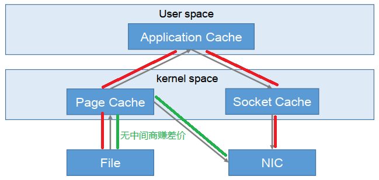

#  Kafka


## 概述

> Kafka 是一个分布式的基于发布/订阅模式的消息队列（Message Queue），主要应用于大数据实时处理领域


**优点**

- 解耦
- 异步
- 削峰


### 消费模式

#### 点对点

> 消费者主动拉取数据，消息收到后被清除

生产者生产消息发送到Queue，消费者从Queue中取出并消费消息。消息被消费后，Queue中不再有存储，所以消息消费者不可能消费到已经被消费的消息。Queue支持存在多个消费者，但是对一个消息而言，只会有一个消费者可以消费。


#### 发布/订阅模式

> 一对多，消息被消费后不会被清除

消息生产者将消息发布到Topic中，同时有多个消息消费者（订阅）消费该消息。和点对点方式不同，发布到Topic的消息会被所有订阅者消费。


### 基础架构

- **Producer**，消息生产者
- **Consumer**，消息消费者，向Broker取消息
- **Consumer Group（CG）**，消费者组，由多个Consumer组成。==消费者组内每个消费者负责消费不同分区的数据，一个分区只能由一个组内消费者消费。消费者组之间互不影响。==所有的消费者都属于某个消费者组，消费者组是逻辑上的一个订阅者
- **Broker**，一台Kafka服务器就是一个Broker。一个集群由多个Broker组成。一个Broker可以容纳多个Topic。
- **Topic**，话题，可以理解为一个队列，生产者和消费者面向的都是一个Topic
- **Partition**，为了实现扩展性，一个非常大的Topic可以分布到多个Broker（即服务器）上，一个Topic可以分为多个Partition，每个Partition是一个有序的队列
- **Replica**，副本（Replication），为保证集群中的某个节点发生故障时，该节点上的Partition数据不丢失，且Kafka仍然能够继续工作，Kafka提供了副本机制，一个Topic的每个分区都有若干个副本，一个Leader和若干个follower
- **Leader**，每个分区多个副本的“主”，生产者发送数据的对象，以及消费者消费数据的对象都是Leader
- **Follower**，每个分区多个副本中的“从”，实时从Leader中同步数据，保持和Leader数据的同步。Leader发生故障时，某个Follower会成为新的Leader


## 使用


### 启动

**Docker**

```shell
docker pull wurstmeister/zookeeper
docker pull wurstmeister/kafka
# 先启动zk
docker run -d --name zookeeper -p 2181:2181 -t wurstmeister/zookeeper
# 启动kafka
docker run  -d --name kafka -p 9092:9092 -e KAFKA_BROKER_ID=0 -e KAFKA_ZOOKEEPER_CONNECT=IP地址:2181 -e KAFKA_ADVERTISED_LISTENERS=PLAINTEXT://IP地址:9092 -e KAFKA_LISTENERS=PLAINTEXT://0.0.0.0:9092 -t wurstmeister/kafka
# -e KAFKA_BROKER_ID=0 在kafka集群中，每个kafka都有一个BROKER_ID来区分自己
# -e KAFKA_ZOOKEEPER_CONNECT=IP地址:2181 配置zookeeper管理kafka的路径
# -e KAFKA_ADVERTISED_LISTENERS=PLAINTEXT://IP地址:9092 把kafka的地址端口注册给zookeeper
# -e KAFKA_LISTENERS=PLAINTEXT://0.0.0.0:9092 配置kafka的监听端口
# -v /etc/localtime:/etc/localtime 容器时间同步虚拟机的时间
```


### 命令操作

```shell
# 查看某个zk服务器中的所有topic
kafka-topics.sh --list --zookeeper IP地址:2181

# 创建 topic
kafka-topics.sh --create --zookeeper localhost:2181 --replication-factor 3 --partitions 1 --topic topic_mytopic
# --topic 定义 topic 名
# --replication-factor 定义副本数
# --partitions 定义分区数

# 删除 topic
kafka-topics.sh --zookeeper localhost:2181 --delete --topic topic_name
# 需要 config/server.properties 中设置 delete.topic.enable=true 否则只是标记删除

# 查看某个 Topic 的详情
kafka-topics.sh --zookeeper localhost:2181 --describe --topic topic_name

# 修改topic分区数
kafka-topics.sh --zookeeper localhost:2181 --alter --topic topic_name --partitions 6

# 消费消息
kafka-console-consumer.sh --bootstrap-server localhost:9092 --topic test --from-beginning
```


## 进阶


### 工作流程

> Kafka中消息是以Topic进行分类的，Producer生产消息，Consumer消费消息，都是面向Topic的

Topic 是逻辑上的概念，而Partition是物理上的概念。每个Partition对应于一个log文件，该log文件中存储的就是 producer 生产的数据。（topic = N partition，partition = log）

Producer生产的数据会被不断追加到该log文件末端，且每条数据都有自己的Offset。Consumer组中的每个consumer都会实时记录自己消费到了哪个Offset，以便出错恢复时从上次的位置继续消费。（producer –to– log with offset –to– consumer(s)）


### 文件存储

> 一个 Topic 可分为多个 Partition；一个 Partition 可分为多个 Segment；一个 Segment 对应两个文件：`.index`文件，`.log`文件

由于生产者生产的消息会不断追加到 log 文件末尾，为防止 log 文件过大导致数据定位效率低下，Kafka 采取了**分片**和**索引**机制，将每个 Partition 分为多个 Segment

每个 Segment 对应两个文件：`.index`文件和`.log`文件。这些文件位于一个文件夹下，文件夹的命名规则为：Topic 名称 + 分区序号。例如，first 这个 Topic 有三个分区，则其对应的文件夹为first-0，first-1，first-2

==index 和 log 文件以当前 Segment 的第一条消息的 Offset 命名==，消息到达一定数量之后会根据新的 offset 生成新的 index 和 log 文件

```shell
00000000000000000000.index
00000000000000000000.log
00000000000000170410.index
00000000000000170410.log
00000000000000239430.index
00000000000000239430.log
```


### 消费者 Offset 的存储

> 由于 Consumer 在消费过程中可能会出现断电宕机等故障，Consumer 恢复后，需要从故障前的位置的继续消费，所以**Consumer 需要实时记录自己消费到了哪个 Offset**，以便故障恢复后继续消费

Kafka 0.9版本之前，Consumer默认将Offset保存在Zookeeper中，从0.9版本开始，Consumer默认将Offset保存在Kafka一个内置的Topic中，该Topic为`__consumer_offsets`


### 生产者分区策略

**分区原因**

1. **方便在集群中扩展**，每个Partition可以通过调整以适应它所在的机器，而一个Topic又可以有多个Partition组成，因此整个集群就可以适应更多的数据
2. **可以提高并发**，因为可以以Partition为单位读写


**分区策略**

1. 指明Partition的情况下，直接发送到对应的Partition
2. 没有指明Partition但有key的情况下，将key的hash值与topic的partition数量进行取余得到partition值
3. 既没有partition值又没有key值的情况下，第一次调用时随机生成一个整数（后面每次调用在这个整数上自增），将这个值与topic可用的partition总数取余得到发送到的partition值，也就是常说的round-robin算法


### 消费者分区分配策略

**消费方式**

- pull（拉）模式从Broker中读取数据。pull模式不足之处是，如果Kafka没有数据，消费者可能会陷入循环中， 一直返回空数据。 针对这一点，Kafka的消费者在消费数据时会返回一个时长参数timeout，如果当前没有数据可供消费，Consumer会等待一段时间之后再返回，这段时长即为timeout。

- **push（推）模式很难适应消费速率不同的消费者，因为消息发送速率是由Broker决定的**。它的目标是尽可能以最快速度传递消息，但是这样很容易造成Consumer来不及处理消息，典型的表现就是拒绝服务以及网络拥塞。而pull模式则可以根据Consumer的消费能力以适当的速率消费消息


#### 分区分配再平衡机制

> 所谓的再平衡，指的是在kafka consumer所订阅的topic发生变化时发生的一种分区重分配机制

**一般有三种情况会触发再平衡**

- Consumer Group中的新增或删除某个Consumer，导致其所消费的分区需要分配到组内其他的Consumer上
- Consumer订阅的topic发生变化，比如订阅的topic采用的是正则表达式的形式，如`test-*`此时如果有一个新建了一个topic `test-user`，那么这个topic的所有分区也是会自动分配给当前的consumer的，此时就会发生再平衡
- Consumer所订阅的topic发生了新增分区的行为，那么新增的分区就会分配给当前的consumer，此时就会触发再平衡


**分区分配策略**

> 一个Consumer Group中有多个Consumer，一个 Topic 有多个 Partition，所以必然会涉及到 Partition 的分配问题，即确定哪个 Partition 由哪个 Consumer 来消费

**Kafka 有两种分配策略**

- round-robin 轮询
- range

[Kafka再平衡机制详解](https://zhuanlan.zhihu.com/p/86718818)


### 生产者ISR（ **In-Sync Replica set**）

> 为保证Producer发送的数据，能可靠的发送到指定的Topic，topic的每个partition收到producer发送的数据后，都需要向producer发送ack，如果producer收到ack， 就会进行下一轮的发送，否则重新发送数据

**何时发送ack？**

确保有follower与leader同步完成，leader再发送ack，这样才能保证leader挂掉之后，能在follower中选举出新的leader

**多少个follower同步完成之后发送ack？**

1. 半数以上的follower同步完成，即可发送ack继续发送重新发送。优点是延迟低；缺点是选举新的leader时，容忍n台节点的故障，需要2n+1个副本。（如果集群有2n+1台机器，选举leader的时候至少需要半数以上即n+1台机器投票，那么能容忍的故障，最多就是n台机器发生故障），容错率：1/2
2. 全部的follower同步完成，才可以发送ack。优点是选举新的leader时， 容忍n台节点的故障，需要n+1个副本（如果集群有n+1台机器，选举leader的时候只要有一个副本就可以了），容错率：1；缺点是延迟高


**Kafka选择了第二种方案**，原因如下：

1. 同样为了容忍n台节点的故障，第一种方案需要2n+1个副本，而第二种方案只需要n+1个副本，而Kafka的每个分区都有大量的数据， 第一种方案会造成大量数据的冗余。
2. 虽然第二种方案的网络延迟会比较高，但网络延迟对Kafka的影响较小。


> 采用第二种方案之后，设想以下情景：leader收到数据，所有follower都开始同步数据，但有一个follower，因为某种故障，迟迟不能与leader进行同步，那leader就要一直等下去，直到它完成同步，才能发送ack。这个问题怎么解决呢？

Leader维护了一个动态的 **In-Sync Replica set** (ISR)，意为和leader保持同步的follower集合。当ISR中的follower完成数据的同步之后，就会给leader发送ack。如果follower长时间未向leader同步数据，则该follower将被踢出ISR，时间阈值由`replica.lag.time.max.ms`参数设定。Leader发生故障之后，就会从ISR中选举新的leader。


### 生产者ACK机制

> 对于某些不太重要的数据，对数据的可靠性要求不是很高，能够容忍数据的少量丢失，所以没必要等ISR中的Follower全部接收成功

Kafka为用户提供了三种可靠性级别，用户根据对可靠性和延迟的要求进行权衡

**acks参数配置**

1. 0：Producer不等待Broker的ack，这一操作提供了一个最低的延迟，==Broker一接收到还没有写入磁盘就已经返回==，当Broker故障时**有可能丢失数据**
2. 1：Producer 等待Broker的ack，==Partition的Leader落盘成功后返回ack==，如果在Follower同步成功之前Leader故障，那么将会**丢失数据**
3. -1（all）：Producer等待Broker的ack，==Partition的leader和ISR的Follower全部落盘成功后才返回 ack==。但是如果在Follower同步完成后，Broker发送ack之前，leader发生故障，那么会造成**数据重复**


### 数据一致性问题

> LEO（Log End Offset），每个副本的最后一个Offset；HW（High Watermark）高水位，指的是消费者能见到的最大的Offset，ISR队列中最小的LEO


**Follower故障和Leader故障**

- **Follower故障**：Follower发生故障后会被==临时踢出ISR==，待该Follower恢复后，Follower会读取本地磁盘记录的上次的HW，并将log文件高于HW的部分截取掉，从HW开始向leader进行同步。等该follower的LEO大于等于该 Partition的HW，即follower追上leader之后，就可以重新加入ISR
- **Leader故障**：Leader发生故障之后，会从ISR中选出一个新的leader，之后，为保证多个副本之间的数据一致性， 其余的follower会先将各自的log文件高于HW的部分截掉，然后从新的leader同步数据

> **注意**：这只能保证副本之间的数据一致性，并不能保证数据不丢失或者不重复


### ExactlyOnce

- 将服务器的ACK级别设置为-1（all），可以保证Producer到Server之间不会丢失数据，即 **At Least Once** 语义
- 相对的，将服务器ACK级别设置为0，可以保证生产者每条消息只会被发送一次，即 **At Most Once** 语义
- **At Least Once** 可以保证数据不丢失，但是不能保证数据不重复；相对的， At Most Once可以保证数据不重复，但是不能保证数据不丢失。 但是，对于一些非常重要的信息，比如说**交易数据**，下游数据消费者要求数据既不重复也不丢失，即 **Exactly Once** 语义


0.11 版本的 Kafka，引入了一项重大特性：**幂等性**。**所谓的幂等性就是指 Producer 不论向 Server 发送多少次重复数据， Server 端都只会持久化一条**。幂等性结合 At Least Once 语义，就构成了 Kafka 的 Exactly Once 语义。

> At Least Once + 幂等性 = Exactly Once

要启用幂等性，只需要将 Producer 的参数中 `enable.idempotence` 设置为 true 即可。 Kafka的幂等性实现其实就是将原来下游需要做的去重放在了数据上游。开启幂等性的 Producer 在初始化的时候会被分配一个 PID，发往同一 Partition 的消息会附带 Sequence Number。而Broker 端会对`<PID, Partition, SeqNumber>`做缓存，当具有相同主键的消息提交时， Broker 只会持久化一条。

但是 PID 重启就会变化，同时不同的 Partition 也具有不同主键，所以幂等性无法保证跨分区跨会话的 Exactly Once。


### 高效读写


#### 顺序写磁盘

Kafka 的 producer 生产数据，要写入到 log 文件中，写的过程是一直追加到文件末端，为顺序写。 官网有数据表明，同样的磁盘，顺序写能到 600M/s，而随机写只有 100K/s。这与磁盘的机械机构有关，顺序写之所以快，是因为其**省去了大量磁头寻址的时间**

实际上不管是内存还是磁盘，快或慢关键在于寻址的方式，磁盘分为顺序读写与随机读写，内存也一样分为顺序读写与随机读写。基于磁盘的随机读写确实很慢，但磁盘的顺序读写性能却很高，一般而言要高出磁盘随机读写三个数量级，一些情况下磁盘顺序读写性能甚至要高于内存随机读写。

磁盘的顺序读写是磁盘使用模式中最有规律的，并且操作系统也对这种模式做了大量优化，Kafka就是使用了磁盘顺序读写来提升的性能。Kafka的message是不断追加到本地磁盘文件末尾的，而不是随机的写入，这使得Kafka写入吞吐量得到了显著提升 。

每一个Partition其实都是一个文件 ，收到消息后Kafka会把数据插入到文件末尾。这种方法有一个缺陷：没有办法删除数据 ，所以Kafka是不会删除数据的，它会把所有的数据都保留下来，每个消费者（Consumer）对每个Topic都有一个offset用来表示 读取到了第几条数据 。

两个消费者，Consumer1有两个offset分别对应Partition0、Partition1（假设每一个Topic一个Partition）；Consumer2有一个offset对应Partition2。这个offset是由客户端SDK负责保存的，Kafka的Broker完全无视这个东西的存在；一般情况下SDK会把它保存到zookeeper里面。(所以需要给Consumer提供zookeeper的地址)。

如果不删除硬盘肯定会被撑满，所以Kakfa提供了两种策略来删除数据。一是基于时间，二是基于partition文件大小。


#### Page Cache

为了优化读写性能，Kafka 利用了操作系统本身的 Page Cache，就是利用操作系统自身的内存而不是 JVM 空间内存。这样做的好处有：

- 避免 Object 消耗：如果是使用 Java 堆，Java 对象的内存消耗比较大，通常是所存储数据的两倍甚至更多
- 避免 GC 问题：随着 JVM 中数据不断增多，垃圾回收将会变得复杂与缓慢，使用系统缓存就不会存在 GC 问题


相比于使用JVM或in-memory cache等数据结构，利用操作系统的Page Cache更加简单可靠。

首先，操作系统层面的缓存利用率会更高，因为存储的都是紧凑的字节结构而不是独立的对象。

其次，操作系统本身也对于Page Cache做了大量优化，提供了 write-behind、read-ahead以及flush等多种机制。

再者，即使服务进程重启，系统缓存依然不会消失，避免了in-process cache重建缓存的过程。

通过操作系统的Page Cache，Kafka的读写操作基本上是基于内存的，读写速度得到了极大的提升。


#### 零拷贝技术

Linux 操作系统 “零拷贝” 机制使用了 sendfile 方法， 允许操作系统将数据从 Page Cache 直接发送到网络，只需要最后一步的 copy 操作将数据复制到 NIC 缓冲区， 这样避免重新复制数据 



> NIC network interface controller 网络接口控制器

通过这种 “零拷贝” 的机制，Page Cache 结合 sendfile 方法，Kafka消费端的性能也大幅提升。这也是为什么有时候消费端在不断消费数据时，我们并没有看到磁盘io比较高，此刻正是操作系统缓存在提供数据。


当Kafka客户端从服务器读取数据时，如果不使用零拷贝技术，那么大致需要经历这样的一个过程：

1. 操作系统将数据从磁盘上读入到内核空间的读缓冲区中。
2. 应用程序（也就是Kafka）从内核空间的读缓冲区将数据拷贝到用户空间的缓冲区中。
3. 应用程序将数据从用户空间的缓冲区再写回到内核空间的socket缓冲区中。
4. 操作系统将socket缓冲区中的数据拷贝到NIC缓冲区中，然后通过网络发送给客户端。


> 数据在内核空间和用户空间之间穿梭了两次，那么能否避免这个多余的过程呢？

当然可以，Kafka使用了零拷贝技术，也就是直接将数据从内核空间的读缓冲区直接拷贝到内核空间的socket缓冲区，然后再写入到NIC缓冲区，避免了在内核空间和用户空间之间穿梭。

可见，这里的零拷贝并非指一次拷贝都没有，而是避免了在内核空间和用户空间之间的拷贝。如果真是一次拷贝都没有，那么数据发给客户端就没了不是？不过，光是省下了这一步就可以带来性能上的极大提升。


#### 分区分段+索引

Kafka的message是按topic分类存储的，topic中的数据又是按照一个一个的partition即分区存储到不同broker节点。每个partition对应了操作系统上的一个文件夹，partition实际上又是按照segment分段存储的。这也非常符合分布式系统分区分桶的设计思想。

通过这种分区分段的设计，Kafka的message消息实际上是分布式存储在一个一个小的segment中的，每次文件操作也是直接操作的segment。为了进一步的查询优化，Kafka又默认为分段后的数据文件建立了索引文件，就是文件系统上的.index文件。这种分区分段+索引的设计，不仅提升了数据读取的效率，同时也提高了数据操作的并行度。


#### 批量读写

Kafka数据读写也是批量的而不是单条的。

除了利用底层的技术外，Kafka还在应用程序层面提供了一些手段来提升性能。最明显的就是使用批次。在向Kafka写入数据时，可以启用批次写入，这样可以避免在网络上频繁传输单个消息带来的延迟和带宽开销。假设网络带宽为10MB/S，一次性传输10MB的消息比传输1KB的消息10000万次显然要快得多。


#### 批量压缩

在很多情况下，系统的瓶颈不是CPU或磁盘，而是网络IO，对于需要在广域网上的数据中心之间发送消息的数据流水线尤其如此。进行数据压缩会消耗少量的CPU资源,不过对于kafka而言,网络IO更应该需要考虑。

1. 如果每个消息都压缩，但是压缩率相对很低，所以Kafka使用了批量压缩，即将多个消息一起压缩而不是单个消息压缩
2. Kafka允许使用递归的消息集合，批量的消息可以通过压缩的形式传输并且在日志中也可以保持压缩格式，直到被消费者解压缩
3. Kafka支持多种压缩协议，包括Gzip和Snappy压缩协议

Kafka速度的秘诀在于，它把所有的消息都变成一个批量的文件，并且进行合理的批量压缩，减少网络IO损耗，通过mmap提高I/O速度，写入数据的时候由于单个 Partition 是末尾添加所以速度最优；读取数据的时候配合sendfile直接暴力输出。


### Zookeeper在Kafka中的作用

Kafka 集群中有一个 broker 会被选举为 Controller，负责管理集群 broker 的上下线，所有 topic 的分区副本分配和 leader 选举等工作

Controller 的管理工作都是依赖于 Zookeeper 的


### 事务

> Kafka从0.11版本开始引入了事务支持。事务可以保证Kafka在Exactly Once语义的基础上，生产和消费可以跨分区和会话，要么全部成功，要么全部失败

**生产者事务**

为了实现跨分区跨会话的事务，需要引入一个全局唯一的`Transaction ID`，并将 Producer 获得的PID 和Transaction ID 绑定。这样当Producer 重启后就可以通过正在进行的 TransactionID 获得原来的 PID。

为了管理 Transaction， Kafka 引入了一个新的组件`Transaction Coordinator`。 Producer 就是通过和 Transaction Coordinator 交互获得 Transaction ID 对应的任务状态。 Transaction Coordinator 还负责将事务所有写入 Kafka 的一个内部 Topic，这样即使整个服务重启，由于事务状态得到保存，进行中的事务状态可以得到恢复，从而继续进行


**消费者事务**

对于 Consumer 而言，事务的保证就会相对较弱，尤其时无法保证 Commit 的信息被精确消费。这是由于 Consumer 可以通过 Offset 访问任意信息，而且不同的 Segment File 生命周期不同，同一事务的消息可能会出现重启后被删除的情况


### API的使用

#### 生产者API调用流程

Kafka 的 Producer 发送消息采用的是异步发送的方式。在消息发送的过程中，涉及到了两个线程：main 线程和 Sender 线程，以及一个线程共享变量：RecordAccumulator。 main 线程将消息发送给 RecordAccumulator， Sender 线程不断从 RecordAccumulator 中拉取消息发送到 Kafka broker。


**相关参数**

- **batch.size**： 只有数据积累到`batch.size`之后， sender 才会发送数据
- **linger.ms**： 如果数据迟迟未达到 batch.size， sender 等待 `linger.time` 之后就会发送数据


#### 异步发送生产者

##### 1、普通生产者

```xml
<dependency>
    <groupId>org.apache.kafka</groupId>
    <artifactId>kafka-clients</artifactId>
    <version>2.8.0</version>
</dependency>
```

```java
import org.apache.kafka.clients.producer.KafkaProducer;
import org.apache.kafka.clients.producer.Producer;
import org.apache.kafka.clients.producer.ProducerRecord;

import java.util.Properties;

public class MyProducer {
    public static void main(String[] args) {
        Properties props = new Properties();

        // kafka地址
        props.put("bootstrap.servers", "127.0.0.1:9092");
        // ack级别all
        props.put("acks", "all");
        // 重试次数
        props.put("retries", 1);
        // 批次大小
        props.put("batch.size", 16384);
        // 等待时间
        props.put("linger.ms", 1);
        // RecordAccumulator 缓冲区大小
        props.put("buffer.memory", 33554432);
        // 将需要发送的消息序列化
        props.put("key.serializer", "org.apache.kafka.common.serialization.StringSerializer");
        props.put("value.serializer", "org.apache.kafka.common.serialization.StringSerializer");

        Producer<String, String> producer = new KafkaProducer<>(props);
        for (int i = 0; i < 100; i++) {
            producer.send(new ProducerRecord<>("test", "test-" + i,
                    "test-" + i));
        }

        producer.close();
    }
}
```


##### 2、带回调函数生产者

```java
import org.apache.kafka.clients.producer.*;

import java.util.Properties;

public class CallBackProducer {
    public static void main(String[] args) {
        Properties props = new Properties();
        // kafka地址
        props.put("bootstrap.servers", "127.0.0.1:9092");
        // ack级别all
        props.put("acks", "all");
        // 重试次数
        props.put("retries", 1);
        // 批次大小
        props.put("batch.size", 16384);
        // 等待时间
        props.put("linger.ms", 1);
        // RecordAccumulator 缓冲区大小
        props.put("buffer.memory", 33554432);
        // 将需要发送的消息序列化
        props.put("key.serializer", "org.apache.kafka.common.serialization.StringSerializer");
        props.put("value.serializer", "org.apache.kafka.common.serialization.StringSerializer");

        Producer<String, String> producer = new KafkaProducer<>(props);
        for (int i = 0; i < 100; i++) {
            producer.send(new ProducerRecord<>("test", "test-" + i,
                    "callback-test-" + i), new Callback() {

                // 回调函数，该方法会在 Producer 收到 ack 时调用
                @Override
                public void onCompletion(RecordMetadata metadata, Exception exception) {
                    if (null == exception) {
                        System.out.println(metadata.toString());
                    } else {
                        exception.printStackTrace();
                    }
                }
            });
        }
        producer.close();
    }
}
```


##### 3、带自定义分区生产者

```java
import org.apache.kafka.clients.producer.Partitioner;
import org.apache.kafka.common.Cluster;

import java.util.Map;

/**
 * MyPartitioner 自定义分区策略
 *
 * 具体内容填写可参考默认分区器 org.apache.kafka.clients.producer.internals.DefaultPartitioner
 * 然后Producer配置中注册使用 props.put(ProducerConfig.PARTITIONER_CLASS_CONFIG, MyPartitioner.class);
 *
 * @author lgn
 */

public class MyPartitioner implements Partitioner {
    @Override
    public int partition(String topic, Object key, byte[] keyBytes, Object value, byte[] valueBytes, Cluster cluster) {
        return 0;
    }

    @Override
    public void close() {}

    @Override
    public void configure(Map<String, ?> configs) {}
}
```


#### 同步发送生产者

> 同步发送的意思就是，一条消息发送之后，会阻塞当前线程， 直至返回 ack

由于 send 方法返回的是一个 Future 对象，根据 Futrue 对象的特点，我们也可以实现同步发送的效果，只需再调用 Future 对象的 get 方法即可


#### 消费者

##### 1、普通消费者

```java
import java.util.Arrays;
import java.util.Properties;
/**
 * MyConsumer 普通消费者
 * @author lgn
 */
public class MyConsumer {
    public static void main(String[] args) {
        Properties props = new Properties();
        // kafka地址
        props.put("bootstrap.servers", "127.0.0.1:9092");
        props.put("group.id", "aaa");
        // 是否开启自动提交 offset 功能
        props.put("enable.auto.commit", "true");
        // 自动提交 offset 的时间间隔
        props.put("auto.commit.interval.ms", "1000");
        props.put("key.deserializer",
                "org.apache.kafka.common.serialization.StringDeserializer");
        props.put("value.deserializer",
                "org.apache.kafka.common.serialization.StringDeserializer");

        KafkaConsumer<String, String> consumer = new KafkaConsumer<>(props);

        // 订阅模式，设置订阅的 topic
        consumer.subscribe(Arrays.asList("test"));
        while (true) {
            ConsumerRecords<String, String> records = consumer.poll(100);
            for (ConsumerRecord<String, String> record : records) {
                System.out.println(record.toString());
            }
        }

    }
}
```


##### 2、消费者重置Offset

> Consumer 消费数据时的可靠性是很容易保证的，因为数据在 Kafka 中是持久化的，故不用担心数据丢失问题

由于 Consumer 在消费过程中可能会出现断电宕机等故障，Consumer 恢复后，需要从故障前的位置的继续消费，所以**Consumer 需要实时记录自己消费到了哪个Offset，以便故障恢复后继续消费，所以 Offset 的维护是 Consumer 消费数据是必须考虑的问题**

```java
public static final String AUTO_OFFSET_RESET_CONFIG = "auto.offset.reset";

Properties props = new Properties();
// ...
props.put(ConsumerConfig.AUTO_OFFSET_RESET_CONFIG, "earliest");
props.put("group.id", "abcd");
// ...
KafkaConsumer<String, String> consumer = new KafkaConsumer<>(props);

```


##### 3、消费者手动提交Offset

> 虽然自动提交 Offset 十分便利，但由于其是基于时间提交的， 开发人员难以把握Offset 提交的时机。因此 **Kafka 还提供了手动提交 offset 的 API**

**手动提交 Offset 的方法有两种**

1. commitSync（同步提交）
2. commitAsync（异步提交）

两者的**相同点**是，都会将本次 poll 的一批数据最高的偏移量提交

**不同点**是，commitSync 阻塞当前线程，一直到提交成功，并且会自动失败重试（由不可控因素导致，也会出现提交失败）；而 commitAsync 则没有失败重试机制，故有可能提交失败


**同步提交Offset**

> 由于同步提交 offset 有失败重试机制，故更加可靠

```java
//关闭自动提交 offset
props.put("enable.auto.commit", "false");
// ...
KafkaConsumer<String, String> consumer = new KafkaConsumer<>(props);
consumer.subscribe(Arrays.asList("first"));//消费者订阅主题
while (true) {
  //消费者拉取数据
  ConsumerRecords<String, String> records =
    consumer.poll(100);
  for (ConsumerRecord<String, String> record : records) {
    System.out.printf("offset = %d, key = %s, value= %s%n", record.offset(), record.key(), record.value());
  }
  //<---------------------------------------
  //同步提交，当前线程会阻塞直到 offset 提交成功
  consumer.commitSync();
}
```


**异步提交Offset**

> 虽然同步提交 offset 更可靠一些，但是由于其会阻塞当前线程，直到提交成功。因此吞吐量会收到很大的影响。因此更多的情况下，会选用异步提交 offset 的方式

```java
//关闭自动提交 offset
props.put("enable.auto.commit", "false");
// ...
KafkaConsumer<String, String> consumer = new KafkaConsumer<>(props);
consumer.subscribe(Arrays.asList("first"));// 消费者订阅主题
while (true) {
  ConsumerRecords<String, String> records = consumer.poll(100);// 消费者拉取数据
  for (ConsumerRecord<String, String> record : records) {
    System.out.printf("offset = %d, key = %s, value = %s%n", record.offset(), record.key(), record.value());
  }
  //<----------------------------------------------
  // 异步提交
  consumer.commitAsync(new OffsetCommitCallback() {
    @Override
    public void onComplete(Map<TopicPartition, OffsetAndMetadata> offsets, Exception exception) {
      if (exception != null) {
        System.err.println("Commit failed for" + offsets);
      }
    }
  });
}
```


##### 4、数据漏消费和重复消费

无论是同步提交还是异步提交 offset，都有可能会造成数据的漏消费或者重复消费。先提交 offset 后消费，有可能造成数据的漏消费；而先消费后提交 offset，有可能会造成数据的重复消费


##### 5、自定义存储Offset

Kafka 0.9 版本之前， offset 存储在 zookeeper， 0.9 版本及之后，默认将 offset 存储在 Kafka的一个内置的 topic 中。除此之外， Kafka 还可以选择自定义存储 offset。

offset 的维护是相当繁琐的， 因为需要考虑到消费者的 Rebalace

> **当有新的消费者加入消费者组、 已有的消费者推出消费者组或者所订阅的主题的分区发生变化，就会触发到分区的重新分配，重新分配的过程叫做 Rebalance**

消费者发生 Rebalance 之后，每个消费者消费的分区就会发生变化。**因此消费者要首先获取到自己被重新分配到的分区，并且定位到每个分区最近提交的 offset 位置继续消费**

要实现自定义存储 offset，需要借助 `ConsumerRebalanceListener`， 以下为示例代码，其中提交和获取 offset 的方法，需要根据所选的 offset 存储系统自行实现。(可将offset存入MySQL数据库)

```java
public class CustomSaveOffset {
	private static Map<TopicPartition, Long> currentOffset = new HashMap<>();

	public static void main(String[] args) {
		// 创建配置信息
		Properties props = new Properties();
		...
		//<--------------------------------------
		// 关闭自动提交 offset
		props.put("enable.auto.commit", "false");
		...
		// 创建一个消费者
		KafkaConsumer<String, String> consumer = new KafkaConsumer<>(props);
		// 消费者订阅主题
		consumer.subscribe(Arrays.asList("first"), 
			//<-------------------------------------
			new ConsumerRebalanceListener() {
			// 该方法会在 Rebalance 之前调用
			@Override
			public void onPartitionsRevoked(Collection<TopicPartition> partitions) {
				commitOffset(currentOffset);
			}

			// 该方法会在 Rebalance 之后调用
			@Override
			public void onPartitionsAssigned(Collection<TopicPartition> partitions) {

				currentOffset.clear();
				for (TopicPartition partition : partitions) {
					consumer.seek(partition, getOffset(partition));// 定位到最近提交的 offset 位置继续消费
				}
			}
		});
		
		while (true) {
			ConsumerRecords<String, String> records = consumer.poll(100);// 消费者拉取数据
			for (ConsumerRecord<String, String> record : records) {
				System.out.printf("offset = %d, key = %s, value = %s%n", record.offset(), record.key(), record.value());
				currentOffset.put(new TopicPartition(record.topic(), record.partition()), record.offset());
			}
			commitOffset(currentOffset);// 异步提交
		}
	}

	// 获取某分区的最新 offset
	private static long getOffset(TopicPartition partition) {
		return 0;
	}

	// 提交该消费者所有分区的 offset
	private static void commitOffset(Map<TopicPartition, Long> currentOffset) {
	}
}
```


#### 自定义拦截器

> Producer 拦截器(interceptor)是在 Kafka 0.10 版本被引入的，主要用于实现 clients 端的定制化控制逻辑。

对于 Producer 而言， interceptor 使得用户在消息发送前以及 producer 回调逻辑前有机会对消息做一些定制化需求，比如`修改消息`等。同时， producer 允许用户指定多个 interceptor按序作用于同一条消息从而形成一个拦截链(interceptor chain)

Intercetpor 的实现接口是`org.apache.kafka.clients.producer.ProducerInterceptor`，其定义的方法包括：

- `configure(configs)`：获取配置信息和初始化数据
- `onSend(ProducerRecord)`：该方法封装进 `KafkaProducer.send` 方法中，即它运行在用户主线程中。 Producer 确保**在消息被序列化以及计算分区前**调用该方法。 用户可以在该方法中对消息做任何操作，但最好保证不要修改消息所属的 topic 和分区， 否则会影响目标分区的计算
- `onAcknowledgement(RecordMetadata, Exception)`：**该方法会在消息从 RecordAccumulator 成功发送到 Kafka Broker 之后，或者在发送过程中失败时调用**。 并且通常都是在 producer 回调逻辑触发之前。 onAcknowledgement 运行在producer 的 IO 线程中，因此不要在该方法中放入很重的逻辑，否则会拖慢 producer 的消息发送效率
- `close()`：关闭 interceptor，主要用于执行一些**资源清理**工作

如前所述， interceptor 可能被运行在多个线程中，因此在具体实现时用户需要自行确保线程安全。另外**倘若指定了多个 interceptor，则 producer 将按照指定顺序调用它们**。==注意，producer 仅仅是捕获每个 interceptor 可能抛出的异常记录到错误日志中而非在向上传递。这在使用过程中要特别留意。==


### 图形界面 Kafka Eagle

> 略


## 参考

[Kafka学习笔记](https://my.oschina.net/jallenkwong/blog/4449224)

[Kafka为什么吞吐量大、速度快？](https://mp.weixin.qq.com/s/QIK1N-ePm6DQE4tMQ9N3Gw)
