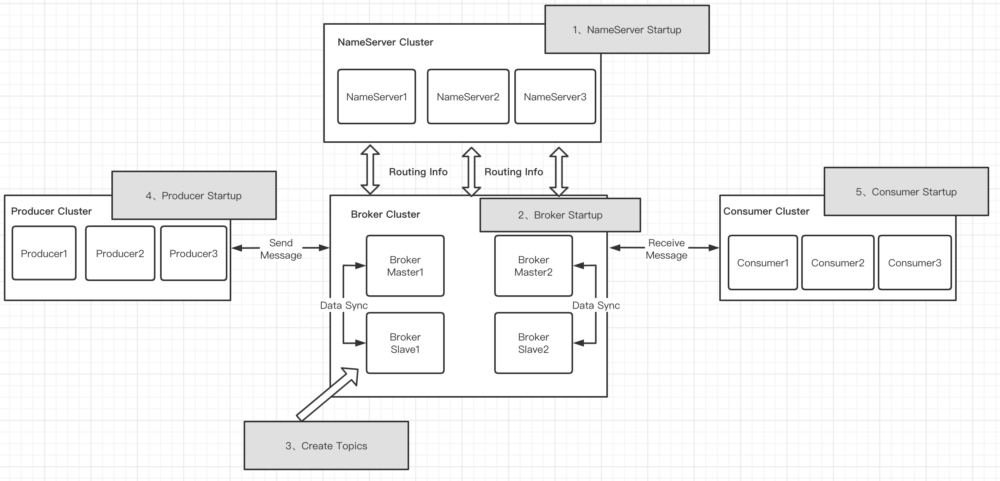
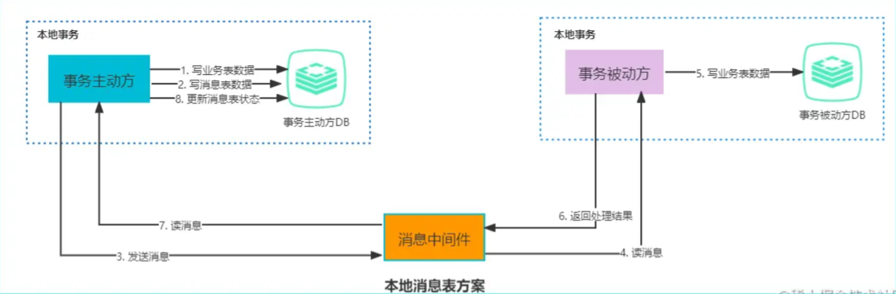
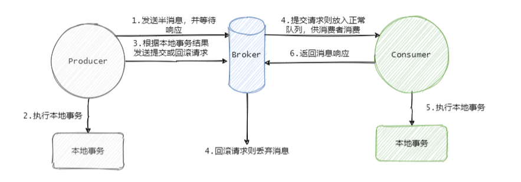
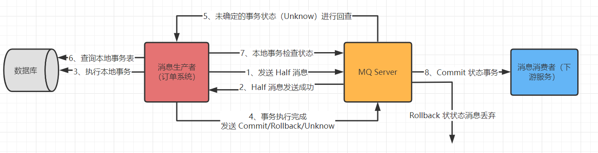

# RocketMQ

## 前言

<br>

**MQ 的作用**

> 1、**异步解耦**，两个互相调用的系统之间解耦
>
> 2、**削峰**，在系统遇到流量激增的情况下，消息队列可以将消息缓存起来，将消息分散处理，保证系统的稳定性
>
> 3、**顺序收发**，保证消息的 FIFO


<br>

**MQ 的优缺点**

**优点**：解耦、异步削峰、数据（消息）分发

**缺点**

1、**系统可用性降低**。系统引入的外部依赖多出了一个 MQ，一旦 MQ 宕机，就会对系统业务造成影响。因此，使用 MQ 就要考虑 MQ 的高可用（集群）

2、**系统复杂度提高**。MQ 的加入提高了系统的复杂度，系统之间的远程调用从 RPC 变成了通过 MQ 进行异步调用。需要考虑消息是否被重复消费，怎么处理丢失消息，怎么保证消息传递的顺序性

3、**一致性问题**。若是某个业务由多个系统一起完成，A 系统完成业务，通过 MQ 给 B、C、D 三个系统发送消息数据，如果 B 和 C 系统处理成功，D 系统处理失败，如何保证消息数据处理的一致性？此时就要考虑事务消息


<br>

[RocketMQ 优势对比](https://juejin.cn/post/6844903511235231757)

[RocketMQ 与其他 MQ 的区别](https://juejin.cn/post/6844904170651172871)


<br>

## 开始

[下载](https://rocketmq.apache.org/dowloading/releases/)

[Quick Start](https://rocketmq.apache.org/docs/quick-start/)

<br>

**Windows 启动和关闭**

1、下载 RocketMQ 压缩包，并解压

2、设置系统环境变量

```
ROCKETMQ_HOME="rocketmq 解压目录"
NAMESRV_ADDR="localhost:9876"
```

3、启动 NameServer

```shell
.\bin\mqnamesrv.cmd
```

4、启动 Broker

```shell
.\bin\mqbroker.cmd -n localhost:9876 autoCreateTopicEnable=true
```

5、关闭服务，直接关闭命令窗口即可（先关闭 Broker，再关闭 NameServer）

<br>

**Linux 启动和关闭**

1、解压 RocketMQ 压缩包到 `/usr/local/opt/rocketmq`

2、修改 `rocketmq/bin` 目录下 `runserver.sh` 和 `runbroker.sh` 配置的 Java 虚拟机内存大小

```sh
# runserver.sh
JAVA_OPT="${JAVA_OPT} -server -Xms256m -Xmx256m -Xmn128m -XX:MetaspaceSize=128m -XX:MaxMetaspaceSize=320m"

# runbroker.sh
JAVA_OPT="${JAVA_OPT} -server -Xms256m -Xmx256m -Xmn128m"
```

3、启动 NameServer

```sh
# 以后台运行的方式启动 nameserver，需要注意带的是公网 IP，而不是 localhost
nohup sh bin/mqnamesrv -n 公网IP:9876 &
# 从日志查看是否成功启动，tial -f
# control+c 退出日志
tail -f ~/logs/rocketmqlogs/namesrv.log
```

4、启动 Broker

```sh
# 以后台运行的方式启动 broker，并连接到 nameserver
# 修改 conf/broker.conf，添加 brokerIP1=公网IP
nohup sh bin/mqbroker -n nameserver公网IP:9876 -c conf/broker.conf autoCreateTopicEnable=true &
# 查看是否启动成功
tail -f ~/logs/rocketmqlogs/broker.log 
```

5、关闭服务

```sh
# 先关闭 broker
sh bin/mqshutdown broker
# 再关闭 nameserver
sh bin/mqshutdown namesrv
```

<br>

**测试消息发送与消费**（Windows 为例）

```shell
# 发送
.\bin\tools.cmd org.apache.rocketmq.example.quickstart.Producer

SendResult [sendStatus=SEND_OK, msgId=7F000001713C28A418FC549BA0E40000, offsetMsgId=0A12543300002A9F0000000000000000, messageQueue=MessageQueue [topic=TopicTest, brokerName=PC1-HZ20239021, queueId=1], queueOffset=0]

# 消费
.\bin\tools.cmd  org.apache.rocketmq.example.quickstart.Consumer

ConsumeMessageThread_1 Receive New Messages: [MessageExt [brokerName=PC1-HZ20239021, queueId=0, storeSize=190, queueOffset=0, sysFlag=0, bornTimestamp=1645064285471, bornHost=/10.18.84.51:58279, storeTimestamp=1645064285473, storeHost=/10.18.84.51:10911, msgId=0A12543300002A9F000000000000023A, commitLogOffset=570, bodyCRC=1032136437, reconsumeTimes=0, preparedTransactionOffset=0, toString()=Message{topic='TopicTest', flag=0, properties={MIN_OFFSET=0, MAX_OFFSET=250, CONSUME_START_TIME=1645064303213, UNIQ_KEY=7F000001713C28A418FC549BA11F0003, CLUSTER=DefaultCluster, TAGS=TagA}, body=[72, 101, 108, 108, 111, 32, 82, 111, 99, 107, 101, 116, 77, 81, 32, 51], transactionId='null'}]]
```


<br>

## 基本概念

<br>

### 主要角色

RocketMQ 主要由 NameServer、Broker、Producer、Consumer 四部分组成

* **NameServer** 提供轻量级的服务发现和路由
* **Broker** 负责存储消息
* **Producer** 负责生产消息
* **Consumer** 负责消费消息
* Topic 消息主题，生产者发送消息时需指定主题，消费者接受消息时也需要指定主题

每个 Broker 可以存储多个 Topic 的消息，每个 Topic 的消息也可以分片存储于不同 Broker。MessageQueue 存储消息的物理地址，每个 Topic 中的消息地址存储于多个 MessageQueue 中。




**生产者（Producer）**

负责产生消息，生产者向消息服务器发送由业务应用程序系统生成的消息。生产者支持分布式部署。 分布式生产者通过多种负载平衡模式将消息发送到 Broker 集群。 发送过程支持快速失败并且延迟低。支持三种方式发送消息：同步、异步和单向。


**消息服务（Broker）**

消息存储中心，接收来自 Producer 的消息并存储， Consumer 从这里取得消息。单个 Broker 节点与所有的 NameServer 节点保持长连接及心跳，并会定时将 Topic 信息注册到 NameServer，（其底层通信是基于 Netty 实现的）。Broker 负责消息存储，以 Topic 为维度支持轻量级的队列，单机可以支撑上万队列规模，支持消息推拉模型。具有上亿级消息堆积能力，同时可严格保证消息的有序性


**命名服务器（NameServer）**。类似于注册中心（Zookeeper、Eureka），主要进行 **Broker 管理和路由信息管理**。这里保存着消息的 TopicName、队列等运行时的元信息。

提供轻量级的服务发现和路由。NameServer 接受来自 Broker 群集的注册，并提供检测信号机制以检查 Broker 是否还存在。每个 NameServer 记录完整的路由信息（Broker 相关 Topic 等元信息，并给 Producer 提供 Consumer 查找 Broker 信息），提供相应的读写服务。多个 NameServer 实例组成集群，但**集群中的 NameServer 节点之间相互独立，不会进行信息交换**。


**消费者（Consumer）**

负责消费消息，消费者从消息服务器拉取信息并将其输入用户应用程序。也支持**推/拉**模型中的分布式部署。还支持集群使用和消息广播。 它提供了实时消息订阅机制，可以满足大多数消费者的需求。


<br>

### 整体流程

1、启动 **NameServer**，启动后进行端口监听。等待 Broker、Producer、Consumer 连接，相当于路由控制中心

2、启动 **Broker**，注册到 NameServer。

注册成功后，NameServer 集群中就有 Topic 跟 Broker 的映射关系。Broker 跟所有的 NameServer 保持长连接，定时发送心跳包。心跳包中包含当前 Broker 信息（IP/端口等）以及存储所有 Topic 信息。

3、创建 **Topic**。

收发消息前先创建 Topic 。创建 Topic 时需要指定该 Topic 要存储在哪些 Broker上，也可以在发送消息时自动创建Topic。

4、**Producer** 发送消息。

Producer 启动后先跟 NameServer 集群中的其中一台建立长连接，并从 NameServer 中获取当前发送的 Topic 存在哪些 Broker 上。然后跟对应的 Broker 建立长连接，并定时向 Broker 定时发送心跳。**Producer 可直接向 Broker 发消息，但是只能发送到 Broker master**

5、**Consumer** 消费消息。

Consumer 启动后先跟其中一台 NameServer 建立长连接，获取当前订阅 Topic 存在哪些 Broker 上。然后直接跟 Broker 建立连接通道，开始消费消息。

与 Producer 不一样的是，Consumer 可同时向 Broker 的 Master 和 Broker Slave 建立长连接，既可以从 Master 订阅消息，也可以向 Slave 订阅消息。


<br>

### 消息模型

**主题（Topic）**

表示**消息的第一级类型**，是最细粒度的订阅单位（生产者传递消息和消费者消费消息的标识）。一条消息必须有一个 Topic。一个 Group 可以订阅多个 Topic 的消息。**Topic 一般为领域范围**，比如交易消息

**标签（Tag）**

可以看作子主题，表示**消息的第二级类型**，可以使用相同的 Topic，不同的 Tag 来表示同一业务模块的不同任务的消息，比如交易消息又可以分为：交易创建消息，交易完成消息等。助于保持代码整洁和一致，简化 RocketMQ 提供的查询系统

**消息体（Message）**

消息是要传递的信息。 Message 中必须包含一个 Topic，可选 Tag 和 key-vaule 键值对

**组（Group）**

分为 Producer Group（生产者组）和 Consumer Group（消费者组），具有相同角色组成 Group。如果原生产者交易崩溃，Broker 可以联系同一生产者组的不同生产者进行提交或回退交易。消费者组的消费者实例必须具有完全相同的主题订阅。

**消息队列（Message Queue）**

在 **Kafka** 中叫 `Partition`，每个消息队列内部是有序的，**在 RocketMQ 中分为读和写两种队列**，一般来说读写队列数量一致，如果不一致就会出现很多问题。

相当于 Topic 的分区（逻辑上），用于并行接收和发送消息。主题被划分为一个或多个消息队列。所有消息队列都是持久化的，消息队列的引入使得消息的存储可以分布式集群化，具有了水平扩展能力。

**Offset**

在 RocketMQ 中，所有消息队列都是持久化，长度无限的数据结构。长度无限是指队列中的每个存储单元都是定长，访问存储单元可以使用 Offset 来访问。也可以认为消息队列是一个长度无限的数组，Offset 就是下标，Offset 为 64 位 `java long` 类型


> 了解完 RocketMQ 的基本概念和整体流程，接下来开始上手操作


<br>

## 消息生产与消费


**依赖**

```xml
<dependency>
    <groupId>org.apache.rocketmq</groupId>
    <artifactId>rocketmq-client</artifactId>
    <version>依赖版本需要和部署的 rocketmq 版本一致</version>
</dependency>
```


**生产步骤**

1. 创建消息生产者 Producer，指定生产者组名
2. 指定 NameServer地址
3. 启动 Producer
4. 创建消息对象，指定主题 Topic、Tag 和消息体
5. 发送消息


**消费步骤**

1. 创建消费者 Consumer，指定消费者要消费的组名
2. 指定 NameServer 地址
3. 指定主题 Topic 和 Tag
4. 注册消息监听器，设置回调函数，处理消息
5. 启动消费者 Consumer

<br>

### 消息生产

> RocketMQ 生产者生产的消息分为：同步消息、异步消息和单向消息

消息发送方的负载均衡：**先从 `NameServer` 获取关于 `Broker` 的路由信息**，然后通过 **轮询** 的方法去向每个队列中生产数据以达到 **负载均衡** 的效果

<br>

#### 同步消息

> 同步消息使用的较为广泛，如：重要的消息通知、短信

```java
// 同步消息生产者
public class SyncProducer {
    public static void main(String[] args) throws MQClientException, MQBrokerException, RemotingException, InterruptedException {
        // 1、创建消息生产者 Producer，指定生产者组名
        DefaultMQProducer producer = new DefaultMQProducer("group_default");
        // 2、指定 NameServer 地址，集群使用分号隔开：mqhost1:9876;mqhost2:9876；mqhost3:9876
        producer.setNamesrvAddr("localhost:9876");
        // 3、启动 Producer
        producer.start();
        // 4、创建消息对象，指定主题 Topic、Tag 和消息体
        for (int i = 0; i < 10; i++) {
            
            /**
             * 创建消息对象
             * topic 消息主题
             * tags 消息Tag
             * body 消息内容
             */
            Message msg = new Message("topic_default","tag_default",  ("hello, this is msg for rocketmq." + i).getBytes(StandardCharsets.UTF_8));

            //  5、发送消息，超时时间 10000ms。最好加上超时时间，否则可能发送报错
            SendResult sendResult = producer.send(msg, 10000);
            System.out.println(sendResult.toString());

            TimeUnit.SECONDS.sleep(1);
        }
        // 6、关闭 Producer
        producer.shutdown();
    }
}
```

<br>

#### 异步消息

> 异步消息通常用在对响应时间敏感的业务场景，即发送但不能容忍长时间的等待Broker响应

```java
// 异步消息生产者
public class AsyncProducer {
    public static void main(String[] args) throws MQClientException, RemotingException, InterruptedException {
        DefaultMQProducer producer = new DefaultMQProducer("group_default_async");
        producer.setNamesrvAddr("localhost:9876");
        producer.start();

        for (int i = 1; i <= 10; i++) {
            Message msg = new Message("topic_default_async", "tag_default_async", ("hello, this is msg from async producer. NO." + i).getBytes(StandardCharsets.UTF_8));

            // 异步发送消息
            producer.send(msg, new SendCallback() {

                // 发送成功回调函数
                @Override
                public void onSuccess(SendResult sendResult) {
                    System.out.println(sendResult);
                }

                // 发送异常回调函数
                @Override
                public void onException(Throwable e) {
                    System.out.println(e.getMessage());
                }
            });

            TimeUnit.SECONDS.sleep(1);
        }
        producer.shutdown();
    }
}
```

<br>

#### 单向消息

> 适用于某些耗时非常短但对可靠性要求并不高的场景，例如日志收集。

```java
// 单向消息生产者
public class OnewayProducer {
    public static void main(String[] args) throws MQClientException, RemotingException, InterruptedException {
        // ...
      	// 发送单向消息
        producer.sendOneway(msg);
      	// ...
    }
}
```


<br>

### 推拉消费

<br>

推拉消费模式

* **Push 模式**

  Push 模式是 **MQ 主动**推送信息，有信息就推送，但是可能会推送太多消息，导致消费者的消费速度跟不上推送速度

* **Pull 模式**

  由**客户端主动**向 MQ 请求数据，主动权在客户端，取消息的过程需要自定义实现。先拉取数据再消费，不会因为推送太快而处理不及时

<br>

**两种模式的区别**

* 推模式指的是客户端与服务端建立长连接，服务端直接通过长连接通道推送到客户端。优点是及时，一旦有数据变更，客户端立马能感知到；

  推模式对客户端来说逻辑简单，不需要关心有无数据这些逻辑处理。缺点是不知道客户端的数据消费能力，可能导致数据积压在客户端，来不及处理。

* 拉模式指的是客户端主动向服务端发出请求，拉取相关数据。优点是此过程由客户端发起请求，不存在推模式中数据积压的问题。缺点是消息消费可能不够及时，对客户端来说需要考虑数据拉取相关逻辑，何时拉取，拉取的频率怎么控制等等。

  拉模式中，为了保证消息消费的实时性，采取了长轮询消息服务器拉取消息的方式。每隔一定时间，客户端向服务端发起一次请求，服务端有数据就返回数据，服务端如果此时没有数据，保持连接。等到有数据返回，或者超时返回。

  长轮询的好处是可以减少无效请求，保证消息的实时性，又不会造成客户端积压

<br>

**推拉消费者**

RocketMQ 的消费者被分为两类：`MQPullConsumer` 和 `MQPushConsumer`。本质都是拉模式，消费者轮询从 MQ 拉取消息。

* 拉模式消费者（Pull Consumer）主动从消息服务器拉取信息，只要批量拉取到消息，消费者就会启动消费过程，所以 Pull 称为主动消费型
* 推模式消费者（Push Consumer）封装了消息的拉取、消费进度和其他的内部维护工作，将消息到达时执行的回调接口留给用户应用程序来实现，所以 Push 称为被动消费类型。但从实现上看，是从消息服务器中拉取消息，而且 Push 模式首先要注册消费监听器，当监听器处触发后才开始消费消息


<br>

### 消息消费

#### 消息模式

> 多个消费者同时存在的情况下，默认为负载均衡模式

<br>

**负载均衡模式 CLUSTERING**

```java
// 消息消费者
public class DefaultConsumer {
    public static void main(String[] args) throws MQClientException {
        // 1、创建消费者 Consumer，制定消费者组名
        DefaultMQPushConsumer consumer = new DefaultMQPushConsumer("group_default");
        // 2、指定 nameserver 地址
        consumer.setNamesrvAddr("localhost:9876");
        // 3、指定订阅的主题 topic 和 tag，若是多个 tag 使用 || 隔开，所有 tag 使用 * 号
        consumer.subscribe("topic_default", "");
        // 4、设置回调函数，处理消息
        // new MessageListenerOrderly 顺序消费，有序地使用消息意味着消息的消费顺序与生产者为每个消息队列发送消息的顺序相同
        // new MessageListenerConcurrently 并行消费，在此模式下不再保证消息顺序，消费的最大并行数量受每个消费者客户端指定的线程池限制。
        consumer.registerMessageListener(new MessageListenerConcurrently() {

            // 接收消息内容
            @Override
            public ConsumeConcurrentlyStatus consumeMessage(List<MessageExt> msgs, ConsumeConcurrentlyContext context) {
                for (MessageExt msg : msgs) {
                    System.out.println(new String(msg.getBody()));
                }

                return ConsumeConcurrentlyStatus.CONSUME_SUCCESS;
            }
        });
        // 5、启动消费者
        consumer.start();
    }
}
```

<br>

**广播模式 BROADCASTING**

```java
// 设置消费模式 1、BROADCASTING 广播模式 2、CLUSTERING 集群模式（负载均衡模式，默认使用）
consumer.setMessageModel(MessageModel.BROADCASTING);
```

<br>

#### 过滤消息

```java
DefaultMQPushConsumer consumer = new DefaultMQPushConsumer("GROUP_DEFAULT");
consumer.subscribe("TOPIC", "TAGA || TAGB || TAGC");
```


<br>

#### 消费方式

* **Orderly 顺序消费**，有序地使用消息，消息的消费顺序与生产者为每个消息队列发送消息的顺序相同

* **Concurrently 并行消费**，在此模式下不再保证消息顺序，消费的最大并行数量受每个消费者客户端指定的线程池限制。


<br>

#### 重复消费

> RocketMQ 不保证消息不重复，如果需要保证严格的不重复消息，需要在业务端去重
>
> 1、消费端处理消息的业务逻辑保持幂等性
>
> 2、保证每条消息都有唯一编号且保证消息处理成功与去重表的日志同时出现


<br>

#### 回溯消费

> 回溯消费是指 Consumer 已经消费成功的消息，由于业务上需求需要重新消费。
>
> 在 RocketMQ 在向 Consumer 投递消息成功后，**消息仍会保留**。并且重新消费一般是按照时间维度，例如由于 Consumer 系统故障，恢复后需要重新消费 1 小时前的数据，那么 Broker 要提供一种机制，可以按照时间维度来回退消费进度。RocketMQ 支持按照时间回溯消费，时间维度精确到毫秒。


<br>

#### 消息堆积

> 消息堆积意味着生产者发送的消息太多，消费者处理不过来。可以对生产者端服务进行限流，也可以增加多个消费者来进行消费。堆积问题排查可以从消费者入手，查看是否是消费者出现消费错误，或者某个线程消费过程中产生了死锁等。
>


<br>

#### 消息丢失

> [RocketMQ 如何防止消息丢失？](https://juejin.cn/post/7039959533707329566)

稍后补充。。。


<br>

## 消息类型

<br>

### 普通消息

> 普通消息一般应用于微服务解耦、事件驱动、数据集成等场景，这些场景大多数要求数据传输通道具有可靠传输的能力，且对消息的处理时机、处理顺序没有特别要求。

**使用场景**

* 服务解耦
* 数据传输

<br>

**生命周期**

* 初始化：消息被生产者构建并完成初始化，待发送到服务端；
* 待消费：消息被发送到服务端，对消费者可见，等待消费者消费；
* 消费中：消息被消费者获取，并按照消费者本地的业务逻辑进行处理的过程。此时服务端会等待消费者完成消费并提交消费结果，如果一定时间后没有收到消费者的响应，RocketMQ 会对消息进行重试处理；
* 消费提交：消费者完成消费处理，并向服务端提交消费结果，服务端标记当前消息已经被处理（包括消费成功和失败）。 RocketMQ 默认支持保留所有消息，此时消息数据并不会立即被删除，只是逻辑标记已消费。消息在保存时间到期或存储空间不足被删除前，消费者仍然可以回溯消息重新消费；
* 消息删除：RocketMQ 按照消息保存机制滚动清理最早的消息数据，将消息从物理文件中删除。


<br>

### 定时/延时消息

> 定时消息是 RocketMQ 提供的一种高级消息类型，消息被发送至服务端后，在指定时间后才能被消费者消费。通过设置一定的定时时间可以实现分布式场景的延时调度触发效果。

**使用场景**

* 分布式定时调度
* 任务超时处理


**生命周期**

- 初始化：消息被生产者构建并完成初始化，待发送到服务端的状态；
- **定时中**：**消息被发送到服务端，和普通消息不同的是，服务端不会直接构建消息索引，而是会将定时消息单独存储在定时存储系统中，等待定时时刻到达**；
- 待消费：定时时刻到达后，服务端将消息重新写入普通存储引擎，对下游消费者可见，等待消费者消费的状态；
- 消费中：消息被消费者获取，并按照消费者本地的业务逻辑进行处理的过程。 此时服务端会等待消费者完成消费并提交消费结果，如果一定时间后没有收到消费者的响应，RocketMQ 会对消息进行重试处理；
- 消费提交：消费者完成消费处理，并向服务端提交消费结果，服务端标记当前消息已经被处理（包括消费成功和失败）；RocketMQ 默认支持保留所有消息，此时消息数据并不会立即被删除，只是逻辑标记已消费。消息在保存时间到期或存储空间不足被删除前，消费者仍然可以回溯消息重新消费；
- 消息删除：RocketM按照消息保存机制滚动清理最早的消息数据，将消息从物理文件中删除。


> 在电商项目中，提交了一个订单之后发送指定时间的延时消息，等到指定时间之后检查订单状态，若是未付款就取消订单，释放库存

```java
// org/apache/rocketmq/store/config/MessageStoreConfig.java 共 18 个级别
// private String messageDelayLevel = "1s 5s 10s 30s 1m 2m 3m 4m 5m 6m 7m 8m 9m 10m 20m 30m 1h 2h";

// rocketmq 仅支持几个固定的延时的时间，3 对应 10s
msg.setDelayTimeLevel(3);
```


<br>

### 顺序消息

> 消息有序是指可以按照消息发送的顺序来消费，即 `FIFO` 消费。RocketMQ 可以严格的保证消息有序，可以分为分区有序或者全局有序。

在默认情况下，消息发送会采取轮询方式把消息发送到不同的消息队列，消费的时候从多个队列拉取消息，这种情况下发送和消费是不能保证顺序的。

如果控制发送的顺序，消息依次发送到同一个队列中，消费的时候该队列上依次拉取，这样就可以保证消息的有序消费。

当参与发送和消费的消息队列只有一个，则是**全局有序**；如果有多个消息队列参与，则是**分区有序**，即相对某个队列，消息都是有序的。

<br>

**使用场景**

* 有序事件处理
* 撮合交易
* 数据实时增量同步

<br>

**实现**

```java
// OrderStep 订单步骤实体类
@Data
@NoArgsConstructor
@AllArgsConstructor
public class OrderStep {
    private long orderId;
    private String desc;

    public static List<OrderStep> buildOrders() {
        List<OrderStep> orderSteps = new ArrayList<>();

        OrderStep orderStep = null;

        // 1100L create payment push done
        // 2200L create payment
        // 3300L create payment

        orderStep = new OrderStep(1100L, "create");
        orderSteps.add(orderStep);

        orderStep = new OrderStep(2200L, "create");
        orderSteps.add(orderStep);

        orderStep = new OrderStep(1100L, "payment");
        orderSteps.add(orderStep);

        orderStep = new OrderStep(3300, "create");
        orderSteps.add(orderStep);

        orderStep = new OrderStep(1100L, "push");
        orderSteps.add(orderStep);

        orderStep = new OrderStep(2200L, "payment");
        orderSteps.add(orderStep);

        orderStep = new OrderStep(1100L, "done");
        orderSteps.add(orderStep);

        return orderSteps;
    }
}
```

```java
// OrderProducer 顺序消息生产
public class OrderProducer {
    public static void main(String[] args) throws MQClientException, MQBrokerException, RemotingException, InterruptedException {
        DefaultMQProducer producer = new DefaultMQProducer("group_default_order");
        producer.setNamesrvAddr("localhost:9876");
        producer.start();

        // 构建数据
        List<OrderStep> orderSteps = OrderStep.buildOrders();

        // 发送消息
        for (OrderStep order : orderSteps) {
            Message msg = new Message("topic_default_order", "tag_default_order", order.toString().getBytes(StandardCharsets.UTF_8));

            /**
             * Message msg 消息对象
             * MessageQueueSelector selector 消息队列的选择器
             * Object arg 消息队列的业务标识（订单ID）
             */
            SendResult sendResult = producer.send(msg, new MessageQueueSelector() {
                @Override
                public MessageQueue select(List<MessageQueue> mqs, Message msg, Object arg) {
                    // 根据订单ID选择对应的 Queue
                    // 就能将同一个订单消息发送到唯一的一个 Queue
                    // 从而保证消费者消费的顺序性
                    long orderId = (long) arg;
                    long queueIndex = orderId % mqs.size();
                    return mqs.get((int) queueIndex);
                }
            }, order.getOrderId(), 10000);

            System.out.println(sendResult);
        }

        producer.shutdown();

    }
}
```


<br>

### 批量消息

> 批量发送消息能显著提高传递小消息的性能。限制是这些批量消息应该有相同的 Topic，相同的 `waitStoreMsgOK`，而且不能是延时消息。此外，这一批消息的总大小不应超过 4 MB。

**发送批量消息**

```java
List<Message> messageList = new ArrayList<>();
for (int i = 1; i <= 10; i++) {
    Message msg = new Message("topic_default_batch", "tag_default_batch", ("hello, this is msg from batch producer. NO." + i).getBytes(StandardCharsets.UTF_8));
    messageList.add(msg);
}

producer.send(messageList, 10000);
```


**消息列表分割**

> 不确定消息是否超过了大小限制（4 MB），最好把消息列表分割一下

```java
public class ListSplitter implements Iterator<List<Message>> { 
    private final int SIZE_LIMIT = 1024 * 1024 * 4;
    private final List<Message> messages;
    private int currIndex;
    public ListSplitter(List<Message> messages) { 
        this.messages = messages;
    }
    @Override 
    public boolean hasNext() {
        return currIndex < messages.size(); 
    }
    @Override 
    public List<Message> next() { 
        int startIndex = getStartIndex();
        int nextIndex = startIndex;
        int totalSize = 0;
        for (; nextIndex < messages.size(); nextIndex++) {
            Message message = messages.get(nextIndex); 
            int tmpSize = calcMessageSize(message);
            if (tmpSize + totalSize > SIZE_LIMIT) {
                break; 
            } else {
                totalSize += tmpSize; 
            }
        }
        List<Message> subList = messages.subList(startIndex, nextIndex); 
        currIndex = nextIndex;
        return subList;
    }
    private int getStartIndex() {
        Message currMessage = messages.get(currIndex); 
        int tmpSize = calcMessageSize(currMessage); 
        while(tmpSize > SIZE_LIMIT) {
            currIndex += 1;
            Message message = messages.get(curIndex); 
            tmpSize = calcMessageSize(message);
        }
        return currIndex; 
    }
    private int calcMessageSize(Message message) {
        int tmpSize = message.getTopic().length() + message.getBody().length(); 
        Map<String, String> properties = message.getProperties();
        for (Map.Entry<String, String> entry : properties.entrySet()) {
            tmpSize += entry.getKey().length() + entry.getValue().length(); 
        }
        tmpSize = tmpSize + 20; // 增加日志的开销 20 字节
        return tmpSize; 
    }
}
// 把大的消息分裂成若干个小的消息
ListSplitter splitter = new ListSplitter(messages);
while (splitter.hasNext()) {
  try {
      List<Message>  listItem = splitter.next();
      producer.send(listItem);
  } catch (Exception e) {
      e.printStackTrace();
      // 处理error
  }
}
```


<br>

### 事务消息

<br>

#### 分布式事务

分布式事务指事务的参与者、支持事务的服务器、资源服务器以及事务管理器分别位于不同的分布式系统的不同节点之上。

简单的说，就是一次大的操作由不同的小操作组成，这些小的操作分布在不同的服务器上，且属于不同的应用，分布式事务需要保证这些小操作要么全部成功，要么全部失败。

本质上来说，分布式事务就是为了保证不同数据库的数据一致性。比如微服务电商交易、跨行转账等


<br>

##### CAP 理论

不同于本地事务的 ACID 特性，分布式事务主要特性为：**CAP**

* **C（一致性）**

  对某个指定的客户端来说，读操作能返回最新的写操作。对于数据分布在不同节点上的数据上来说，如果在某个节点更新了数据，那么在其他节点如果都能读取到这个最新的数据，那么就称为强一致，如果有某个节点没有读取到，那就是分布式不一致。

* **A（可用性**）

  非故障的节点在合理的时间内返回合理的响应（不是错误和超时的响应）。可用性的两个关键：一个是合理的时间，一个是合理的响应。

  合理的时间指的是请求不能无限被阻塞，应该在合理的时间返回。合理的响应指的是请求应该得到明确并正确的返回结果，这里的正确指的是比如应该返回 200，而不是返回 404。

* **P（分区容错性）**

  当出现网络分区后，系统能够继续工作。比如，在一个服务集群中，有一个服务网络出现了问题，但是这个集群仍然可以正常工作

CAP 三者不能同时存在，只能满足 AP 或者 CP 原则。因为在分布式系统中，网络不是 100% 可靠，分区（服务集群）其实是一个必然现象，必定需要满足 P。

对于 CP 来说，就是追求强一致性和分区容错性，放弃高可用。对于 AP 来说，就是追求分区容错性和可用性，放弃一致性（强一致性)，AP 是很多分布式系统设计时的选择。

注意 AP 或者 CP 不是说就要放弃 C 或者放弃 A，而是需要使用一些别的手段来保证 C （比如日志）或者 A （快速失败机制、快速响应机制）。


<br>

##### BASE 理论

BASE 是 Basically available（基本可用）、Soft state（软状态）和 Eventually consistent （最终一致性）三个短语的缩写，是对 CAP 中 AP 的一个扩展。

* 基本可用，分布式系统在出现故障时，允许损失部分可用功能，保证核心功能可用
* 软状态，允许系统中存在中间状态，这个状态不影响系统可用性，这里指的是 CAP 中的不一致
* 最终一致性，最终一致是指经过一段时间后，所有节点数据都将会达到一致

BASE 和 ACID 是相反的，它完全不同于 ACID 的强一致性模型，而是通过牺牲强一致性来获得可用性，并允许数据在一段时间内是不一致的，但最终达到一致状态。


<br>

**分布式事务方案**

##### 2PC

**两段提交（2PC）**基于 **XA 协议**实现的分布式事务，XA 协议中分为两部分：**事务管理器/事务协调者**和**本地资源管理器**。其中本地资源管理器往往由数据库实现，比如 Oracle、MySQL 这些数据库都实现了 **XA 接口**，而事务管理器则作为一个全局的调度者。

<br>

**2PC 流程**

2PC 分为两个阶段：**准备和提交**。

第一个阶段，由事务协调者给每个参与者发送准备命令，每个参与者收到命令之后会执行相关事务操作。可以认为除了事务的提交，其他关于事务的操作都做了，然后每个参与者会返回响应告知协调者自己是否准备成功。

在 2PC 中事务协调者有超时机制，若是事务协调者在第一阶段未收到个别参与者的响应，等待一定时间后就会认为事务失败，会发送回滚命令。

协调者收到每个参与者的响应之后就进入第二阶段，根据收集的响应，如果有一个参与者响应准备失败那么就向所有参与者发送回滚命令，反之发送提交命令。

<br>

**2PC 优缺点**

2PC 对业务侵⼊很小，它最⼤的优势就是对使⽤⽅透明，用户可以像使⽤本地事务⼀样使⽤基于 XA 协议的分布式事务，能够严格保障事务 ACID 特性。

2PC 的缺点也是显而易见，它是一个强一致性的**同步阻塞**协议，事务执⾏过程中需要将所需资源全部锁定，也就是 `刚性事务`。所以它比较适⽤于执⾏时间确定的短事务，整体性能比较差。

事务管理器**单点故障**，一旦事务协调者宕机或者发生网络抖动，会让参与者一直处于锁定资源的状态或者只有一部分参与者提交成功，导致数据的不一致。因此，在⾼并发性能⾄上的场景中，基于 XA 协议的分布式事务并不是最佳选择。

<br>

##### 3PC

**三段提交（`3PC`**）是二阶段提交的一种改进版本 ，为解决两阶段提交协议的阻塞问题，上边提到两段提交，当协调者崩溃时，参与者不能做出最后的选择，就会一直保持阻塞锁定资源。

2PC 中只有协调者有超时机制，3PC 在协调者和参与者中都引入了超时机制，协调者出现故障后，参与者不会一直阻塞。而且在第一阶段和第二阶段中又插入了一个预提交阶段，保证了在最后提交阶段之前各参与节点的状态是一致的。

<br>

**3PC 流程**

3PC 分为三个阶段：**准备、预提交和提交**

准备阶段就是协调者去访问参与者，查看是否能接受事务请求，进行事务操作。如果全部响应成功则进入下一阶段。

预提交阶段，协调者向所有参与者发送预提交命令，询问是否可以进行事务的预提交操作。参与者接收到预提交请求后，如果成功的执行了事务操作，则返回成功响应，进入最终提交阶段。一旦有参与者中有向协调者发送了失败响应，或因网络造成超时，协调者没有收到该参与者的响应，协调者向所有参与者发送 `abort` 请求，参与者收到 `abort` 命令后中断事务的执行。

提交阶段，如果前两个阶段中所有参与者的响应反馈均是 `YES`，协调者向所有参与者发送提交命令正式提交事务，如协调者没有接收到参与者发送的 `ACK` 响应，会向所有参与者发送 `abort` 请求命令，执行事务的中断。

<br>

**3PC 优缺点**

虽然 `3PC` 用超时机制，解决了协调者故障后参与者的阻塞问题，与此同时也多了一次网络通信，性能上反而变得更差，也不太推荐

<br>

##### TCC

`TCC`（Try-Confirm-Cancel）又被称`补偿事务`，TCC 与 2PC 的思想很相似，事务处理流程也很相似，但 2PC 是应用于在数据库层面，TCC 则可以理解为在应用层面的 2PC，是需要自定义编写业务逻辑来实现的。

TCC 核心思想是：**针对每个操作（Try）都要注册一个与其对应的确认（Confirm）和补偿（Cancel）**。

<br>

**TCC 流程**

TCC 的实现分为**两个阶段**，需要在业务层面需要写对应的**三个方法**（Try、Confirm、Cancel），主要用于跨数据库、跨服务的业务操作的数据一致性问题。

第一阶段是**资源检查预留阶段**即 Try，尝试执行，完成所有业务检查（一致性），预留必须业务资源（准隔离性）

第二阶段是 Confirm 或 Cancel，Confirm 执行真正的业务操作，Cancel 执行预留资源的取消，回滚到初始状态。

以下单扣库存为例，Try 阶段去占库存，Confirm 阶段则实际扣库存，如果库存扣减失败 Cancel 阶段进行回滚，释放库存。

<br>

**TCC 注意点**

* **幂等问题**，因为网络调用无法保证请求一定能到达，所以都会有重调机制，因此对于 Try、Confirm、Cancel 三个方法都需要幂等实现，避免重复执行产生错误；
* **空回滚问题**，指的是 Try 方法由于网络问题超时了，此时事务管理器就会发出 Cancel 命令，那么需要支持在未执行 Try 的情况下能正常的 Cancel；
* **悬挂问题**，指 Try 方法由于网络阻塞超时触发了事务管理器发出了 Cancel 命令，**但是执行了 Cancel 命令之后 Try 请求到了**。对于事务管理器来说这时候事务已经是结束了的，到达的 Try 操作就被**悬挂**了，所以空回滚之后还需要将操作记录，防止 Try 的再调用。

<br>

**TCC 优缺点**

TCC **不存在资源阻塞的问题**，因为每个方法都直接进行事务的提交，一旦出现异常通过则 Cancel 来进行回滚补偿，这也就是常说的补偿性事务。

TCC **对业务的侵入性很强**，原本一个方法，现在需要三个方法来支持，而且这种模式并不能很好地被复用，会导致开发量激增。还要考虑到网络波动等原因，为保证请求一定送达都会有重试机制。

TCC 适用于一些强隔离性和强一致性，并且执行时间较短的业务。

<br>

##### 本地消息表

本地消息就是利用了**本地事务**，在数据库中存放一个本地事务消息表，在进行本地事务操作时加入了本地消息的插入，**业务执行和消息放入消息表这两个操作放在同一个事务中提交**。

这样本地事务执行成功的话，消息肯定也插入成功。然后再调用其他服务，如果调用成功就修改这条本地消息的状态。**核心思路是将分布式事务拆分成本地事务进行处理，并通过消息的方式来异步执行。**

通过在事务发起方新建事务消息表，事务发起方处理业务和记录事务消息在本地事务中完成，轮询事务消息表的数据发送事务消息，事务被动方基于消息中间件消费事务消息表中的事务。这样可以避免以下两种情况导致的数据不一致性：业务处理成功、事务消息发送失败；业务处理失败、事务消息发送成功。

<br>

**整体流程**



<br>

**流程中必要的容错处理**

* 步骤 1 出错，由于在处理的是本地事务，直接本地回滚即可
* 步骤 2 或 3 出错，由于事务主动方本地保存了消息，只需要轮询失败的消息，重新通过消息中间件发送，事务被动方重新读取消息处理业务即可
* 事务被动方业务上处理失败，事务被动方可以发消息给事务主动方回滚事务
* 如果事务被动方已经消费了消息，事务主动方需要回滚事务的话，需要发消息通知事务主动方进行回滚事务

<br>

**消息事务优缺点**

从应用设计开发的角度实现了消息数据的可靠性，消息数据的可靠性不依赖于消息中间件，弱化了对 MQ 中间件特性的依赖。并且方案轻量，容易实现。

但也很容易看出消息数据与业务数据同库，会占用业务系统资源。与具体的业务场景绑定，耦合性强，不可公用。业务系统在使用关系型数据库的情况下，消息服务性能会受到关系型数据库并发性能的局限。


<br>

#### RocketMQ 事务消息

> 分布式事务消息（确保数据的最终一致性，大量引入 MQ 的分布式事务，既可以实现系统之间的解耦，又可以保证最终的数据一致性，减少系统间的交互）

RocketMQ 的事务消息也可以认为是两阶段提交。

在事务开始的时候会先发送一个半消息（Half）给 Broker。半消息对 Consumer 是不可见的，也不是保存在要发送的队列中，而是一个特殊队列。发送完半消息之后执行本地事务，再根据本地事务的执行结果来决定是向 Broker 发送提交消息，还是发送回滚消息。

如果发送**提交或者回滚**消息失败，Broker 会定时的向 Producer 来回查这个事务是否成功。具体的 Producer 需要暴露一个接口，通过这个接口 Broker 可以得知事务到底有没有执行成功。

如果没成功就返回未知，因为有可能事务还在执行，会进行多次查询；如果成功，就将半消息恢复到正常要发送的队列中，消费者就可以消费这条消息了。




**事务消息状态**

- **提交状态**，`LocalTransactionState.COMMIT_MESSAGE`，提交事务，它允许消费者消费此消息。
- **回滚状态**，`LocalTransactionState.ROLLBACK_MESSAGE`，回滚事务，它代表该消息将被删除，不允许被消费。
- **中间状态**，`LocalTransactionState.UNKNOW`，中间状态，它代表需要检查（回查）消息队列来确定状态。

<br>

**事务消息投递流程**



<br>

**发送事务消息**

1、实现事务监听端口

```java
// 事务消息监听器
public class TransactionListenerImpl implements TransactionListener {

    // 全局事务标识
    private AtomicInteger transIndex = new AtomicInteger(0);
    // 本地事务表
    private ConcurrentHashMap<String, Integer> localTransMap = new ConcurrentHashMap<>();

    /**
     * 执行本地事务，并根据事务执行结果返回不同状态
     */
    @Override
    public LocalTransactionState executeLocalTransaction(Message msg, Object arg) {

        // 执行本地事务操作
        double r = Math.random() * 10;
        System.out.println("********************");
        System.out.println("开始执行本地事务");

        int index = transIndex.getAndIncrement();
        int status = index % 3;
        String transactionId = msg.getTransactionId();
        localTransMap.put(transactionId, status);

        if (r < 3) {
            System.out.println("本地事务执行完成，返回状态： UNKNOW");
            System.out.println("更新本地消息表，Id为 " + transactionId);
            localTransMap.put(transactionId, 0);
            return LocalTransactionState.UNKNOW;
        } else if( r > 3 && r < 6) {
            System.out.println("本地事务执行完成，返回状态： COMMIT_MESSAGE");
            System.out.println("更新本地消息表，Id为 " + transactionId);
            localTransMap.put(transactionId, 1);
            return LocalTransactionState.COMMIT_MESSAGE;
        } else {
            System.out.println("本地事务执行完成，返回状态： ROLLBACK_MESSAGE");
            System.out.println("更新本地消息表，Id为 " + transactionId);
            localTransMap.put(transactionId, 2);
            return LocalTransactionState.ROLLBACK_MESSAGE;

        }
    }

    /**
     * 检查本地事务状态，并回复消息队列（Message Queue）的事务状态检查请求
     */
    @Override
    public LocalTransactionState checkLocalTransaction(MessageExt msg) {
        System.out.println("********************");
        String transactionId = msg.getTransactionId();
        System.out.println("Id为 " + transactionId + " 的事务消息状态不确定，回查本地事务表...");
        Integer status = localTransMap.get(msg.getTransactionId());
        if (null != status) {
            switch (status) {
                case 0:
                    return LocalTransactionState.UNKNOW;
                case 1:
                    return LocalTransactionState.COMMIT_MESSAGE;
                case 2:
                    return LocalTransactionState.ROLLBACK_MESSAGE;
            }
        }
        return LocalTransactionState.COMMIT_MESSAGE;
    }
}

```

<br>

2、创建事务消息生产者

```java
// 事务消息生产者
public class TransactionProducer {
    public static void main(String[] args) {
        TransactionListenerImpl listener = new TransactionListenerImpl();
        TransactionMQProducer producer = new TransactionMQProducer("gp_default");
        producer.setNamesrvAddr("localhost:9876");
        ThreadPoolExecutor executor =
                new ThreadPoolExecutor(2, 5, 100, TimeUnit.SECONDS, new ArrayBlockingQueue<>(2000), Executors.defaultThreadFactory(), new ThreadPoolExecutor.AbortPolicy());

        producer.setExecutorService(executor);
        producer.setTransactionListener(listener);
        try {
            producer.start();

            for (int i = 0; i < 10; i++) {
                Message msg = new Message("tp_default", "tg_trans", "KEY" + i,
                        ("hi, this is transaction msg from TransactionProducer " + i).getBytes(RemotingHelper.DEFAULT_CHARSET));

                TransactionSendResult result = producer.sendMessageInTransaction(msg, null);
                System.out.println("********************");
                System.out.println("发送第 " + i +" 条消息 " + result);

                Thread.sleep(1000);
            }
        } catch (MQClientException e) {
            e.printStackTrace();
        } catch (UnsupportedEncodingException e) {
            e.printStackTrace();
        } catch (InterruptedException e) {
            e.printStackTrace();
        } finally {
            producer.shutdown();
        }

    }
}

```


<br>

## 消息存储

> [消息存储模型](https://mp.weixin.qq.com/s/_GXaJfRn11F_TiyOQKQ2Ew)

<br>

### 零拷贝

* mmap（Memory Map），是一种内存映射文件的方法，即将一个文件或者其它对象映射到进程的地址空间，实现文件磁盘地址和进程虚拟地址空间中一段虚拟地址的一一对映关系。内核缓冲区和应用缓冲区共享，从而减少了从读缓冲区到用户缓冲区的一次CPU拷贝。
* sendfile

<br>

### 落盘机制

> RocketMQ 先将消息写到 PageCache，再写入磁盘

* 异步
* 同步


> [RocketMQ 消息存储和查询原理](https://juejin.cn/post/6844904149725741064)

稍后补充。。。


<br>

## 消息清理

当出现以下几种情况下时就会触发消息清理：

- 手动执行删除
- 默认每天凌晨 4 点会自动清理过期的文件
- 当磁盘空间占用率默认达到 75% 之后，会自动清理过期文件
- 当磁盘空间占用率默认达到 85% 之后，无论这个文件是否过期，都会被清理掉


<br>

## 集群搭建

> 保证高可用

<br>


**集群特点**

- NameServer 是一个几乎无状态节点，可集群部署，节点之间无任何信息同步
- Broker 部署相对复杂，Broker 分为 Master 和 Slave。Master 可以部署多个，一个 Master 可以对应多个Slave；一个 Slave 只能对应一个 Master。Master 与 Slave 对应关系通过指定相同的 BrokerName，不同的 BrokerID来定义，BrokerId 为 0 表示 Master，非 0 表示 Slave；一般来说生产者生产的消息发送到 Master， Master 和 Slave 之间进行消息同步，消费者从 Slave 读取消息。每个 Broker 与 NameServer 集群中所有节点建立长链接，定时注册 Topic 信息到所有 NameServer
- Producer 与 NameServer 集群中的其中一个节点（随机选择）建立长链接，定期从 NameServer 获取 Topic 路由信息，并向提供 Topic 服务的 Master 建立长链接，且定时向 Master 发送心跳。Producer 完全无状态，可集群部署。
- Consumer 与 NameServer 集群中的其中一个节点（随机选择）建立长链接，定期从 NameServer 获取 Topic 路由信息，并向提供 Topic 服务的 Master、Slave 建立长链接，且定时向 Master、Slave 发送心跳。Consumer 既可以从 Master 订阅消息，也可以从 Slave 订阅消息，订阅规则由 Broker 配置决定


<br>

### 集群模式

#### 单 Master

> 风险较大，一旦 Broker 重启或者宕机，会导致整个系统服务不可用。

<br>

#### 多 Master

> 无 Slave，所有 Broker 都是 Master，例如 2 个 Master 或者 3 个 Master

优点：配置简单，单个 Master 宕机或重启对应用无影响，性能最好

缺点：单台机器宕机期间，这台机器上未被消费的消息在机器恢复之前不可订阅，消息实时性会收到影响

<br>

#### 多 Master/Slave

**异步**

> 每个 Master 配置一个 Slave，有多对 Master-Slave，采用**异步复制**方式，主备有短暂消息延迟（毫秒级）

优点：即使磁盘损坏，消息丢失的非常少，且实时性不会受到影响。同时 Master 宕机后，消费者仍然可以从 Slave 消费，而且此过程对应用透明，不需人工干预，性能和多 Master 模式几乎一样。

缺点：Master 宕机，磁盘损坏情况下会丢失少量信息

<br>

**同步**

> 每个 Master 配置一个 Slave，有多对 Master-Slave，采用**同步双写**方式，即只有主备都写成功，才向应用返回成功

优点：数据与服务都无单点故障，Master 宕机情况下，消息无延迟，服务可用性与数据可用性都非常高

缺点：性能比异步复制略低，发送单个消息的 RT 略高，且目前版本在主节点宕机后，备机不能自动切换为主机


<br>

### 双主双从集群

#### 集群搭建

1. 配置 hosts
2. 关闭防火墙（开发环境）/开放端口（线上环境）
3. 配置环境变量（export rocketmq）
4. 创建消息存储路径
5. 修改 Broker 配置文件
6. 分别启动 Master1，Slave2，Master2，Slave1


#### 总体结构

双主双从，同步双写


#### 工作流程

1. 启动 NameServer，启动后监听端口，等待 Broker、Producer、Consumer 连接；
2. Broker 启动，跟所有的 NameServer 保持长链接，定时发送心跳包。心跳包中包含当前 Broker 信息（IP 和端口等信息）以及存储所有 Topic 信息。注册成功后，NameServer 集群中就有 Topic 跟 Broker 的映射关系；
3. 创建 Topic，创建 Topic 时需要指定该 Topic 要存储在哪些 Broker 上，也可以在发送消息时自动创建 Topic；
4. 生产消息，生产者启动时先跟 NameServer 集群中的其中一台建立长链接，并从 NameServer 中获取当前发送的 Topic 存在哪些 Broker 上，轮询从队列列表中选择一个队列，与队列所在的 Broker 建立长链接，向该 Broker 发消息；
5. 消息消费，消费者跟其中一台 NameServer 建立长链接，获取当前订阅 Topic 存在哪些 Broker 上，然后直接跟 Broker 建立连接通道，开始消费消息。


<br>

## RocketMQ Console

> RabbitMQ 监控平台

```shell
git clone https://github.com/apache/rocketmq-externals.git
cd rocketmq-console

# 修改 rocketmq-console 配置文件 application.properties 中的 nameserver 等内容

# 打包
mvn clean package -Dmaven.test.skip=true
cd target
# 运行
java -jar rocketmq-xxxxxx.jar
# 访问 http://localhost:8080
```


<brs>

## 参考

[RocketMQ](#)

[RocketMQ Docs CN](https://github.com/apache/rocketmq/tree/master/docs/cn)

https://juejin.cn/post/6844904127403671566

https://juejin.cn/post/6844904008629354504

https://juejin.cn/post/6874788280378851335

https://juejin.cn/post/6844904087390011405

https://juejin.cn/post/6844904018322391054

https://juejin.cn/post/6899609320313339911

https://www.jianshu.com/p/cc5c10221aa1

[RocketMQ 高级进阶知识](https://juejin.cn/post/6944894142652612638)

[RocketMQ 事务消息机制](https://www.jianshu.com/p/cc5c10221aa1)

[RocketMQ 事务消息回查设计方案](https://blog.csdn.net/qq_27529917/article/details/79802406)

[RocketMQ 事务消息学习及刨坑过程](https://www.cnblogs.com/huangying2124/p/11702761.html)


[分布式事务](#)

https://juejin.cn/post/6844903647197806605

https://juejin.cn/post/6899645923024355336

https://juejin.cn/post/7022800217518899237

https://juejin.cn/post/6867040340797292558
